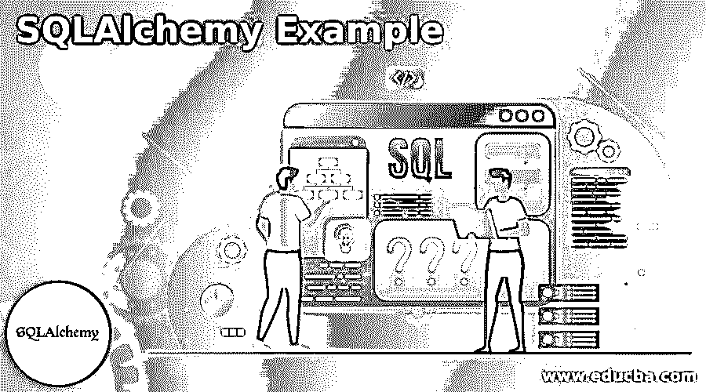
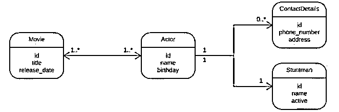
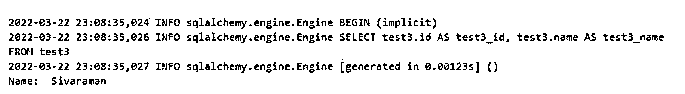
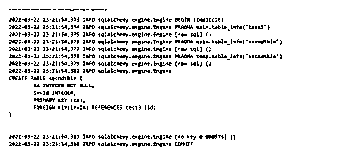
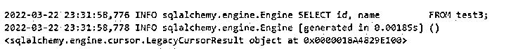
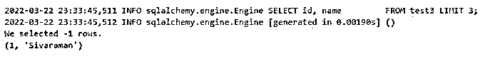

# SQLAlchemy 示例

> 原文：<https://www.educba.com/sqlalchemy-example/>

## SQLAlchemy 示例介绍

下面的文章提供了 SQLAlchemy 示例的概要。SQLAlchemy 是一种可以通过 python 编程语言和数据库之间的通信来实现的库，这种最需要的库映射到对象关系映射器[ORM]工具，它用表行和列上的 python 类转换到关系数据库，它自动转换为 SQLAlchemy 中每个 SQL 语句的函数调用。

### ORM 示例

SQLAlchemy 主要是针对各种示例发布的，包括一些典型模式和一些非典型模式。它是否都是可运行的，并且主要是在发行目录中找到的，包括源代码？SQLAlchemy 将配置 delete-orphan 节点功能，包括当父对象被移除或父对象被删除时集合中的已删除对象。接下来，它是一个简单的函数，需要 ORM 和一个与 python 类相关联的方法，以及数据库表和对应表的对象行上的指定实例。它包括对象状态列和行中所有变化的透明同步系统。

<small>Hadoop、数据科学、统计学&其他</small>

然后，它主要被称为系统的工作单元，根据用户定义的类及其相互关系来表达数据库查询。SQLAlchemy 可以与 ORM 功能一起使用，也可以不与指定项目一起使用，可以选择 SQLAlchmey core 或 ORM，配置各种类型的应用软件堆栈和后端数据库。这可以通过使用任何有效选项的设计来实现，这取决于我们编码的应用类型。SQLAlchmey 给许多开发人员带来的好处是允许他们从应用程序数据库访问指定项目中的 Python 代码。

### SQLAlchemy 代码和带示例的普通 SQL

SQLAlchemy 主要负责表的创建，这需要用 python 代码为所有记录创建一个表语句，而不是普通的 SQL。python 语言中的查询对于 python 开发人员来说更快、更易访问，在多个表和指定的过滤字段中，一旦创建了表，问题的编写速度更快、更易访问。对于 SQLAlchemy 来说，最好的方式和最舒适的区域主要是挖掘读写数据库驱动的应用程序资源，以便在一些边缘情况下获得有用的信息。它是基于 python 的对象关系映射器，有几个开源项目。数据中列出的文章让我们更容易理解使用 Django ORM 框架的几种实现，它处理事务、模型和查询。许多开源项目依赖 SQLAlchemy 来正确地使用工具读取由类和函数定义的代码。

它有 n 个必须在不同区域使用和调用的方法。就像 add_columns()、add_entity()、counter()一样，我们可以在 create_engine()方法中添加数据库驱动程序。

在上面的截图中，我们可以传递带有指定端口(如 5432)的 PostgreSQL 数据库驱动程序，作为与 SQLAlchemy 数据库交互的有效凭证。主要是当创建一个引擎时，它不立即连接数据库；当我们要提交查询时，它将更新设计并更新表中的表行。DBAPI 是与最常见的数据库管理系统中的数据库进行交互的规范。PostgreSQL、MySQL、Oracle、Microsoft SQL Server 和 SQLite 是基于文档的 SQLAlchemy 引擎的最常见示例。在 dB 引擎连接之后，事务是 SQLAlchmey 的核心角色；它会每隔一段时间执行一次操作。

上面的类图是 SQLAlchemy 类与用户数据数据库交互的基本工作流。

#### 示例#1

**代码:**

`from SQLAlchemy import Column, Integer, String
from SQLAlchemy import create_engine
engine = create_engine('sqlite:///D:/Mar9.db', echo = True)
from SQLAlchemy.ext.declarative import declarative_base
Base = declarative_base()
class Mar22(Base):
__tablename__ = 'test3'
id = Column(Integer, primary_key = True)
name = Column(String)
from SQLAlchemy.orm import sessionmaker
Session = sessionmaker(bind = engine)
session = Session()
result = session.query(Mar22).all()
for row in result:
print ("Name: ",row.name)`

**输出:**

#### 实施例 2

**代码:**

`from SQLAlchemy import create_engine, ForeignKey, Column, Integer, String
engine = create_engine('sqlite:///sales.db', echo = True)
from SQLAlchemy.ext.declarative import declarative_base
Base = declarative_base()
from SQLAlchemy.orm import relationship
class Fits(Base):
__tablename__ = 'test3'
id = Column(Integer, primary_key = True)
name = Column(String)
class secs(Base):
__tablename__ = 'secndtble'
id = Column(Integer, primary_key = True)
invid = Column(Integer, ForeignKey('test3.id'))
fts = relationship("Fits", back_populates = "secndtble")
Fits.secndtble = relationship("secs", order_by = secs.id, back_populates = "fts")
Base.metadata.create_all(engine)`

**输出:**

#### 实施例 3

**代码:**

`from SQLAlchemy import text
res = engine.execute(
text(
"SELECT id, name \
FROM test3;"
)
)
print(res)`

**输出:**

#### 实施例 4

**代码:**

`from SQLAlchemy import text
res = engine.execute(
text(
"SELECT id, name \
FROM test3 LIMIT 3;"
)
)
print(f"We selected {res.rowcount} rows.")
for a in res.fetchall():
print(a)`

**输出:**

在上面的例子中，我们在不同的地方使用了 SQLAlchemy，并通过不同的默认方法传递了 SQLAlchemy 包。最初，我们必须为指定的数据库创建数据库引擎来连接表，以便在各个区域执行用户数据操作。此外，我们完成了与 SQLite 数据库中的 SQLAlchemy 相结合的一对一和其他关系映射。我们应该为每个 python 脚本代码添加相应的依赖项和类。

### 结论–SQLAlchemy 示例

SQLAlchemy 是查询执行，它是使用样板代码执行特定操作的工作流引擎之一。它必须是标准的数据库连接器，以估计 SQL 过程和查询数据，以 fetchAll()提供的索赔数据的结果。

### 推荐文章

这是一个指导 SQLAlchemy 的例子。这里我们讨论简介、ORM 示例、SQLAlchemy 代码和普通 SQL。您也可以看看以下文章，了解更多信息–

1.  [desc 的 SQL 订单](https://www.educba.com/sql-order-by-desc/)
2.  [SQL 执行](https://www.educba.com/sql-execute/)
3.  [SQL 排除](https://www.educba.com/sql-exclude/)
4.  [MySQL InnoDB 集群](https://www.educba.com/mysql-innodb-cluster/)

