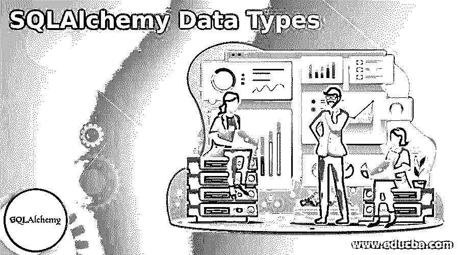
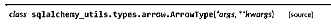
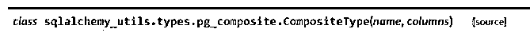
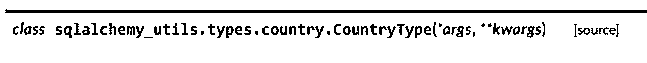
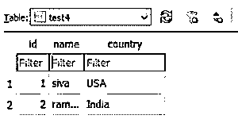
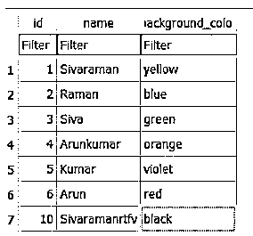
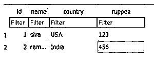

# SQLAlchemy 数据类型

> 原文：<https://www.educba.com/sqlalchemy-data-types/>




## SQLAlchemy 数据类型介绍

SQLAlchemy 数据类型是实用模型之一，它提供了各种格式集，包括整数、字符串、字符、浮点数和双精度数；这些数据类型将使用自动数据强制，它将声明和使用函数，并在初始化数据模型之前，为所有要使用 SQLAlchemy 映射器的强制属性进行映射的类自动分配。

### 不同的 SQLAlchemy 数据类型

SQLAlchemy 为大多数常见数据库提供了数据抽象，并提供了指定自定义数据类型的机制。它包括直接调用对象类型的每个对象类型的方法和属性。它们被提供给数据库驱动程序将作为不正确的数据类型错误返回的数据库表定义场合。SQLAlchemy 将使用 Integer(10)和 String(32)这样的数据类型作为信息类型，这有助于用数据库中的一组后行创建表。

<small>Hadoop、数据科学、统计学&其他</small>

#### 1.通用类型

泛型是数据类型模型中的一种，它是通过列来指定的，可以存储用于读写数据的用户数据。它还有助于选择源数据库甚至目标数据库中已经可用的数据库列，这些列可以用于在数据库中发出和创建表。它还满足于 sql 标准和多供应商类型，这些类型可以是 sql 标准的一部分，并且它可能与数据库后端的子集以及通用类型一起被发现，甚至具有多供应商类型的 SQL 标准也不能保证只记录显式调用支持数据的后端。

阵列主要是核心支持的核心部分，包括标准的 sql 函数，包括隐式和显式捕获的阵列数据，除了 Postgresql 后端和可能的方言，如带有内置 sqlalchemy 函数的第三方工具。

#### 2.箭头类型

它提供了一种保存和检索箭头对象以创建数据库的方法。它自动更改 Arrow 对象来指定 datetime 之类的数据对象，以维护查询数据库中的内容。ArrowType 将需要安装箭头库；它期望所有的 arrow goodies arrow library 主要提供了一种明智的方法来创建、操作、格式化用户输入格式，并将其转换为其他数据类型，如日期、时间和时间戳。




上面的类是 arrow 类型中的主 sqlalchemy 实用程序，在名为 ArrowType(args，kwargs)的方法中传递参数和自变量。

#### 3.选择类型

choice 类型提供了多种方法来修复具有指定列类型和元组集合键值对列表的选择。此外，它将与 python 语言的标准库集成，用于自动强制选择对象的兼容版本，基于元组的列表传递给子类的构造函数。


选择类型更有助于在 Utils 包中进行额外更改的情况下呈现用户区域设置的值。

#### 4.颜色类型

颜色类型将提供将颜色包中的颜色和其他对象保存到数据库中的方法。它将保留颜色对象作为输入字符串，并自动将它们转换为对象；查询时，数据库将总是返回相同颜色的对象。


上面的类是主要的颜色类型，它将被导入 sqlalchemy utils，带有用于传递参数(如 max_length=20 和参数 kwargs)的附加颜色。同时给出了同列和异列的思路。

#### 5.复合类型

它有助于自动与 Postgresql 数据库复合类型进行交互；通过轻松访问混合类型字段，可以使用此功能。并且还支持 sqlalchemy 类型修饰类型以及将复合类型作为 Postgresql 数组的一部分的能力。用于安装 DDL 侦听器的混合类型的类型创建和删除在混合类型的数据库之前 _create 和之后 _drop。




当使用元组或任何其他数据字典创建复合类型时。

#### 6.国家类型

在改回标量强制类之后，country 反对将对象传递和更改为字符串和其他数据类型表示。




这个类将提供 county 类型的 utils，并将国家作为第一个和第二个参数传递。

#### 7.供应商特定类型

特定于数据库的类型主要用于为每个方言模块导入数据库。它主要用于 Mysql、SQLite、PostgreSQL 等数据库中突出显示的模式。通常，integer 和 varchar 数据类型是 sqlalchemy 类型的基本类型。INET 是一种特定的 Postgresql 方言类型，具有 sql 标准类型，但也提供额外的参数类型。

**代码:**

```
from sqlalchemy.dialects import mysql
tb = Table(news, metadata,
Column('id', mysql.BIGINT),
Column('validss',mysql.ENUM('p', 'e', 'r'))
) 
```

上述代码是数据库的基本供应商特定类型，用于区分来自用户的信息，由数据库编码器处理。

#### 8.自定义类型

sqlalchemy 还使用现有的方法为新的数据类型重新定义当前的数据类型。我们还可以为编译覆盖类型，以强制执行类似字符串版本的数据类型，并为表创建呈现该类型，以满足所有可以转换更改的 sql 函数。应用程序希望为所有包含 BLOB 数据的平台强制执行二进制渲染数据，这为大多数首选用例执行了大型二进制渲染。我们可以在与任何类型相关联的编译指令上测量控件类型。

**代码:**

```
from sqlalchemy.ext.compiler import compiles
from sqlalchemy.types import BINARY
@compiles(BINARY, "sqlite")
def news(type_, compiler, **kw):
return "BLOB" 
```

以上代码用于通过 sqlalchemy 导入二进制和编译库将 BLOB 数据插入数据库。它有 n 个满足 XML 和 JSON 类型数据格式的定制类型。

### SQLAlchemy 数据类型的示例

下面提到了不同的例子:

#### 示例#1

**代码:**

```
from sqlalchemy_utils import CountryType, Country
class firsts(Base):
__tablename__ = 'test4'
id = sa.Column(sa.Integer, autoincrement=True)
name = sa.Column(sa.Unicode(255))
country = sa.Column(CountryType)
ft = firsts()
ft.country = Country('FI')
session.add(ft)
session.commit()
ft.country
ft.country.name
print ft.country 
```

**输出:**




#### 实施例 2

**代码:**

```
from colour import Color
from sqlalchemy_utils import ColorType
class seconds(Base):
__tablename__ = 'test3'
id = sa.Column(sa.Integer, autoincrement=True)
name = sa.Column(sa.Unicode(50))
background_color = sa.Column(ColorType)
sec = seconds()
document.background_color = Color('#blue')
session.commit() 
```

**输出:**




#### 实施例 3

**代码:**

```
from sqlalchemy.dialects.postgresql import ARRAY
class third(Base):
__tablename__ = 'test4'
id = sa.Column(sa.Integer, primary_key=True)
bal = sa.Column(
ARRAY(
CompositeType(
'amnt',
[
sa.Column('ruppee', CurrencyType),
sa.Column('id', sa.Integer)
]
),
dmns=2
)
) 
```

**输出:**




上面的例子是在不同阶段帮助创建数据库列的一些数据类型。例如，当我们想要向现有的表中再添加一列时，我们可以使用一个改变的关键字和查询语句向当前的表中添加额外的列。在这里，我们可以为每个示例创建单独的类，将值添加到所需的列，并执行特定列类型的数据操作，如国家类型、货币类型和颜色类型。一些列类型还处理用户向数据库输入的数据。

### 结论

SQLAlchemy 数据类型是实现从前端到后端数据库模式的用户数据的主要特性和概念之一。然后，我们需要根据用户需求，从用户的现有数据库表列中添加额外的用户输入数据。

### 推荐文章

这是 SQLAlchemy 数据类型指南。这里我们分别讨论简介和不同的 SQLAlchemy 数据类型。您也可以看看以下文章，了解更多信息–

1.  [desc 的 SQL 订单](https://www.educba.com/sql-order-by-desc/)
2.  [SQL 执行](https://www.educba.com/sql-execute/)
3.  [SQL 排除](https://www.educba.com/sql-exclude/)
4.  [MySQL InnoDB 集群](https://www.educba.com/mysql-innodb-cluster/)


