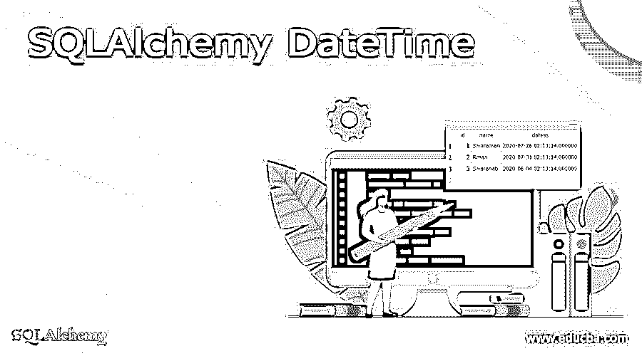
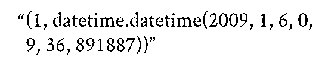
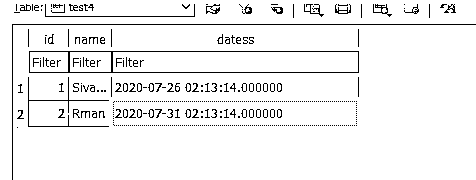
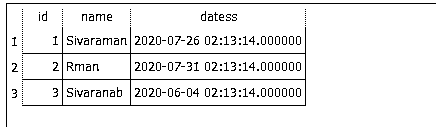
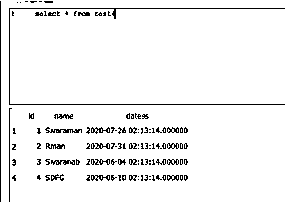

# SQLAlchemy 日期时间

> 原文：<https://www.educba.com/sqlalchemy-datetime/>




## SQLAlchemy DateTime 简介

SQLAlchemy DateTime 是其中一个关键字，它不是用户输入的默认关键字，它应该以列函数的形式返回输入，并且它将由 DB 服务器而不是应用程序服务器来计算时间戳，并通过不同编程语言的变量偶尔在时区上计算时间戳，从而导致网络延迟方面的各种问题。

### SQLAlchemy 日期时间概述

SQLAlchemy 扩展为 JSON、CSV、YAML 和其他 python 字典提供了序列化和反序列化支持。它是主要项目之一，类似于 SQLAlchemy 模型，具有 Marshmallow 和其他框架，不可知库通过验证输入数据和反序列化应用程序级对象来执行复杂的对话，如数据类型，如与原生 python 数据类型之间的对象。序列化应用程序级对象是最基本的数据类型，可以与 JSON 和其他 HTTP API 一起呈现为标准格式。我们还使用反射映射类型的相同点实现了该功能，这些反射映射类型可以定制并格式化为不同的数据库模式，以及引擎对反射映射名称的方言。几乎任何合理的格式都可以接受输入，包括传统 POSTGRES 上的 ISO 8601 SQL 兼容格式和其他相同格式的格式。在日期输入是不明确的，有更多的支持指定排序字段与日期样式参数的 MDY 数据解释。在处理日期/时间输入时，我们使用 PostgreSQL 以获得更大的灵活性，而不是使用 SQL 标准来对识别的文本字段(包括月份、星期几和时区)中的日期/时间输入提取解析规则。

<small>Hadoop、数据科学、统计学&其他</small>

### 如何更改 SQLAlchemy DateTime？

PostgreSQL 支持完整的 SQL 日期和时间类型集，并根据公历对指定的数据类型进行指定的操作，以了解更多信息。SQL 操作可用于每种数据类型，这些数据类型用根据公历计算的分隔日期来描述。时区和时区惯例受世界各地政治决策的影响。它变得标准化，并继续随着夏令时的变化而任意变化。我们使用了在 IANA 广泛使用的 PostgreSQL 数据库，并为历史时区规则指定了时区数据库。对于未来的每一个时间，时区最新的假设将继续被观察到不确定的未来。区间输出是可以在该类型上使用的格式类型，它将与包含 Postgres 数据库的其他区域一起设置。我们使用 sql_standard 样式，它将产生类似的符合 sql 标准规范的输出。时区允许的类型是将本机日期时间对象保存到数据库的真参数。这返回了修改数据库时区的方法，以便用 UTC 存储所有带有时间对象的日期，从而将本地生成的日期时间对象转换为时区信息中的检索。




上面的屏幕截图显示了具有单独参数的 datetime 方法的一般格式，这里是 datetime()方法，第一个参数是年、日、月，有时也称为日、年和月、月、日和年。Timedelta()是满足 UTC 格式的方法。它表示数据库 schema 和 sequences 对象，该对象被认为是列 default 对象的一种特殊情况，用于识别在 UTC 时间单独存储的时区信息中检索的数据。时区配置参数可以在 postgresql.config 文件中设置，该文件在其他标准方式上。我们过去建议在整个应用程序中使用 UTC 时间戳，并在数据库中使用时区的日期和时间。


带有附加说明的日期和时区的一些样式规范。与 ISO、传统风格、原创和地域风格相比，它可能会有所不同。

#### 示例#1

```
import sqlalchemy as sa
from sqlalchemy.sql import select
import datetime
md = sa.MetaData('sqlite:///Mar9.db')
data_table = sa.Table('test4', md,
    sa.Column('id',   sa.types.Integer, primary_key=True),
    sa.Column('name',   sa.types.String),
    sa.Column('datess', sa.types.DateTime(timezone=True), default=datetime.datetime.utcnow)
)
md.create_all()
eng = md.bind
con = eng.connect()
res = con.execute(data_table.insert().values(id=1))
s = select([data_table])
res = con.execute(s)
rw = res.fetchone() 
```

**输出:**




#### 实施例 2

```
import datetime
from sqlalchemy import Column, Integer, DateTime
from sqlalchemy.ext.declarative import declarative_base
Base = declarative_base()
class Fitrstss(Base):
__tablename__ = 'test4'
id = Column(Integer, primary_key=True)
datess = Column(DateTime, default=datetime.datetime.utcnow)
print(id)
print(datess)
```

**输出:**




#### 实施例 3

```
from sqlalchemy import types
class thirdclass(types.TypeDecorator):
  thrd=types.String
  def __init__(ab, vars2, *vas, **ref):
    types.TypeDecorator.__init__(ab, *vas, **ref)
    ab.vars2 = vars2
def mthd(ab, vals, eng):
ress = ab.thrd.mthd(value, eng)
if ress not in ab.vars2:
   raise TypeError(
"Please find the output results from the newmeth methd" % (ress, ab.vars2))
  return ress
 def outs(ab, vals, eng):
  'Have a Nice day thanks for your support'
   return ab.thrd.outs(vals, eng)
print("Thanks for the thrd example regarding sqlalchemy types datetimes")
```

**输出:**




在上面的例子中，我们用日期和时间的各种方式和逻辑来执行数据库中的用户操作。我们还导入了导入基类的 sqlalchemy 类型、datetime 和 declarative。此外，def 关键字用于定义方法并打印每个方法的输出结果。我们声明了类，并像传递类型一样传递参数。TypeDecorator 和来启动这些方法，作为数据库连接的返回类型，用于连接带有附加数据(如 id、name 和 dates 属性)的数据库，以便在相应的列中存储输入。

### 结论

SQLAlchemy datetime 是定义函数、操作符和其他关键字的最广泛使用的方法，用于将数据库从应用程序 UI 连接到后端。这是一个具有一致的当前时间、日期和带有相同事务日期时间戳的多个修改的单一事务。

### 推荐文章

这是 SQLAlchemy DateTime 的指南。在这里，我们讨论介绍，概述，如何改变 SQLAlchemy 日期时间，代码实现的例子。您也可以看看以下文章，了解更多信息–

1.  [MYSQL 提交](https://www.educba.com/mysql-commit/)
2.  [PL/SQL 异常](https://www.educba.com/pl-sql-exception/)
3.  [PLSQL 行类型](https://www.educba.com/plsql-rowtype/)
4.  [desc 的 SQL 订单](https://www.educba.com/sql-order-by-desc/)


