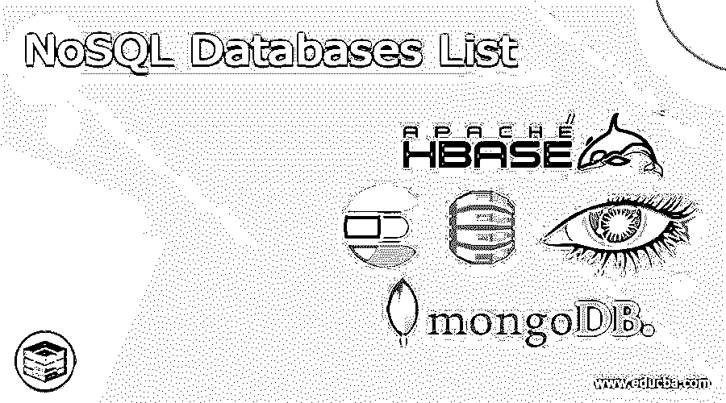

# NoSQL 数据库列表

> 原文：<https://www.educba.com/nosql-databases-list/>

## NoSQL 数据库列表介绍

NoSQL 数据库是一个非概念性的数据库，它可以用不同于关系表的方式保存数据。它可以为事实的存储和恢复提供一个定制的过程，这意味着不同于可以在关系表中使用的表格形式。它有各种类型的数据库，如文档数据库，可以像 JSON 对象一样保留文档中的数据，键值数据库是简单的数据库，其中所有产品都包含键和值，宽列存储可以保留表、行和动态列中的数据。

### 顶级 NoSQL 数据库列表

让我们来讨论一下最顶端的 NoSQL 数据库列表，其中有 MongoDB、Cassandra、Elasticsearch、Amazon DynamoDB、HBase 等。,

<small>Hadoop、数据科学、统计学&其他</small>

#### 1.MongoDB:

它是一个基于文档的数据库，其中它是一个跨平台和基于文档的数据库，并且该数据库可以在许多组织的大部分时间使用，因此它可以在 JSON 对象中保留文档，大约有 3400 个组织在其技术商店中使用 MongoDB，该数据库由 MongoDB inc .创建，它可以与开发人员的思维方式和他们如何编写强大的查询一起工作。

如果我们试图组合大量不同的数据源，那么 MongoDB 是最好的选择，因为它将提供数据的单一统一视角，而且如果我们期待从我们的应用程序中读取和写入大量操作，那么在那个时候这个数据库也是有用的，所以我们不需要担心我们的数据可能在服务器冲突中丢失。 我们只需点击几次就可以使用该数据库进行预订，因此该数据库被称为点击流数据数据库，我们可以将其用于客户沟通调查。

#### 2.卡珊德拉:

这是一个开源的分散数据库系统，最初是由脸书开发的，它可以广泛使用，完全可移植，它可以操作数 Pb 的信息，每秒钟还可以处理数千个同步请求，大约有 400 家公司正在使用这个数据库，如脸书，Instagram，网飞，Spotify，Coursera 等。
如果我们有更多用于读取的用例，而较少用于写入，那么这个数据库是有帮助的，并且也有一种情况，当我们需要比稳定性更好的可访问性时，那么这个数据库可以用于例如社交网络网站，但是它对于银行网站也是有用的，在这个数据库中，我们在对数据库的查询中需要较少数量的连接和聚合，并且它对于健康跟踪器、天气预报、订单跟踪也是有用的，在这种情况下我们可以使用 Cassandra 数据库。

#### 3.弹性搜索:

这也是一个开源的、分散的 NoSQL 数据库系统，它是可移植的、现代的和兼容的，它基于 Apache Lucene，我们可以将其标记为分析引擎，因为它可以毫不费力地分析、保留和找出大量数据。如果我们有全文搜索的用例，那么这个数据库是我们组织的最佳选择，它还允许使用模糊补充进行搜索，大约有 3000 个组织在他们的组织中使用这个数据库。

如果我们有一个使用全文搜索的用例，那么这个数据库将是最适合它的，在另一种情况下，如果我们有一个使用聊天机器人的用例，在这种情况下可能有更多的拼写错误，因此它可以解决大部分疑问，所以它有内置的模糊匹配功能，这样会有帮助，而且这个数据库可以帮助保留大量数据并检查它。

#### 4.亚马逊 DynamoDB:

这是一个完全托管的无服务器分散数据库，它有键值对，由 Amazon 设计，非常可靠，但它不是开源的，它主要是为运行任何规模的高性能应用程序而设计的，它一天能够处理 10 万亿个请求，大约有 700 个组织在他们的组织中使用这个数据库，就像使用相同的最佳应用程序一样。

如果我们需要在一个简单的键-值查询中处理大量查询，那么 DynamoDB 是最佳选择，如果我们必须处理 OLTP 工作，如在线订票或银行业务，我们希望数据高度可用，那么在这种情况下，该数据库最适合，该数据库可以提供内置安全性，还可以进行持续备份，它有内存缓存，还可以有数据导出工具。

#### 5.HBase:

它是开源的，它是一个高度可靠的面向列的非关系数据库系统，它可以为 Hadoop 提供大表能力，它是一个分散的数据库系统，这个数据库是用 Java 编写的，可以是 Apache 软件基金会 Apache Hadoop 项目的一部分，因此它可以使用 Apache HBase，并且它可以在 Hadoop 分布式文件系统上运行，大约有 70 个组织在使用这个数据库，如 Hike，Pinterest 和 HubSpot，刚刚发布了它的 1.0 版本

这个数据库可以处理数 Pb 的数据，当我们有少量数据时，他们不会得到我们想要的结果，如果在我们的用例中，我们希望随机和实时访问数据，那么这个数据库将是最佳选择，如果我们希望以简单的方式为更多人保留实时消息，那么这个数据库也将是有用的。

### 结论

在本文中，我们的结论是，NoSQL 数据库是一个非关系数据库，其中没有数据之间的关系，它的列表中有我们上面讨论过的前五个数据库，因此本文将有助于理解 NoSQL 数据库列表的概念。

### 推荐文章

这是 NoSQL 数据库列表指南。在这里，我们讨论的介绍，顶级 NoSQL 数据库列表。你也可以看看下面的文章来了解更多-

1.  [NoSQL 数据库的类型](https://www.educba.com/types-of-nosql-databases/)
2.  [NoSQL 的优势](https://www.educba.com/advantages-of-nosql/)
3.  [什么是 NoSQL 数据库](https://www.educba.com/what-is-nosql-database/)
4.  [NoSQL 面试问题](https://www.educba.com/nosql-interview-questions/)

