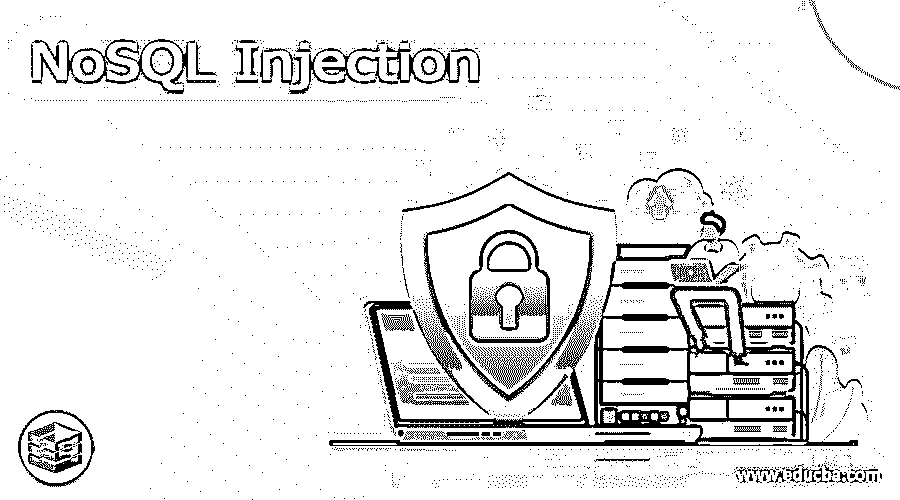

# NoSQL 注射液

> 原文：<https://www.educba.com/nosql-injection/>

## NoSQL 注射液简介

NoSQL 注入的定义是，它是可以使用 NoSQL 数据库的 web 应用程序中的一个误解，它不同于 SQL 注入。数据清洗是在 NoSQL 注入攻击之后进行的，而 NoSQL 的攻击具有威胁性，因为它们将直接注入代码，并以 web 应用程序所用的语言在服务器上实现。注入使得攻击者能够将代码插入到数据库的命令中，在这些命令中，他们无法使用类似于 MongoDB 的 SQL 查询，MongoDB 允许随机执行代码。

### 什么是 NoSQL 注射液？

注入是 web 应用程序中的一个误解，它可以攻击构建在 MongoDB、Angular 和节点上的 web 应用程序，并且它是许多类似于 SQL 注入的注入攻击中的一种，因为它已经被设计为利用不使用 SQL 的现代数据库，术语 NoSQL 不仅意味着 SQL 表示可能使用较小的不灵活结构的数据库，而且可能涉及各种类型的数据库。

<small>Hadoop、数据科学、统计学&其他</small>

注入能够在应用程序的各个领域实现，当它与 MongoDB 一起使用时，它就能够从字符串中构造查询。

### NoSQL 注射液 MongoDB

让我们讨论注入 MongoDB，其中它可以使用二进制 JSON 数据格式，并且它与安全的二进制查询工具一起发生，并且其中的查询也在 BSON 对象中表示，因此直接注入在 MongoDB 中是不可能的，并且它允许在服务器上以及在“$where”和“MapReduce operation”下运行 JavaScript 应用程序，

让我们看一个 PHP 中 MongoDB 注入的例子，在这个例子中，虽然基本认证攻击者可以尝试以字段值的形式进入 MongoDB 操作符，即$equ 表示等于，$neq 表示不等于，$grt 表示大于，

`“$query = array ("user" => $_POST["uname"], "pwd" =>
$_POST["pwd"]);”.`

*   如果上面的查询已经用于检查登录信息，那么攻击者可以滥用 PHP 的内置组合数组将查询注入到 MongoDB 查询中，该查询总是可以返回真值，

`“uname[$neq]=1&pwd[$neq]=1”`

*   PHP 会将上述内容解释为数组的数组:

`“array("uname" => array("$neq" => 1), "pwd" =>
array("$neq" => 1));”`

当此查询作为 MongoDB 查询发送到用户存储时，它将搜索用户名和密码不等于 1 的所有用户，这将返回真实值，并可能允许攻击者绕过身份验证。

### NoSQL 注入 JavaScript

让我们讨论注入攻击 MongoDB 的方式，然而，MongoDB 具有内置的安全性，因此它更安全，MongoDB 文档包含三个操作，' $where '，' MapReduce '和' group '，其中' $where '用于将包含 JavaScript 表达式的字符串或完整的 JavaScript 函数移动到查询系统，这意味着' $where '可被未授权用户用作查询操作符。

*   让我们看一个 MongoDB 中 JavaScript 注入的例子，其中如果我们试图用 MongoDB 数据存储编写查询，那么' $where '操作符已经与' find()'函数一起使用，例如，

`“db.collection.find( {$where: function() {return (this.name == 'Nosqlinjection') } } );”.`

*   上述查询将找到名称“Nosqlinjection”，一些 PHP 应用程序将在查询构造时接受用户输入，例如，“$userInfo”:

`“db.collection.find({$where: function() {
return (this.name == $userInfo)}});”`

*   攻击者可以尝试用“b”搜索“userInfo ”,如果成功完成了注入，则服务器停止 5 分钟，并且将成功实现以下查询，

`“db.collection.find( { $where: function(){return (this.name == 'b'; sleep(4000) )}});”`

这可能是一种可能的注射方式。

### 避免 NoSQL 注射

注入比传统的 SQL 注入更具威胁性，因为 striker 不仅可以从数据库中获取信息，还可以在应用程序环境中执行代码，例如，如果攻击者想要侵入管理员用户帐户并控制服务器，这种类型的攻击是非常危险的。

关于 web 应用程序的安全性，阻止 NoSQL 攻击的最好方法是避免在应用程序的代码中使用未净化的用户输入，特别是当我们试图构建数据库查询时，因为 MongoDB 具有保护查询的内置特性，并且它可以在没有 JavaScript 的情况下构建。

### NoSQL 注射攻击

让我们来讨论一下注入攻击，其中 MongoDB 是一个 NoSQL 数据库，它不能使用 SQL 来执行查询，因为它们根据用户输入来执行查询。这意味着如果开发人员没有正确地执行输入数据清理，他们很容易受到注入攻击。NoSQL 和 SQL 注入的区别仅在于他们如何使用语法和使用什么语法。 出乎意料的是，如果我们尝试使用字符串执行 SQL 注入注入，那么它可能会成功，因为数据库没有任何系统化的语言。

通常，通过考虑驱动程序可能不容易受到攻击，但不安全的 API 可能会随之而来，通过驱动程序进行注入，正如我们已经看到的那样，当来自用户的查询未经净化时，SQL 注入可能会发生，并且它具有恶意输入，可以在数据库中执行命令，因为 SQL 无法在 NoSQL 上执行。

### 结论

在本文中，我们得出结论，NoSQL 注入是 web 应用程序中的一个错误，可能会损害应用程序，必须进行动态预防，我们还讨论了 NoSQL 攻击、如何避免 NoSQL 注入、使用 MongoDB 的 NoSQL 注入以及使用 JavaScript 的 NoSQL 注入。

### 推荐文章

这是一个 NoSQL 注射指南。这里我们讨论一下定义，什么是 NoSQL 注射，NoSQL 注射 MongoDB，NoSQL 注射攻击。你也可以看看下面的文章来了解更多-

1.  [NoSQL 数据库的类型](https://www.educba.com/types-of-nosql-databases/)
2.  [NoSQL 的优势](https://www.educba.com/advantages-of-nosql/)
3.  [NoSQL 数据模型](https://www.educba.com/nosql-data-models/)
4.  [什么是 NoSQL 数据库](https://www.educba.com/what-is-nosql-database/)

