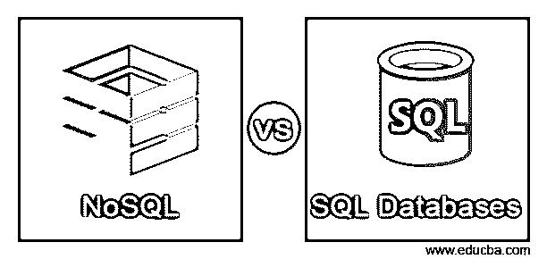
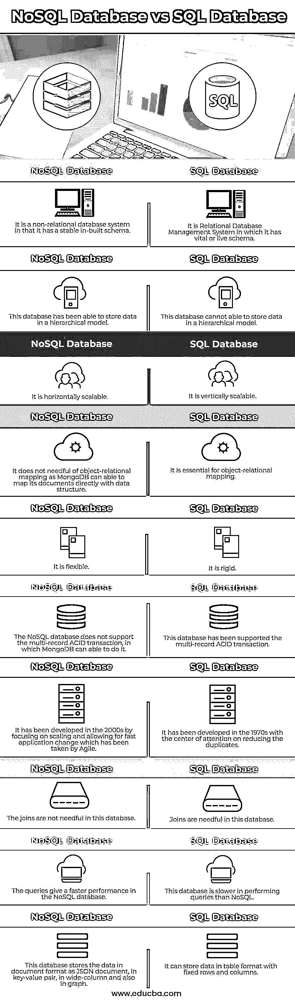

# NoSQL 与 SQL 数据库

> 原文：<https://www.educba.com/nosql-vs-sql-databases/>

## NoSQL 与 SQL 数据库简介

NoSQL 对 SQL 数据库的定义是，NoSQL 数据库是一种非关系数据库，其中包含不同类型的数据库技术，它们是专门为发展中的现代应用程序而开发的，不需要任何查询语言，它可以以文档格式、键值对以及图形数据库存储数据，而 SQL 数据库是一种关系数据库，其中关系数据库可以使用 SQL 语法和查询来检查和获取数据以供将来使用，它使用 OLAP 系统，也可以使用结构化查询语言进行查询。

### NoSQL 与 SQL 数据库的直接比较(信息图表)

以下是 NoSQL 数据库与 SQL 数据库之间的 10 大区别:

<small>Hadoop、数据科学、统计学&其他</small>

### NoSQL 与 SQL 数据库的区别

**NoSQL** :

NoSQL 是一种非关系数据库管理系统，它没有稳定的模式，易于分层，并且不使用连接，该数据库用于分散的数据存储，可用于海量数据，并处理实时数据，这意味着许多拥有大量用户的公司需要每天生成数兆字节的用户数据，以便该数据库允许在我们的数据库中更新， 我们能够快速和不断地重复功能，以集成应用程序，为用户提供良好的价值，NoSQL 数据库代表“不是 SQL 或不仅是 SQL”。

**SQL** :

SQL 是使用 SQL 语法的关系数据库管理系统(RDBMS ),它可以以表格的形式存储数据，例如具有固定的行和列，以便这种类型的数据可以用于将来的目的，其中它是垂直可伸缩的，并且 SQL 还可以具有预定的模式，以便它可以提供更好的性能，可以支持 SQL 以存储具有 ACID 事务的多个记录，并且它需要用于查询的连接。

### NoSQL 数据库与 SQL 数据库的主要区别

**语言:**

NoSQL 对于非结构化数据有很强的模式，它能够以多种方式存储数据，例如以文档格式、列格式和基于图形的方式，或者它也可以以键值形式存储数据，因为它很灵活，这意味着 NoSQL 可以在不定义结构的情况下生成文档，而， SQL 数据库已经定义了用于数据操作的结构化查询语言，并且它还具有结构化模式，需要使用预定义的模式以及我们存储的需要遵循定义结构的数据，我们可以说 SQL 使用了查询语言，而 NoSQL 没有用于查询的语言，因为这是它们之间的主要区别。

**可扩展性**:

在所有情况下，我们可以说 SQL 是纵向可扩展的，这意味着我们可以通过扩展 RAM 和 CPU 等术语来升级服务器的负担，另一方面，NoSQL 数据库是横向可扩展的，这意味着它可以借助分片来控制流量，或者我们可以在 NoSQL 数据库中添加额外的服务器，我们可以说 NoSQL 更强大，更大，因此我们可以将其作为首选。

**结构**:

NoSQL 数据库是基于文档的、键值对的和基于图形的，而 SQL 数据库是面向表的，其中 SQL 可以以行和列的形式以表的形式存储数据，因此，如果我们的应用程序有多个事务，那么我们肯定可以使用 SQL 数据库，因为它具有存储乘法数据的结构。

**支持**:

SQL 可以从他们的供应商那里获得很大的支持，并且还可以获得许多自我维持的披露，这可以帮助我们在进行大规模部署时使用 SQL 数据库，而对于 NoSQL 数据库，我们需要依赖社区支持，可能只有很少的外部支持者可以用于建立和实施。

**类型**:

基本上，SQL 数据库被称为关系数据库，它们可以有自己的查询语言和数据存储结构，而 NoSQL 数据库被称为非关系数据库，它们不能有特定的查询语言，它可以以多种存储形式存储数据。

### NoSQL 与 SQL 数据库的比较表

| **序号** | **NoSQL 数据库** | **SQL 数据库** |
| 1. | 它是一个非关系数据库系统，因为它有一个稳定的内置模式。 | 它是一个关系数据库管理系统，其中有一个重要的或动态的模式。 |
| 2. | 该数据库能够以分层模式存储数据。 | 该数据库无法在分层模型中存储数据。 |
| 3. | 它是水平可伸缩的。 | 它可以纵向扩展。 |
| 4. | 它不需要对象关系映射，因为 MongoDB 可以直接用数据结构映射它的文档。 | 这对于对象关系映射至关重要。 |
| 5. | 它是灵活的。 | 它是刚性的。 |
| 6. | NoSQL 数据库不支持多记录 ACID 事务，而 MongoDB 可以做到这一点。 | 该数据库一直支持多记录 ACID 事务。 |
| 7. | 它是在 2000 年代发展起来的，专注于伸缩性并允许敏捷所采取的快速应用程序变更。 | 它是在 20 世纪 70 年代发展起来的，关注的中心是减少重复。 |
| 8. | 该数据库中不需要联接。 | 此数据库中需要联接。 |
| 9. | 这些查询在 NoSQL 数据库中提供了更快的性能。 | 该数据库在执行查询时比 NoSQL 慢。 |
| 10. | 该数据库以 JSON 文档的文档格式、键-值对、宽列以及图形的形式存储数据。 | 它可以用固定行和列的表格格式存储数据。 |

### 结论

在这篇文章中，我们得出结论，NoSQL 数据库是非关系数据库，因为它是基于文档的，而 SQL 是关系数据库管理系统，因为它是基于表的，我们讨论了一些关键的差异，它们的定义，以及 SQL 和 NoSQL 数据库之间的比较差异。

### 推荐文章

这是一个关于 NoSQL 和 SQL 数据库的指南。在这里，我们讨论简介，NoSQL 和 SQL 数据库之间的主要区别。你也可以看看下面的文章来了解更多-

1.  [PostgreSQL vs SQLite](https://www.educba.com/postgresql-vs-sqlite/)
2.  [MySQL vs SQLite](https://www.educba.com/mysql-vs-sqlite/)
3.  [PL SQL vs SQL](https://www.educba.com/pl-sql-vs-sql/)
4.  [MySQL vs 甲骨文](https://www.educba.com/mysql-vs-oracle/)

