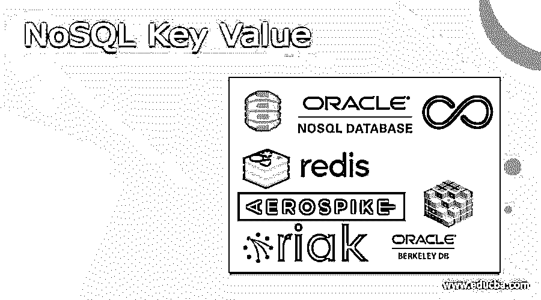

# NoSQL 键值

> 原文：<https://www.educba.com/nosql-key-value/>

## NoSQL 关键价值简介

NoSQL 键值被定义为基于 NoSQL 键值格式的数据库，我们可以说它可以以键值格式存储数据，并且数据已经过处理，可以读写。键值数据库和文档数据库是一样的，键值数据库可以保留单独的记录，它没有预先确定的数据结构。键可以是任何东西，但这只是获得相关值的一种方法，而且它是唯一的标识符。该值是数据库结构战略性增长的任何对象的值。

### 什么是 NoSQL 键值？

键值是数据库的类型；NoSQL 是一个基于键值的数据库，没有特定的结构；正如我们所知，关系数据库有指定的数据类型来存储表中的数据。键值数据库是一组键值对，可以保留在不具有预定数据结构的记录中；在一个键的帮助下，我们可以检索任何值；值是对象。

<small>Hadoop、数据科学、统计学&其他</small>

### NoSQL 键值是如何工作的？

NoSQL 键-值数据库可以使用简单的键-值过程来存储数据，该过程使用一个键作为唯一标识符来实现哈希表。值可以存储为一种数据类型，使用一个键来引用该值。通常，它可以被优化以适应需求，键值没有任何查询语言，但是它们给出了添加和删除键值对的方法。

### NoSQL 键值的类型

有八种类型的 NoSQL 键值数据库，它们是 Oracle Berkeley DB、Riak KV、Voldemort、Aerospike、Amazon DynamoDB、Oracle NoSQL 数据库、Infinity DB 和 Redis 让我们讨论它们，

#### 1.Oracle 伯克利数据库

它是一个开源的嵌入式键值数据库，带有库，为应用程序提供大规模的数据管理服务。产品可以使用函数调用来访问和管理数据。此外，它可以实现定制的数据管理解决方案；通常，它可以与定制项目相关。

#### 2\. Riak KV

分散的 NoSQL 键值数据库具有现代的本地和多样化的集群复制，可以确保读取和写入文档，也可以读取和写入网络中的故障。它可以用我们的键值数据库来升级应用程序的可用性。它可以根据查询需要保留数据，我们可以借助文本搜索、二次搜索和 map-reduce 以三种方式给出数据。

#### 3.伏地魔数据库

它是分散的键值保留系统，因为它不是关系数据库。数据可以在不同的服务器上复制，因为每个服务器都有一个数据子集。它可以提供相等的密度，并且能够非常清楚地处理故障；其中的每个节点都是独立于其他节点的，并且它没有一个非成功的中心点。

#### 4.气塞式

这是实时平台中的领先企业，在该平台中，键值存储数据库可以体现跨内存架构，这可以借助实时应用程序和调查进行转换。

### 前 4 名 NoSQL 关键值

让我们讨论一下顶级的 NoSQL 键值数据库，

#### 1.亚马逊 DynamoDB

这是一个非关系数据库，可以在任何校准下提供确定的产品。该数据库已被完全控制；多区域、多主数据库可以提供兼容的一位数毫秒带宽。它还可以提供内置的安全性。它可以保留备份，也可以恢复，还可以使用内置内存。这个数据库在移动设备上运行得最好；因此，它有许多用户，因为它可以为任何规模的每个用户提供兼容的响应。如果我们尝试在不进行任何交换的情况下添加内存中的缓存，可以将响应时间从毫秒级减少到微秒级，那么它的应用程序已经建立在总输出和存储之上，并且它是一个无服务器的数据库。

#### 2.Oracle NoSQL 数据库

该数据库已经给出了节点的可定制位置的确定的和可比较的数据管理。该数据库已经被特别扩展，并且当涉及到用于管理业务相关数据的业务时，它可以是极其机密的；为了确定关系和连接，该数据库可以使用图来构成图可以使用节点和边的结构。此外，这个数据库分片系统可以在批处理中的所有其他分片上一致地分配数据。

#### 3.无限 DB

此数据库一直在利用非均匀的内部存储更新协议来实现请求时的持久性，或者缓存可以向磁盘显示大量数据，从而支持系统范围的数据一致性，并度过突然的应用程序终止、文件系统错误。它所拥有的文件可以是最新的、安全的，并且可以通过任何事件来想象；该数据库没有基于箱包的检索；因此，在任何情况下都可以快速恢复和即时重启。可以概述为利用单个文件，在该文件中，这些特征的联合可以帮助使产品控制器变得自由；没有分支机构希望被记录或重新注册。

#### 4.雷迪斯

Redis 是一种 NoSQL 键-值数据库；它能够以键值格式保留任何数据；其中该数据库具有内置的复制、脚本和活动；它在构造复杂的结构方面很灵活，这意味着它不是一个简单的键值缓存，而是一个管理各种类型的值的服务器。

### 结论

在本文中，我们得出的结论是，NoSQL 键-值数据库已经被用来以键-值格式存储数据，这种格式将键作为惟一的标识符，值是为获得哈希表而优化的对象；我们还讨论了键值的工作方式、键值的类型以及 NoSQL 键值的顶层。

### 推荐文章

这是 NoSQL 键值的指南。在这里，我们讨论了定义、工作、类型和前 4 名 NoSQL 键值数据库以及解释。你也可以看看下面的文章来了解更多-

1.  [NoSQL 数据库的类型](https://www.educba.com/types-of-nosql-databases/)
2.  [NoSQL 的优势](https://www.educba.com/advantages-of-nosql/)
3.  [什么是 NoSQL 数据库](https://www.educba.com/what-is-nosql-database/)
4.  [NoSQL 面试问题](https://www.educba.com/nosql-interview-questions/)

