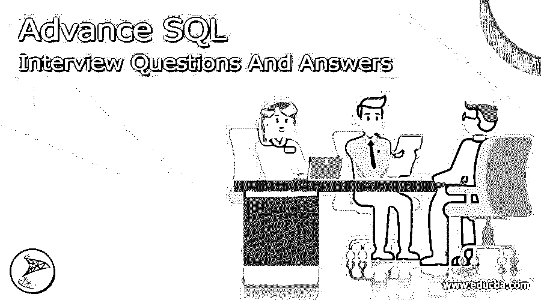

# 高级 SQL 面试问题和答案

> 原文：<https://www.educba.com/advance-sql-interview-questions/>

## 高级 SQL 面试问答简介

所以你终于在高级 SQL 中找到了你的梦想工作，但是想知道如何破解 2022 高级 SQL 面试，以及可能的高级 SQL 面试问题。每次面试都不一样，工作范围也不一样。牢记这一点，我们设计了最常见的高级 SQL 面试问题和答案，以帮助您在面试中取得成功。

以下是面试中最常被问到的高级 SQL 面试问题:

<small>Hadoop、数据科学、统计学&其他</small>

### 1.什么是同义词？

**答:**
同义词允许你为数据库中的对象创建别名。如果对象被重命名，或者对象的模式被更改，同义词可以允许现有的应用程序继续使用旧名称。通过使用由三部分或四部分组成的对象名，同义词还可以引用不同数据库甚至不同服务器中的对象。同义词必须引用数据库对象，而不是另一个同义词。可以为一个数据库对象创建多个名称，只要它们都直接引用该数据库对象。

### 2.使用同义词有什么好处？

**答案:**

*   同义词提供了被引用对象的抽象层
*   允许将复杂(多部分)和冗长的名称用简化的别名作为同一服务器驻留对象进行更改。
*   提供在不更改现有代码的情况下更改对象位置的灵活性。
*   可以在同一个数据库中创建同义词，以便在删除或重命名对象时为旧的应用程序提供向后兼容性。
*   如果您提供像电子表格这样的前端查询工具，并访问链接表到表的直接链接，同义词会很有用。

### 3.强调使用同义词的几个缺点？

**答案:**

*   同义词与被引用的对象是松散耦合的，这意味着同义词可以被删除，而不会显示它正被任何其他数据库对象引用的任何警告。
*   不允许内部链接。这意味着您不能创建同义词的同义词。
*   您不能创建具有相同同义词名称的表
*   在运行时检查为其创建同义词的对象。它在创建时不会被检查。因此，如果您犯了任何相关的错误，例如拼写错误，同义词将被成功创建，但您将在访问对象时得到一个错误。
*   不能在 DDL 语句中引用同义词

### 4.说出 SQL Server 中常用的聚合函数

**答案:**
AVG，CHECKSUM_AGG，COUNT，COUNT_BIG，GROUPING，MAX，MIN，SUM，STDEV，STDEVP，VAR，VARP

### 5.解释集合函数的用法？

**答案:**

| AVG | 返回集合中的平均值。忽略空值；可以配置为对集合中的所有值(默认值)或仅不同值进行平均。 |
| CHECKSUM_AGG | 返回组中所有值或不同值的校验和，忽略空值。 |
| 数数 | 根据表达式或(可选)简单的行计数，返回所有或不同的行数。 |
| 计数 _ 大 | 像 COUNT 一样执行，只是它返回 bigint 而不是 int 数据类型。 |
| 分组 | 指示分组依据列表中的指定列是否为聚合列。返回 0 或 1。 |
| 马克斯(男子名ˌ等于 Maximilian) | 根据提供的列名返回集合中的最大值。 |
| 部 | 根据提供的列名返回集合中的最小值。 |
| 总和 | 根据提供的列名返回集合中值的总和。 |
| 标准差（standarddeviation） | 根据提供的列名返回所有值的统计标准偏差。 |
| STDEVP | 基于提供的列名返回所有值的统计总体标准差。 |
| 增值转销公司 | 根据提供的列名返回所有值的统计方差。 |
| 我的天啊 | 基于提供的列名返回所有值的统计总体方差。 |

### 6.说出 SQL 中不同类型的可能连接？

**答案:**
内连接、左外连接、右外连接、全外连接、交叉连接

### 7.描述各种连接类型？

**答案:**

| **加入类型** | **描述** |
| 内部连接 | 仅当连接字段完全匹配时，才返回每个表中每一行的请求数据。 |
| 左外部连接 | 返回联接操作中第一个表中所有行的请求数据；只返回第二个表中有匹配值的行的数据。当连接中的第一个表中有一行在第二个表中没有匹配行时，这可能会导致结果为空值。 |
| 右外部联接 | 返回联接操作中所述的第二个表中所有行的请求数据；只返回第一个表中有匹配值的行的数据。当连接中的第二个表中有一行与第一个表中没有匹配行时，这可能会导致结果为空值。 |
| 完全外部连接 | 为两个相关表中的所有行返回请求的数据，但是对于另一端没有匹配联接值的行，结果将包含 null 值。 |
| 交叉连接 | 返回笛卡尔(叉)积；换句话说，两个表之间所有可能的行组合。 |

### 8.什么是标量子查询和相关子查询

**回答**
当子查询恰好返回一行和一列数据时，它被认为是标量子查询。
有时，如果没有来自外部查询的信息，子查询就无法处理。在这些情况下，表别名用于定义查询参数的范围，并允许从外部查询“参数化”子查询。因此，内部查询与外部查询相关。最终结果是一个“来回”的执行，外部查询结果中的一行被允许将参数传递给内部查询来执行

### 9.你将如何找到员工的第二高薪？

**回答**
从 EDUCBA_Employee 中选择 MAX (salary)其中 salary 不在(从 EDUCBA_EMPLOYEE 中选择 MAX(salary)

### 10.什么是常见的餐桌用语(CTE)

**答案**
通用表表达式(CTE)是在 SQL Server 2005 中引入的。CTE 的目的是提供一个语法选项，允许开发人员在逻辑上而不是物理上处理临时数据结构。SQL 开发人员现在可以使用 CTE 来大大简化逻辑，而不必创建临时表或表变量来完成更复杂的任务。CTE 的基本格式是
，用 expression_name [ ( column_name [，…n] ) ]作为
(CTE _ query _ definition)
SELECT<column _ list>
FROM expression _ name；

### 11.如何从表中获取备用记录？

**答案**
奇数和偶数行的记录都可以得到-。
对于偶数:–
Select employee _ id from(Select rowno，employee _ id from employee)where mod(rowno，2) =0
对于奇数:–
Select employee _ id from(Select rowno，employee _ id from employee)where mod(rowno，2) =1

### 12.NVL 和 NVL2 函数有什么区别？

**答案**
如果 exp1 包含 NULL，NVL (exp1，exp2)函数将表达式 exp1 转换为目标表达式 exp2。exp1 与返回值具有相同的数据类型。
NV L2(exp1，exp2，exp3)函数检查第一个表达式 exp1，如果 exp1 不为空，则返回第二个表达式 exp2。如果第一个表达式 exp1 为空，则返回第三个表达式 exp3 作为结果。

### 推荐文章

这是一个高级 SQL 面试问题和答案列表的指南，以便候选人可以轻松地解决这些高级 SQL 面试问题。您也可以阅读以下文章，了解更多信息——

1.  [SSRS 面试问题——如何破解 10 大问题](https://www.educba.com/ssrs-interview-questions/)
2.  [12 个最成功的 TSQL 面试问答](https://www.educba.com/tsql-interview-questions/)
3.  [5 个最重要的 Cognos 面试问题及答案](https://www.educba.com/cognos-interview-questions/)
4.  [Excel 中的聚合函数指南](https://www.educba.com/aggregate-in-excel/)

