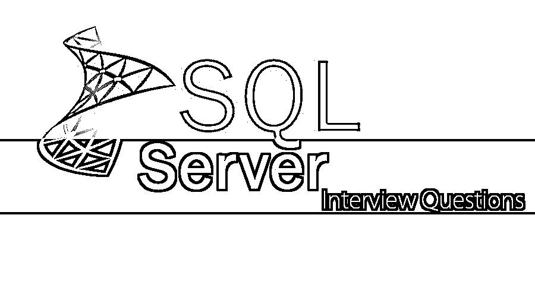

# SQL Server 面试问题

> 原文：<https://www.educba.com/sql-server-interview-questions/>




## SQL Server 面试问题介绍

以下文章提供了 SQL Server 面试问题的概述。SQL Server 是微软开发的 RDBMS(即关系数据库管理系统)中使用最多的一种。除了提供关系数据库，它还包括其他组件以及商业智能、报告和分析工具。数据库创建、备份、安全和复制等功能使 SQL server 成为顶级数据库管理工具之一。Microsoft SQL server 有多个版本，由 Microsoft 销售，面向多个受众，基于从单机应用程序到面向 internet 的大型应用程序的工作负载，同时涉及多个用户。

其主流版本包括企业版、标准版、网络版、商业智能版、工作组版和快速版。企业版包括核心数据库引擎和附加服务，以及用于创建和管理 SQL server 群集的多种工具。标准版包括一个数据库引擎，以及独立的服务。企业版的一个不同之处在于，它支持集群中更少的节点。根据业务案例场景，所有版本都有自己的一套功能。

<small>Hadoop、数据科学、统计学&其他</small>

现在，如果你正在寻找一份与 SQL Server 相关的工作，那么你需要准备 2022 年 SQL Server 面试问题。的确，每个面试都因职位不同而不同，但要通过面试，您仍然需要对 SQL Server 有一个清晰的了解。在这里，我们准备了重要的 SQL Server 面试问题和答案，将帮助您在面试中取得成功。

在这篇 2022 年 SQL Server 面试问题的文章中，我们将介绍 10 个最重要和最常用的 SQL Server 面试问题。这些问题将帮助学生围绕 SQL Server 建立他们的概念，并帮助他们赢得面试。

### 第 1 部分 SQL Server 面试问题(基础)

第一部分介绍了基本的 SQL Server 面试问题和答案:

#### Q1。保护 SQL server 的多种方法是什么？

**答案:**

开发人员可以通过多种方法来确保 SQL server 的安全性。其中一些可能是常见的用法，而另一些可能更面向技术。

*   可以重命名 SQL server 计算机上的管理员帐户。
*   通过设置 SSL 和防火墙，将 SQL server 与 web 服务器隔离开来。
*   始终通过为服务器、数据库和应用程序应用角色来控制对数据的访问。
*   NTFS 权限可以用来保护物理数据库文件。
*   启用加密审核，禁用来宾帐户。
*   应该首选 NT 身份验证。
*   利用强系统管理员密码，限制对 SQL server 的物理访问。

#### Q2。什么是触发器，触发器有多少种类型？

**答案:**

每当与表相关的事件发生时，比如插入、更新或删除，可以用一个名为 Trigger 的实体执行一批 SQL 代码。它们由数据库管理系统管理。触发器也可以用来执行存储过程。下面列出了 SQL server 中可用的触发器:

*   **DML 触发器:**它们被称为数据操作触发器。顾名思义，每当 DML 命令(即插入、更新或删除)在表或视图上发生时，它们都会被触发。
*   **DDL 触发器:**任何数据库对象的定义发生任何变化，都可以被数据定义语言触发器捕获。这些触发器可以控制和管理基于生产和开发的环境。
*   **登录触发器:**这些触发器在案例中很方便；发生了 SQL server 的登录事件。它在 SQL server 中设置用户会话之前被激发。

#### Q3。SQL server 中的用户定义函数是什么，如何创建和执行它们？

**答案:**

用户可能需要实现他们自己的逻辑，这些逻辑可以在一个称为用户定义函数的函数中捕获。用户无论如何都不限于预定义的功能，并且可以编写复杂的已经定义的代码的简化版本。这是用户定义函数的最大优点之一。

用户定义函数的创建可以通过以下方式完成:

**代码:**

```
Create Function test(@num int)
returns table
as
return select * from employee where empid=@num
```

该功能可按如下方式执行:

**代码:**

```
select * from a test(12)
```

#### Q4。解释一下 SQL server 中 View 的用法？

**答案:**

这是面试中问的基本 SQL Server 面试问题。对于 SQL server 开发人员来说，视图是最有益的实体。数据库模式非常复杂。同时，为一组特定的用户定制数据可能是一项单调乏味的任务，与数据库模式设计一样复杂。这些类型的复杂性可以通过视图抽象出来。它们提供了一种机制来控制对特定行和列的访问。因此，通过聚合数据可以显著提高数据库的性能。

#### Q5。什么是复制，为什么在 SQL server 上需要复制？

**答案:**

它是一组从一个数据库向另一个数据库复制和分发数据和数据库对象技术。同步数据也可以通过复制来保持一致性。复制可用于将数据分发到不同的位置，并通过特定的 internet 介质分发给远程或移动用户。具有数据的多个服务器可以使用副本集与复制过程同步。因此，可以增强读取能力，并且可以向用户提供在不同服务器之间进行选择以执行读写操作的选择。

### 第 2 部分 SQL Server 面试问题(高级)

现在让我们看一下高级 SQL Server 面试问题和答案:

#### Q6。在 SQL server 中创建数据库的命令是什么？

**答案:**

有一个命令叫做' CREATEDATABASE '，它可以用来在 SQL server 上创建任何数据库。

**语法:**

```
CREATE DATABASE database_name
```

示例–可以创建“测试”数据库来创建数据库测试。

#### Q7。在 SQL server 中拥有索引的优缺点是什么？

**答案:**

在 SQL server 中使用索引有各种优点和缺点。

**优点:**

*   索引有助于加快选择查询的速度。
*   也可以搜索大的字符串值，给定的索引设置为全文索引。
*   索引有助于使一行唯一或没有任何重复。

**记过:**

*   索引占用额外的空间；因此，磁盘大小被占用。
*   索引会降低插入、删除、更新等基本操作的速度，但是如果条件中包含索引字段，那么更新操作会更快。由于必须更新每个操作索引，所以插入、删除或更新变得较慢。

#### Q8。SQL server 中的排序规则是什么？

**答案:**

有一套特定的规则来决定数据库中的数据需要如何排序和比较。这些规则可以称为排序规则。示例–使用定义正确字符序列的规则对字符数据进行排序，并带有指定区分大小写、字符宽度等选项。排序规则是 SQL server 中预定义的，它将决定 SQL server 中数据的存储和检索方式。SQL server 中存在各种排序规则，但主要有两种:

SQL_Latin1_General_CP1_CI_AS

SQL_Latin1_General_CP1_CS_AS

其中 CI 不区分大小写，CS 区分大小写。

因此，默认情况下，排序规则不区分大小写，因此其中的所有数据库也不区分大小写。

#### Q9。什么是光标，它有哪些不同的类型？

**答案:**

这是面试中常见的 SQL Server 面试问题。游标是一个数据库对象，可以利用它从结果集中一次一行地检索数据。当数据需要逐行更新时，游标会非常方便。

光标生命周期主要由 5 个步骤组成:

*   **声明游标**–通过定义 SQL 语句声明。
*   **打开游标**–打开用于存储数据，从结果集中取出。
*   **取游标**——游标打开后，可以逐行或分块取行进行数据操作。
*   **关闭光标**–数据操作完成后，需要明确关闭光标。
*   **解除分配游标**–要删除游标定义，应该解除分配游标，释放与游标相关的所有系统资源。

光标的类型有:

*   **静态**–这些类型的游标负责制作数据的临时副本并存储在 tempdb 中。对基表所做的任何修改都不会在游标进行的提取所返回的数据中突出显示。
*   **动态–**与静态相反，它们突出显示基表中的所有变化。
*   **只进**–光标只能从第一个到最后一个顺序提取。
*   **键集驱动的**–键集是唯一标识行的键集，是内置的 tempdb。

#### Q10。SQL server 中的联合和联接有什么区别？

**答案:**

UNION 选择行，而 JOIN 从两个或多个表中选择列。两者都可以用来合并多个表中的数据。简而言之，JOIN 将数据合并到新列中，而 UNION 将数据合并到新行中。

### 推荐文章

这是 SQL Server 面试问答指南。这里我们列出了最有用的 10 组面试问题，这样求职者就能轻松应对面试。您也可以阅读以下文章，了解更多信息——

1.  [热门 PostgreSQL 面试问题](https://www.educba.com/postgresql-interview-questions/)
2.  [MySQL 面试问答](https://www.educba.com/mysql-interview-questions/)
3.  [SQL 面试问答](https://www.educba.com/sql-interview-questions/)
4.  [成功 TSQL 面试问答](https://www.educba.com/tsql-interview-questions/)


