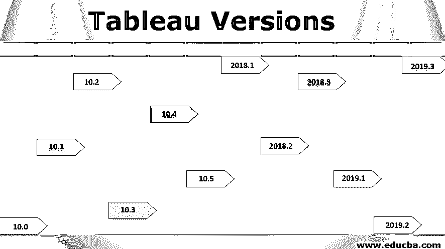

# Tableau 版本

> 原文：<https://www.educba.com/tableau-versions/>

## Tableau 版本介绍

每当对软件进行某些更新或更改时，就会发布包含必要更新的新版本工具。通常，发布新版本的需求是由用户的需求或工具中某些特定特性的需求决定的。Tableau 是一个广泛使用的可视化分析工具。它有多种形式，如 Tableau Desktop、 [Tableau Server](https://www.educba.com/install-tableau-server/) 和 Tableau Mobile 等。该工具的各种版本都有，该公司一直在其官方网站上发布更新。在出色的支持服务的帮助下，用户可以轻松利用更新版本。在这个主题中，我们将学习 Tableau 版本。

### 简短的 Tableau 版本

我们现在将看到一些重要的特性，这些特性是从最新版本到 10.0 的 Tableau 的各个版本中新加入或改进的。

<small>Hadoop、数据科学、统计学&其他</small>

#### 1.表 2019.3

*   它的一个特色是 Tableau 目录。该目录使您能够全面了解数据与分析的关系。这一点很重要，因为 analytics created 提供了对特定用户来说重要的数据部分的见解。
*   这个版本有一个 Tableau 服务器管理插件。这一特性本质上允许更大规模的执行，有助于提高可管理性。它还集成了性能监控和内容管理功能。
*   它提供基于统计显著性的分析，利用人工智能等强大的概念，以获得更深入的见解，并得出正确的结果。

#### 2.表 2019.2

*   在这些新特性中，最值得注意的是参数。这些参数可以是动态的，控制计算和过滤，从而相应地驱动可视化。
*   矢量地图是另一个令人兴奋的功能。该功能提供了清晰流畅的地图可视化效果。

#### 3.表 2019.1

*   这个版本提供了一个基于自然语言的功能，即“询问数据”。使用 Ask 数据，可以通过提问从数据中产生见解。
*   混合内容类型是允许在同一页上查看数据源和工作簿的功能。
*   将见解导出到 PowerPoint 有助于构建高度互动且见解深刻的演示文稿

#### 4.表 2018.3

*   这个版本中包含的一个非常强大的工具是热图。热图是一种特殊类型的可视化数据，它结合了散点图的功能以及基于变量值的颜色组合。
*   动态行动现在成为可能。因此，只需选择或点击地图的一部分，就可以实时改变可视化效果。此外，在工作表之间导航变得更加容易。
*   与 R 的连接现在变得更加安全。这是通过 SSL/TLS 安全连接与 Tableau 集成或 RServe 实现的。

#### 5.表 2018.2

*   基于位置元素连接数据集，当它碰巧是其中唯一常见的元素时，现在变得可能了。这在空间数据环境中证明是有用的。
*   嵌套排序作为排序中的高级选项，是这里提供的一个强大的分析特性
*   现在可以轻松构建适合移动设备的仪表盘。这对于业务用户非常有用，他们现在可以在几秒钟内使用自动表格布局构建仪表板。
*   一个非常重要的特征是 ISO-8601 标准周。该功能现在可以用于基于日历的计算和可视化，从而使分析更加标准。
*   在高级计算中使用对数轴时，负值现在可以显示在对数刻度轴上。

#### 6.表 2018.1

*   在分析中引入了一个非常重要的概念。该工具提供了高价值的见解，并且可视化地描绘了一种趋势。
*   一个非常强大的概念是建立从 SQL server 到空间数据的连接。这为更深入的分析开辟了新的途径，因为现在可以利用自定义 SQL 从空间数据中获得更深入的见解。
*   通过添加集群功能，集群得到了改进。该功能克服了以前保存的群集的静态特征，现在随着数据的刷新而改变。

#### 7.表 10.5

*   在这个版本中，一个名为 Hyper 的功能是 Tableau 的吸引力。作为一种内存数据引擎技术，它使复杂数据集的操作更快。
*   当处理任何类型的数据时，幂趋势线是一个非常重要的数据分析工具，这是这个版本的一个重要特征。
*   它方便了开发人员和用户创建嵌套项目。使用该功能，项目可以根据按照需求设置的权限级别进行嵌套。这使我们能够有一个系统的结构来进行项目。
*   Tableau 服务器现在可以在 Linux 操作系统上使用。Tableau 和 Linux 的特性现在都可以用于分析。

#### 8.表 10.4

*   现在，使用 Tableau 的团队中的分析师可以在分析的基础上协作和讨论，使用该工具的某些特定点。这得益于该工具提供的实时对话功能。
*   Tableau 开始支持 Okta Mobile Connect，扩大了基于 Tableau 的移动分析的范围，使其更加通用。
*   Denodo 连接器使数据虚拟化成为可能。该设施为虚拟化数据分析打开了新的大门。

#### 9.表 10.3

*   Tableau 服务器中的工作簿可以更快地加载数据。这是由于查询的自动预缓存。
*   Tableau Bridge 有助于连接来自 Tableau Online 的现场数据，从而让用户使用云功能。

#### 10.表 10.2

*   它给马克卡带来了有益的改进。现在，所有的药丸都可以一目了然，不需要滚动屏幕。
*   在图形环境中，现在可以为单个测量创建单独的图例。

#### 11.表 10.1

*   地理编码是引入的一个非常重要的功能。这实际上意味着国际航空运输协会和国际民航组织的代码现在已经被 Tableau 认可，机场现在可以很容易地被绘制出来。
*   通过促进向上钻取，连续字段的分析被带到了另一个层次。这有助于创建动态的、开箱即用的可视化效果。

#### 12.表 10.0

*   基于用户在 Tableau 服务器上利用站点 SAML(安全断言标记语言)现在变得可能了。
*   新的管理视图让我们深入了解 Tableau Desktop 的许可和使用情况。

在 Tableau 的每个版本中，都添加了某些功能或对其进行了更新。现在，让我们看看 Tableau 的优点和缺点。

### Tableau 的优点和缺点

以下是一些优点和缺点:

#### 优势

*   Tableau 提供的可视化特性和功能非常出色。他们是行业中的佼佼者之一。
*   Tableau 让用户创建由统计分析驱动的可视化，人工智能。例如，在 Tableau 中，可以执行有洞察力的时间序列分析。此外，该工具支持与像 r。
*   [Tableau](https://www.educba.com/tableau-new-features/) 支持连接多个数据源
*   它在移动平台上得到支持，也提供了一种易于利用的方法。

#### 不足之处

*   收购的许可成本相当高，因此基本上是大型企业的首选。
*   虽然很容易使用，但有些功能需要专业技术知识，如 SQL 知识

### 结论

任何组织，为了成为头号玩家，都会不断更新其工具，并不时发布其版本。工具及其版本总是有利有弊，但是使用工具的决定完全取决于组织的偏好。

### 推荐文章

这是一个 Tableau 版本的指南。这里我们讨论一下 Tableau 的各个版本的优缺点。您也可以阅读以下文章，了解更多信息——

1.  [什么是 Tableau 仪表盘？](https://www.educba.com/what-is-tableau-dashboard/)
2.  [Tableau 仪表板创建](https://www.educba.com/tableau-dashboard-creation/)
3.  [Tableau 仪表盘设计](https://www.educba.com/tableau-dashboard-design/)
4.  [画面故事情节](https://www.educba.com/tableau-storyline/)

