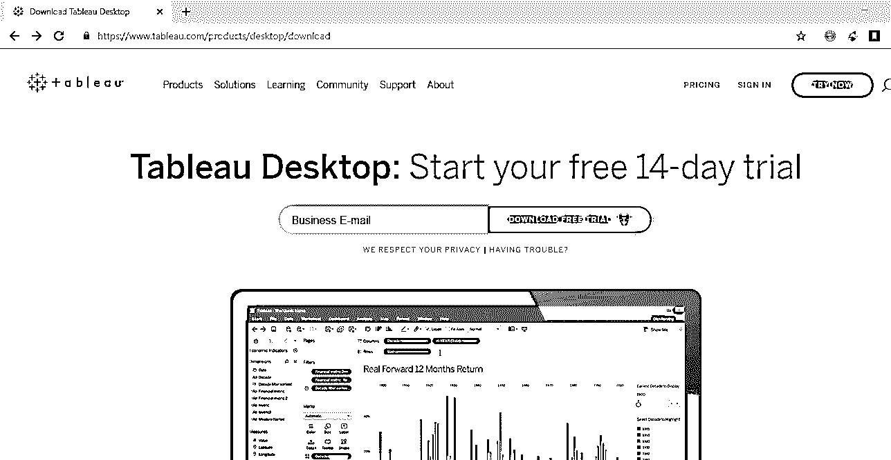
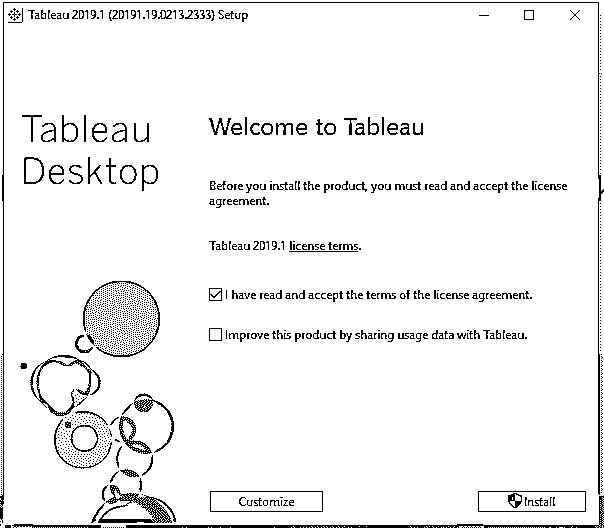
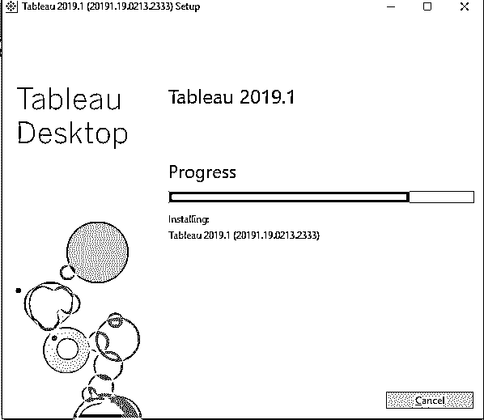
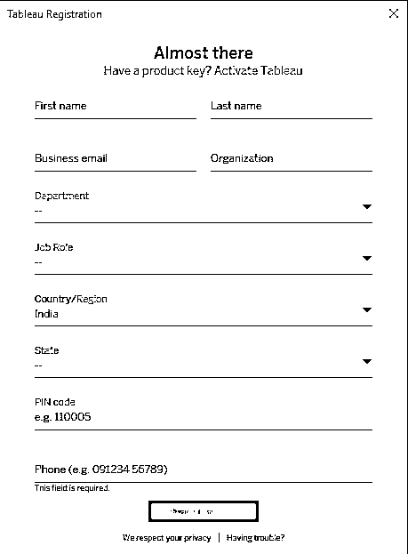

# 如何安装 Tableau？

> 原文：<https://www.educba.com/install-tableau/>

## 如何安装 Tableau？

[Tableau](https://www.educba.com/what-is-tableau-dashboard/) 是一款数据可视化软件(工具),用于跨组织分析数据和做出业务决策。使用一个工具很有趣，因为它的交互式用户界面和产生可视化效果的能力。

本文将指导您在 Windows 平台上安装 Tableau Desktop 的步骤。

<small>Hadoop、数据科学、统计学&其他</small>

### 安装 Tableau Desktop 的步骤

以下是如何安装 tableau 的不同步骤:

#### 第一步

*   首先，我们需要从 Tableau 网站下载 Tableau 软件来安装 Tableau[https://www.tableau.com/products/desktop/download](https://www.tableau.com/products/desktop/download)

*   这是下载 Tableau 桌面的主页。你可以从这个链接下载最新版本。页面顶部包含产品、解决方案、学习、社区、支持、关于和定价等选项。Tableau 提供一系列产品，如 Tableau Desktop、Tableau Reader、Tableau Public、Tableau Server、Tableau Online、Tableau Prep。产品选项给出了 Tableau 必须为消费者提供的所有产品的列表。
*   Solutions option 让我们先睹为快 Tableau 的强大功能，以及如何在更大的行业平台和更小的个人平台上使用它来分析不同的市场和领域。
*   Tableau 还提供免费的视频讲座和培训 Tableau，希望学习 Tableau 的人可以利用它们。学习选项提供了数据集，可以下载并在观看视频时用于练习。在从事某个项目或作为个人时，我们可能会在 Tableau 中遇到一些问题或疑问。Tableau 有自己的社区，那里有论坛，人们可以提出他们的疑问，也可以为他们希望在 Tableau 未来看到的一些附加功能投票。以及人们在使用 Tableau 时面临的许多问题的讨论线索。
*   此外，还有博客和在线活动正在进行，人们可以通过它们获得更多的见解。我们还提供 tableau 支持，Tableau 的 Tableau 专业人员会帮助人们解决他们在开发仪表板时遇到的一些问题，或者在使用任何其他 Tableau 服务(如服务器、Tableau prep 等)时遇到的一些问题。我们可以获得在线支持，也可以打电话给他们，通过电话解决问题。“关于”选项提供了对 Tableau 是什么以及开发它的目的的深入了解，以及对领导层的一些深入了解。然后，我们有定价选项，它给出了关于所提供的 Tableau 服务的定价的详细信息。
*   输入电子邮件 id 并开始下载。打开下载的文件并开始安装。

#### 第二步

接受协议，开始安装 tableau。

*   如果您希望与 Tableau 分享您如何使用该产品的一些细节，以便公司更容易收到反馈并改进该产品(Tableau)，您可以选中“通过与 Tableau 分享使用数据来改进该产品”选项。

*   你会看到 Tableau 正在安装

#### 第三步

*   Tableau 安装完成后。Tableau 将打开，您将看到以下屏幕。该屏幕将有一个表格，需要填写姓名，电话号码，组织名称等细节。您需要填写这些详细信息来注册该产品，以便您可以使用它。这只是一次性活动。但是，如果您在您的机器上重新安装 tableau 或第一次在另一台机器上使用 tableau，则需要再次执行此操作。

#### 第四步

*   输入您的所有详细信息并开始试用版，tableau 试用版可以使用 14 天，之后您将需要一个许可证密钥来安装 Tableau。试用期结束后，如果没有许可证密钥，您将无法使用 tableau。如果你想免费使用 Tableau，你可以导航到此链接[https://public.tableau.com/en-us/s/download](https://public.tableau.com/en-us/s/download)从 Tableau 网站下载并安装 Tableau Public，下载 Tableau Public 软件也可以遵循同样的步骤。Tableau Public 和 Tableau Desktop 完整版的区别在于，Tableau Public 连接数据源的选项有限。你只能连接到几个数据源，如 excel 表、google 表等，将其用作数据源，而 Tableau Desktop 将在 14 天内免费提供 Tableau 的全部功能。您可以连接到 Tableau 提供的所有可用数据源。您需要在 Tableau public 网站上创建一个帐户以使用 Tableau public，然后您开发的工作簿或报表需要在 Tableau Public 服务器上发布，您不能在您的计算机上本地保存您开发的 Tableau Public 报表。
*   但是您可以通过下载已从 Tableau 公共服务器发布的报告来保存报告。这样，您可以在本地系统上间接保存一个副本。

### 推荐文章

这是一个如何安装 Tableau 的指南。在这里，我们已经讨论了以更容易和最简单的方式安装 Tableau 的基本说明和不同步骤。您也可以阅读以下文章，了解更多信息——

1.  [什么是 Tableau 服务器？](https://www.educba.com/what-is-tableau-server/)
2.  [如何使用 Tableau 命令？](https://www.educba.com/tableau-commands/)
3.  [Tableau 的用途](https://www.educba.com/uses-of-tableau/)
4.  [Tableau 的替代品](https://www.educba.com/tableau-alternatives/)

