# 表格图表

> 原文：<https://www.educba.com/tableau-charts/>

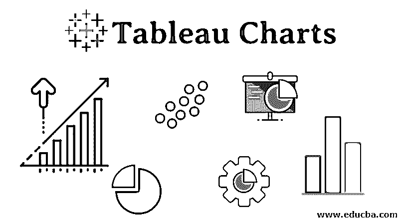

## Tableau 图表介绍

Tableau 是一个可视化分析工具，它带有一系列的图形分析功能。基于上下文，用户可以对数据使用合适的图表，并根据需要生成洞察。Tableau 中的每个图表都有一个应用程序。单击“演示”,将鼠标悬停在图形符号上，它会显示生成图表需要多少个度量或维度。

Tableau 中可用的各种图表类型如下:

<small>Hadoop、数据科学、统计学&其他</small>

1.  条形图
2.  折线图
3.  面积图
4.  饼图
5.  树形地图
6.  气泡图
7.  热图
8.  项目符号图表
9.  盒须图
10.  帕累托图
11.  直方图
12.  线条图

### Tableau 中的图表类型

我们将看到，Tableau 中的图表类型，一个接一个，以及生成它们的机制。

#### 1.条形图

*   此图表有助于可视化维度的度量。各种类别以条形的形式表示。条形的高度对应于测量值(分布体积)。

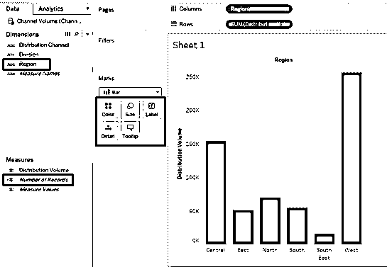

*   如上所示，将该区域拖至“列”区域，将“分配体积”拖至“行”区域。它生成垂直条形图，显示产品的区域分销量。

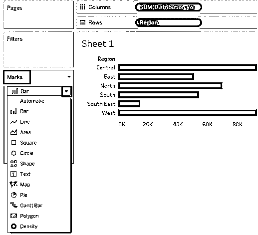

*   将分布量放入列中，将区域放入行中，使条形图变成了水平形式。可以从标记卡的下拉菜单中更改图形类型。

#### 2.折线图

*   它以线条的形式显示数据，线条是一系列的点。折线图描绘了一种模式或趋势，我们可能希望将其可视化以供分析。下面的折线图显示了每日的温度模式。

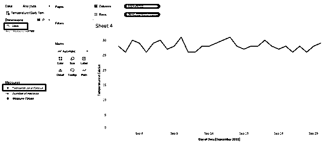

*   图表有多个选项。对于折线图，选择线条(离散)选项。正如我们在 Columns 区域看到的，Tableau 自动应用了各种[周期函数](https://www.educba.com/tableau-functions/)超维度日期。

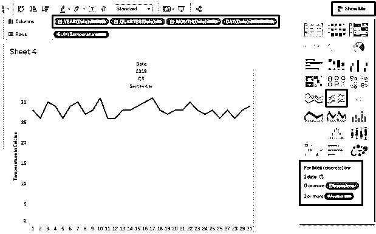

#### 3.面积图

*   这些图表基于当前时段的定量数据，如每日、每月等。如果我们想要在一段时间内将类别与度量进行比较，面积图有助于理解图形中面积所代表的大小的差异。

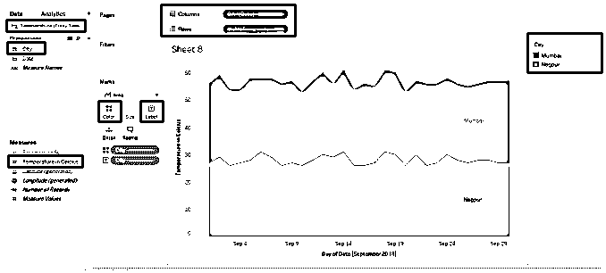

*   上述面积图的数据源包含两个城市 2018 年 9 月的每日气温数据。将日期拖到列区域，将摄氏温度拖到行区域。将城市拖到颜色和标记卡上。

#### 4.饼图

*   当我们希望直观显示总贡献的比例时，例如，我们可能希望看到每个地区对总销售额的贡献，这些就很有用。贡献由圆的扇区表示。要生成下面的饼图，请将区域拖到列中，将分布量拖到行中，然后单击演示中的饼图。将区域拖到标签上。

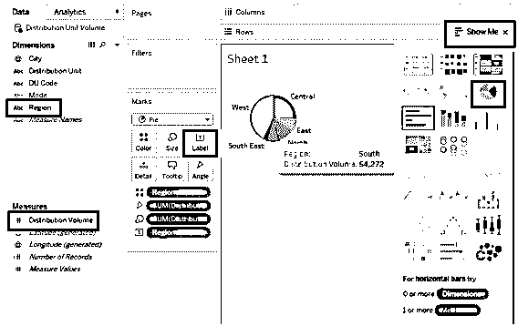

*   保持上面的[饼图](https://www.educba.com/pie-chart-examples/)不变，只需将 Mode 拖动到 Columns 区域，它给出了两种不同模式下分配到各个区域的数量的详细信息，如下所示:

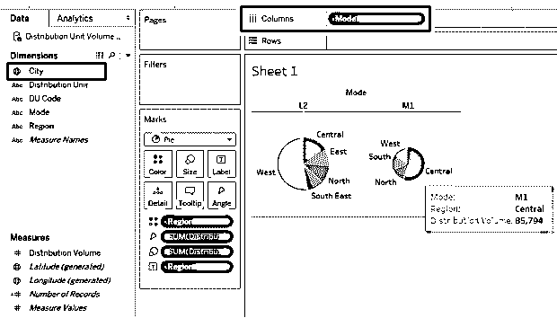

#### 5.树形地图

*   这些可视化将大小和颜色考虑应用于数据。根据数据的比例，颜色和大小的强度会有所不同。我们将使用我们在前面的例子中使用的数据。要生成树形图，请将区域拖到标签上。将分布卷拖到颜色、大小和标签上，一次拖一个。

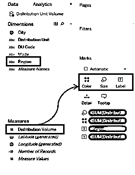

*   正如我们所看到的，度量值决定了颜色的强度和大小。这里，西部地区的销售额最高，由最暗的阴影和最大的矩形表示。颜色强度因值而异。

#### **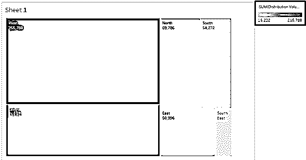

** 

#### 6.气泡图

*   顾名思义，图表以气泡形式显示数据。当我们想要针对某个度量标准生成有用的见解时，它会变得很方便。

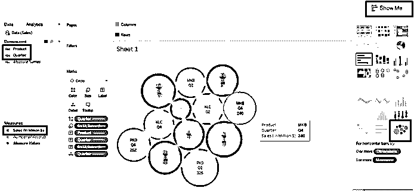

*   要生成上述气泡图，请遵循以下步骤:

1.  首先将产品拖到列中，然后将销售额拖到行中
2.  单击演示中的气泡图选项
3.  将四分之一拖到颜色上
4.  将产品拖到标签上
5.  将销售额拖到标签上
6.  将硬币拖到标签上

这里，气泡的大小代表了度量的大小。注意，不同的硬币用不同的颜色表示。

#### 7.热图

*   当我们有许多类别需要用一种方法进行比较时，就会用到热图。颜色的强度显示了类别的贡献。它们可以作为一个强大的工具，将热强度的概念用于可视化。
*   下面的热图是针对不同产品的区域销售数据生成的。若要生成映射，请将“销售额(百万)”分别拖动到“颜色”、“大小”、“地区”和“产品”区域的列和行中。

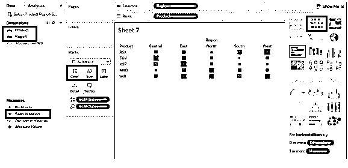

#### 8.项目符号图表

*   当我们有两个度量标准，并希望对两个不同的类别进行可视化时，项目符号图非常有用。它们类似温度计。这两个度量相互叠加，一个表示为条形，另一个显示为线条。
*   我们用于生成项目符号图的数据包含城市温度和降雨量数据。首先，将城市拖到列中，将温度和降雨量拖到行中。度量的默认函数是 Sum。改成一般。在演示中，单击项目符号图。

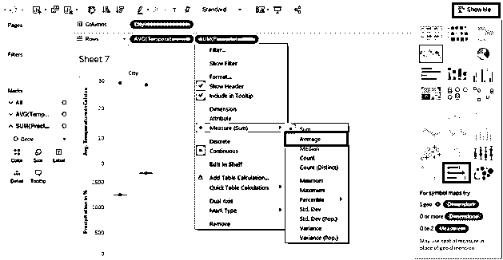

*   如下所示，项目符号图需要两个度量。在这种情况下，我们用降水量和温度作为度量。我们已经生成了超维度城市的子弹图。

#### **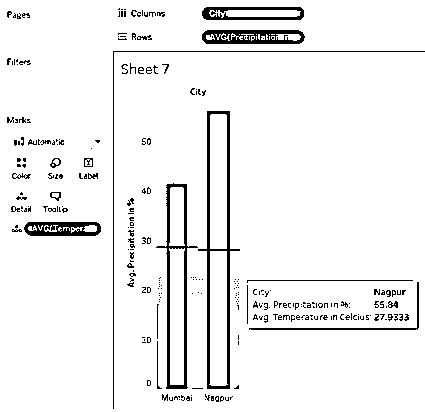

** 9。方框和胡须图

*   这是一个统计图，提供了对数据分布的直观了解。从技术上讲，它提供的数据考虑了某些统计因素:中位数，四分位数，四分位数之间的范围，和异常值。要生成方框图和须状图，请将 Product 拖到列中，将 Sales 拖到行中，并将 Quarter 拖到 Detail 上。单击演示中的盒须图。

#### **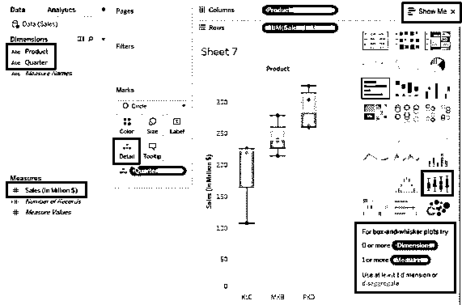

** 10。帕累托图

*   此图表用于 ABC 和 80-20 分析。这是一种特殊类型的图表，不能直接在 Tableau 中使用，但可以创建。它结合了条形图和折线图来生成帕累托分析。例如，管理层使用帕累托图来了解哪些产品类别占总销售额的 80%。

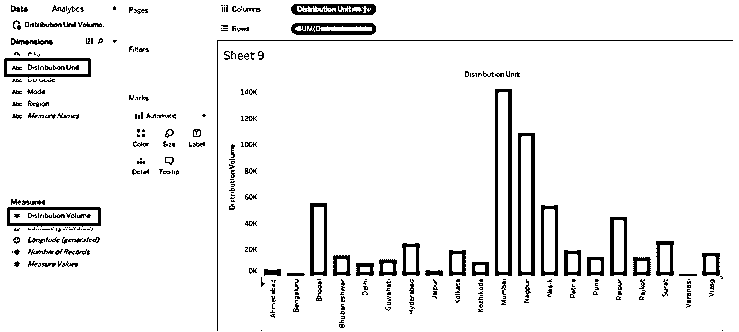

*   对于我们的示例，我们使用的是 Distribution Unit Volume 数据源。最初，将分配单元拖到列中，将分配卷拖到行中，并按降序对结果进行排序。我们得到下图。

*   现在，第二次将分布卷拖动到行区域，如下所示:

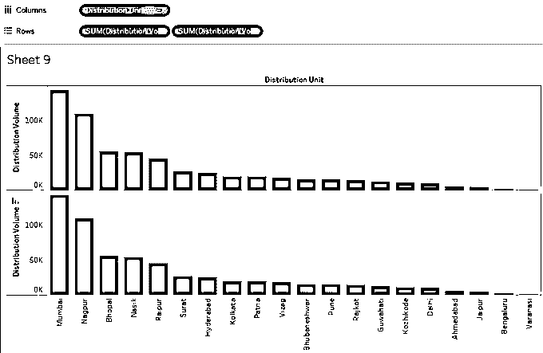

*   对于第二个分配卷，创建一个[双轴](https://www.educba.com/tableau-dual-axis/)。

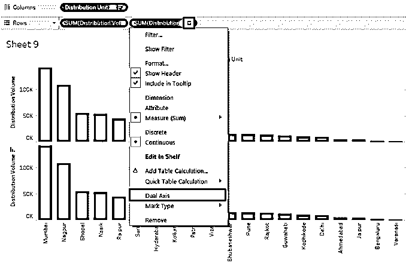

*   如上所述，创建双轴将两个图表映射到同一个框架上。

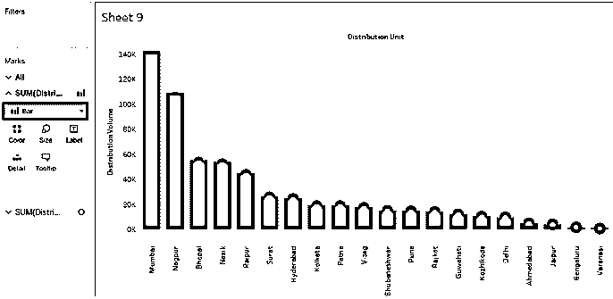

*   可以从下拉菜单中更改类型图表。我们将图表类型改为线形，如下所示。双轴现在也出现在右侧。

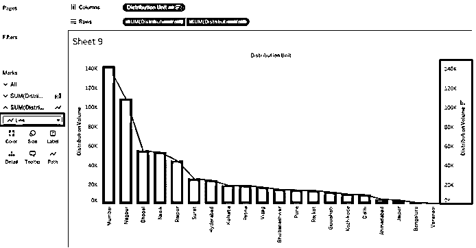

*   通过点击标记卡中的颜色，可以更改图形的颜色和其他属性。我们已经将线条颜色改为橙色。

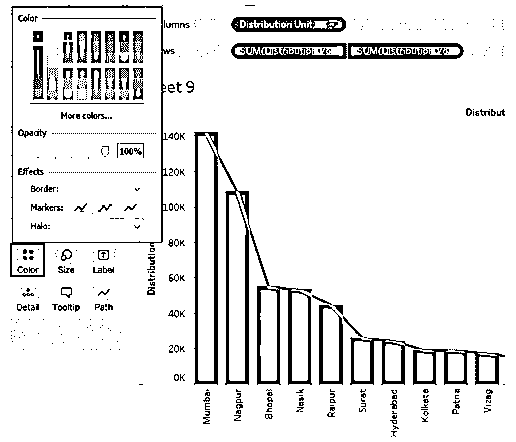

*   现在从过滤器中选择选项**添加表格计算**。

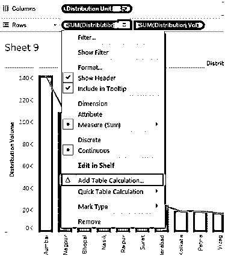

*   在计算类型下点击**运行总数**。

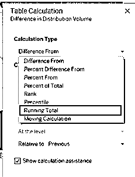

*   将打开表格计算框，勾选**添加二次计算**。

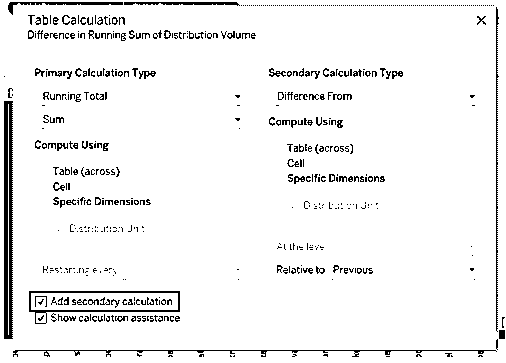

*   并选择**选项，占总数的百分比。**

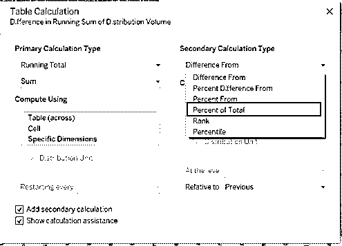

*   现在你可以看到条形图。

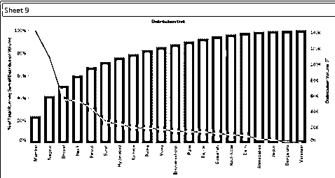

*   将条形图改为折线图，将折线图改为条形图。

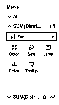

                           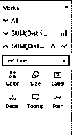

*   您将看到下面有线条的条形图。

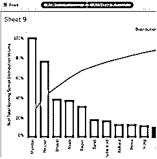

#### 11.直方图

*   该图将数据划分为多个仓，然后基于频率生成可视化洞察。

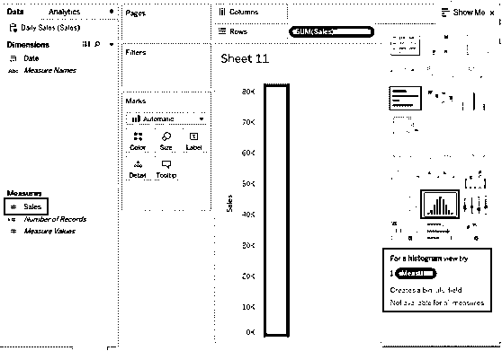

*   将销售额拖动到行中，然后单击直方图。Tableau 中的[直方图只需要](https://www.educba.com/histogram-in-tableau/)一次测量。

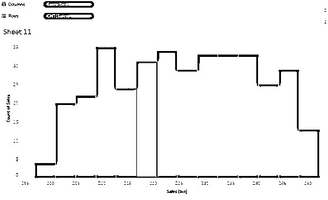

#### 12.线条图

*   该图表特别用于监控项目。活动以基于持续时间的水平条表示。我们将为一个软件开发项目生成一个甘特图。

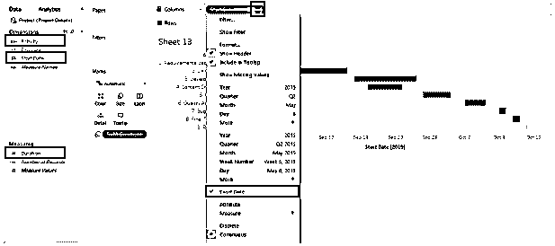

*   将开始日期拖到列中，将活动拖到行中。对于开始日期，单击提取日期以按日期显示数据。拖移持续时间超过大小

**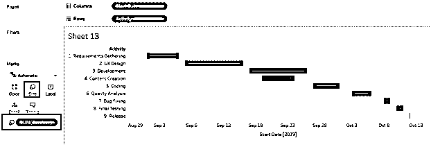

** 

### 结论

在可视化分析中，图表是一个重要的分析单位。Tableau 为可视化分析提供了广泛的功能。该工具附带了一系列图表，必须根据上下文来使用。这些图表是易于使用的元素，可以帮助我们更深入地挖掘数据并生成详细的见解。

### 推荐文章

这是 Tableau 图表的指南。在这里，我们讨论了 12 种不同类型的图表，并附有简要的解释和说明。您也可以浏览我们的文章，了解更多信息——

1.  Tableau 中的气泡图
2.  [什么是 Tableau？](https://www.educba.com/what-is-tableau/)
3.  [Tableau 命令](https://www.educba.com/tableau-commands/)
4.  [Tableau 图表类型指南](https://www.educba.com/tableau-chart-types/)

