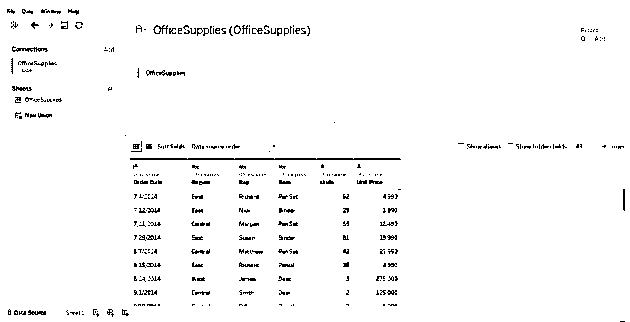
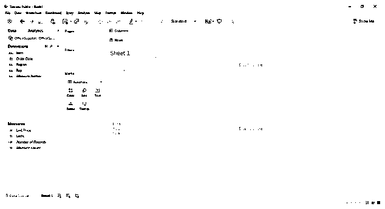
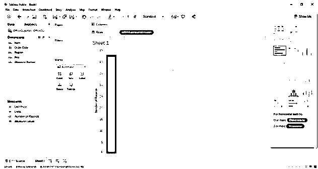
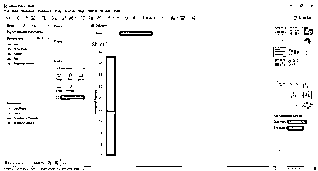
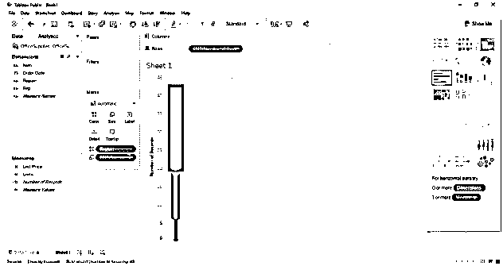
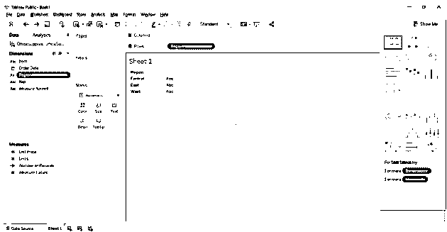
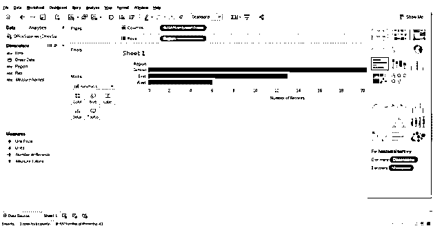
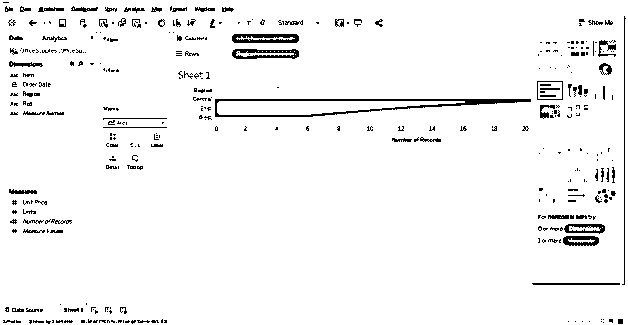
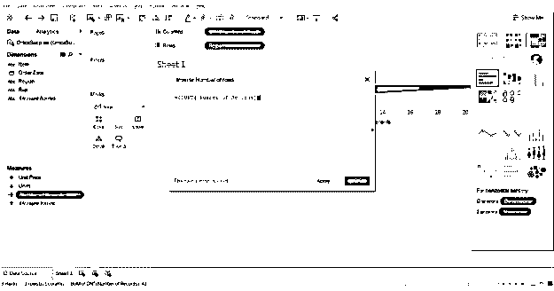
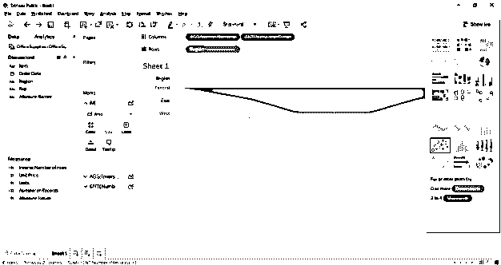

# Tableau 中的漏斗图

> 原文：<https://www.educba.com/funnel-chart-in-tableau/>

## Tableau 中漏斗图的介绍

在我们开始详细讨论 tableau 中漏斗图是如何绘制的之前，我们先来了解一下什么是漏斗图？因此，漏斗图顾名思义，在绘制时就像一个漏斗。它显示逐渐降低比率的值，总计为 100%。较高的部分称为头部，较低的部分称为颈部。它们可以用来显示任何正在缩小的东西。我们可以说漏斗图是饼图的某种替代形式，因为两者覆盖的总面积都是 100 %,唯一的区别是，在漏斗图中，我们缩小了面积，例如:

*   一个面积为 60%的条形
*   第二个面积为 20%
*   下一个是 15%
*   最后一个面积为 5%

例如，如果我们有一个拥有不同技能的办公室，总共有 500 名员工，我们想要以递减顺序绘制具有特定技能的员工数量，我们可以选择漏斗图。假设我们有 300 名员工使用 Python，150 名员工掌握 R 知识，50 名员工掌握 SPSS 知识。使用 Python，漏斗图的头部可以是 300 名员工，使用 SPSS，漏斗图的颈部可以是 50 名员工，中间层属于 150 名具有 r 知识的员工。

<small>Hadoop、数据科学、统计学&其他</small>

因此，在介绍完漏斗图之后，我们现在将注意力转移到 Tableau，它将用于可视化漏斗图。

tableau 是一种用于可视化的工具。它用于直观地分析数据。一个人可以使用 Tableau 创建一个交互式的可共享的仪表板，该仪表板可以使用图形和图表来描述数据的趋势和变化。它不是开源的，但是有学生版。有趣的是，它允许实时数据分析。可以用来连接文件，大数据源。它用于学术、商业和许多政府组织。

### 构建 Tableau 图表

那么，现在让我们开始构建 [tableau 图表](https://www.educba.com/tableau-charts/)。因此，我们将有两种方法来构建 tableau 中的漏斗图

#### 方法 1-(阶梯式漏斗图)

1.打开 Tableau，你会发现下面的屏幕。

2.使用 Tableau 登录页面中的连接选项连接到文件。在我的例子中，我有一个 excel 文件要连接。选择 excel 选项并浏览您的文件以连接

3.我使用的办公用品数据集有六个属性，包括数值和分类值。下面的截图显示了当你连接到你的工作表时，它在 tableau 中的样子。如果仔细观察，会发现在度量区域中有两个属性(单位和单价),在维度区域中有四个属性(区域、代表、项目、日期)。

4.单击带有工具提示“转到工作表”的 sheet1。这是你准备可视化的地方。下面的截图显示了它的样子。

5.因为我们现在必须准备一个漏斗图，所以我们需要将任何测量值拖放到行中。请记住，在此之前，您应该选择聚合函数作为“计数”或“计数(distinct)”。拖放到行中后，您将看到一个反映计数的条形，如下图所示。

6.现在，在这之后，我们可以将 dimensional 字段拖动到 tableau 工作表的“marks”卡中的“color”区域中，在本例中，该区域将允许我们将条形分成组。这里，我们在数据源中有三个组，即东部、中部和西部。同样显示在下面的截图。

7.现在，下一步就是按下 ctrl 键，将测量值拖动到标记卡的尺寸部分。请记住，在拖动“行”部分中存在的记录数时按住 ctrl，因为这将创建测量值的新副本，并将进一步区分栏中的各个部分。因此，条形图现在已根据区域和大小进一步分割。下面的截图显示了同样的情况。

8.现在把上面的转换成漏斗图。只需将工具栏中的视图栏从“标准”更改为“完整视图”，它将被转换为漏斗图，如下图所示。

#### 方法 2-(平滑漏斗图)

1.前四个步骤保持不变，从第五步开始，方法将会改变。对于这种方法，我们必须首先通过右键单击 region >default properties> sort 对维字段中的区域进行排序，然后将维字段 region 拖放到 rows shelf 中。下面的截图说明了同样的情况。

2.下一步是将测量字段“记录数”拖放到列架中。记得将默认属性更改为计数或计数(distinct)。下面的截图显示相同。

3.完成后，现在使用下拉菜单将标记架从“自动”更改为“区域”。下面的截图显示相同。

4.下一步是创建计算字段或计数字段的倒数(记录数),并将计算字段拖放到列架中。要创建计算字段，请执行下列操作:右键单击字段(记录数)>创建>计算字段。下面的屏幕截图显示了计算字段对话框。

5.最后一步是将文件拖放到列架中。下面的截图显示相同。

### 结论

漏斗图通常用于显示尺寸减小的东西。下面是一些可以使用它们的领域。

*   可视化订单执行流程。
*   将销售过程从头到尾可视化。
*   根据优先级可视化信息流。

### 推荐文章

这是 Tableau 中漏斗图的指南。这里我们讨论了在 tableau 中构建漏斗图的不同方法。您也可以阅读以下文章，了解更多信息——

1.  [Tableau 中的堆积条形图](https://www.educba.com/stacked-bar-chart-in-tableau/)
2.  [表格中的折线图](https://www.educba.com/line-chart-in-tableau/)
3.  [Tableau 建筑](https://www.educba.com/tableau-architecture/)
4.  [Tableau Count Distinct](https://www.educba.com/tableau-count-distinct/)

