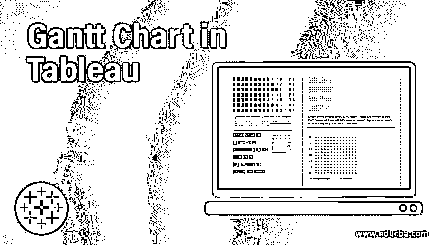
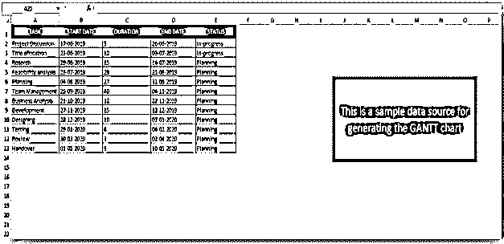
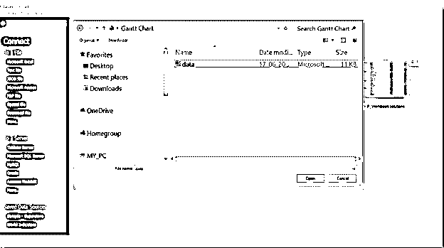
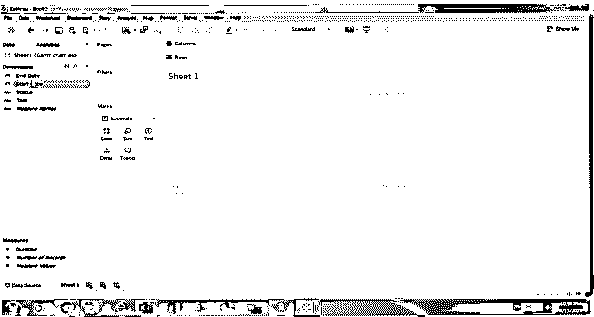
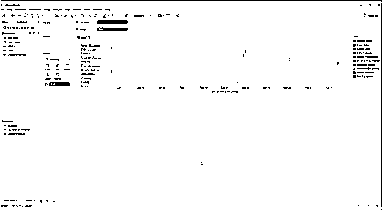
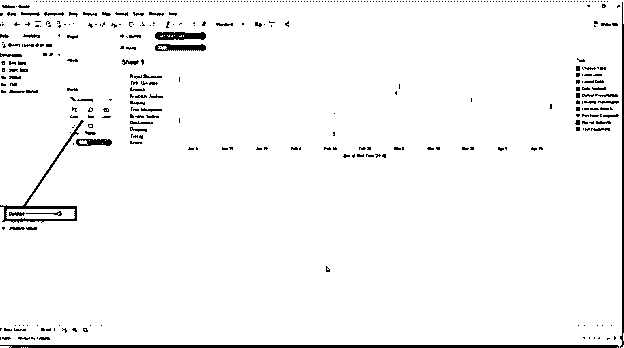
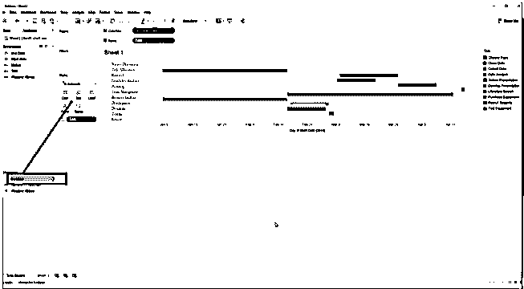
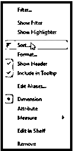
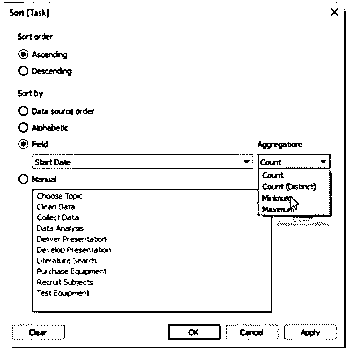
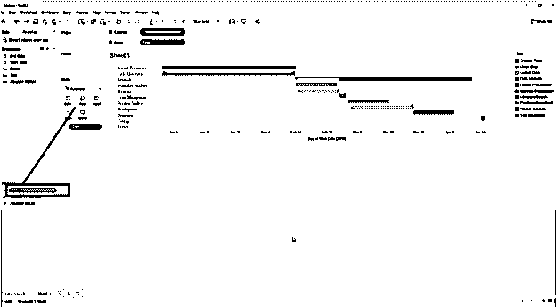

# 表格中的甘特图

> 原文：<https://www.educba.com/gantt-chart-in-tableau/>

## Tableau 中的甘特图介绍

许多项目在初始阶段就以彻底的灾难告终，因为他们试图去咬超过他们所能咀嚼的东西。这种失败可能有多种原因——其中一个重要原因是缺乏合适的项目可视化工具。项目经理需要在任何需要的时候，对计划、监控和调整变更(或大或小)拥有完全的控制权。在这篇表格中的甘特图的文章中，我们已经讨论了一个如此伟大且被广泛接受的项目管理工具——甘特图。

甘特图——是一种线形/条形图表(更常见的类型),捕捉并说明项目进度以及所有相关活动与里程碑、成就、任务等之间的依赖关系。

<small>Hadoop、数据科学、统计学&其他</small>

让我们看看如何在 Tableau 中创建甘特图，以及它在项目经理的日常生活中对项目成功的重要性。

### 如何在 Tableau 中创建甘特图？

*   从创建甘特图开始，Tableau 软件需要连接数据源。数据源可以是 Excel 电子表格、MySQL 或任何服务器。
*   我们正在使用 Excel 电子表格，

*   准备好数据源后，需要打开 Tableau 应用程序来连接数据源。
*   打开 Tableau >转到连接数据源>>打开保存的包含数据的 Excel 表文件。
*   一旦你这样做了，你会得到这样一个屏幕

*   选择数据源文件，您将看到如下屏幕

*   上面的屏幕是 Tableau 的仪表盘；这是我们创建甘特图的地方。

在我们继续之前，让我们先向观众简要介绍一下这些部分——

**1。Dimension** :这个部分保存我们在 Excel 中创建的数据表中的列。我们可以看到在 Dimension 部分下所有的列都存在。

**2。度量**:名字本身就给人一些想法。这些是测量参数。

**3。标记:**标记是一种编辑工具，用颜色、大小、文本、工具提示等来增强我们的甘特图。这些是为了增强演示风格。

**4。列&行:**列代表列数据。列部分中的所有信息代表列数据。行数据也是如此

**5。工作表区域:**工作表是我们可以看到甘特图的区域；它最初是空白的，直到一些工作进展。

*   下一件事是根据你的需要定制你的数据。单击“工作表”选项卡，开始定制数据。使用“标记”选项更直观地显示您的数据。在 Tableau 中，有几种图表——条形图、折线图、地图、饼图、圆环图、面积图和其他几种图表。
*   对于甘特图，通常情况下，条形图是首选，因为甘特图代表了不同阶段工作的时间间隔。
*   遵循以下屏幕–

*   在上面的屏幕中，我们可以看到间隔非常小，所以我们将从“Measures”列中拖动“Duration ”,并将其拖动到“Marks”部分下的“Size”中。按照下面的屏幕。

*   一旦你这样做了，你会得到这样的东西-按照下面的屏幕。

*   现在您有了每项任务的工期间隔；你可以看到持续时间是无组织的。你应该按照下面的步骤来组织它。

任务>>排序>>

*   这样,“排序”对话框将会打开，您需要在其中选择
*   字段单选按钮，并选择“开始日期”。让我们看看下面的屏幕。

*   在聚合下拉菜单中，您必须选择“最小值”，然后单击“应用”和“确定”按钮。
*   一旦你点击了 OK 按钮，你将得到一个组织好的条形图。看看下面的屏幕。

*   这就是你制作甘特图的方法。有了这一点，我们也可以说，制作甘特图永远不会有类似的要求。用户可以根据自己的需要，通过改变颜色、持续时间、图表大小等进行定制。

**Note:** The chart complexity may vary as per the requirement.

### 甘特图的重要性

1.  有了甘特图，团队就知道项目进展如何，他们已经走了多远，落后了多少。它是使用最广泛的项目可见性工具之一。
2.  它作为一种改进和更好的沟通的媒介，因为我们知道糟糕的沟通技术和缺乏证据成为项目失败的最重要的原因之一。它消除了这个问题。
3.  更加清晰
4.  更好地掌握时间管理

### 结论

*   甘特图是跟踪项目相关管理的重要工具之一。它还消除了对任何其他项目管理工具的需求。
*   那些真正使用过它或者读过它的人能够理解它的重要性。
*   TABLEAU 作为一个应用在当前行业获得了巨大的动力；它制作这些 PM 相关文档的能力是其广泛可用性的有希望的原因之一。

### 推荐文章

这是 Tableau 中甘特图的指南。在这里，我们讨论了如何在 Tableau 中创建图表，以及甘特图的重要性。您也可以浏览我们推荐的其他文章，以了解更多信息-

1.  表格 vs QlikView
2.  [Tableau 中的堆积条形图](https://www.educba.com/stacked-bar-chart-in-tableau/)
3.  [Tableau 中漏斗图概述](https://www.educba.com/funnel-chart-in-tableau/)
4.  [表格中的折线图](https://www.educba.com/line-chart-in-tableau/)

