# 表格项目符号图

> 原文：<https://www.educba.com/tableau-bullet-chart/>

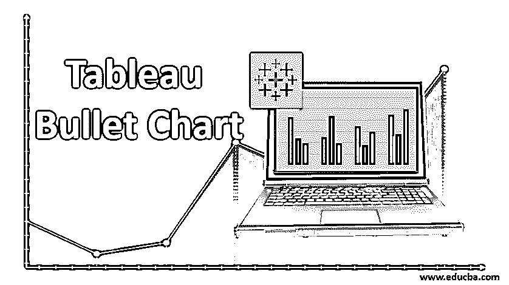

## Tableau 项目符号图简介

在 Tableau 提供的特殊类型的可视化中，项目符号图表就是其中之一。该图表本质上使用两种度量，并以温度计样式的可视化形式表示数据。Tableau 能够生成如此精美的可视化效果，这使它在大多数 BI 工具中独树一帜。项目符号图稍微复杂一些，适合于我们想要分析各种类别的两个度量的情况。它也可以被认为是条形图的高级变体，其中一个度量代表条，而另一个度量代表穿过条的黑线。

### 在 Tableau 中构建项目符号图表

现在，我们将研究构建项目符号图的逐步步骤。为了进行演示，我们使用每日降水和温度数据集。该数据集包含印度十个主要城市九月份的每日气温(摄氏度)和降水量(百分比)。我们想了解不同城市的温度和降水模式是否相同，并得出其他见解。

<small>Hadoop、数据科学、统计学&其他</small>

让我们按照以下步骤构建一个项目符号图:

**第一步:**首先将数据集加载到 Tableau 中。为此，点击“数据”菜单下的“新数据源”。或者，单击“连接到数据”。

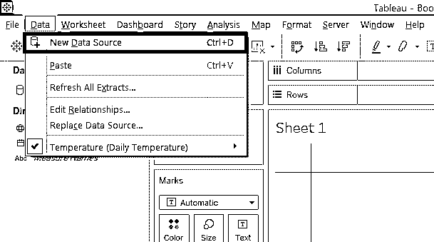

**步骤 2:** 在“数据源”选项卡中可以看到数据被加载，如下图所示。

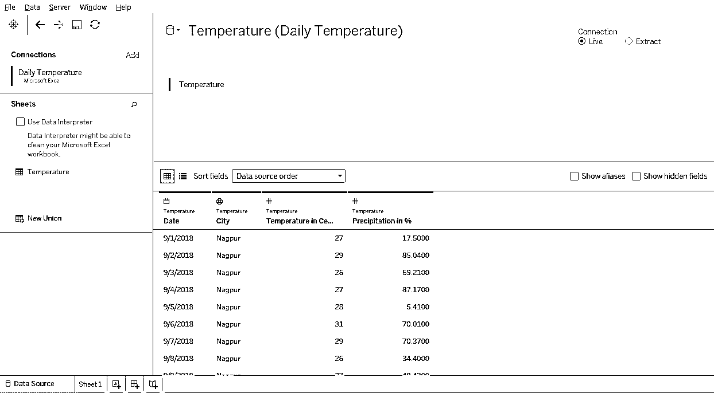

**步骤 3:** 转到工作表标签，我们可以在相应的部分中找到“降水量%”和“温度摄氏度”以及维度城市和日期。

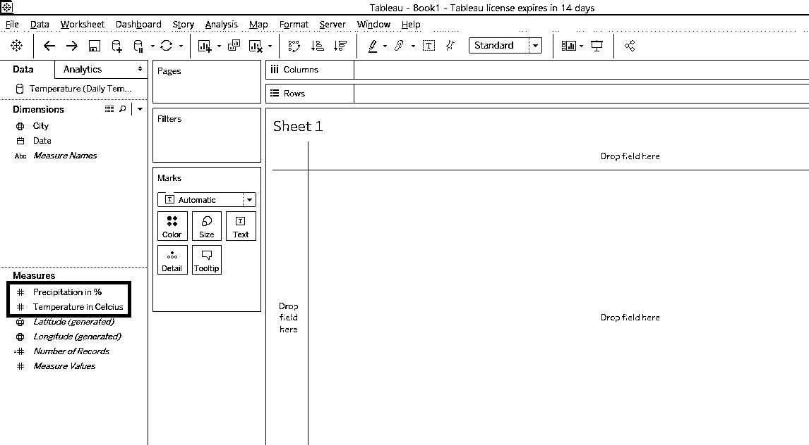

**步骤 4:** 最初，将“降水量%”和“温度摄氏度”拖到行区域。然后将城市维度拖到列区域中。我们得到一个简单的柱状图可视化，如下图所示。

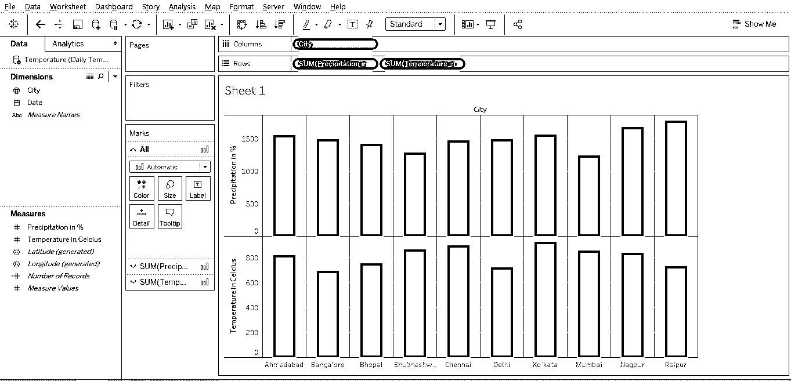

**步骤 5:** 下一步是将条形图转换成项目符号图。这可以如下所示完成。只需单击“演示”，然后单击位于“演示”选项最后一行符号中的项目符号图符号。将鼠标悬停在项目符号图符号上，会给出与生成图表的尺寸和测量要求相关的条件的详细信息。注意，对于项目符号图，需要两个度量，而对任何维度没有要求。

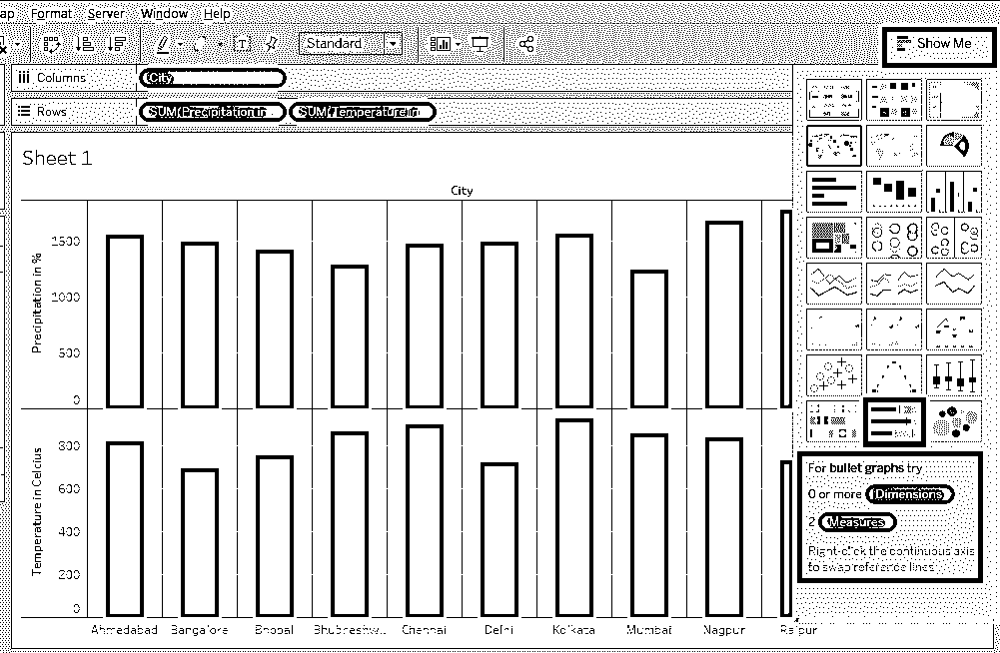

**步骤 6:** 下面的屏幕截图详细介绍了演示选项和项目符号图表类型的选择。

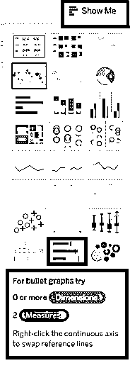

**第 7 步:**点击 Show Me 中的项目符号图表类型，会显示如下截图所示的项目符号图表。默认情况下，图表以水平形式显示。我们可以让它水平或垂直。要使其垂直，请使用 Ctrl + W 命令。

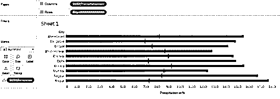

**步骤 8:** 下面的截图向我们展示了基于两个天气指标构建的项目图，即温度和降水。我们可以看到，自动地，以摄氏度为单位的温度测量在标记卡中被考虑得过于详细，而以%为单位的降水量测量继续保留在 rows 区域中。在这里，必须注意，项目符号图的应用是从两个密切相关的度量中探索洞察力，并解释结果，以根据图表完美解释的相关性和对应趋势得出结论。

然而，下面截图中显示的图表没有给出正确的见解。因为，尽管图表恰当地描述了趋势，但它是基于以%为单位的降水量和以摄氏度为单位的气温的测量值的总和。整个月的总值没有意义，因为我们打算分析一个月的日平均温度和降水量。

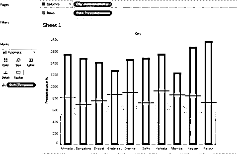

**步骤 9:** 为了解决上述问题，我们将使用这些步骤将应用于“摄氏度温度”和“百分比降水量”测量的函数从总和(总和或总和)更改为 AVG(平均值)，如下图所示。单击衡量标准的下拉菜单。然后在度量(总和)中选择平均值。对两个测量都这样做。

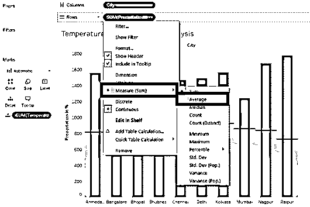

**第 10 步:**正确执行上述步骤将使我们得到正确的项目符号图，如下图所示。请注意，我们已经适当地命名了工作表。这对于更好地理解通过两个度量的洞察所传达的意义是必不可少的。项目符号图的重要性不仅仅在于它能够以漂亮的可视化方式呈现数据，还在于它能够探索重要的洞察力，否则很难获得这些洞察力。

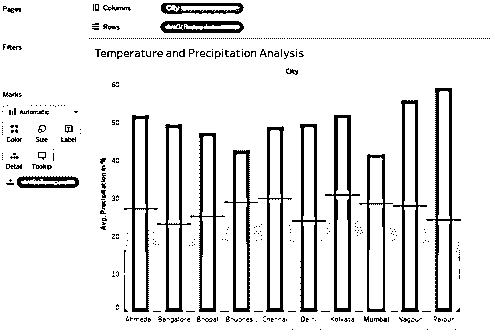

**步骤 11:** 让我们通过项目符号图可视化更深入地分析一下。只需将鼠标悬停在一个条上，我们就会发现该条所代表的详细信息会出现。在下面的截图中，我们可以看到关于钦奈市的温度和降雨量的详细信息。子弹图有助于我们理解不同城市的降水和气温是如何变化的。我们可以一次比较多个城市的测量值，并验证某些假设。比如，让我们假设，如果平均温度条件不同，那么降水量也会不同。现在，如果我们比较德里和赖布尔的城市，我们会发现尽管气温不同，但降水量是一样的。像这样，我们可以在特定的上下文中使用两个度量来执行广泛的分析。

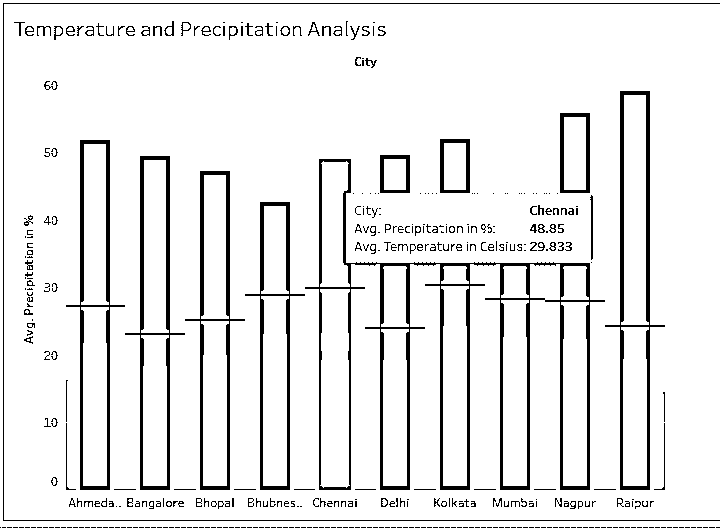

第 12 步:当我们将鼠标悬停在黑线上时，我们会知道该城市的平均温度。黑线代表温度。此外，我们可以在栅栏周围找到灰色的背阴填充物。这些灰色阴影与代表黑线的度量值相关联，例如本例中的摄氏温度。阴影填充的高度由测量值决定，并与黑线所在的水平面相对应。

如果我们从分析中去掉以摄氏度为单位的温度，我们将只剩下条形。我们可以通过将测量拖到 Marks card 中的详细信息上，将它们放回分析中。

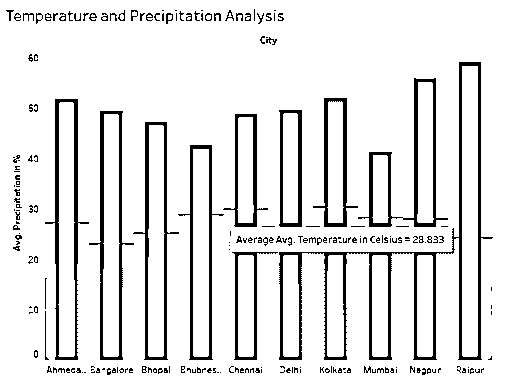

### 结论

项目符号图表类似于 MS EXCEL 中的单元格内图表。然而，与 Excel 单元格内图表不同，Tableau 项目符号图表非常强大，能够处理复杂的问题。Tableau 中易于利用的机制允许快速构建可视化。它最适合包含两个相关度量的上下文。

### 推荐文章

这是 Tableau 项目符号图的指南。在这里，我们讨论如何在一步一步的过程中建立一个项目符号图。您也可以浏览我们的其他相关文章，了解更多信息——

1.  [Tableau 图表类型](https://www.educba.com/tableau-chart-types/)
2.  [Tableau 中的圆环图](https://www.educba.com/donut-chart-in-tableau/)
3.  [表格中的案例陈述](https://www.educba.com/case-statement-in-tableau/)
4.  [Tableau 中的堆积条形图](https://www.educba.com/stacked-bar-chart-in-tableau/)
5.  [如何在 Matlab 中使用条形图(示例)](https://www.educba.com/bar-graph-in-matlab/)
6.  [Tableau 特性和属性介绍](https://www.educba.com/tableau-new-features/)
7.  [用程序创建 JavaFX 条形图？](https://www.educba.com/javafx-bar-chart/)

