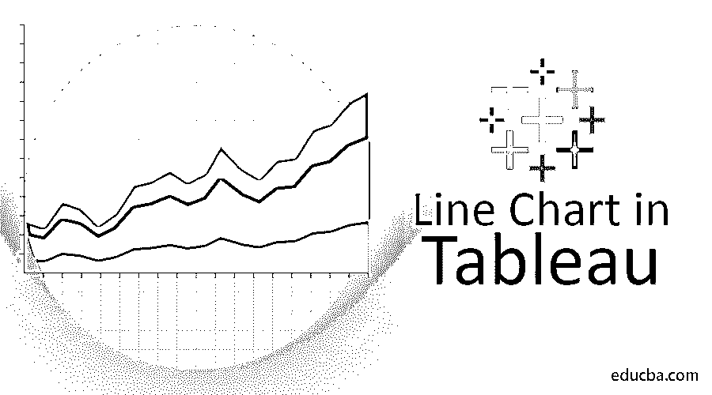
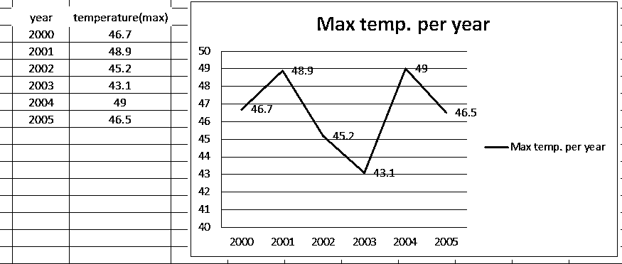
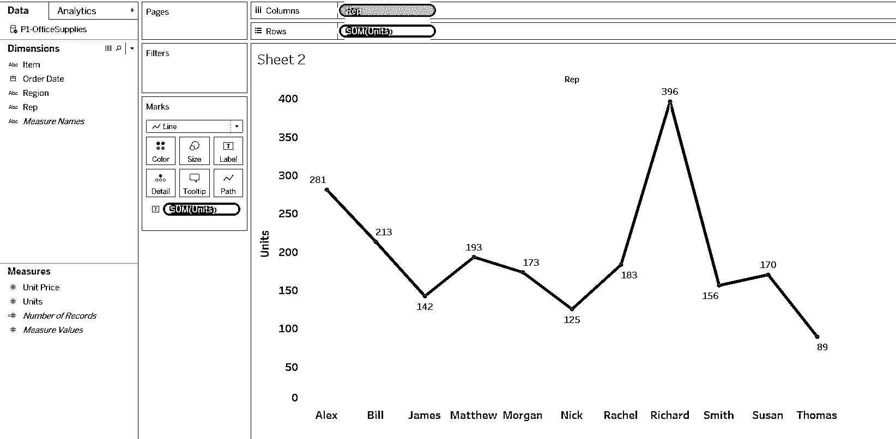
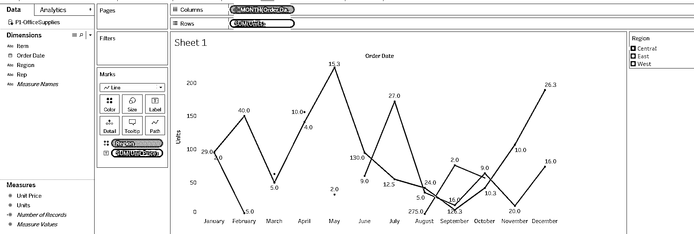
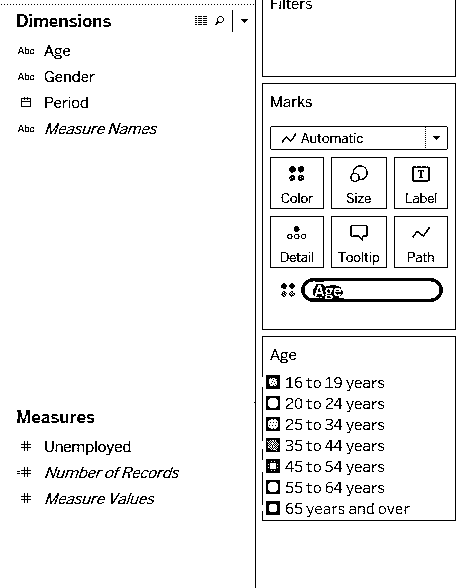
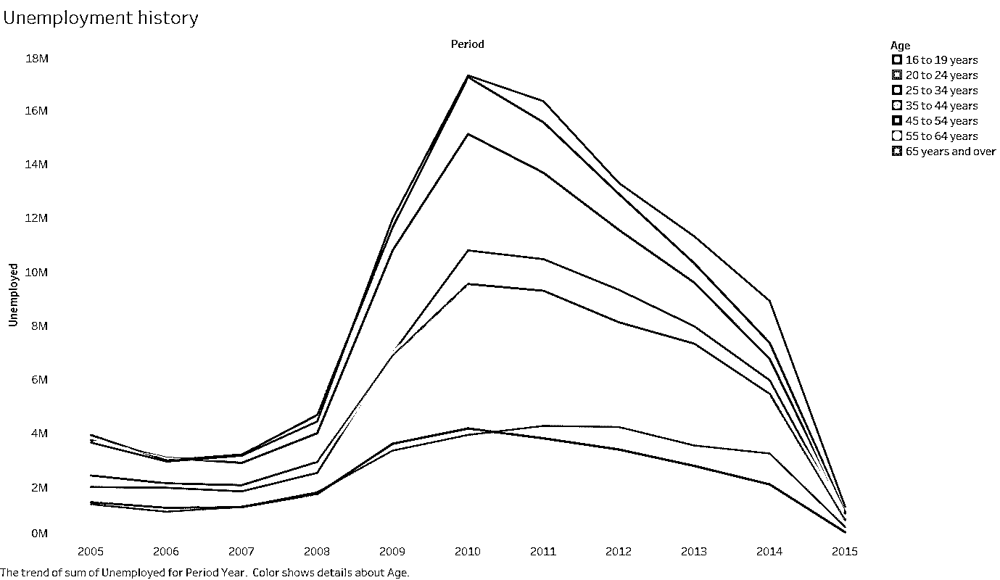
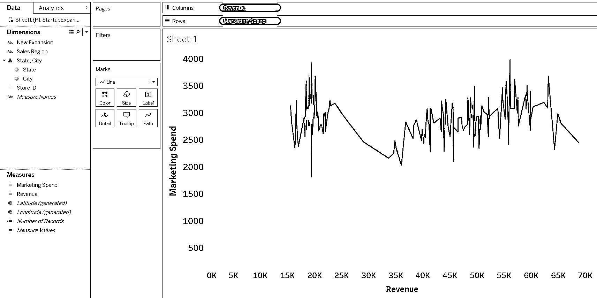
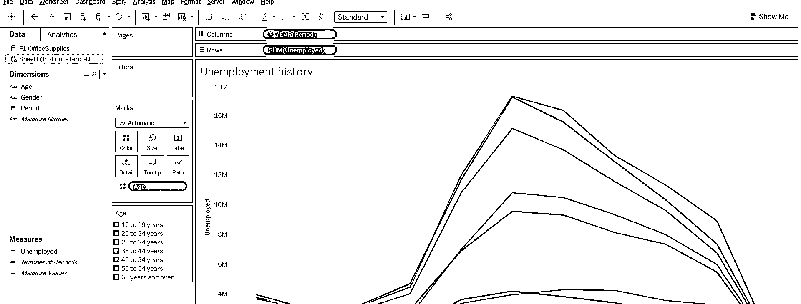
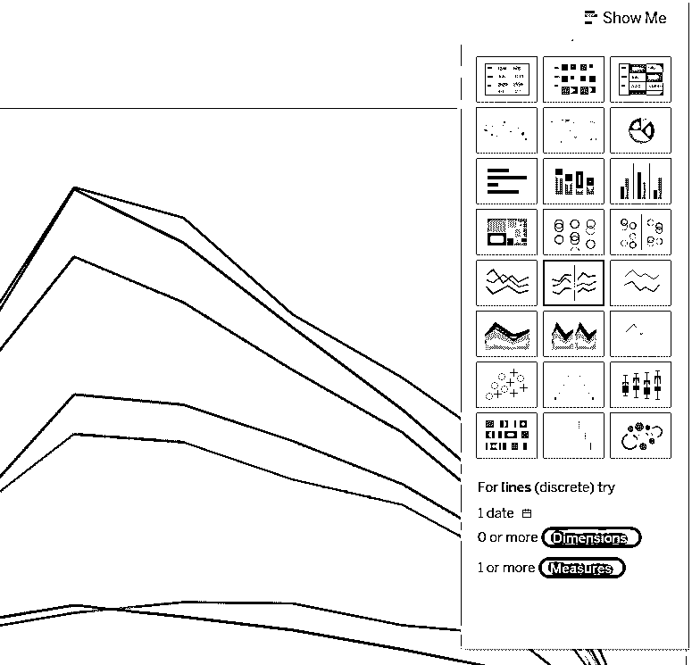

# Tableau 中的折线图

> 原文：<https://www.educba.com/line-chart-in-tableau/>

## Tableau 中的折线图概述

图表是指这样一种图形，其中我们沿着一个轴测量，沿着另一个轴测量尺寸。这可以是离散的，也可以是连续的图。每个观察值对成为一个点，所有这些点的连接形成一条线，显示 2 个轴之间的关系。这叫做折线图。在本主题中，我们将学习 Tableau 中的折线图。

如果我们有连续的数据，我们希望通过图表来表示，那么折线图是一个很好的选择。当我们试图识别数据中的趋势或模式，以了解季节效应和随时间的巨大变化时，这种图表是非常必要的。用折线图来表示时间序列数据是非常必要的。

<small>Hadoop、数据科学、统计学&其他</small>

为了更好地理解，这是在 excel 中创建的基本折线图。下面它描述了给定年份的最高温度，我们已经在折线图中绘制出来。

### 画面中的可视化

数据可视化是以图像或图形格式呈现数据。我们很容易看到图形形式的分析，这使我们能够掌握困难的概念，并确定新的模式。在交互式可视化的帮助下，我们可以将概念带入更深的层次，以获得更多的细节。

我们可以制作两种折线图。

I)单线/简单折线图

ii)多折线图

### 单线/简单折线图

一个简单的折线图显示了一组数据的自变量和因变量之间的关系。

对于 Tableau 中的演示部分，我们将使用下面的数据集，其中的数据涉及不同地区的一些代表销售的商品，以及销售的商品数量和单价。

当我们把 tableau 和。csv 文件，那么 tableau 会自动将维度和度量划分到不同的部分。在下面的示例中，我们在列(x 轴)中采用了“代表值”，在行(y 轴)中采用了“单位值”以实现可视化(我们只需将度量值和维度拖到列和行中)。在“标记”部分，我们需要选择“线”,以折线图的形式查看图形。

注意——在“标记”部分，我们可以设置我们想要的图形类型。在下拉框中，我们有条形图、面积图、折线图、正方形图和饼图等。根据我们的要求，我们可以从中选择选项。

(这是一个离散的单线图)

根据我们输入的数据 tableau 为我们绘制了折线图。为了显示图表上的标题，我们需要将“单位”从度量值拖动到“标签”上，如上面截图中箭头所示。

这个图表告诉我们每个销售代表售出的产品数量。

### 多折线图

多折线图显示多组数据的相关值和独立值之间的关系。

#### 示例#1

当我们有更多的子类别或者在多维变量的情况下，这个多线图表是非常必要的。

在本例中，我们将“订单日期”作为 x 轴，将“单位”作为 y 轴。在将订单日期从一年扩展到几个月之后，我们将“区域”从 dimension 拖到颜色部分，如下所示，然后创建多个折线图，显示按区域划分的每个月的销售总量。

蓝色代表中部地区，橙色代表东部地区，红色代表西部地区。

#### 实施例 2

该数据集是关于从 2005 年到 2015 年期间许多年龄组的失业历史，如 16-19 岁、20-24 岁等。借助 tableau 中的折线图，我们将展示每个特定年龄组在此期间的失业历史。

我们采用了“周期”(列中的维度)和“失业”(行中的度量)。“年龄”维度已被拖到每个年龄组的子类别线图的颜色部分。

在这里，我们可以看到特定时期每个年龄组的失业分布情况

注意:当“标记”设置为“自动”时，tableau 会给出最能描述数据的图。在这里，tableau 将自动抛出这种类型的折线图，因为条形图不是最适合从这种数据中获得洞察力的。

### 使用连续数据

我们在本文中看到的所有例子都是关于离散数据的。让我们创建另一个包含连续数据的折线图示例。

在这篇文章中，我们多次遇到离散和连续数据，我想给它们一个简单的定义。离散数据只能取特定的值。它们可能是无限多的，但每一个都是不同的，在它们之间没有灰色地带。这可以是数字的，如苹果的数量/人口数量，也可以是分类的，如男性或女性、红色或蓝色等。连续数据不限于定义单独的值，而是可以占据连续范围内的任何值。在任意两个连续值之间，可能存在无穷多个其他值。

这是不同地区初创企业扩张的数据集，包括市场支出和收入金额。我们将在市场支出和收入之间绘制一个线形图。

这张图表向我们展示了市场支出和收入之间的模式。两个变量都是数值型的，两个数据之间有许多点。

### 创建折线图的另一种方法

除了这种方法，还有另一种在 Tableau 中创建折线图的方法。在 Tableau 屏幕的右上角，有一个“演示”选项。在该下拉菜单中，我们可以选择多种绘图来可视化我们的数据。在下面的截图中，突出显示的部分为我们创建了一个折线图。

**步骤 1:** 我们需要点击下面标记的部分——“演示”

**步骤 2:** 在下面标记的部分中，我们可以根据我们的数据选择一个，无论数据是连续的还是离散的。

### 推荐文章

这是 Tableau 中的折线图指南。在这里，我们详细讨论了 tableau 中可视化的基本概念，包括单折线图和多折线图示例。您也可以阅读以下文章，了解更多信息——

1.  [Tableau 替代方案](https://www.educba.com/tableau-alternatives/)
2.  [最佳数据可视化工具](https://www.educba.com/best-data-visualization-tools/)
3.  [数据分析工具](https://www.educba.com/data-analysis-tools/)
4.  [数据科学职业](https://www.educba.com/data-science-career/)

