# 表格中的趋势线

> 原文：<https://www.educba.com/trend-lines-in-tableau/>

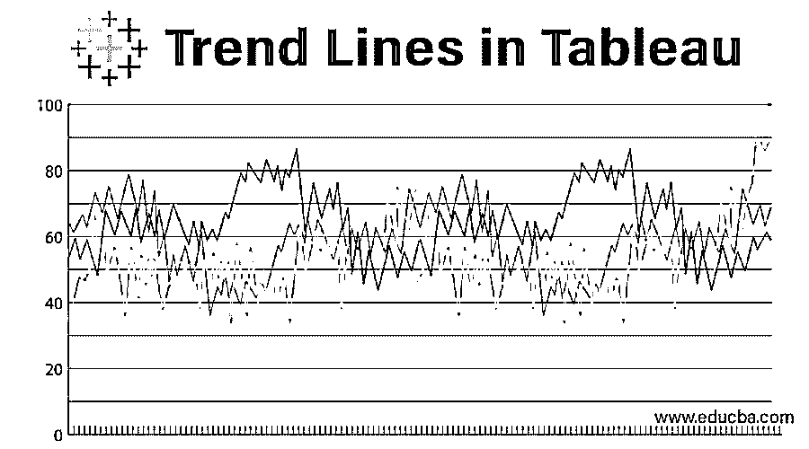

## Tableau 中趋势线的介绍

趋势为分析提供了重要的见解；它突出了数据的趋势。Tableau 创建带有维度和度量字段的趋势线。要在数据中添加趋势线，两个坐标轴都必须包含数字(列和行)。例如，tableau 不会为城市或国家维度创建趋势线，因为它不包含数字。

数学模型用于创建趋势线。Tableau 提供了五种趋势线选项-1。线性 2。对数 3。指数 4。多项式 5。力量

<small>Hadoop、数据科学、统计学&其他</small>

借助趋势线，我们可以看到数据中呈现的趋势。我们可以突出我们现有数据的趋势。因为有了 tableau，我们可以发布包含趋势线的视图，或者与他人共享包含趋势线的视图。

### 如何在 tableau 中创建趋势线？

下面是在 tableau 中设置趋势线的步骤。

1.  打开 tableau 应用程序。
2.  打开数据源。
3.  将订单表拖到工作簿中。

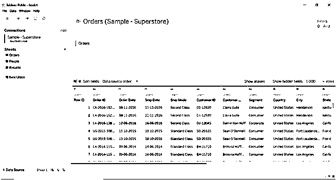

4.  转到工作表。
5.  将订单日期(维度)和折扣(度量)拖到列和行中。

6.  转到分析窗格，选择趋势线并拖动它概述创建。
7.  选择线性趋势线。

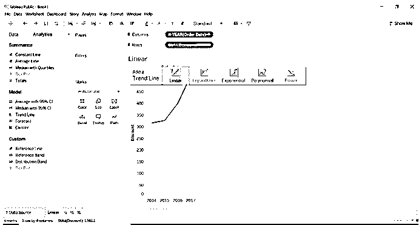

8.  一旦选择了趋势线，视图将会改变。

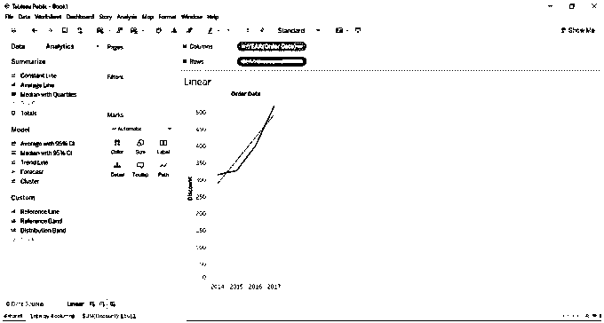

9.  我们可以看到趋势线的描述。

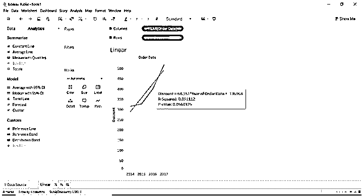

1.  将发货日期维度拖至列，将利润度量拖至行。
2.  转到“分析”窗格，选择趋势线。
3.  拖动趋势线总览并选择指数趋势线。

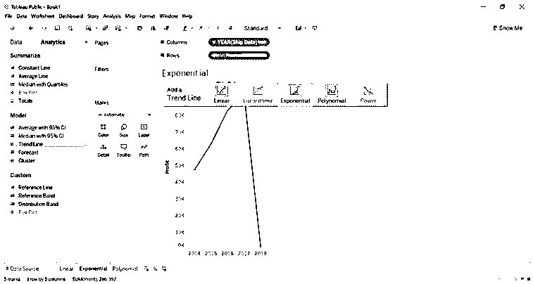

4.  一旦趋势线被拖动，结果就会改变。
5.  将鼠标悬停在趋势线上，我们可以看到对趋势线的描述。

1.  将发货日期(维度)拖到列中，将销售额(度量)拖到行中。
2.  转到分析窗格并选择趋势线。
3.  拖动趋势线总览并选择多项式趋势线。

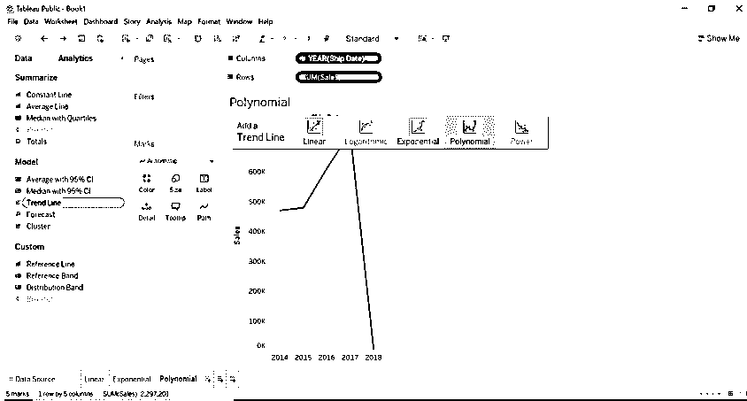

4.  一旦趋势线被拖动视图就会改变，我们可以看到趋势线的描述。

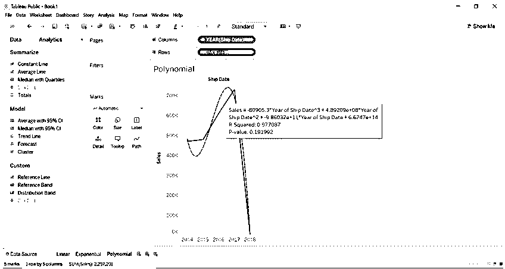

1.  我们将绘制对数趋势线。
2.  将订单日期(维度)拖到列中。
3.  将销售(维度)拖到列中。
4.  将折扣(度量值)拖到行中。
5.  转到分析窗格，并选择趋势线。
6.  将趋势线拖成对数来查看。

您将看到下图。

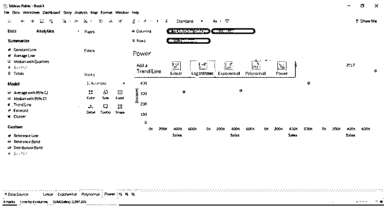

7.  将片段拖到颜色中。

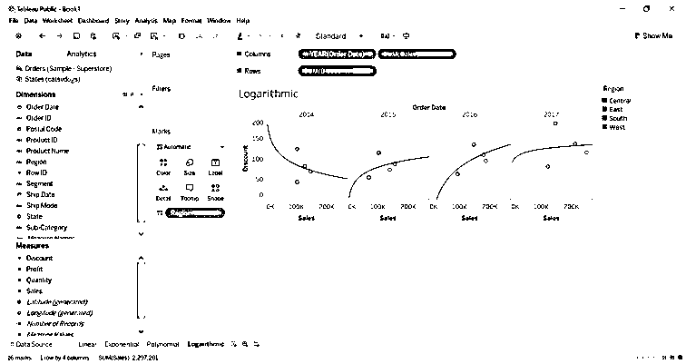

1.  我们将画出力量趋势线。
2.  将发货日期(维度)拖到列中。
3.  将利润(度量)拖到列中。
4.  将 sales (measure)拖到行中。
5.  转到“分析”窗格，选择趋势线并将其拖动到视图中。
6.  将趋势线拖动到幂作为趋势线。

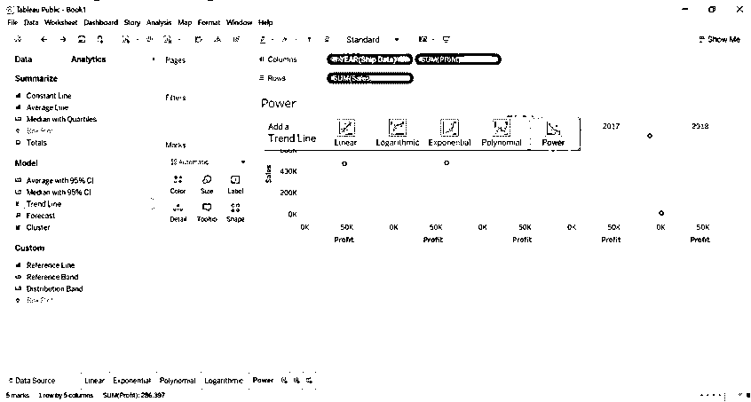

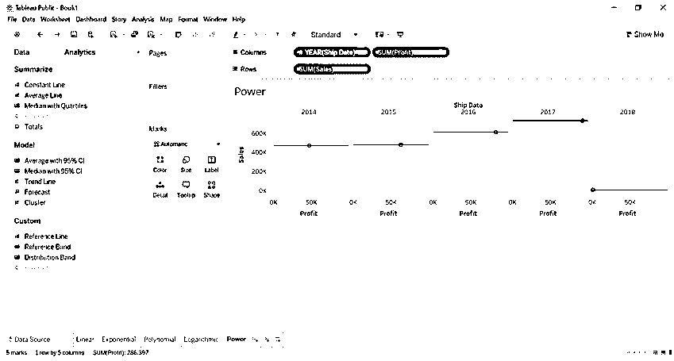

### 趋势线是如何工作的？

用于预测数据统计分析的趋势线。假设它引用了我们创建的线性模型。从这个例子中我们可以看出，折扣每年都在增加。通过计算折扣，我们可以得出每年的利润额。我们可以借助趋势线来计算数字的统计数据。我们不需要执行任何计算，它内置在 tableau 中。我们只需要拖动适当的字段来深入了解数据。

看下图，通过应用折扣来获得每年的利润。

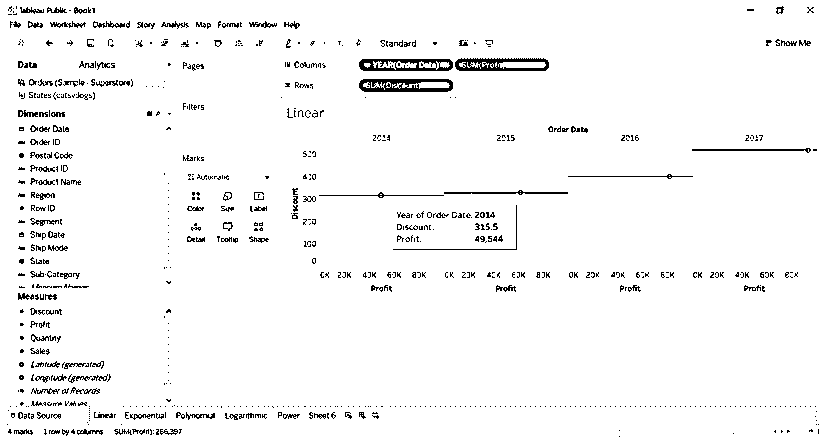

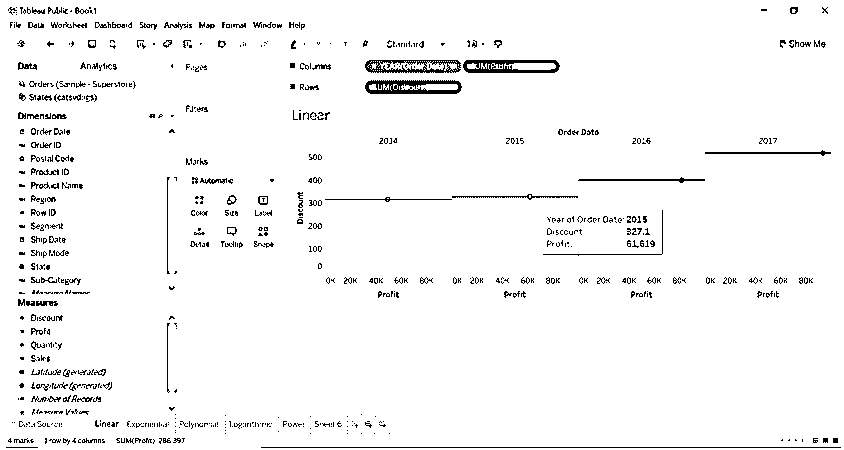

观察上面的例子我们可以理解，如果我们开始可视化数据，我们将得到随机的图。趋势线帮助我们用拟合最好的曲线或直线来绘制数据。

列架上应该有一个数字字段，架上应该有一个数值字段。

趋势线提供了每个绘图的细节。

a)选择趋势线并点击描述趋势线。

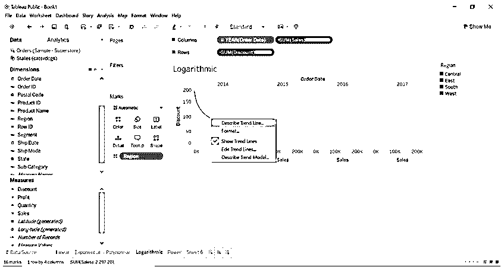

b)当我们点击描述趋势线时，我们将看到下图。

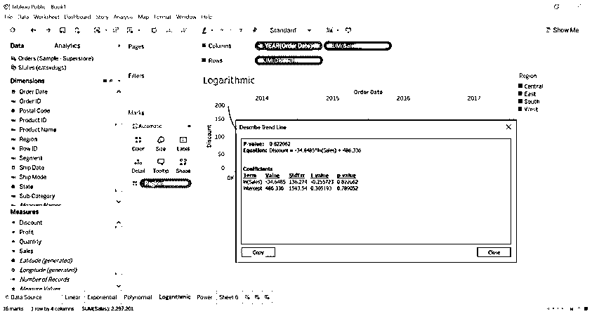

*   要估计线性关系，线性趋势线是最好的例子。它们具有以下形式的等式。Y= b0+b1X
*   当变量之间的变化率增加或减少时，我们可以使用对数趋势线。在上面的例子中，我们可以观察变化率(折扣)是如何影响的。
*   当变量之间的变化率快速增加时，我们可以使用指数趋势线。在上面的例子中，我们可以看到每个地区的利润是如何变化的。
*   当变化率波动时，曲线只不过是多项式趋势线。
*   幂趋势线使用自然对数来转换变量，它不接受小于零的值，因为对数不是针对零值的。在上面的例子中，我们可以观察到。

### 编辑趋势线

让我们看看趋势线的前后编辑是如何工作的。

1.  点击趋势线。
2.  选择编辑趋势线。将打开一个新对话框。
3.  我们可以编辑它，因为我们只选择了区域。图表将会改变。

#### 编辑前

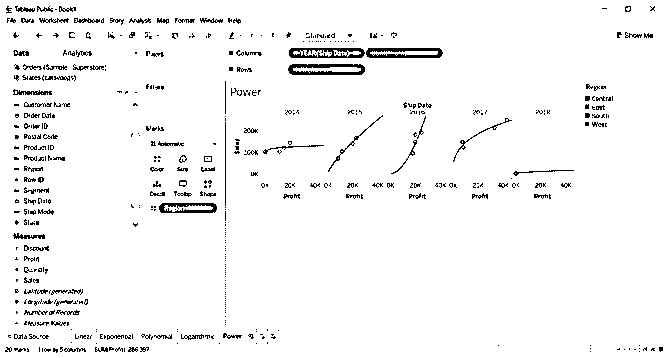

#### 编辑后

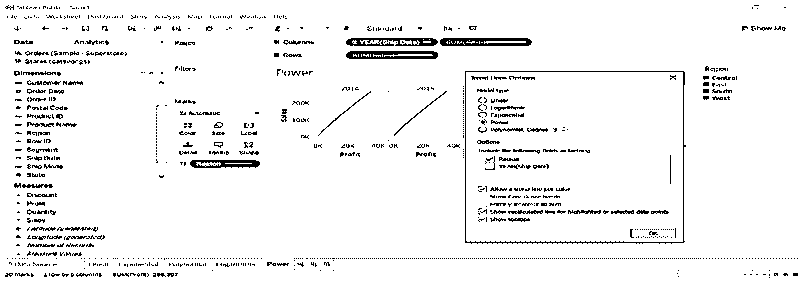

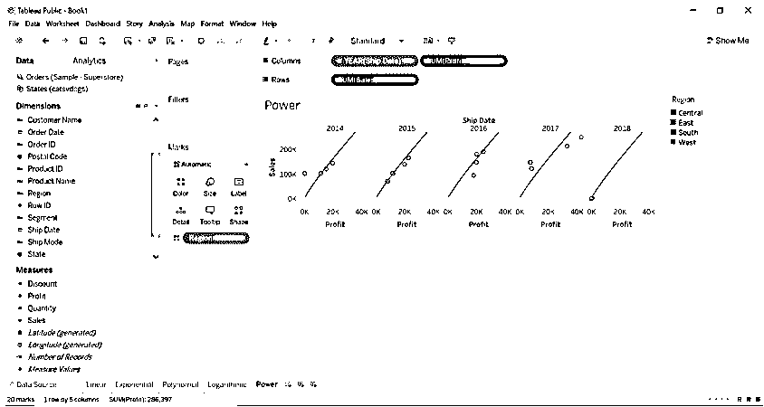

### 仪表盘

我们已经创建了一个包含所有类型线性模型的仪表板。我们已经取消隐藏了一些头文件。将所有工作表拖放到仪表板中，并根据需要进行可视化。

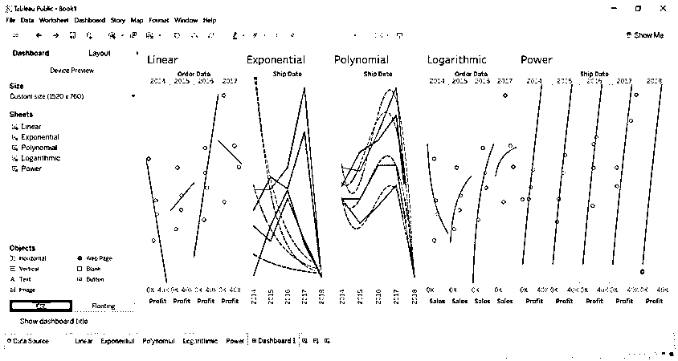

### 描述趋势模型

tableau 的这个特性将向我们展示如何为模型计算公式。

*   点击趋势线。
*   选择描述趋势线。你会看到下图。

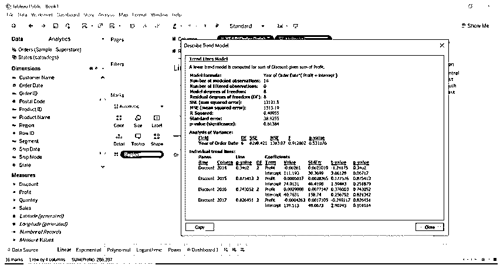

### 结论

我们已经了解了什么是趋势线，如何使用它，以及何时使用哪个趋势线模型。

如果一个人不熟悉数学，即统计学，他不需要担心趋势线是如何计算的，或者公式是如何应用的。我们只需要知道我们想用哪个数据字段进行分析。

### 推荐文章

这是一个 Tableau 趋势线的指南。这里我们讨论在 tableau 中设置趋势线的步骤，以及趋势线编辑在前期和后期是如何工作的。您也可以阅读以下文章，了解更多信息——

1.  [Tableau 仪表板创建](https://www.educba.com/tableau-dashboard-creation/)
2.  [表格中的参数](https://www.educba.com/parameters-in-tableau/)
3.  [表格中的预测](https://www.educba.com/forecast-in-tableau/)
4.  [Tableau 中的枢轴](https://www.educba.com/pivot-in-tableau/)

