# 表格参考线

> 原文：<https://www.educba.com/tableau-reference-lines/>

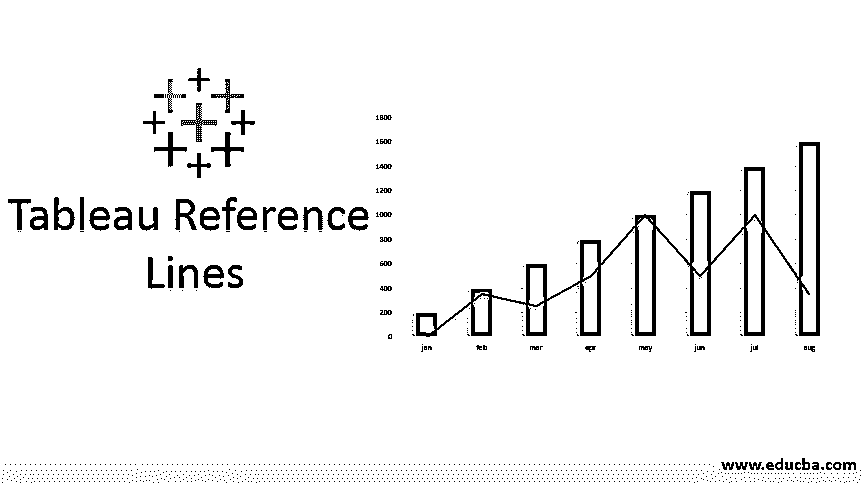

## Tableau 参考线介绍

Tableau 参考线是用于结果比较和分析的标识符。它可以添加到轴上，用于参考常数值或计算值。参考线也可以与 Tableau 中的置信区间相关联。可视化中参考线的一个示例场景是在二维条形聊天表示中跨多个客户群添加平均销售额等于 90000 美元的参考线。Tableau 参考线可以根据业务需求进行定制和应用。参考线支持的一些聚合，如总和、平均值、总和、常数、最大值、最小值和中值。

### 如何使用参考线？

以下是使用 Tableau 参考线的步骤:

<small>Hadoop、数据科学、统计学&其他</small>

**第一步:**登录 Tableau 桌面或公共。

**第二步:**连接数据库。

**第三步:**拖动区域维度到列，利润度量到行。您将看到下图(选择条形图——根据您需要的图表类型)

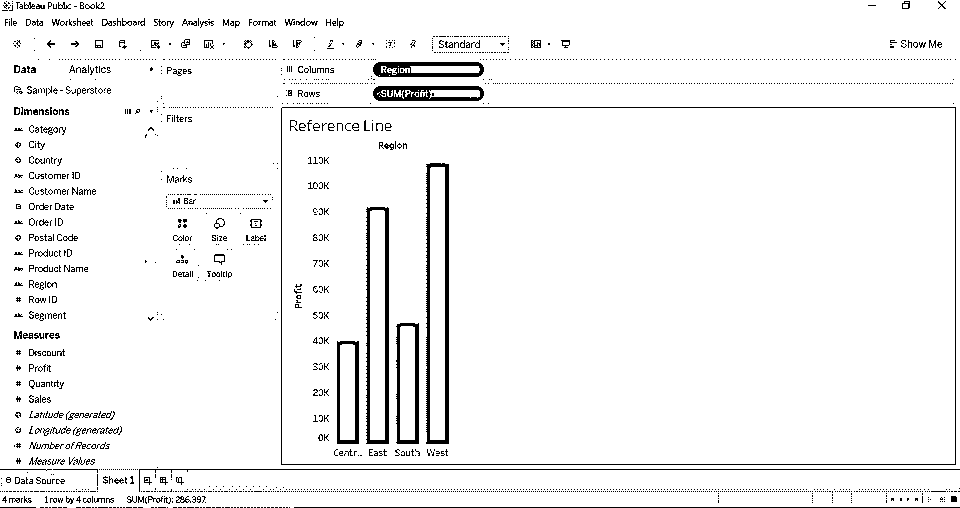

**步骤 4:** 将参考线从分析拖到视图中。

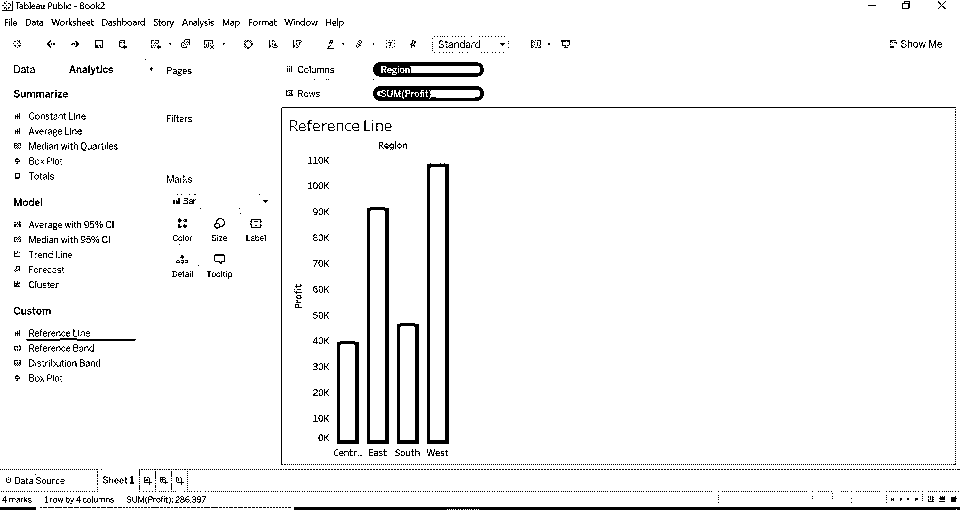

**第 5 步:** Tableau 将显示可能的选择范围，具体取决于项目类型和当前视图。

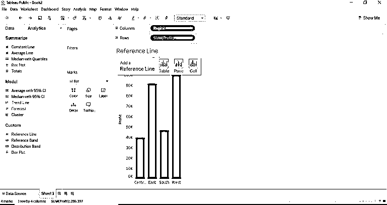

**第 6 步:**该行将显示该项目的三个不同范围。

*   整个表格
*   为了面包
*   每个细胞

**整张表**

*   当我们选择 scope 作为整个表时，Tableau 将对整个表执行聚合。范围作为整个表将向整个表添加一条引用线。
*   看看条形图上的平均值。

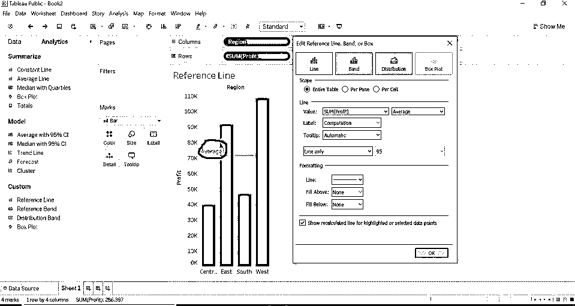

**Per Pane**

*   当我们按窗格选择范围时，Tableau 计算每个窗格的聚合。每个窗格的范围将为每个窗格添加一条参考线。

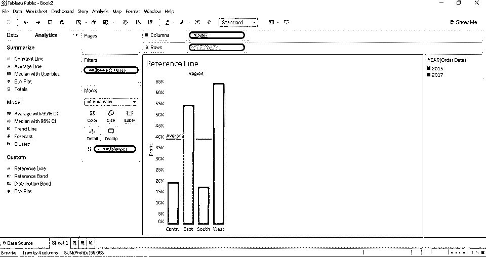

**Per Cell**

*   当我们按单元格选择范围时，Tableau 为所选表的每个单元格计算聚合。每个单元格的范围为每个单元格添加一条参考线。

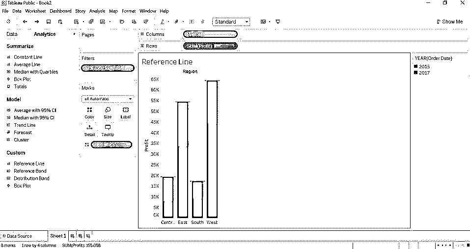

### 参考线存在聚合

下面是下面一行:

*   **Total:** Total 将在特定度量的所有值的聚合中定位行。(利润)
*   **Sum:** Sum 会将线条定位在所选测量的总和上。(利润)
*   **常量:**常量会将线条定位在指定的常量值。
*   **最大值:**最大值将定位线在特定测量的最大值。(利润)
*   **最小值:**最小值将定位线在特定测量的最小值。(利润)
*   **平均:**平均将定位线在特定测量的最小值。(利润)
*   **中间值:**中间值将把线定位在特定测量的中间值。(利润)

当我们根据聚合类型选择一个聚合时，我们希望通过将光标停留在引用行上来查看结果(引用行将显示整个表、每个单元格、每个窗格)。看下面的图片，你会对每个聚合有所了解。

#### 1.总数

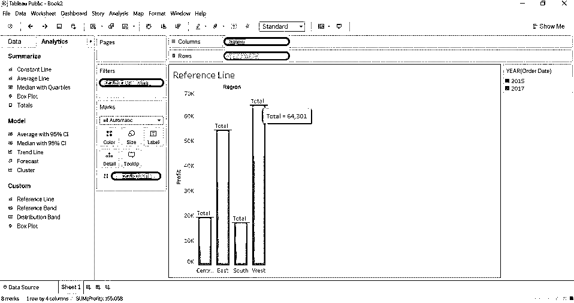

#### 2.总和

#### 3.常数

查看每个条形中出现的数字(该数字是常量值)。

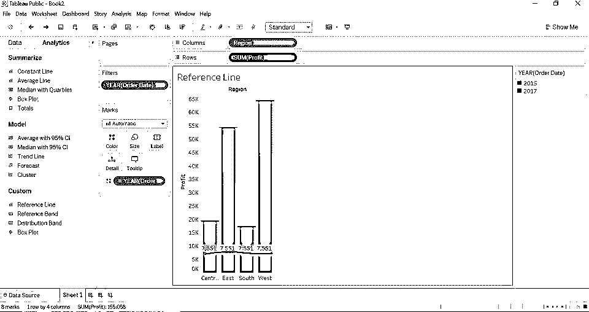

#### 4.最高的

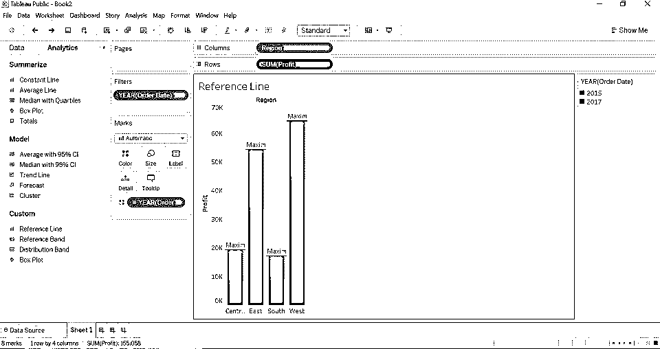

#### 5.中位数

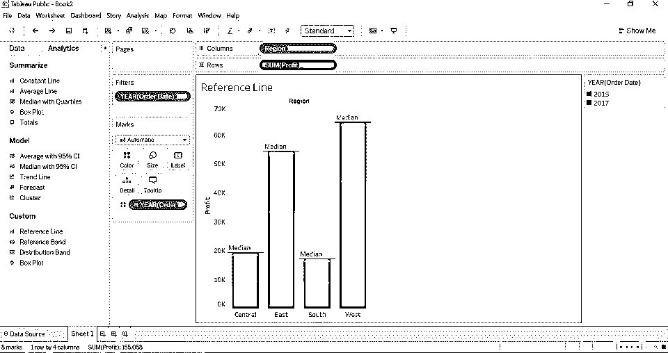

#### 6.最低限度

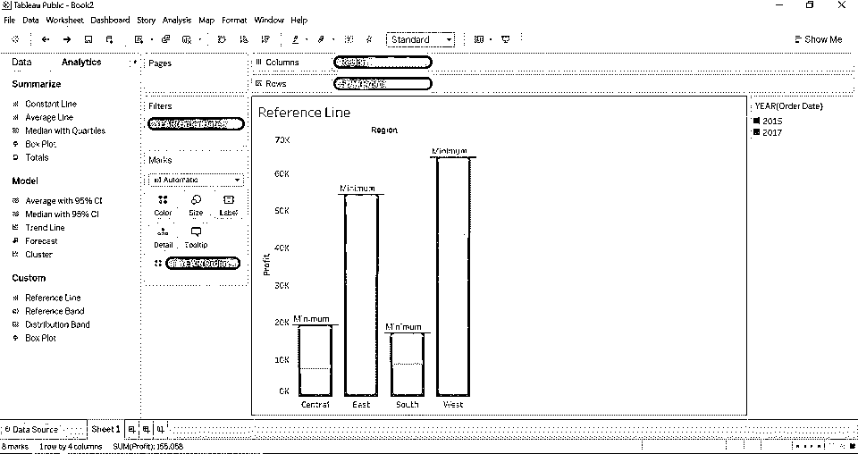

#### 7.标签

此选项允许您配置是否要查看标签。它有不同的领域。

*   **无:**该选项不显示参考线的任何标签。
*   **值:**该选项将显示特定测量值的集合，作为参考线的标签。
*   **计算:**该选项将聚合函数名显示为参考线的标签名。
*   **自定义:**该选项将显示您在文本框中指定的自定义值，作为参考线的标签。

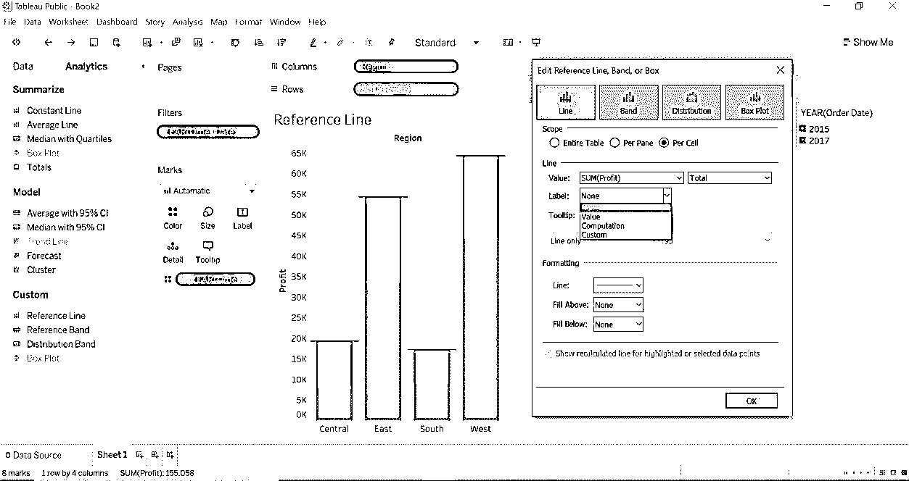

**例如:**我们选择了标签作为值，聚合作为最大值，范围作为整个表。最大值为 64301。

#### 8.格式化

我们可以使用格式化选项来格式化参考线、颜色、宽度和背景色——在区域上方(填充上方)和区域下方(填充下方)。

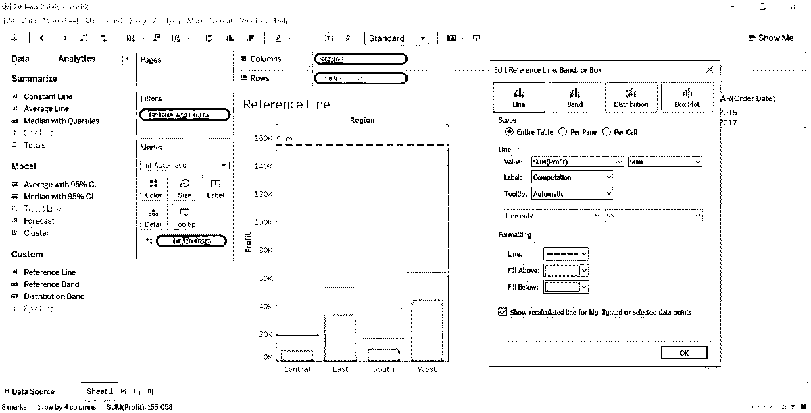

#### 9.移除参考线

右键单击利润轴，将打开菜单并选择删除所有参考行。

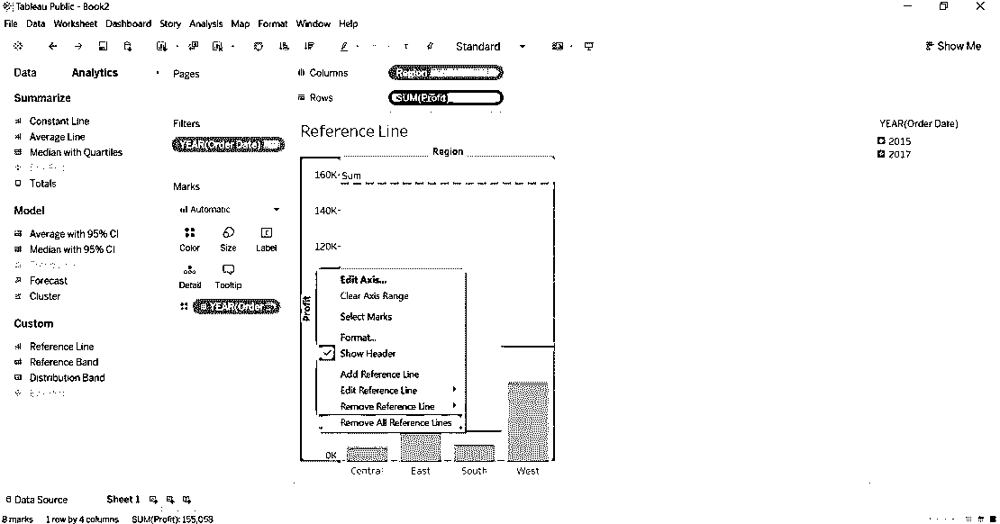

*   如果您的报表只有一条参考线，请选择“删除参考线”选项。
*   如果您的报告有多条参考线，则选择“移除参考线”选项，然后选择您想要的参考线，这将删除选定的参考线。
*   如果您的报表有多条参考线，而您只想一次移除所有参考线，请选择移除所有参考线选项。

### 推荐文章

这是一个 Tableau 参考线指南。这里我们讨论如何一步一步的使用 Tableau 参考线，以及 Tableau 参考线中的聚合。您也可以浏览我们的其他相关文章，了解更多信息-

1.  [表格中的参数](https://www.educba.com/parameters-in-tableau/)
2.  [Tableau 图表](https://www.educba.com/tableau-charts/)
3.  [Tableau 中的树形图](https://www.educba.com/treemap-in-tableau/)
4.  [数据透视表示例](https://www.educba.com/pivot-table-examples/)
5.  [Tableau 中的排名函数](https://www.educba.com/rank-function-in-tableau/)
6.  [Tableau 上下文过滤器](https://www.educba.com/tableau-context-filter/)

