# Tableau 故事情节

> 原文：<https://www.educba.com/tableau-storyline/>

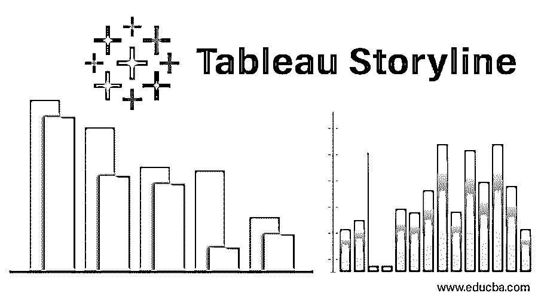

## Tableau 故事情节介绍

故事是商业分析的重要组成部分。它们有助于以有效和高效的方式展示研究结果。使用故事，最终的分析可以以一种与项目或任务相关的每一个利益相关者都可以理解的方式呈现出来。Tableau 附带了一个创建故事的选项。在此选项下，有各种功能可以帮助分析师根据调查结果创建一个美丽而有意义的故事。这些故事是基于表和动态的。此外，根据需求，故事也可以合并到仪表板中。在这篇文章中，我们将详细讨论 Tableau 故事情节。

### 在 Tableau 故事情节中创造故事

为了理解如何在 Tableau 中创建一个故事，我们将使用一个简单的示例，该示例以分布单元体积数据集为特征。它包含产品的分销单位数量数据。重要的维度是发行单位和地区。分配单元是比区域小的业务区域。分布体积是我们在分析中使用的一种度量。

<small>Hadoop、数据科学、统计学&其他</small>

1.将数据源加载到 Tableau。单击“数据”选项卡下的“新数据源”。

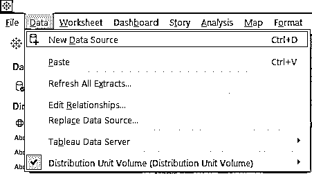

2.点击适当的数据源类型，如下图所示。由于我们的数据源由 Microsoft Excel 文件组成，我们将单击“Microsoft Excel”。

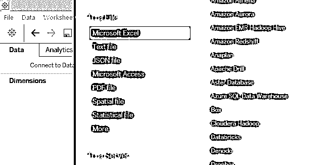

3.数据被加载到 Tableau 中，如下图所示。

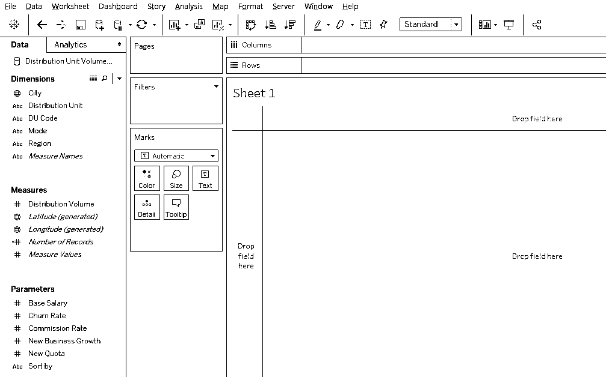

4.首先，让我们进行分析来了解区域销售。将“维”区域和“分配单位”拖到“列”区域，将“分配体积”拖到“行”区域。将尺寸区域拖到标记卡的颜色上。下面我们得到一个垂直条形图。

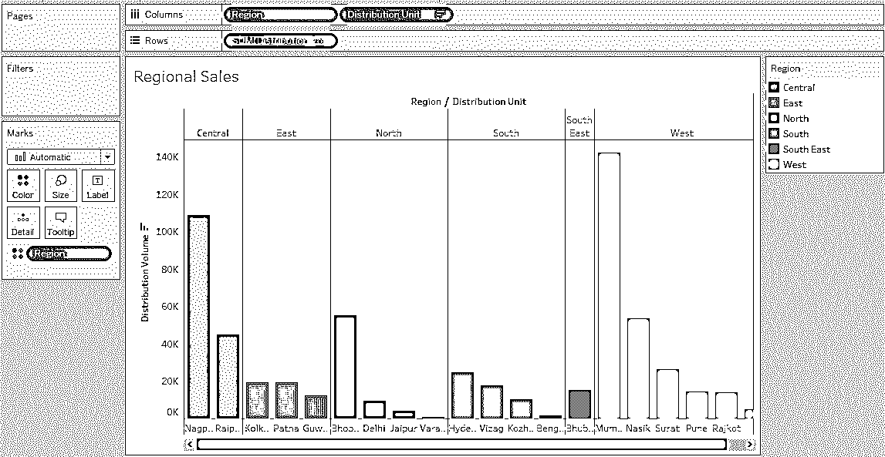

上面的图形分析显示了每个区域的分布单位体积。每个区域都用不同的颜色表示。结果已按容量降序排序，以便快速识别一个区域中容量最大的配电单元。

5.在另一张表中，我们将进行另一项分析，以了解配送单元的模式是否对体积有任何影响。将维模式拖至列区域。拖动尺寸分配单元，分别在标记卡中的标签和尺寸上测量分配体积。如果默认图表类型是条形图，则单击演示中的“打包气泡”,将创建一个气泡图。最后，将尺寸区域拖到标记卡的颜色上。我们得到的视觉效果如下:

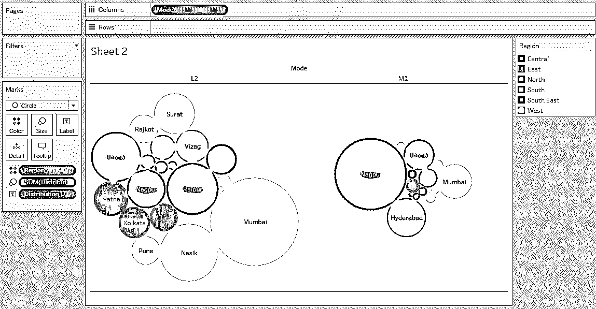

上面的可视化利用了气泡图。气泡图是一个强大的工具，它以大小的形式表现价值。上图有助于我们了解不同分发单元的模式分发量。不同的区域用不同的颜色表示。可以看出，与 M1 模式相比，L2 模式分配给孟买的数量较高，而那格浦尔模式则相反。这有助于我们在网络分析和网络规划中理解该模式的可行性。

6.现在，我们将尝试根据上述发现编写一个故事。要创建一个故事，点击菜单栏中的“故事”选项，然后点击“新故事”，如下所示。

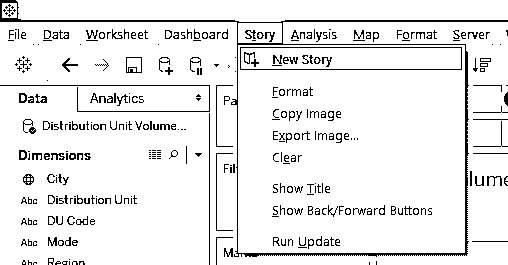

或者，也可以通过单击工作表标签中的图书符号来创建故事，如下图所示。

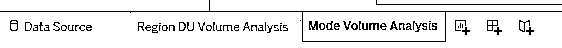

7.创建的空白故事如下所示:

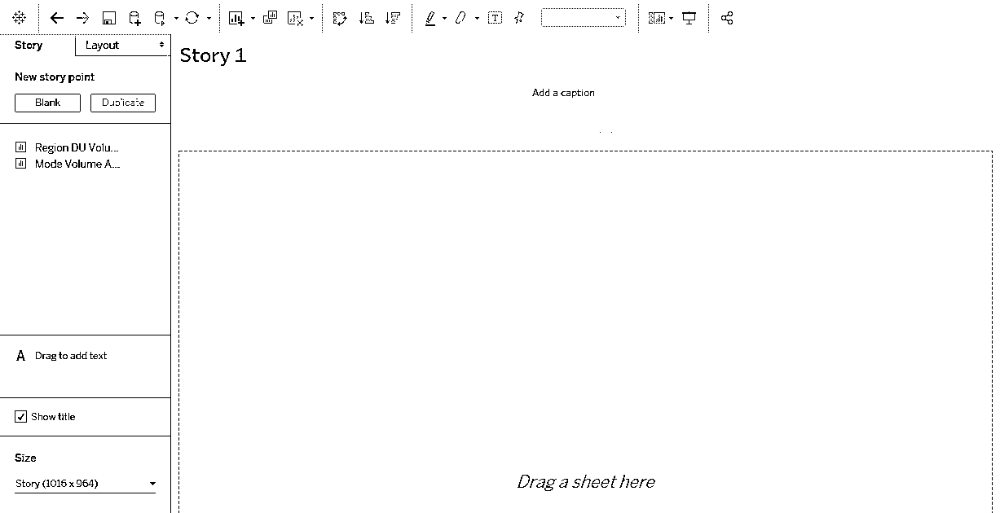

故事是完全空白的，我们创建的工作表出现在屏幕的左侧，如上图所示。我们将继续探索各种选项。

8.将第一张表，即体积分析区域拖动到“在此拖动一张表”窗格。分析按原样导入。

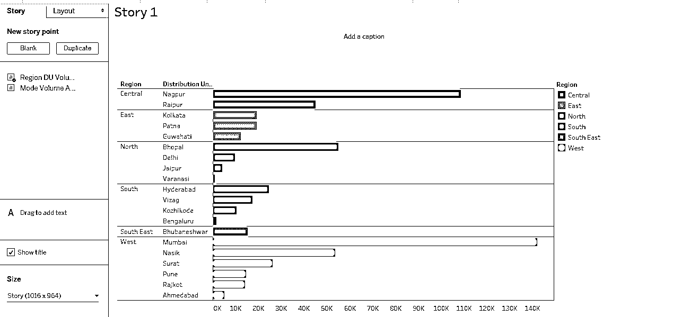

Note, as we changed the chart type to horizontal in the sheet, it got reflected in the story as it is. This is the reason why the stories are sheet-dependent and dynamic.

9.我们可以通过使用位于屏幕左下角的“Size”选项来更改故事中可视化的维度。有各种选项可用于调整大小，包括自定义选项。

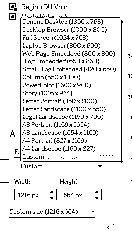

10.右键单击故事选项卡，然后单击重命名。命名为“成交量分析”。成交量分析也如题。如果我们不希望标题出现，只需取消选择“显示标题”，反之亦然。

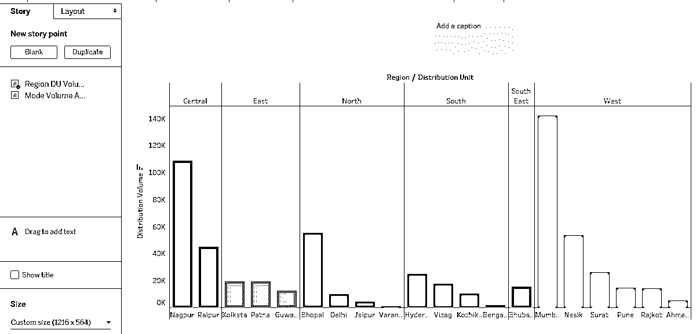

11.默认情况下，“添加标题”框是空白的。应该添加一个有意义和有见地的标题。标题框可以根据需要用鼠标拖动来调整大小。要设置标题框的格式，点击“格式”菜单，然后点击“故事”，如下图所示。

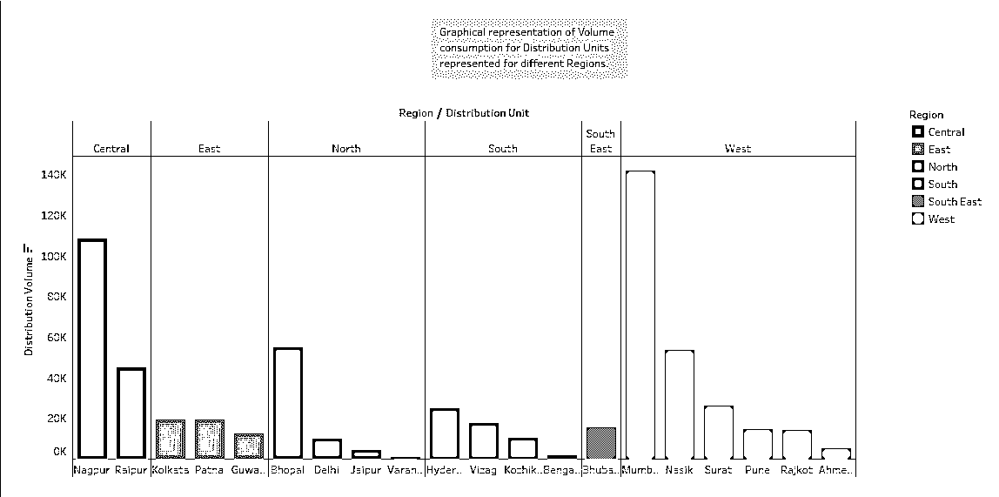

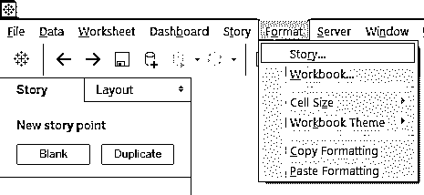

12.点击故事选项，在左侧弹出“格式故事”部分。在阴影、标题、导航器和文本对象部分有各种选项。

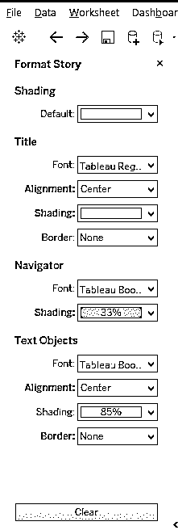

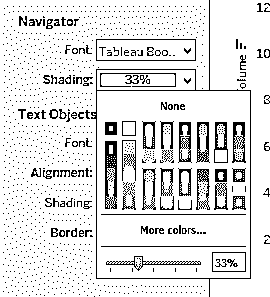

要更改标题框中的背景颜色，在导航部分中，单击阴影，阴影百分比可以使用如上所示的滑块进行更改。标题框现在如下所示:

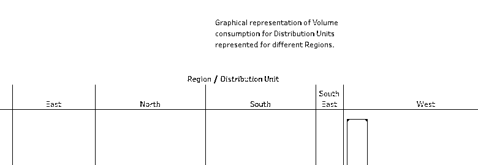

要删除上述格式，只需点击清除按钮，默认设置得到恢复，如下截图所示。

13.要添加新的故事点，请点击“新故事点”下的空白处。如果需要故事的副本，请点击“复制”。下面的截图显示了这一点。

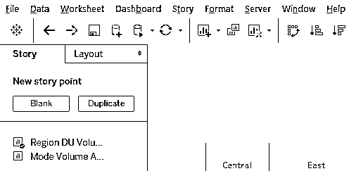

在分析序列中，接下来创建的空白故事点如下。

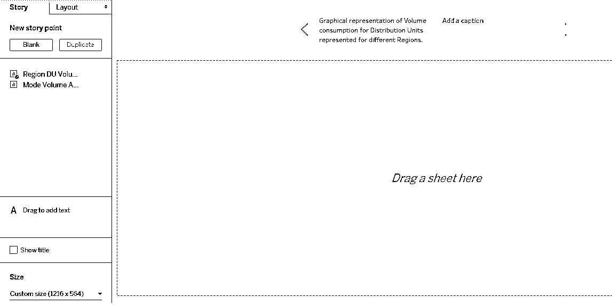

14.现在，拖动表模式体积分析到“拖动一张表在这里”窗格。我们还将添加一个适合分析的相关标题。分析如下图所示。

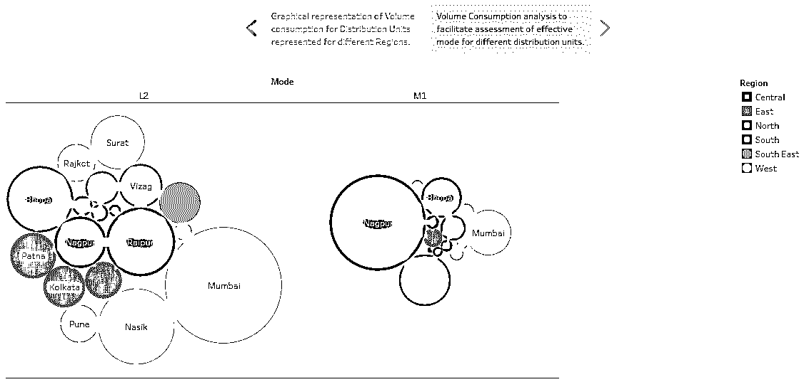

我们可以通过点击标题框在故事点之间导航。标题框有助于导航，它可以用多种方式表示，单击“布局”部分可以探索各种表示选项。

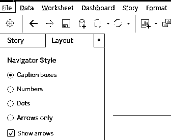

当选择“数字”选项时，观察到导航从标题框变成了数字按钮。

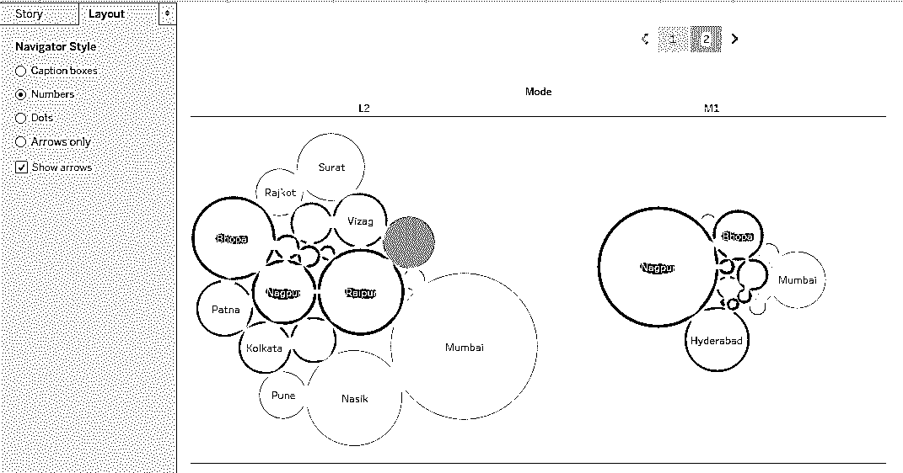

15.Tableau 允许我们分别分析和处理故事中的每个对象。只要点击那个对象。就像下面的截图，我们点击了 M1 模式。

### 结论

如果图形可视化被表示为有意义的结果，它们可以被转化为洞察力。只有这样，分析才有用。这是通过故事创作实现的。Tableau 提供了一个强大的功能来创建可视化的故事，有助于从数据中理解模式和趋势，从而促进 360 度分析。

### 推荐文章

这是一个 Tableau 故事情节指南。在这里，我们讨论基本概念以及如何用 Tableau storyline 创建仪表板故事，并举例说明。您还可以浏览我们推荐的其他文章——

1.  [如何使用 Tableau？](https://www.educba.com/how-to-use-tableau/)
2.  [Tableau 替代方案](https://www.educba.com/tableau-alternatives/)
3.  [Tableau 竞争者](https://www.educba.com/tableau-competitors/)
4.  [表格中的过滤器](https://www.educba.com/filters-in-tableau/)

