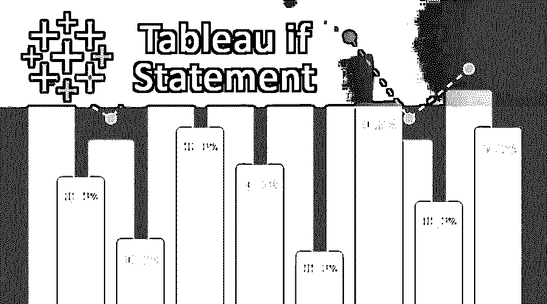

# Tableau IF 语句

> 原文：<https://www.educba.com/tableau-if-statement/>

## Tableau IF 语句简介

为了测试条件以根据条件测试后返回的值完成任务。Tableau 提供了一个逻辑语句，用于对照某个值或假设来检查由表达式表示的特定条件，以确定给定的条件是真还是假，如果条件得到满足，则根据该条件执行某些任务，以便于做出正确和有效的决策，该语句称为 Tableau IF 语句。

### Tableau IF 语句

逻辑计算有助于确定特定条件是真还是假。为了做这个决定，有一个功能是很重要的。Tableau 提供了不同的功能。IF 函数帮助确定一系列表达式是否为真，然后将返回第一个表达式的值。在 Tableau 中，IF 函数有三种变体。它有 IF，IF-ELSE，ELSE IF。

<small>Hadoop、数据科学、统计学&其他</small>

#### 1.如果条件

仅当给定条件为真时，IF 条件才返回结果。如果这个条件不成立，那么它不返回任何值。

示例:如果[分数] > 35，则“通过”

#### 2.IF-ELSE 函数

该条件也测试特定条件。如果 If 中的测试条件为 true，那么将返回 then 关键字之后的语句。如果为 False，则返回 Else 关键字后的语句。Tableau 中 If Else 的语法如下:

`IF <Expression> THEN <True Statement>
ELSE <False Statement>
END`

#### 3.ELSE IF 函数

每当需要检查多个条件时，如果条件非常有用，就检查 Else。只有当是失败的前一个 If 或 Else if 语句时，才能使用 Else If 条件。该功能按顺序执行。它从第一个条件开始检查。如果第一个条件为真，那么它将执行出现在 then 关键字之后的语句。如果这个条件为假，那么它将检查下一个 Else if 条件。它将继续执行 else if 语句，直到满足条件。

**语法-**

`IF <Expression1> THEN <True_statement1>
ELSEIF <Expression2> THEN <True_statement2>
ESEIF <Expression3> THEN <True_statement3>
.....
ELSE <False_statement>
END`

### IIF 函数

*   IIF 是一个有用的函数，它有助于完成逻辑功能。使用此函数时，需要传递一些参数，参数应该是布尔值。如果它不是布尔型的，那么它可能是逻辑表达式的结果。这些结果可以进一步用于提供布尔结果。如果这个逻辑表达式的结果为真，那么 IIF 将返回随后的值。
*   如果这些逻辑表达式的结果为假，那么 IIF 将返回 Else 值。由于返回的值是布尔值，所以可能会出现结果未知的情况，这意味着它们既不为真也不为假。当数据中存在空值时，通常会出现这种情况。当这种情况发生时，传递给 IIF 的最后一个参数将作为未知结果返回。如果不考虑这一点，则返回空值。

**语法-**

`IIF(test, then, else [unknown])`

现在让我们看几个例子，以便正确理解这些功能。

*   考虑到已经获得了一个等级，需要颁发一个证书。应该有一个字段来计算和标识这些实例。这可以通过使用 If Else 语句或 IIF 语句轻松完成。

`IF (Letter Grade (Nulls))= ‘A’ then ‘Create Certificate’
Else ‘Do Nothing’
End
IIF(Letter Grade (Nulls))= ‘A’, ‘Create Certificate’, ‘Do Nothing’)`

这些语句之间的唯一区别是语法。IIF 语句不太容易出错，但可读性不强，也不太熟悉。这两者的基本区别在于，数据包含通过布尔比较产生未知结果的值。当数据中有空值时，可能会发生这种情况。当 If Else 语句中出现这种情况时，未知结果将被视为假结果。但是，当使用 IIF 语句时，它会为具有未知值的结果返回“Null”值。

*   如果测试则取值结束/如果测试则取值否则结束

上述函数类似于 IIF 函数。它区分真值、假值和未知值。另一方面，IF 语句只关心真值和非真值。为了获得相应的值，必须使用 IF THEN ELSE 语句执行所有逻辑测试。

`IF(SUM([Profit]) > 0) THEN 'Performing Good'
ELSE 'Bad Performance'
END`

这句话清楚地定义了企业什么时候表现好，什么时候表现差。在这个场景中不存在任何模糊性。

*   为了检查多个条件，可以使用 If THEN ELSE IF。

`IF (Letter Grade (Nulls))= ‘A’ then 4
ElseIF (Letter Grade (Nulls))= ‘B’ then 3
ElseIF (Letter Grade (Nulls))= ‘C’ then 2
ElseIF (Letter Grade (Nulls))= ‘D’ then 1
Else 0
End`

当谈到 IIF 声明时，这些声明更容易理解，也更明确。它们定义了各自的条件。写起来容易理解多了。当涉及 Tableau 中的 If 语句时，如果计算简单，或者您不确定所讨论字段的数据质量，则应使用 IIF。

### 结论

*   与其他工具不同，Tableau 确实提供了逻辑函数。这些功能可以很容易地用作需求。If 条件及其变体可以很容易地在 Tableau 中实现。它也有 IIF 和埃尔塞夫，提供了一种机制，未知值被替换为空。它还提供正常的条件检查。
*   其他逻辑函数也很有用，因此 Tableau 在市场上使用时也具备这些特性。它还具有创建逻辑计算的功能，其中可以使用所有这些逻辑函数，并且报告可以向用户提供更准确的数据和给出准确的分析。

### 推荐文章

这是 Tableau IF 语句的指南。在这里，我们讨论介绍，IF 函数的三种不同的变体及其各自的语法和解释。您也可以浏览我们推荐的其他文章，了解更多信息——

1.  [什么是 Tableau？](https://www.educba.com/what-is-tableau/)
2.  [旁观者 vs 画面](https://www.educba.com/looker-vs-tableau/)
3.  [如何在 Tableau 中创建布景？](https://www.educba.com/create-set-in-tableau/)
4.  [如何安装 Tableau](https://www.educba.com/install-tableau/)
5.  [Python 中的 If Else 语句|示例](https://www.educba.com/if-else-statement-in-python/)
6.  [R 中 If Else 语句介绍](https://www.educba.com/if-else-statement-in-r/)
7.  [Python 中的 If 语句](https://www.educba.com/if-statement-in-python/)
8.  [Shell 脚本中 If 语句指南](https://www.educba.com/if-statement-in-shell-scripting/)

