# Tableau 中的案例陈述

> 原文：<https://www.educba.com/case-statement-in-tableau/>

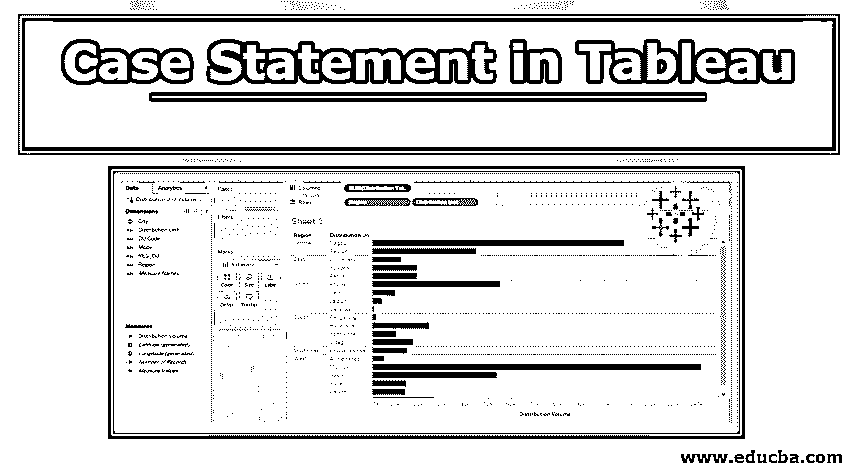

## Tableau 中的 Case 语句介绍

Tableau 中的 CASE 语句或 CASE 函数是逻辑函数的一部分。它类似于 IF 语句，继续逐个检查条件。但是，两者的区别在于，CASE 语句将条件视为案例，因此得名。CASE 函数的中心元素是函数需要计算的表达式。此外，该函数将表达式与一系列值逐一进行比较。当表达式匹配任何值时，相应的值作为结果返回。

### 使用案例陈述-循序渐进的方法

Tableau 中 CASE 语句的语法如下所示。

<small>Hadoop、数据科学、统计学&其他</small>

`CASE
<expression>
WHEN <value 1> THEN <return result 1>
WHEN <value 2> THEN <return result 2>
WHEN <value 3> THEN <return result 3>
ELSE <default return>
END`

上面的语法是标准语法，这里的默认返回是指如果没有找到匹配的话应该返回的值。记住，在不匹配的情况下，应该根据上下文返回合适的值。

### 说明

我们现在将通过一个例子来演示 CASE 函数的用法。数据集包含按分配单元划分的分配量。这里，重要的维度是区域和分配单元，而分配量是一种度量。我们的目标是根据分销量对分销单位进行分类。为了便于我们的分析，我们将创建一个包含地区和分销单位名称的字段。让我们继续这些步骤。

1.将数据加载到 Tableau。为此，请单击“数据”菜单中的“新数据源”，或者单击“连接到数据”。

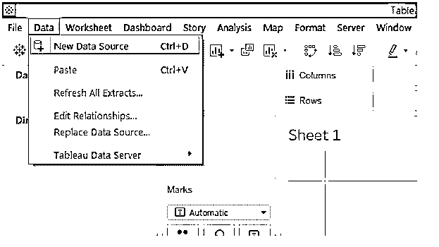

2.在“连接”中，选择必需的数据源类型。在这种情况下，数据源类型是 Microsoft Excel。

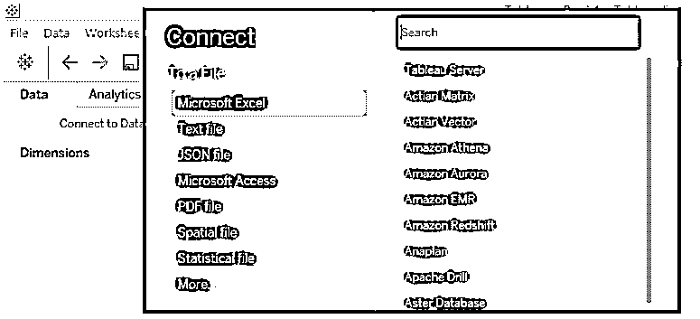

3.数据被加载，可以在“数据源”选项卡中查看，如下所示。

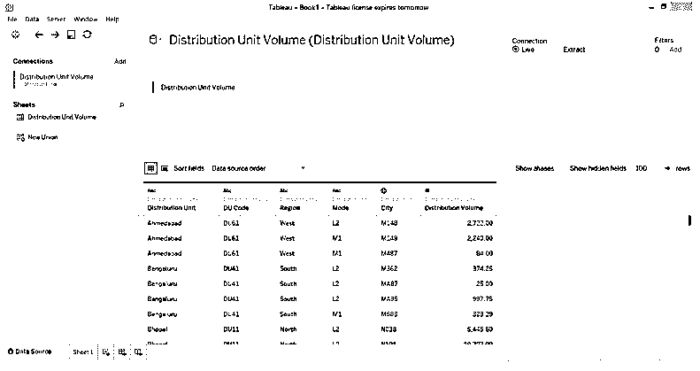

4.转到 sheet 选项卡，我们可以在相应的部分中找到数据集中的维度和度量。

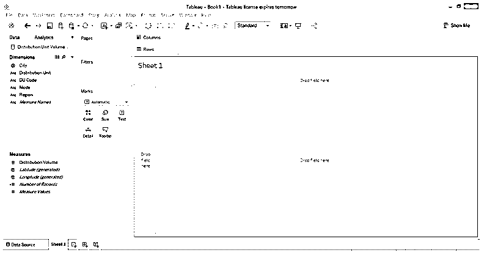

5.首先，只需将“维”区域和“分配单位”拖到“行”区域，并将“测量分配量”拖到“列”区域。我们得到一个水平条形图，如下图所示。如果默认图表类型不是条形图，则从演示中选择它。接下来的步骤将使用 CASE 语句创建一个组合字段，该字段将区域和分发单元名称组合在一起。

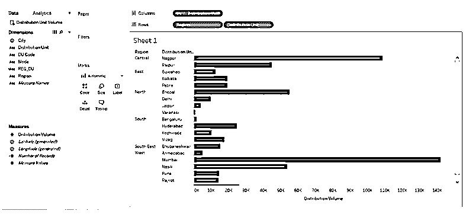

6.要创建组合字段，请右键单击数据部分的空白区域，然后单击选项“创建计算字段…”如下所示。

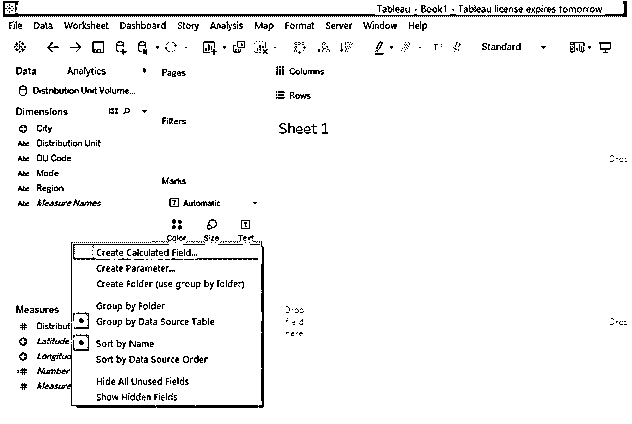

7.我们创建的计算字段如下图所示。可以看出，组合字段是使用 CASE 函数创建的。这里，使用的表达式是尺寸区域。根据地区名称，将通过将地区名称的前三个字母与分发单元名称的前三个字母组合起来创建组合字段。为了从分配单元中提取前三个字母，我们使用了 LEFT 函数。并非所有分布单元的字母都是大写的，所以为了将它们转换成大写，我们将结果传递给了 upper 函数。因此，CASE 函数为我们提供了一种创建组合场的系统方法。

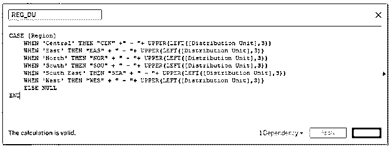

8.新创建的字段 REG _ 杜灿可以在下面的 Dimensions 部分看到。

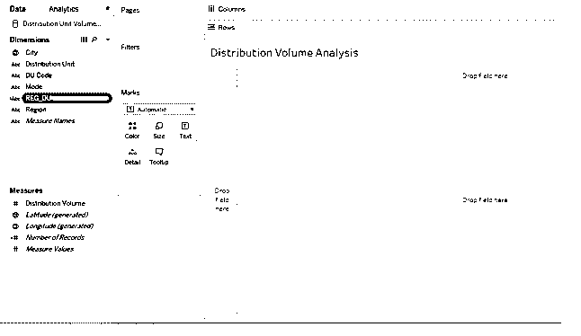

9.现在，只需将新创建的字段 REG_DU 拖动到 rows 区域，distribution volume 拖动到 columns 区域，如下所示。

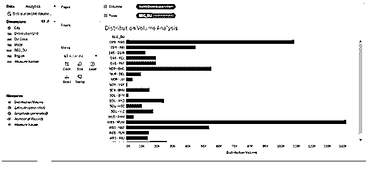

10.让我们仔细看看可视化。我们可以看到地区和分销单位的名称。这将有助于快速分析和轻松捕捉洞察力。但是，在我们根据配送量对配送单元进行分类之前，分析是不完整的。为了实现这个目标，我们将按照下面的截图所示的步骤进行操作。

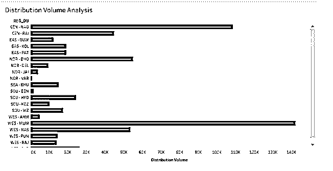

11.  我们将创建两个代表平均音量和高音量的参数。所有分销单位的平均销量为 30000，我们正在考虑 90000 的高销量。要创建参数，右键单击数据部分的空白处，然后单击“创建参数…”。

12.用适当的名称和提到的值创建参数，如下面两个屏幕截图所示。

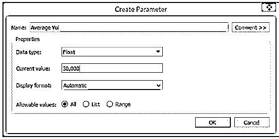

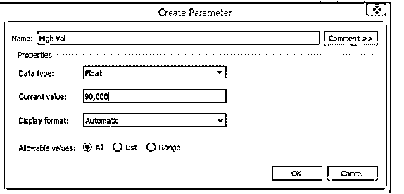

13.这两个参数可以在下面的“参数”部分看到。

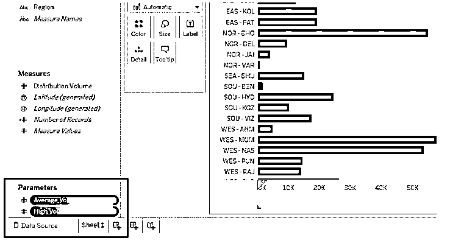

14.接下来，创建用于分类的计算字段。我们把它命名为 VOL_CLASS。查阅外地的编码可以看出，数量超过或等于 90000 的分发单位被归类为"数量很大的分发单位"，数量在 30000 至 90000 之间的分发单位被归类为"数量一般的分发单位"，其余的被归类为"数量低于一般的分发单位"。

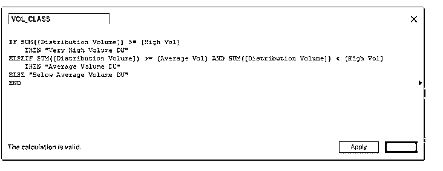

15.新创建的字段可以在 measures 部分看到，如下面的屏幕截图所示。请记住，该字段使用“测量分布体积”,因此会自动归类为“测量”。

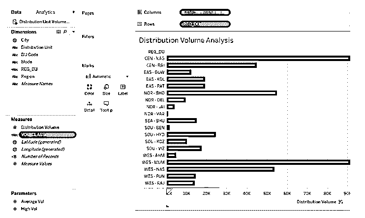

16.现在，拖动行区域中的 REG_DU 字段，并测量列区域中的分布体积。进一步将字段 VOL_CLASS 拖到标记卡中的颜色上。我们得到了下面的可视化结果，其中我们可以看到按不同卷类别分类的分布单元。

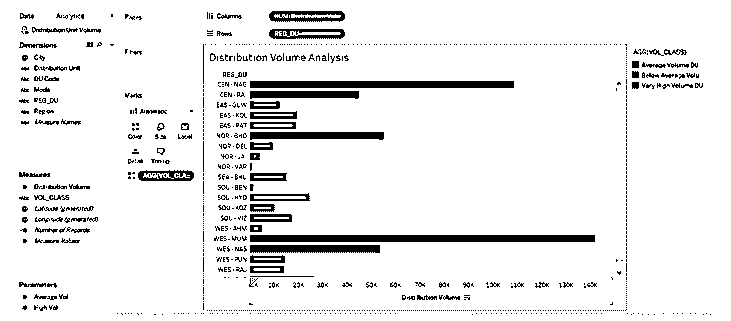

17.下面的屏幕截图提供了对分析的进一步观察。这里我们按照正确的顺序排列了图例，而不是之前截图中的顺序。此外，还为类别分配了适当的颜色，结果按降序排列。

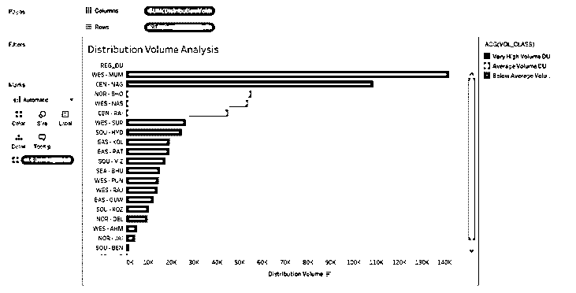

18.在分析分销单位的销量贡献时，上图给出了很好的见解。然而，在这样的分析中，气泡图更有洞察力。因此，接下来，按照 REG_DU 名称的字母顺序对结果进行排序，并单击“展示”中的“打包气泡”,如下所示。

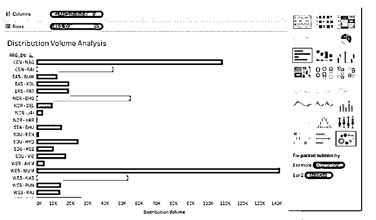

19.如下图所示，我们得到了一个气泡图，它通过颜色和大小的组合来表示类别，证明是我们任务的正确工具。

### 结论

Tableau 是一个典型的可视化分析工具，它利用每一个功能，通过可视化来进行交互式和有见地的分析。Tableau 中的 CASE 函数用于处理条件情况，从条件情况获得的结果基于上下文使用，并影响视觉输出。

### 推荐文章

这是 Tableau 中 Case 语句的指南。在这里，我们讨论了使用 Tableau 中的 Case 语句以及插图的介绍和逐步方法。您也可以浏览我们推荐的其他文章，了解更多信息——

1.  [画面可视化](https://www.educba.com/tableau-visualization/)
2.  [Tableau 中的排名函数](https://www.educba.com/rank-function-in-tableau/)
3.  [什么是 Tableau？](https://www.educba.com/what-is-tableau/)
4.  [Tableau 中的枢轴](https://www.educba.com/pivot-in-tableau/)
5.  [Tableau 上下文过滤器](https://www.educba.com/tableau-context-filter/)
6.  [Tableau 项目符号图](https://www.educba.com/tableau-bullet-chart/)

