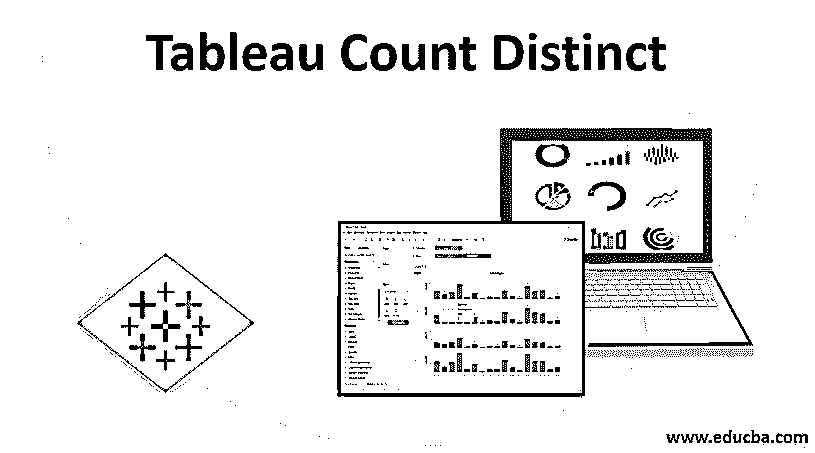
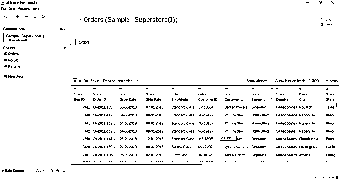
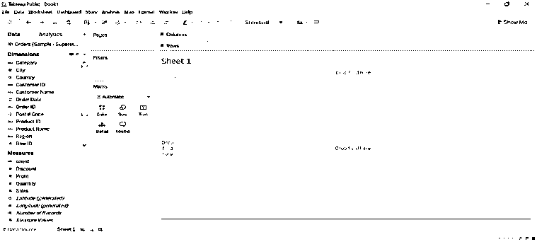
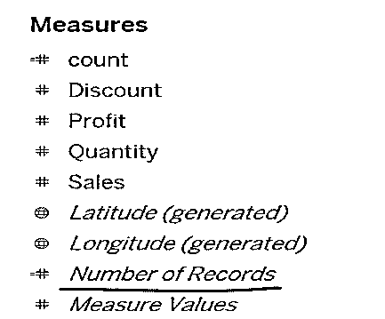
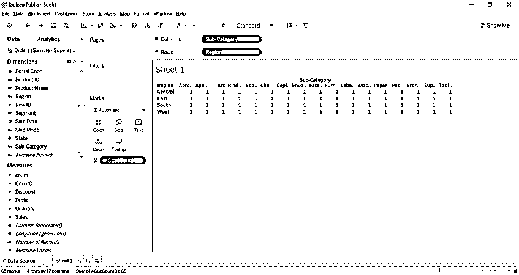
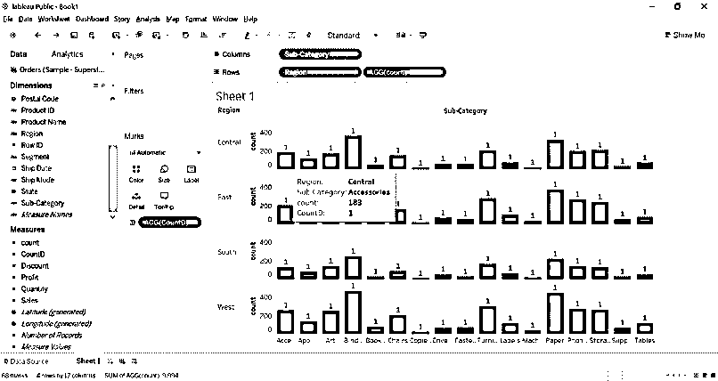
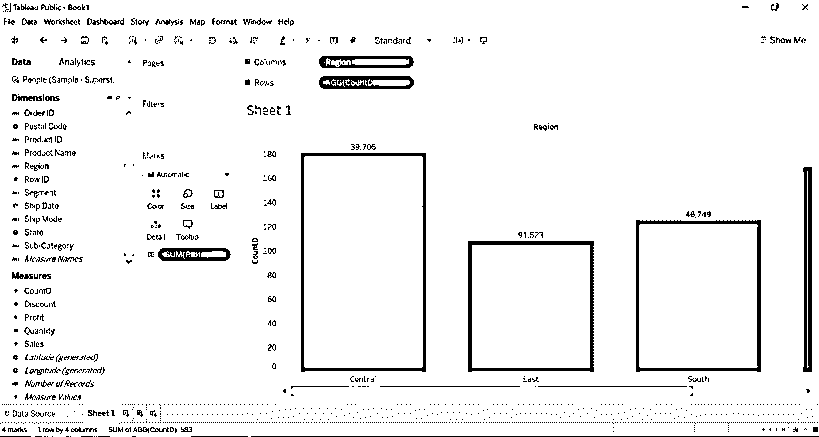
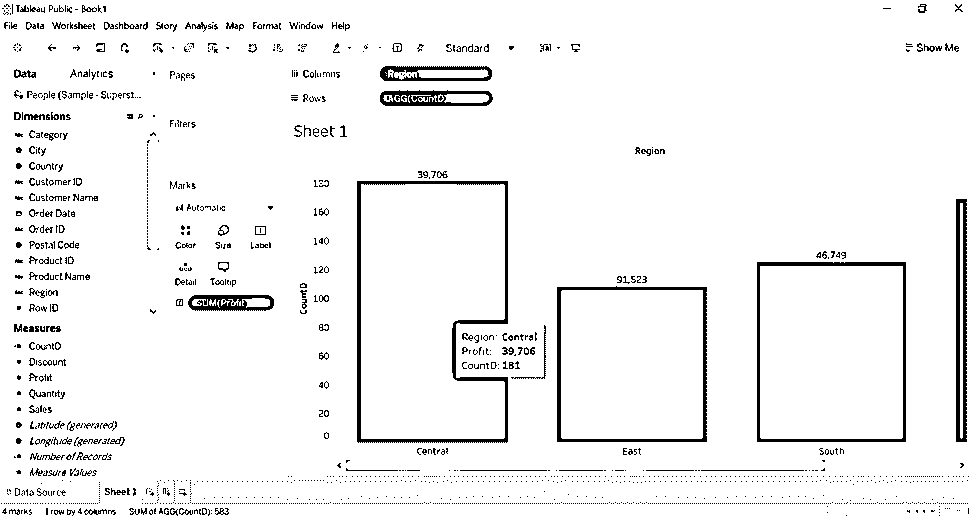
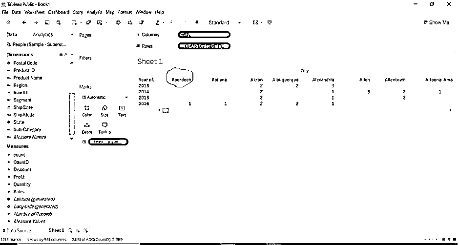
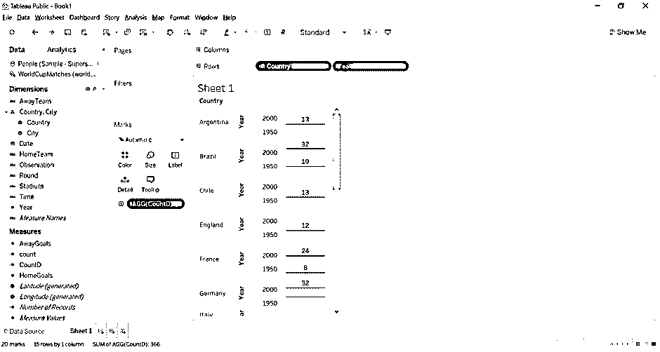

# 不同的 Tableau 计数

> 原文：<https://www.educba.com/tableau-count-distinct/>

## Tableau Count Distinct 简介

Count Distinct 是 tableau 中的聚合函数。Distinct 代表维度或度量的唯一值。当我们为聚合创建维度值时，非重复计数的结果将被创建到数据集的度量中。需要为 Count Distinct 函数创建计算字段。我们通过单击维度值集附近的底部行创建了一个计算字段。所有的聚合函数都可以通过表中的公式获得。我们只需要根据我们的选择来选择维度。我们也可以计算布尔值、字符串和数字。Count (Distinct)返回字段中的唯一值。

**CounD(表达式)的语法**

<small>Hadoop、数据科学、统计学&其他</small>

`CountD([region])`

### 如何在画面中计数不同的作品？

CountD 函数用于显示维度的独特或唯一值。它将计算一个组中项目数量的不同值，并显示出来。它将忽略空值。Tableau 在 measure 部分创建一个临时的新列作为维度的结果，因为 count 的结果是 number，而 measure 包含数据的数量。它将计算该字段的唯一实例。假设我们有 10 个不同国家的 20，000 条记录，那么该国家的独特值将是 10 或 5。即使存在大量数据集，它也会为记录聚合不同的值。

### Tableau Count Distinct 示例

tableau count distinct 的示例如下:

#### 示例#1

1.我们已经连接到 tableau 中的示例超市数据库，并获取了订单表。

2.转到 sheet1，在这里我们将看到分为度量和维度的数据。量纲是定性数据，量纲是数量数据。

3.表中可用的记录数选项，它不包括数据源可用的全部数据。

4.创建计算字段名称 CountD，并输入公式 CountD([子类别])。

5.我们可以选择任意维数。

6.将子类别拖至列，将区域拖至行。

7.将 COUNTD 计算字段拖至文本格式选项。

8.我们将得到下面的图像。

9.我们可以在下图中看到，每个地区的每个子类别的不同计数都是一。

1.我们可以向您展示 COUNT 和 COUNTD 之间的区别。

2.我们已经创建了 COUNT([子类别])计算字段，并将其添加到行中。

3.我们可以在下图中看到，中心区域的配件平均数量为 183，而不同的数量为 1，因为中心区域有多个配件(项目),所以计数为 1。

#### 实施例 2

1.将订单表拖到 tableau 表中。

2.创建计算字段 CountD(维度)。

3.将区域维度拖至列，将创建的计数度量拖至行，将利润度量拖至文本筛选选项。

4.根据我们为城市创建的计算字段，我们可以看到中心地区 CountD 的结果是 181，但实际计数是 2323，利润是 39，706。

5.我们可以看到东部地区的结果是，一个明确的计数是 108 和利润是 91，523。

6.我们可以将每个区域的不同计数视为这些区域的唯一计数。我们以字符串的形式对城市进行了明确的计数。

#### 实施例 3

我们将为每个城市的订单日期计算类别维度。

1.  创建计算字段 CountD(类别)。
2.  拖动到列，将日期排序到行。
3.  将 CountD 拖至文本格式选项。

我们可以观察到，对于 2016 年的阿伯丁市，我们的计数明显为 1。我们已经计算了类别维度的非重复计数(类别是字符串值)。

#### 实施例 4

我们将计算不同的价值，为世界杯比赛获胜的球队，为每个国家与年数据库。

1.  我们已经从 Tableau resources 网站下载了世界杯比赛数据库文件。
2.  我们为 HomeTeam(获胜的团队)创建了 CountD，因为我们希望为获胜的团队计算独特的价值。
3.  将国家和年份维度拖到行中，并将计数拖到文本格式选项中。
4.  我们得到了这个国家一年的国内统计数据。
5.  我们得到了阿根廷 1950 年和 2000 年的成绩，因为 13 和 13 是这两年的不同数字，而实际数字是 38。对于英国的国家来说，2000 年和 1950 年的确切数字是 12。

### 结论

我们已经了解了如何计算字段或维度的 distinct 或 unique。需要记住的要点是，首先需要为 CountD 聚合函数创建计算字段。因为结果是一个数字，所以它总是以度量的形式出现。当用户想要找到大型数据集的独特值时，它总是很有帮助。

### 推荐文章

这是一个不同的 Tableau 计数指南。在这里，我们讨论如何计算 Tableau 中不同的作品，以及不同的例子。您也可以阅读以下文章，了解更多信息——

1.  [Tableau 中的聚合函数是如何工作的？](https://www.educba.com/tableau-aggregate-functions/)
2.  [在 Tableau 中创建圆环图](https://www.educba.com/donut-chart-in-tableau/)
3.  [在带插图的表格中详细排序](https://www.educba.com/sorting-in-tableau/)
4.  [窗口和表指南](https://www.educba.com/window-sum-tableau/)
5.  [操作顺序表|示例](https://www.educba.com/tableau-order-of-operations/)

