# Tableau 参数过滤器

> 原文：<https://www.educba.com/tableau-parameter-filter/>

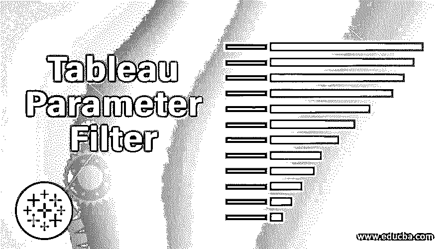

## Tableau 参数过滤器简介

参数是我们可以在图表或条形图中更改的动态值。参数可以是任何东西，比如文本、值的范围。一些可视化选项在数据的可视化中不可用，在参数过滤器的帮助下，我们可以为更好的可视化创建值。我们可以用基于字段的值来创建参数，但是如果字段改变，那么参数值不会改变。参数只保留旧值。我们可以在过滤器或集合中使用参数。由于参数是一个动态值，它会改变计算或参考线中的常数值。我们可以通过参数动作使参数更加动态。在本主题中，我们将学习 Tableau 参数过滤器。

**语法**

<small>Hadoop、数据科学、统计学&其他</small>

过滤->顶部->按字段->选择默认值或创建新参数。

### Tableau 中的参数过滤是怎么做的？

无论我们在参数中选择或添加什么参数值，结果都会显示给用户。我们必须选择一个数值范围，比如 10、20 或任何数字，直到我们想要获取结果。

结果会因参数而动态改变。

### Tableau 参数过滤器示例

我们将根据产品名称的前 20 名销售额创建一个图表。

1.  打开 Tableau 公共版或桌面版。
2.  连接到示例超市数据库，并将订单表拖到数据源表中。
3.  将 sales (measure)拖到列中，将 Product Name (dimension)拖到行中。
4.  将产品名称拖至过滤器编辑选项。

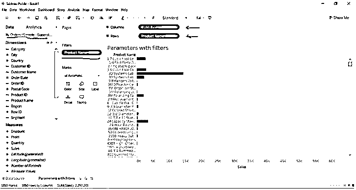

在使用过滤器应用参数之前

5.  转到产品名称过滤器->选择顶部->选择->按字段->输入顶部值为 20。
6.  默认的上限值是 10，我们可以更改值，这就是它被称为动态参数的原因。

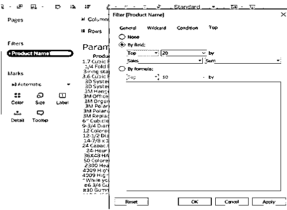

7.  将显示按产品名称排列的前 20 名销售额，而不是全部数据。我们可以在之前的图像中观察到一长串可用的数据，现在它被改变了。

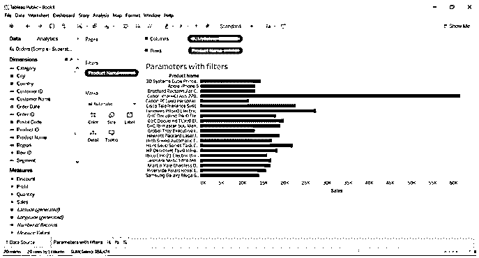

使用过滤器应用参数后(该参数被选为产品名称的前 20 名销售额)

我们将根据各州前 10 名的销售额创建一个图表。

8.  我们已经将状态维度拖到了行和过滤格式选项中。
9.  转到状态->单击->选择编辑过滤器->选择顶部->选择->按字段->输入顶部值为 10。
10.  平均值的选择和。我们可以从参数的下拉菜单中选择我们想要的任何计算值，并获得请求的数据。

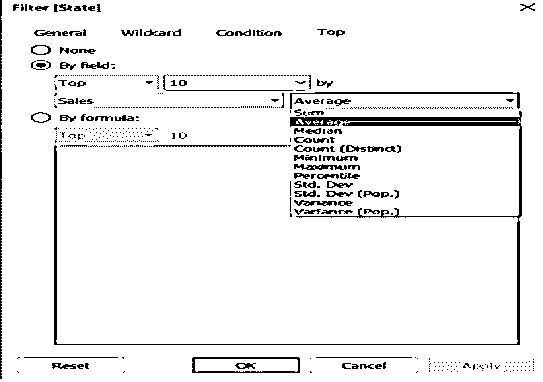

11.  我们将获得前 10 个州的平均销售额。

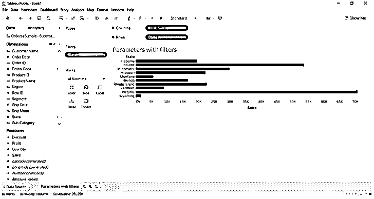

*   **我们已经将最高值作为一个参数。我们将使用参数的底值。我们可以通过选择底部值(降序)来检索结果。**

12.  转到顶部过滤器并选择字段作为底部
13.  将该值更改为 20。

我们将检索倒数 20 个州的平均销售额。

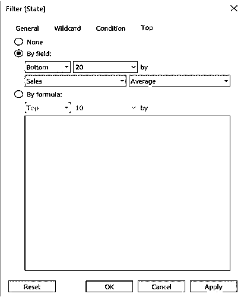

14.  我们已经得到了 20 个州的平均销售额的结果。我们可以在数据的摘要细节中看到结果。
15.  点击空白处->新窗口将打开->点击摘要。

我们可以观察到摘要计数显示为 20。显示正确的数据。

*   我们可以编辑摘要细节，比如在屏幕上显示什么。我们不需要显示所有的参数。我们可以单击我们不想看到的任何度量，如平均值或最小值，值将从汇总窗口中消失。

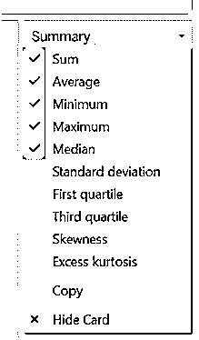

*   我们可以在下图中看到结果会是什么样子。取消选择平均值和最大值。

直到我们了解如何手动操作，但我们不需要每次手动选择和添加值，我们可以通过创建新参数来完成。

**转到顶部选项- >选择创建新参数- >给出参数名称- >选择最小值、最大值和当前值。**

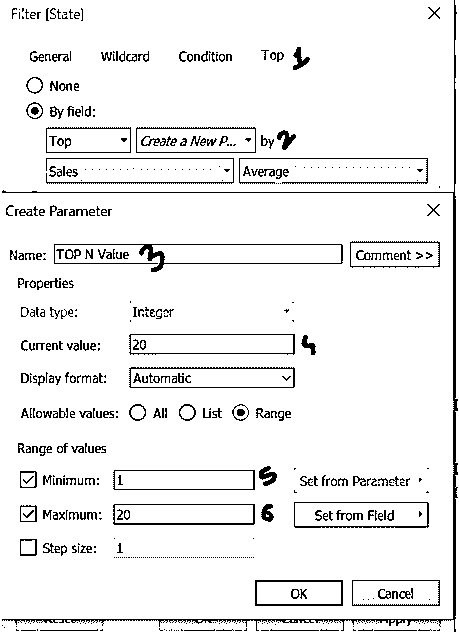

1.  我们可以自动获取结果。

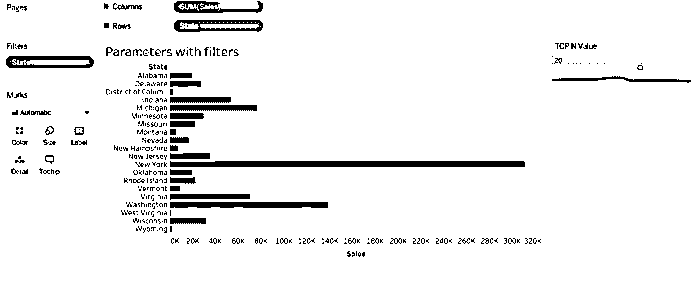

2.  我们可以通过将光标移动到我们创建的参数上来选择值 10。

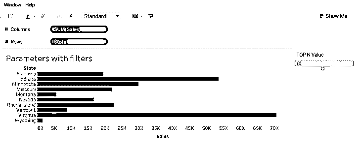

我们可以根据自己的选择更改参数过滤器中的值。点击编辑参数。

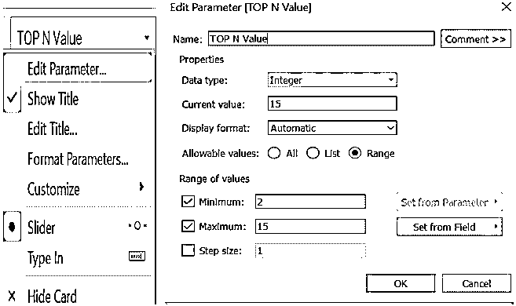

3.  用户可以通过输入 feature 在参数中输入值。键入值 7。

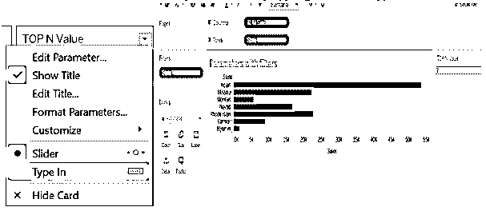

**带设置的参数**

我们可以使用参数过滤器为这组值创建一个集合，以突出显示我们想要的数据。

1.  我们将为具有一组子类别维度的销售度量值创建一个参数。
2.  转到子类别->点击它->选择创建->设置

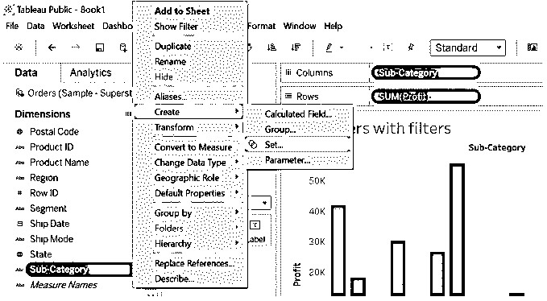

3.  转到顶部->按字段选择前 N 名->单击确定。

我们使用参数作为前 N 名，因为我们已经为子类别创建了前 N 名参数。

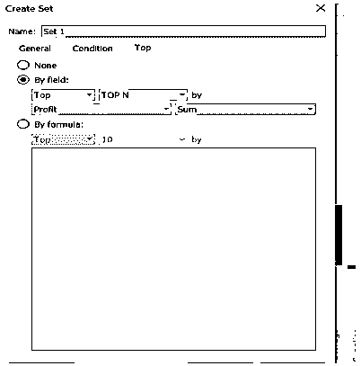

4.  集合 1 创建在测量的下方。将集合 1 拖到颜色。我们的销售额排在前 10 名。

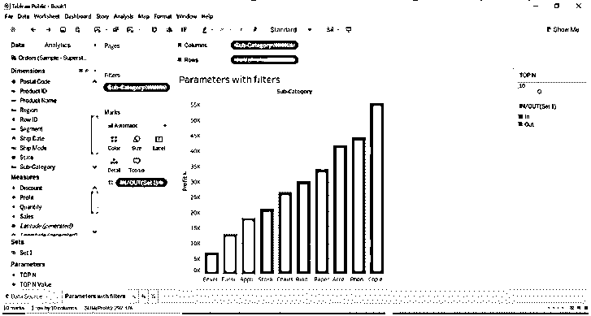

5.  我们可以通过改变参数值来改变这个值，集合也会改变。

看看下面的图片。参数值设置为 13，并设置更改。

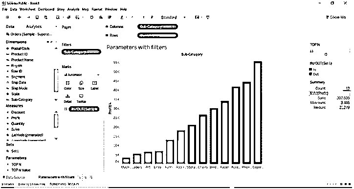

### 结论

我们已经了解了参数过滤器及其使用方法。我们可以在过滤器和集合中使用参数。我们可以自动拖动参数值。使用集合时，我们可以有不同的编辑和颜色选择选项。我们提供了高级选项，使参数更加动态。该参数是动态值。

### 推荐文章

这是一个 Tableau 参数过滤器的指南。在这里，我们将讨论 Tableau 中的参数过滤是如何完成的，并给出一些例子。您也可以看看以下文章，了解更多信息–

1.  [Tableau Count Distinct](https://www.educba.com/tableau-count-distinct/)
2.  [Tableau 中的仪表板](https://www.educba.com/dashboard-in-tableau/)
3.  [Tableau 工作簿](https://www.educba.com/tableau-workbook/)
4.  [窗口求和 Tableau |如何工作？](https://www.educba.com/window-sum-tableau/)
5.  [操作顺序表指南](https://www.educba.com/tableau-order-of-operations/)
6.  [Tableau 用户组|如何创建？](https://www.educba.com/tableau-user-group/)

