# Tableau 中的条件格式

> 原文：<https://www.educba.com/conditional-formatting-in-tableau/>

## Tableau 中的条件格式简介

在分析过程中，我们经常会遇到需要快速分类的情况。分类有助于理解重要的差异，基于这些差异，可以在问题上下文中做出关键的决策。在快速分类数据的方法中，广泛使用的一种方法是条件格式。顾名思义，它本质上意味着根据特定条件格式化数据值，颜色编码构成了这个[数据分析工具](https://www.educba.com/data-analysis-tools/)最重要的部分。Tableau 通过其通用的条件格式特性，使得甚至在图形上应用这个概念成为可能，使得可视化变得相当具有交互性和交流性。

### 如何在 Tableau 中执行条件格式？

现在，我们将通过三种形式的示例，逐步了解在 Tableau 中执行条件格式的方法:

<small>Hadoop、数据科学、统计学&其他</small>

#### 说明 1

在第一个演示中，我们使用的是配电容量数据，其中包含由分布式单元分配的容量。这里重要的维度是区域和分销单位，分销量是一个衡量标准。我们的目标是根据配送量对配送单元进行分类。我们将把它们分为非常高、高、中和低容量分配单元。我们将如何做到这一点，让我们看看:

**第一步:**要加载数据源，点击数据菜单中的“新建数据源”。或者，单击“连接到数据”。

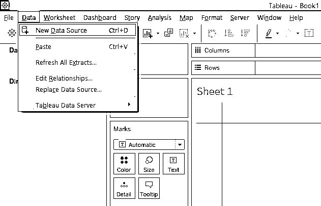

**步骤** **2:** 现在，在“连接”部分，选择所需的数据源类型。在这种情况下，它是“Microsoft Excel”。然后加载数据。

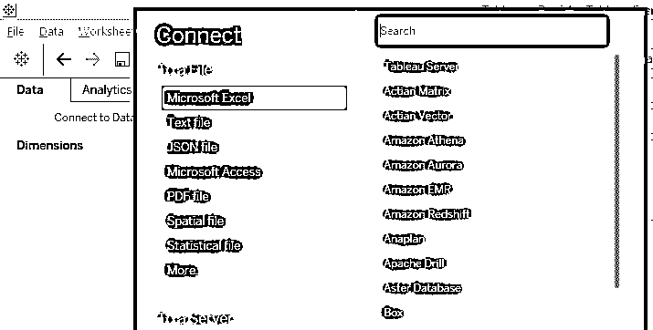

**第三步:**加载的数据可以在“数据源”选项卡中看到，如下图截图所示。

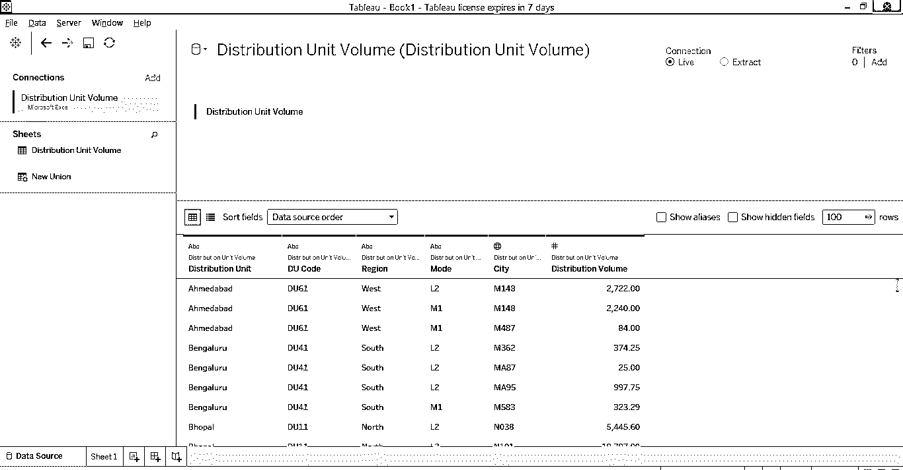

**步骤 4:** 转到 sheet 选项卡，我们可以看到数据集中存在的维度和度量。它们出现在各自的部分中。

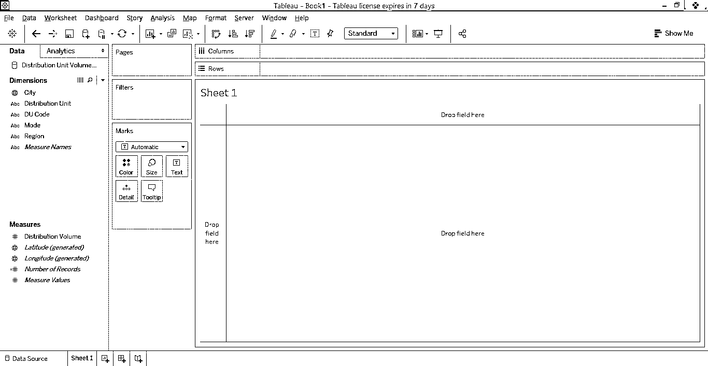

**第 5 步:**首先，将维度分布单元拖动到行区域，将度量分布体积拖动到列区域。生成如下所示的水平条形图。如果默认图表类型不同，请在“演示”中选择条形图。

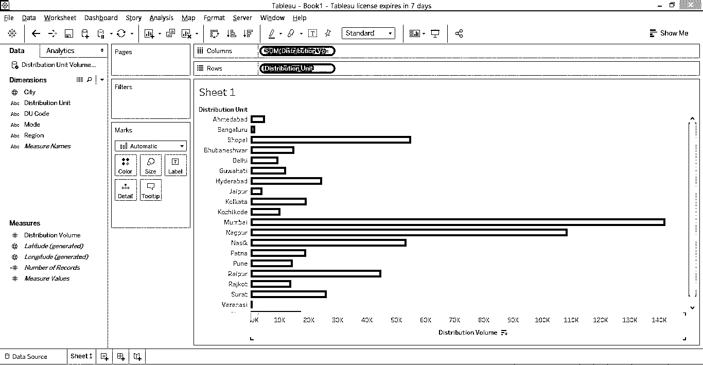

**步骤 6:** 点击排序图标，将结果按降序排序，如下图所示。

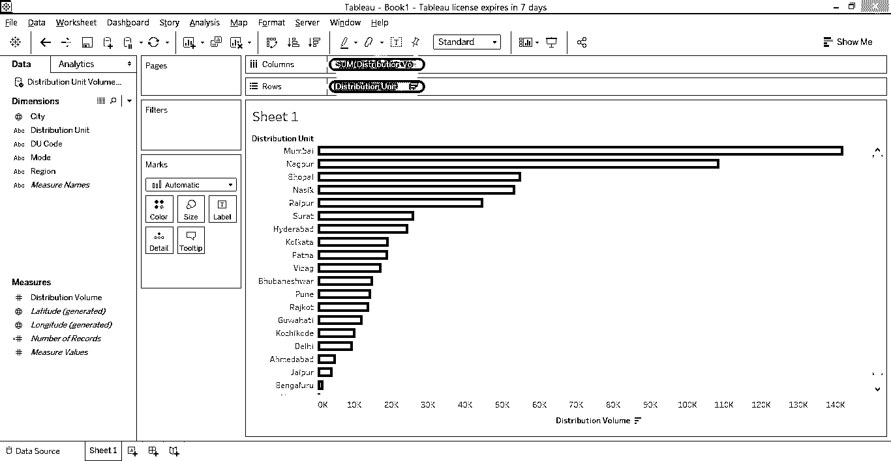

**第 7 步:**接下来，我们将创建三个参数，用于我们的目的。这些参数基本上有助于根据配电量对配电单元进行分类。要创建第一个参数，右键单击数据部分的空白处，然后单击“Create Parameter…”如下图所示。

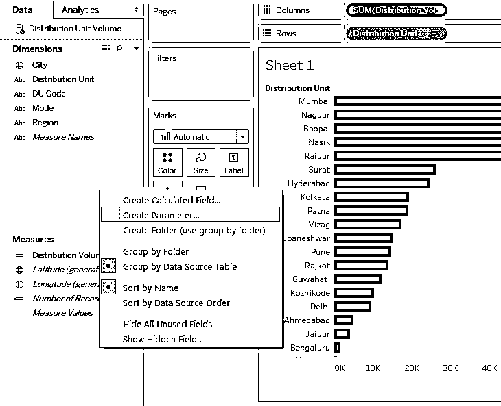

**步骤 8:** 按照上述步骤，弹出“创建参数”对话框，如下图所示。

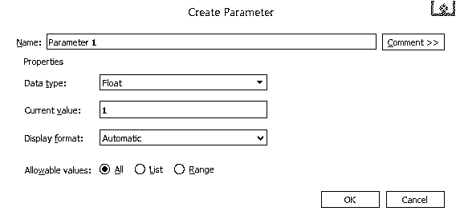

**步骤 9:** 在“创建参数”对话框中执行以下更改。将名称更改为“Threshold_1”，保持数据类型为“Float”，将当前值设置为 100，000，显示格式为自动，允许值选择为全部。最后，单击 OK 创建参数。如下图所示。

**步骤 10:** 同样，创建第二个参数，名称为“Threshold_2”，当前值设置为 50000，其他详细设置如下图。

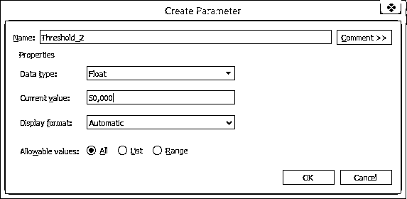

**第十一步:**最后，创建第三个参数。命名为“Threshold_3”。将该参数的当前值设置为 25，000，其他详细信息如下所示。

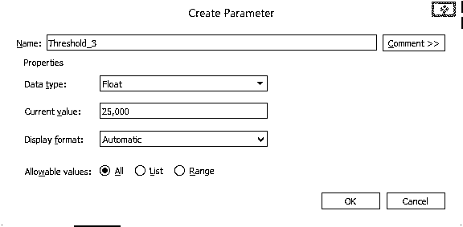

**第 12 步:**我们创建的三个参数如下图所示。现在，我们将适当地使用它们来实现我们的目标。

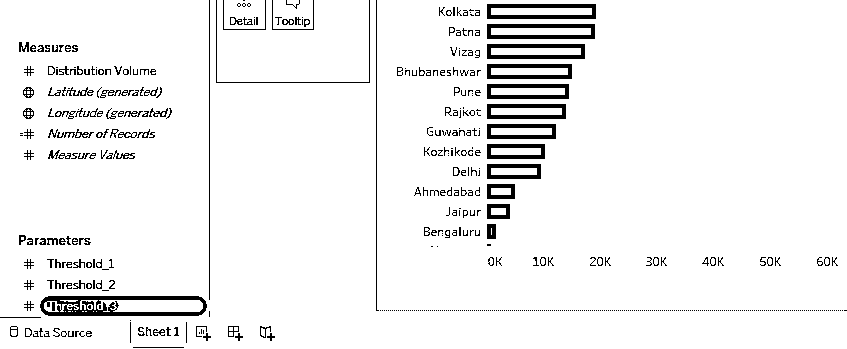

**步骤 13:** 除非在计算字段中使用我们创建的参数，以便根据分发量对分发单元进行正确分类，否则这些参数不会达到我们的目的。因此，接下来，我们将创建一个计算字段。为此，右键单击数据部分的空白处，然后单击“创建计算字段…”。

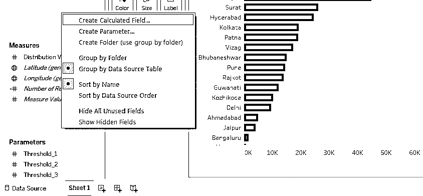

**步骤 14:** 我们创建的字段如下图所示。我们把它命名为“杜分类法”。最重要的一点是，我们使用了之前在计算字段中创建的三个参数。该代码的作用是，如果任何分发单位值大于 Threshold_1，即 100，000，则它会将其分类为“非常高的量 DU”。同样，它会做其他分类。

**注意:**我们没有对字段中的值进行硬编码，因为硬编码可能不允许我们处理基于上下文的更改。如果我们有参数，那么随着上下文的变化，变化的参数值将相应地反映在计算字段中。例如，如果我们打算将配送量超过 200，000 的配送单位归类为非常高的配送量，那么我们只需将 Threshold_1 的当前值从 100，000 更改为 200，000，而不会实际更改计算字段中代码的值。

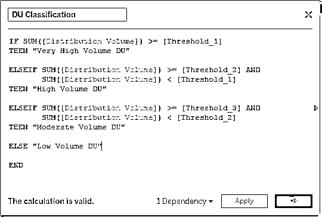

**步骤 15:** 从下面的截图可以看出，计算字段“DU 分类”出现在 Measures 下。

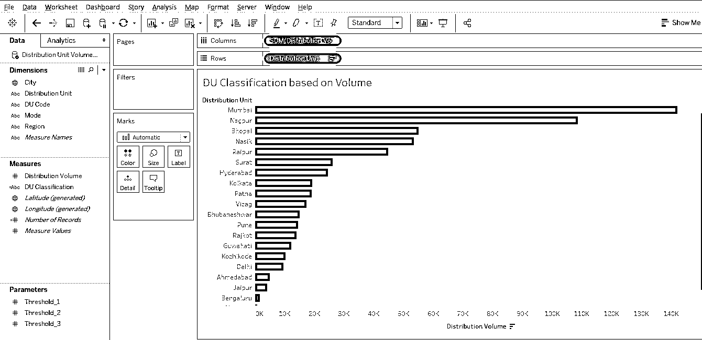

**第 16 步:**只需将计算字段“DU Classification”拖动到颜色标记上，正如我们在下面的屏幕截图中看到的那样，分配单元根据其容量贡献分为四个不同的类别。在屏幕截图的右侧可以看到这些类别。

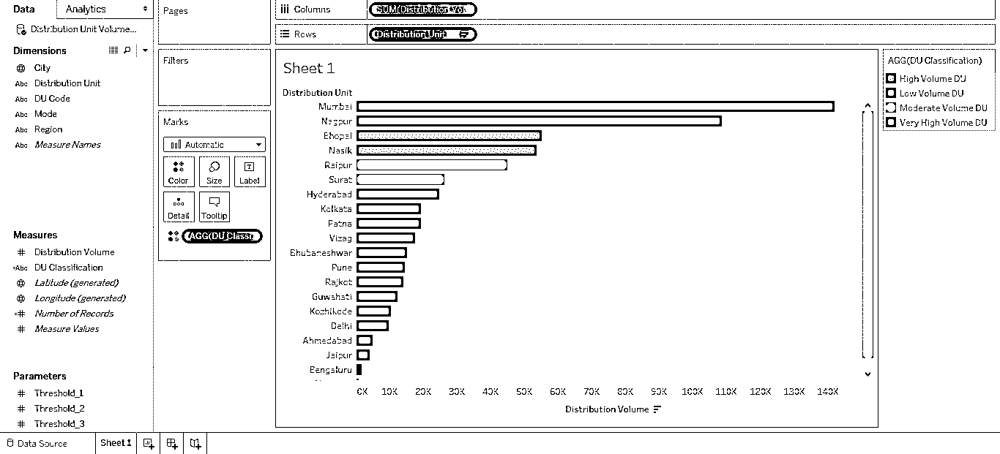

**第 17 步:**让我们仔细看看可视化。此外，我们改变了图例中类别的顺序；这可以通过使用鼠标上下拖动类别来完成。现在，在传说中，类别似乎是在正确的顺序。

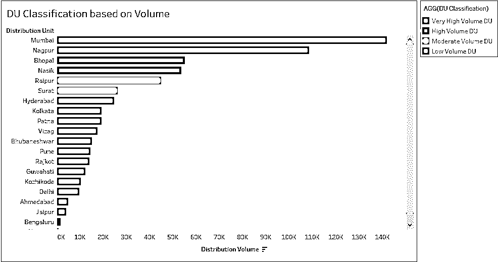

最后但同样重要的是，我们可以改变一个类别的颜色。为此，只需点击标记卡中的颜色，然后点击“编辑颜色”进行必要的颜色选择。

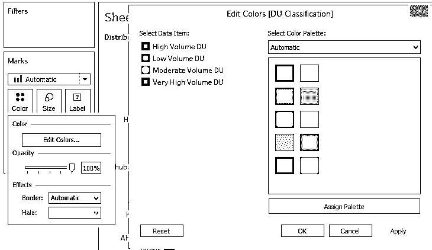

#### 说明 2

在此图中，我们将执行 Microsoft Excel 类型的条件格式。在 Microsoft Excel 中，我们有一个现成的选项，可以根据值设置单元格的背景色。这里，颜色的程度根据值的大小而变化。然而，在 Tableau 中，事情变得相当棘手，尤其是当我们打算在分析中使用这种条件格式时。为了实现目标，我们会稍微偏离轨道。让我们看看如何在 Tableau 中实现它。

**步骤 1:** 本演示的数据包含印度 20 个主要城市的利润和销售数据。数据已经加载到 Tableau 中。转到“sheet”选项卡，我们可以看到唯一的维度“City”和两个度量“Profit”和“Sales”出现在各自的部分中。

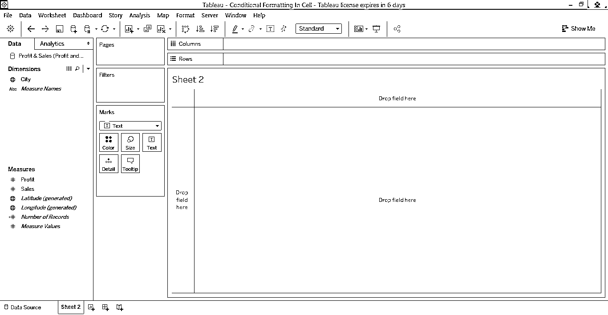

**第二步:**将维度 City 拖动到行区域，如下图所示。

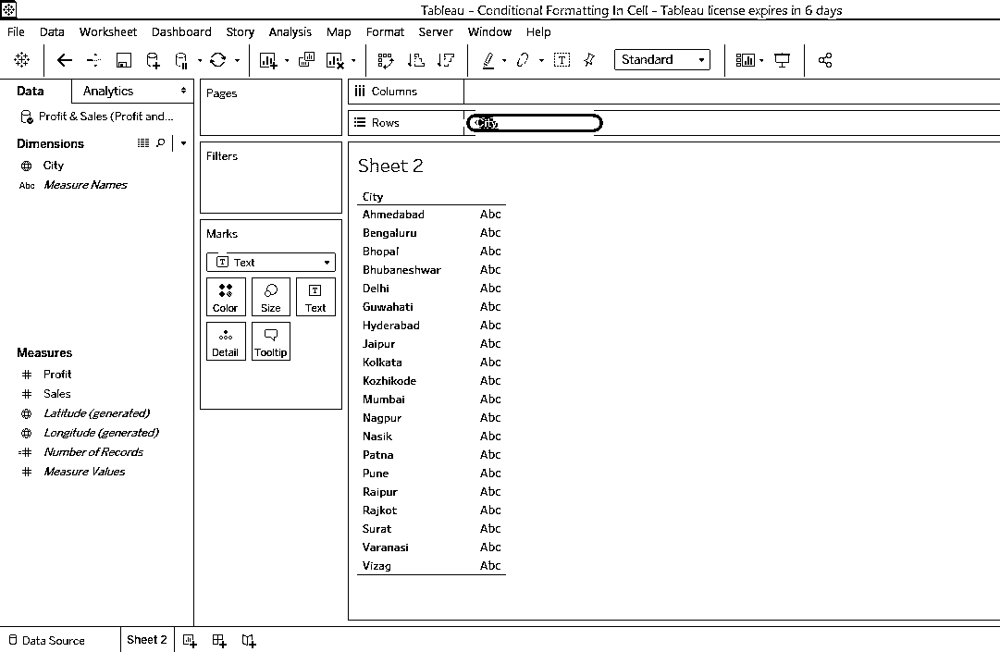

**步骤 3:** 下一步是创建计算字段。如下图所示。

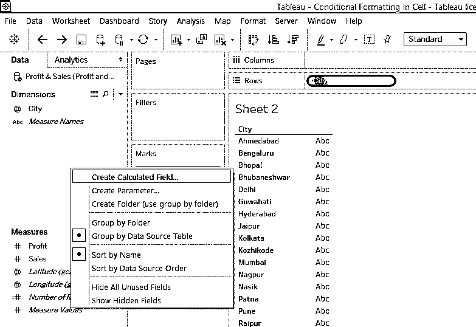

**步骤 4:** 创建名为 1.0 的计算字段，并在代码部分写入 1.0。创建后，可以在 Measures 部分看到该字段，如下面的屏幕截图之后的屏幕截图所示。

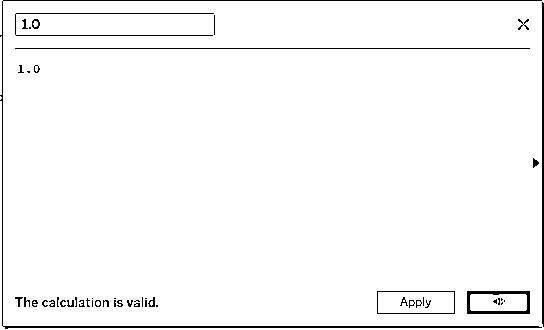

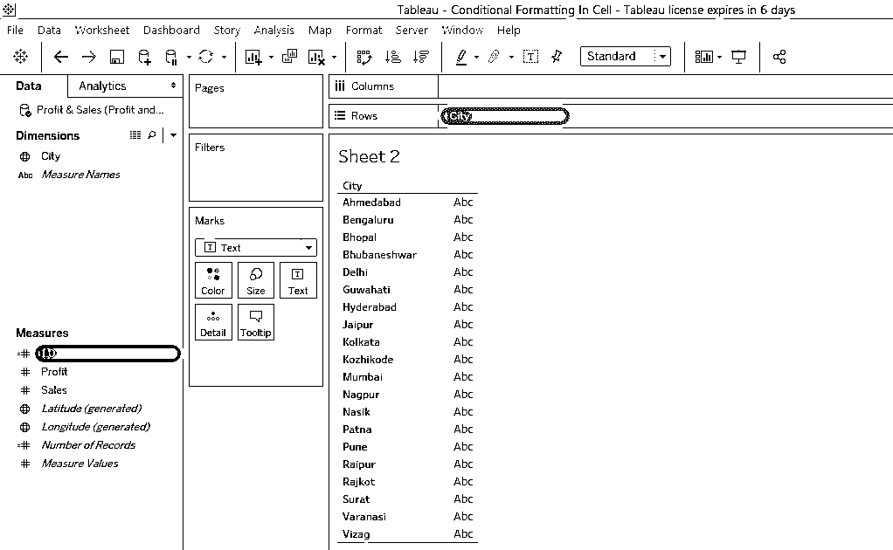

**步骤 5:** 将计算字段 1.0 两次一个一个地拖动到列区域。将类型 1.0 更改为 AVG(平均)。为此，请转到该字段的下拉菜单，然后单击 Measure 中的 Average。

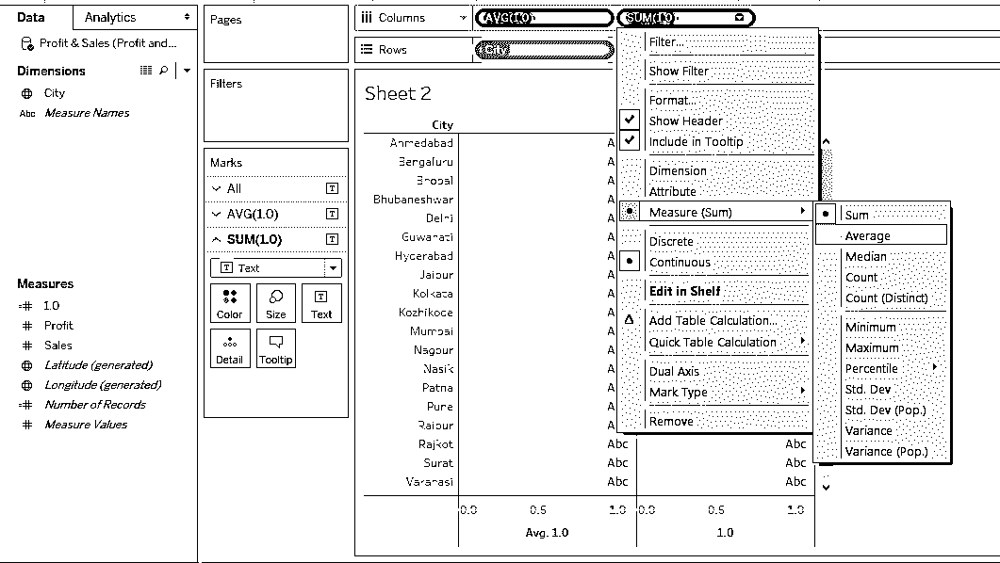

**第六步:**接下来，在第二个 1.0 measure 的下拉菜单中，点击“双轴”。如下图所示。

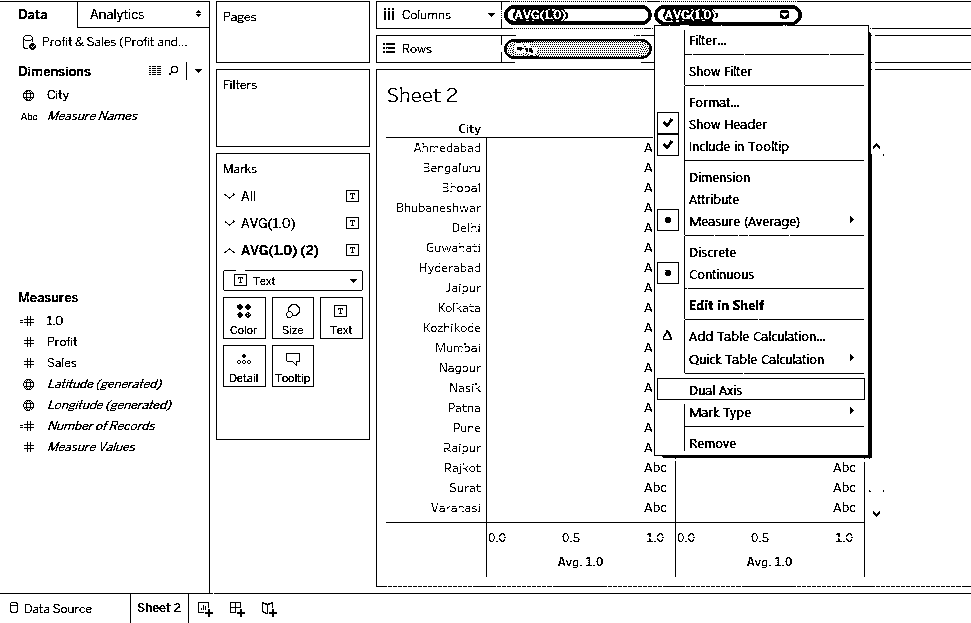

**第 7 步:**我们现在将修改顶轴和底轴。右键单击顶部的轴，然后单击“编辑轴”帖子，此时会出现一个对话框，如下图的截图所示。

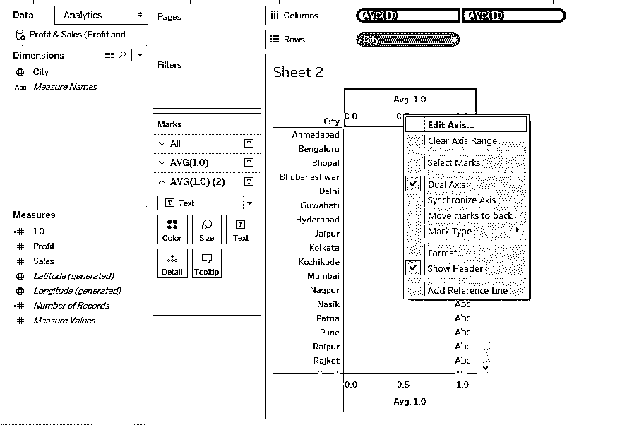

**步骤 8:** “编辑轴”对话框中的默认选项和值如下图所示。

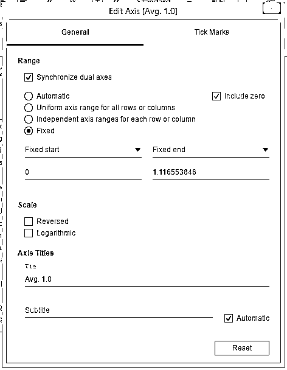

**步骤 9:** 确保在“编辑轴”对话框的“常规”部分进行如下所示的更改。

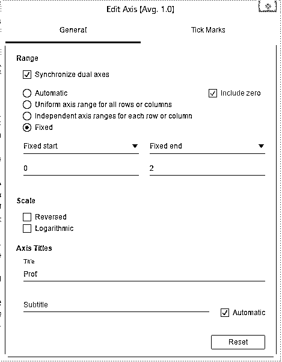

**步骤 10:** 现在，在对话框的“刻度线”部分，为主要刻度线和次要刻度线选择“无”。

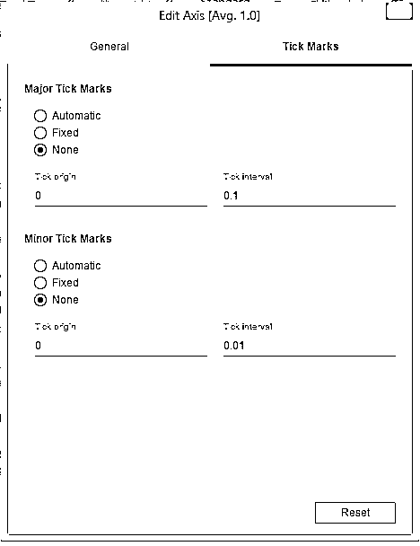

**步骤 11:** 同样对于底部轴，在“常规”和“刻度”部分执行更改，与顶部轴中执行的操作相似，只是“常规”部分中的标题保持空白，如下所示。

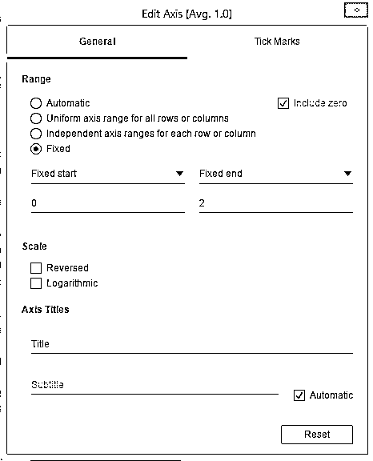

**步骤 12:** 执行上面的步骤给了我们下面的可视化。请注意，蓝色条是单元格大小的一半，因为在“编辑轴”对话框的“常规”部分的“固定端”中，我们有值 2，而在 1.0 字段中，我们有值 1。

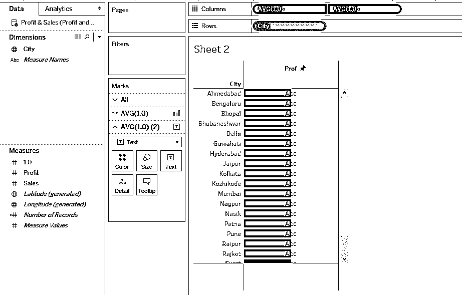

**第 13 步:**要获得全尺寸条，双击第一个 1.0 小节的药丸，然后添加 1，如下所示。

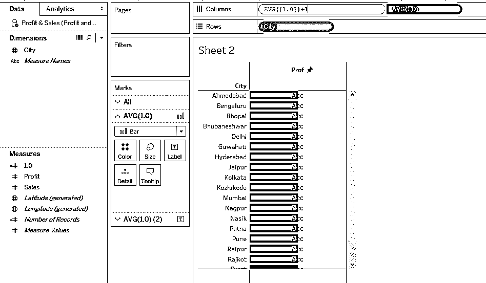

**步骤 14:** 以上步骤给出了全尺寸的单元格内条，如下图所示。

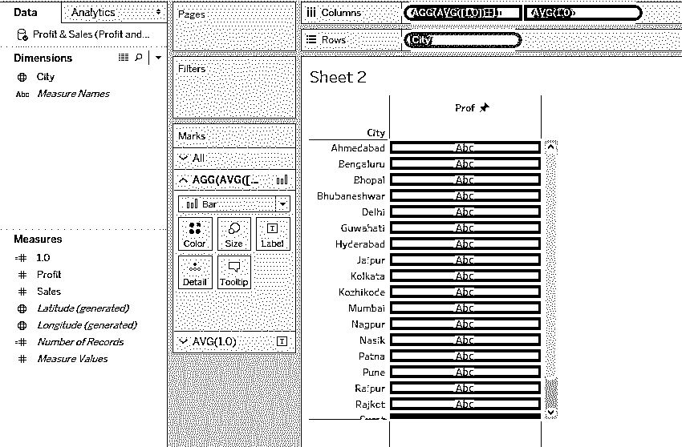

**步骤 15:** 现在，对于 Marks 卡中的第一个 1.0 字段，将利润拖动到颜色上。这样做可以得到不同颜色的条纹。请注意，不同颜色的条是由于不同的利润衡量值。

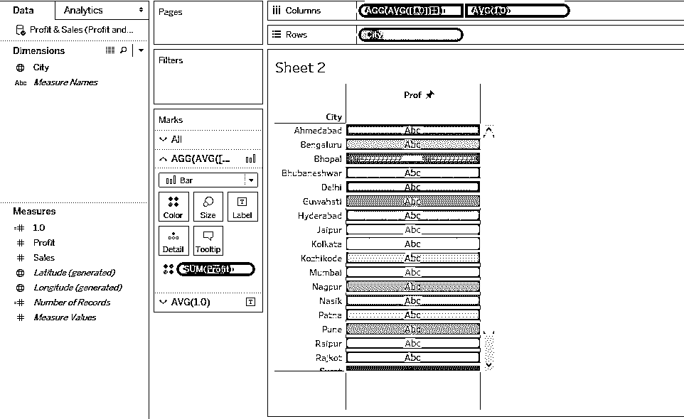

**步骤 16:** 现在，在第二个 1.0 度量中，将利润拖动到 Marks 卡中的文本上，这使得数值出现在单元格中，如下图所示。

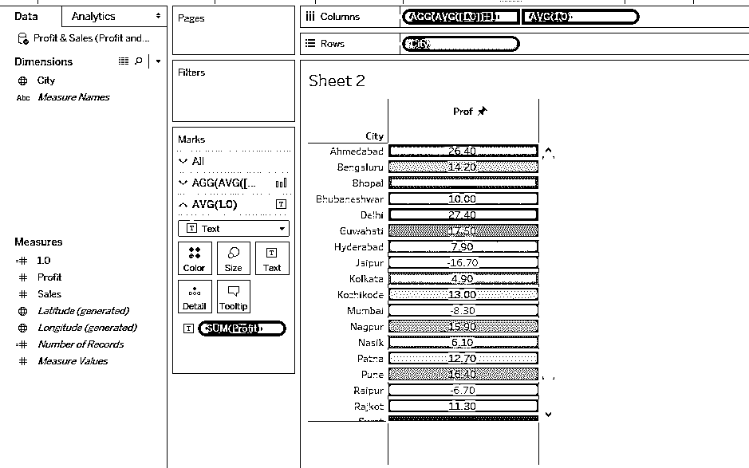

**步骤 17:** 在上面的截图中，我们可以看到颜色还没有填满完整的单元格。要使整个单元格充满颜色，请通过将大小滑块拖到第一个 1.0 栏的最右侧来选择最大的大小。如下图所示。如我们所见，现在，细胞完全被颜色填满了。

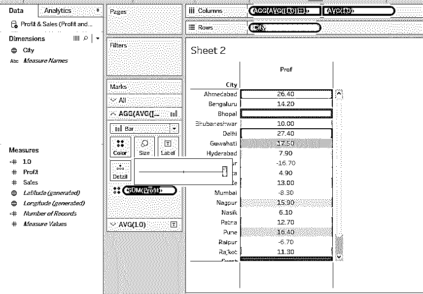

**步骤 18:** 如果我们发现背景颜色的亮度非常高，我们可以根据需要，通过颜色部分的不透明度滑块调整不透明度来降低亮度。在这种情况下，我们保持不透明度为 90%。类似地，我们可以通过第二个 1.0 度量中的设置来调整文本值的不透明度。然而，文本值的不透明度应该保持在 100%，以便让它们清楚地出现在背景颜色上。请注意，在下面的可视化中，我们可以看到负值与正值明显不同。负值用橙色表示，正值用蓝色表示。此外，根据该值，颜色的亮度会发生变化。

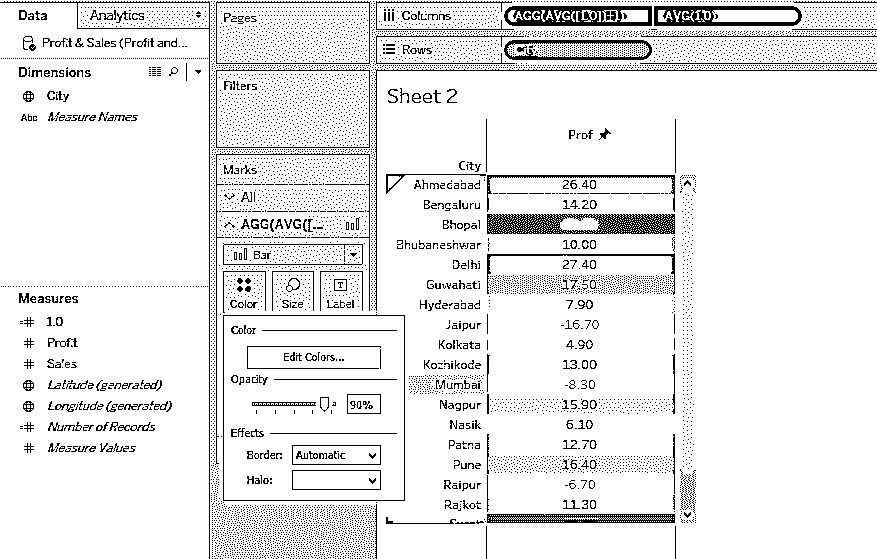

**第 19 步:**以上是我们为利润度量执行的步骤。我们的数据集中还有另一个重要的指标，那就是销售额。对于测量销售，我们也打算进行类似的分析。所以，重复以上步骤即可。最后，将销售颜色改为绿色，如下图所示，或者可以选择任何合适的颜色。

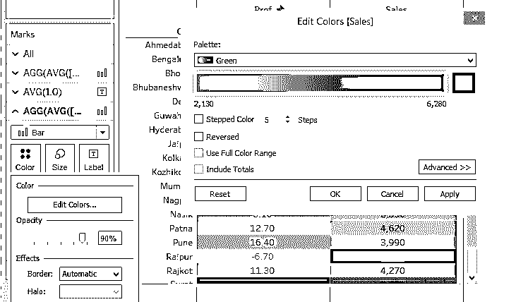

**步骤 20:** 现在，我们使用条件格式执行的分析如下图所示。在右侧，我们可以看到基于利润和销售值范围分配的颜色。这种基于颜色的格式提供了对数据至关重要的见解，因此得名。

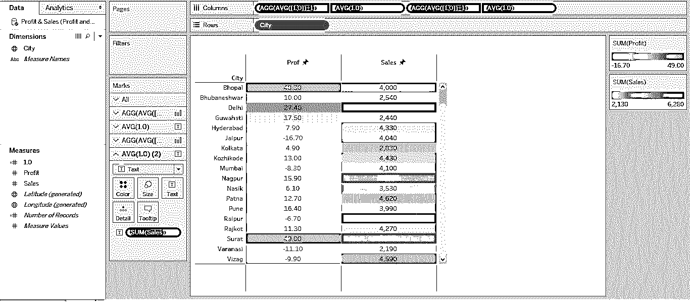

**步骤 21:** 下面的屏幕截图让我们更仔细地了解了我们使用条件格式执行的分析。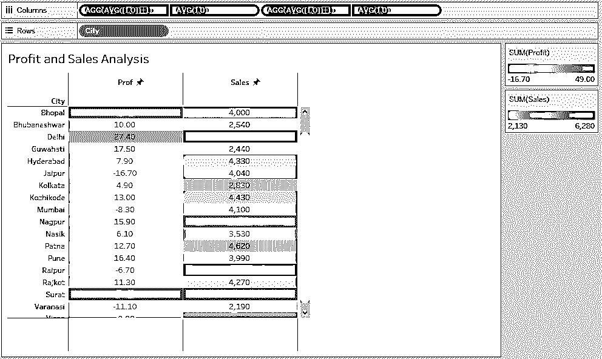

#### 说明 3

对于这个示例，我们将使用第一个示例中使用的数据集。这里我们将重点介绍排名前五和垫底的五个城市。我们去 Tableau:

**步骤 1:** 我们已经加载了维度和度量的数据，如下图所示。

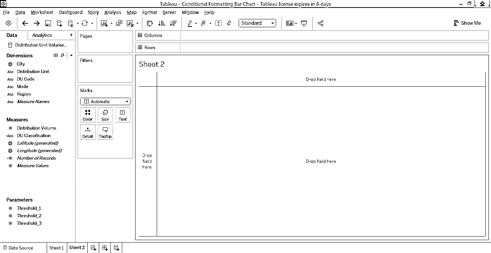

**步骤 2:** 将维度分布单位拖动到行区域，并测量标记卡中文本的分布量，如下图所示。

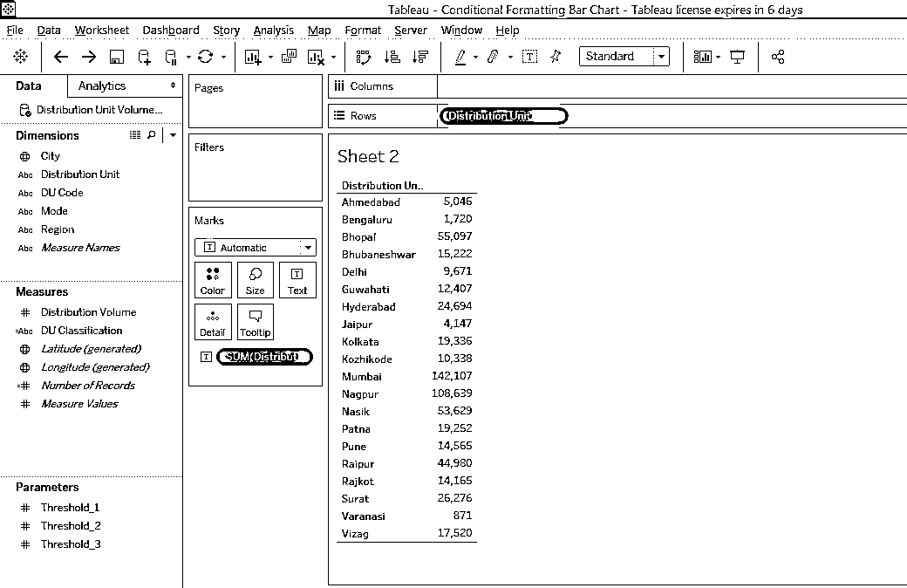

**第三步:**将结果按降序排序，这样我们就得到配送量从高到低的城市。如下图所示。

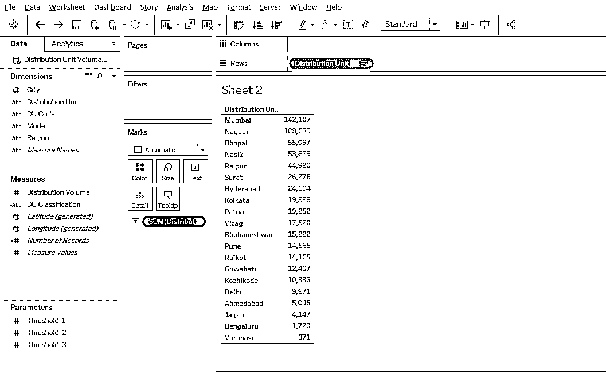

**步骤 4:** 接下来，创建一个计算字段。前面几节已经介绍了创建计算字段的步骤。我们希望突出显示前五名和后五名分配单元，因此将计算字段命名为“前 5 名&后 5 名”。在代码部分，我们使用了 INDEX()和 LAST()函数。INDEX()函数返回当前行的索引，而 LAST()返回从当前行到最后一行的行数。INDEX()从 1 开始计算，而 LAST()从 0 开始计算。这两个函数已经被使用，如下图所示。

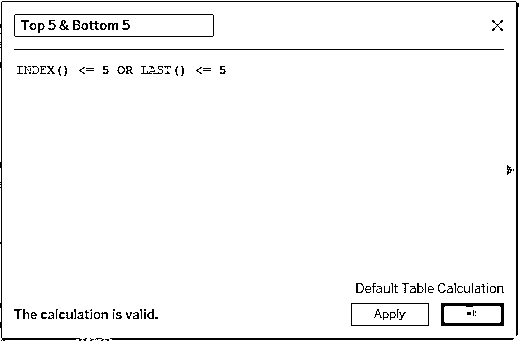

**步骤 5:** 新创建的计算字段显示为一个度量，如下面的屏幕截图所示。

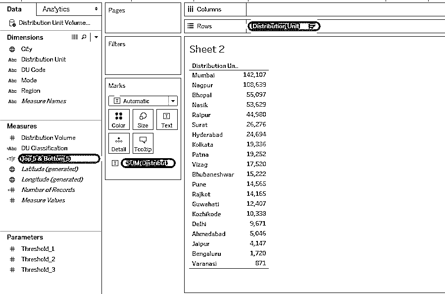

**步骤 6:** 现在，只需将新创建的计算字段“Top 5 & Bottom 5”拖动到标记卡的颜色上，我们可以看到顶部和底部的 5 个区域以红色突出显示。类别显示为假值和真值，如屏幕右侧所示。

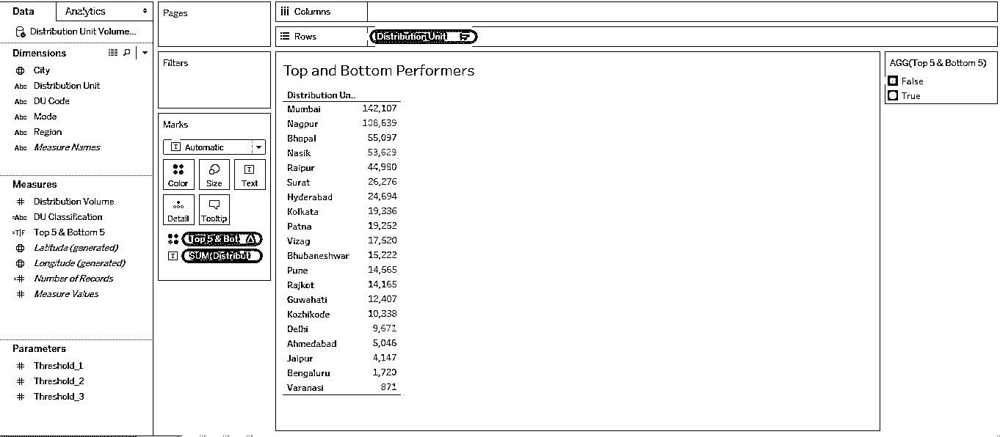

### 结论

通过各种插图，我们试图更深入地了解 Tableau 中条件格式的概念。然而，作为一个非常交互式的可视化工具，可以发现需要使用该工具提供的功能的多种方式。因此，Tableau 便于将条件格式应用于可视化，而不局限于固定的方式。

### 推荐文章

这是 Tableau 中条件格式的指南。在这里，我们通过三种形式的示例，一步步地讨论在 Tableau 中执行条件格式的方法。您也可以浏览我们的其他相关文章，了解更多信息-

1.  [Tableau 图表](https://www.educba.com/tableau-charts/)
2.  [Tableau 仪表盘设计](https://www.educba.com/tableau-dashboard-design/)
3.  [Tableau 图表类型](https://www.educba.com/tableau-chart-types/)
4.  [在 Tableau 中创建集合](https://www.educba.com/create-set-in-tableau/)
5.  [Tableau 聚合函数](https://www.educba.com/tableau-aggregate-functions/)
6.  [Tableau 中的枢轴](https://www.educba.com/pivot-in-tableau/)
7.  [Tableau 上下文过滤器](https://www.educba.com/tableau-context-filter/)
8.  [Tableau 项目符号图](https://www.educba.com/tableau-bullet-chart/)
9.  [Tableau 特性和属性介绍](https://www.educba.com/tableau-new-features/)
10.  [如何在 Tableau 中创建群组？](https://www.educba.com/group-in-tableau/)
11.  [如何在 Tableau 中应用双轴？](https://www.educba.com/tableau-dual-axis/)

