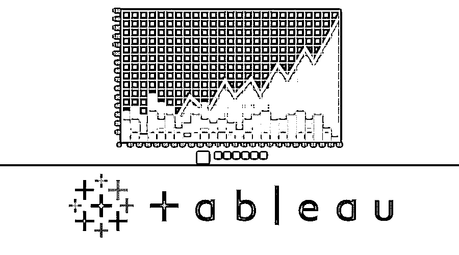

# 在 Tableau 中创建集合

> 原文：<https://www.educba.com/creating-set-in-tableau/>

## 在 Tableau 中创建集合的介绍

集合是一组映射在一起的点，可以是静态的，也可以是动态的。在 Tableau 中创建集合可以被视为过滤器和组的替代选项。因此，集合的特征可以是以下任何一个:

*   输出可能是该点是否在集合内，一般来说是真/假。
*   点是在集合内还是在集合外-进/出。
*   我们可以使用条件搜索，如搜索年龄> 45 岁到一个人的年龄，甚至可以选择任何组的前 5 名或前 10 名。
*   我们还可以使用连接将两个集合组合成一个集合。

<small>Hadoop、数据科学、统计学&其他</small>

### 结论

在 Tableau 中创建集合允许您隔离维度的不同部分，然后可以以多种方式用于深入了解您的数据。这篇文章提供了在 Tableau 中创建集合的指导，以及可以用来改进分析的各种方法(在 Tableau 中创建集合)。

### 推荐文章

这是一个在 Tableau 中创建 Set 的例子的指南。这里我们讨论了在数据集的 Tableau 中创建集合的不同步骤。您也可以阅读以下文章，了解更多信息——

1.  [Tableau 使用指南](https://www.educba.com/uses-of-tableau/)
2.  [十大 Tableau 面试问题](https://www.educba.com/tableau-interview-questions/)
3.  [Looker vs Tableau 顶级差异](https://www.educba.com/looker-vs-tableau/)
4.  [数据对表格的重要性](https://www.educba.com/data-visualization-with-tableau/)
5.  [Tableau 中的排名函数](https://www.educba.com/rank-function-in-tableau/)
6.  [Tableau 上下文过滤器](https://www.educba.com/tableau-context-filter/)
7.  [Tableau 项目符号图](https://www.educba.com/tableau-bullet-chart/)
8.  [在 JavaScript | Top 7 方法中设置](https://www.educba.com/set-in-javascript/)

