# Tableau 向下钻取

> 原文：<https://www.educba.com/tableau-drill-down/>

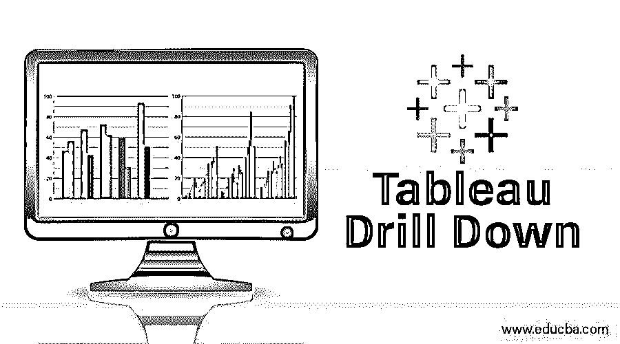

## Tableau 向下钻取简介

Tableau Drill Down 是表示可视化的分层数据视图的功能。它有助于深入分析一个特定的维度及其具有度量细节的维度。深入报告是特定于上下文的，是为特定的业务需求而创建的。Tableau 中的一些下钻报表示例表示国家、地区、州和城市级别的销售数据。类似地，表示年、月、日的表示也是下钻报告的常见用例。Tableau provision 用于查看仪表板上的深入查看功能。向下钻取是 Tableau 中的一个重要特性，它增加了商业智能(BI)的价值。

### 如何使用 Tableau？

*   我们将从数据源开始。
*   将数据集连接到 tableau。
*   打开 Tableau 桌面或公共->点击文件->打开(你想处理的文件，可以是 xlx，pdf，txt 等。).
*   我们已经打开了 Sample-Superstore 数据库，从该数据库中拖出了 orders 表。

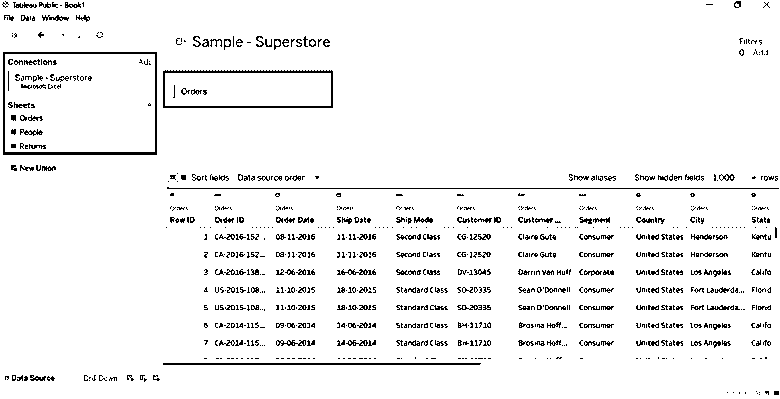

<small>Hadoop、数据科学、统计学&其他</small>

*   转到工作表，在那里您将看到划分为维和度量的数据。根据需要命名工作表(我们将其命名为 Drill-Down)。

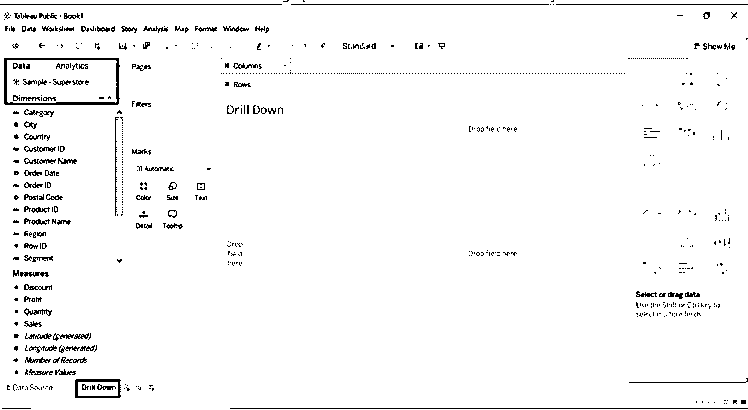

*   将维和度量拖至行和列。
*   将类别和子类别维度拖到行中。
*   将销售额拖到列中。
*   我们将按类别和子类别获取销售额。
*   对于格式，请将类别拖到颜色标记卡中。
*   查看表格右侧给出的类别部分。

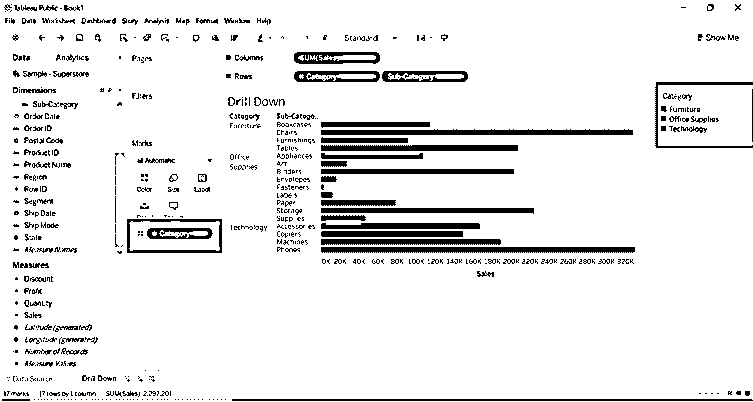

我们将了解每个地区的表现。

*   将区域维度拖到筛选器和列中。
*   我们可以选择所有区域或一个或两个区域。
*   我们已经选择了所有的地区。

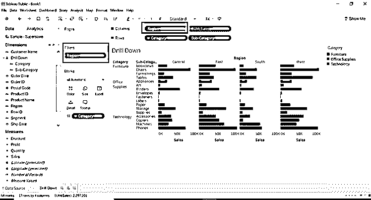

我们将更多地了解工作表的格式。

*   拖动子类别到类别新窗口将弹出名称层次结构。给它一个你想要的名字。我们称之为向下钻取。
*   将区域维度拖到行中，并仅选择 1 或 2 个区域。
*   Category 维度将获得一个子类别的向下钻取。
*   查看类别图标上的+号。

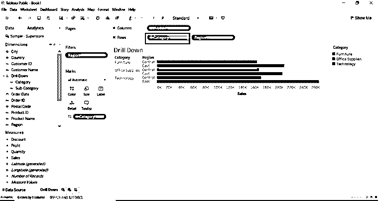

*   如果我们需要带有子类别的数据，单击类别维度上的+号。+符号已更改为-

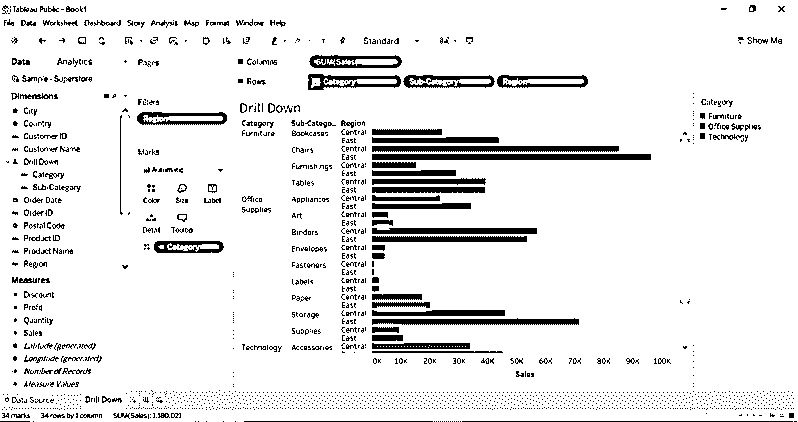

*   将城市维度拖到筛选器(标记卡)中。
*   选择您想要的城市。
*   将类别拖到过滤器(标记卡)中选择所需的类别。
*   我们可以改变任何过滤器的颜色。

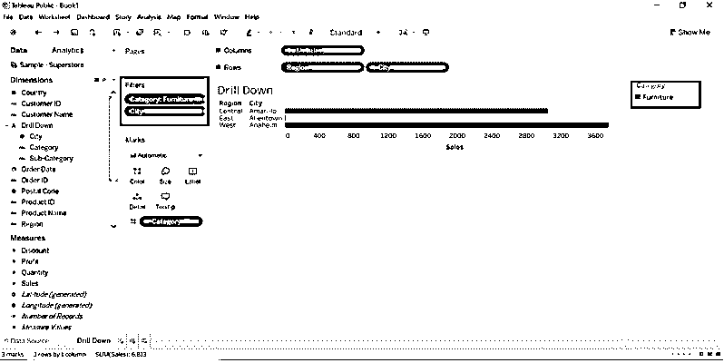

*   将订单日期维度拖到列中。

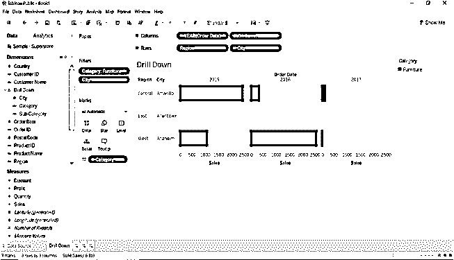

*   订单日期维度有一个+号；点击下拉菜单我们可以选择年、日、季、月。

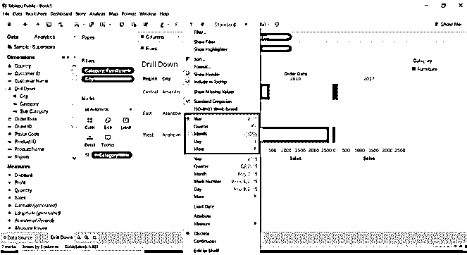

*   如果我们选择月份**，**，结果将会改变。

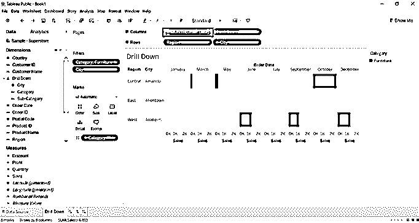

*   如果我们将订单日期维度拖到行中。

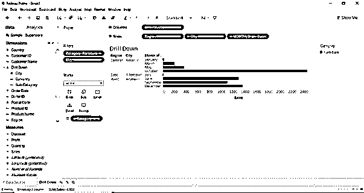

*   我们可以在列和行之间交换值。给出一个交换图标。

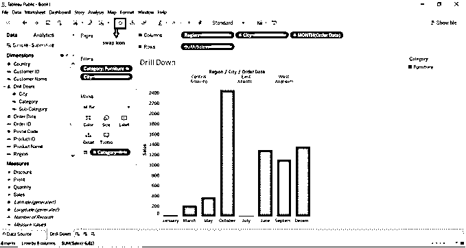

*   将 Sum (Sales)拖动到 Color (Marks)中，将在工作表的右侧生成一个新窗口。
*   点击 Sum(sales) ->选择下拉菜单-->点击编辑颜色，选择你想要的颜色。

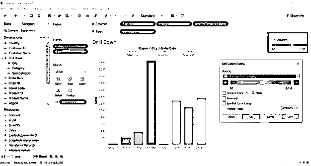

*   我们可以用更高级的颜色形成功能来改变销售的颜色。打开编辑颜色窗口。点击步进颜色，我们可以改变一些步骤，调色板将显示每一个我们选择的步骤的颜色范围。

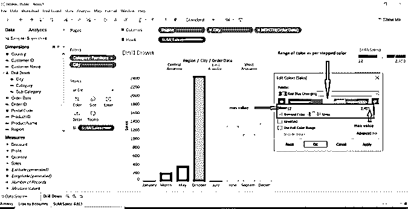

*   我们可以将总和(销售额)转换为平均值、中间值、计数、最小值、最大值等。测量。
*   点击 SUM(销售)->选择衡量指标(SUM)->选择你想要的衡量指标的下拉按钮。

*   我们已经将类别和子类别维度拖到列中。我们选择了家具类别，并选择了所有子类别。

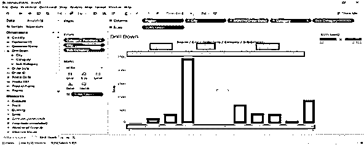

*   选择维度->单击下拉箭头->选择显示过滤器->新窗口将在工作表的右侧打开。
*   我们可以选择右侧创建的任何数据，并显示我们想要的结果。

*   将状态维度拖到标签中；它将以状态方式显示数据。
*   我们选择了 2015 年和 2017 年；将只显示这两年的数据。

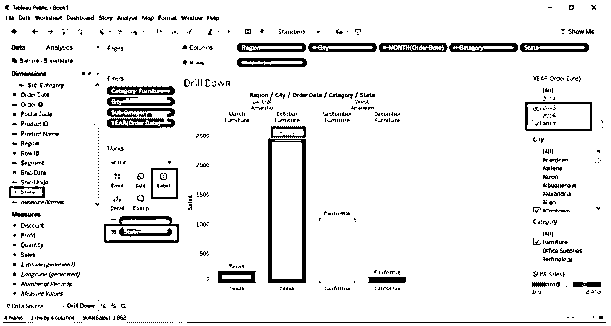

*   我们已经看到了每个地区、类别、州的一些销售情况。

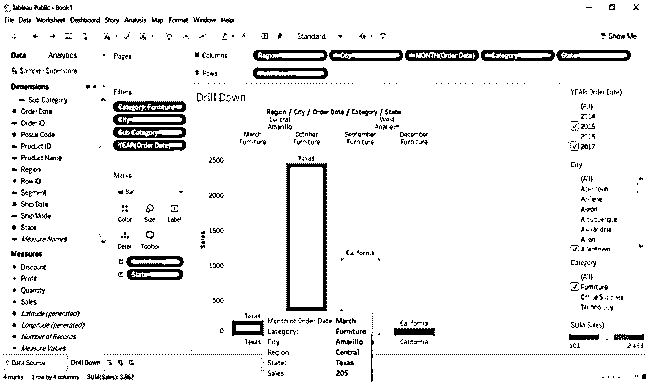

### 创建地图视图

*   首先，创建一个包含邮政编码、州和国家维度的层次结构。
*   转到国家->单击下拉栏->选择层次结构->创建层次结构->为层次结构命名(我们将名称命名为映射)。

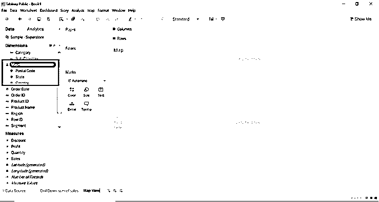

*   双击状态维或将状态维拖动到标签，将创建映射。

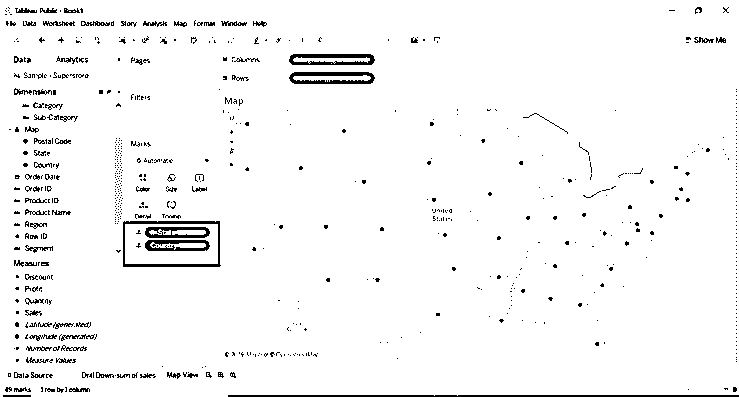

*   Tableau 自动创建地图，因为 tableau 知道州是地理数据。
*   默认情况下会添加 County 维度，因为在示例数据库中，国家是层次结构的一部分。
*   层次结构的每个级别都被添加到详细信息中。
*   添加经度和纬度的原因是地图视图需要每个位置。
*   将利润度量拖到颜色上，我们可以看到每个州的一些利润。

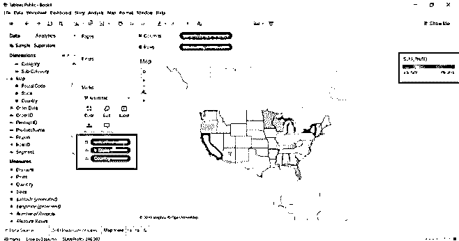

*   根据利润自动为每个州添加颜色。查看自动更新的填充地图。

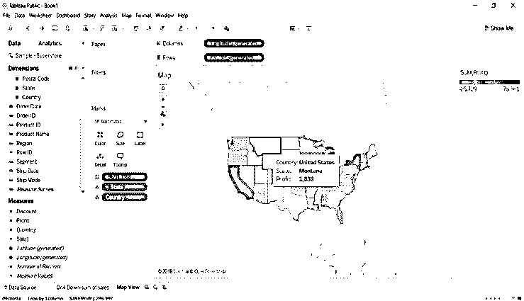

*   我们将把区域维度拖到过滤器中。我们可以看到按地区划分的利润。

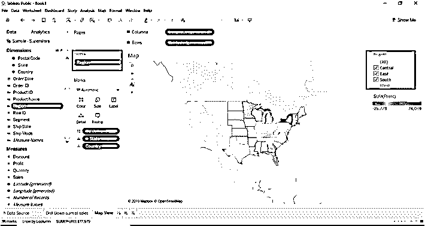

*   我们可以改变利润的颜色；我们可以看到每个州获得了多少利润。
*   进入颜色->编辑颜色->选择步进颜色->选择颜色(从色板)。

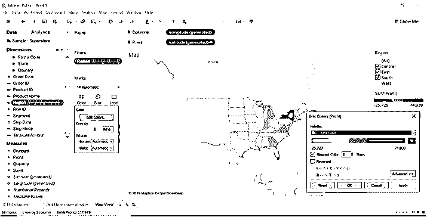

*   将销售度量值和区域维度拖到标签上；我们将看到每个州和地区的销售情况。

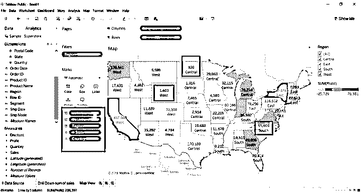

*   我们可以在下图中看到地区和国家所在州的销售利润。

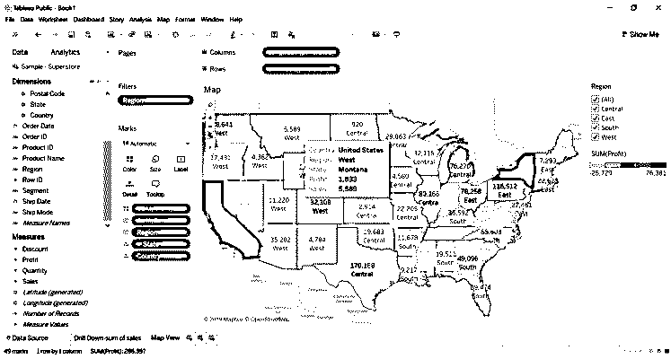

### 使用地图向下钻取

*   我们将通过向下钻取的方法查看每个地区的利润。
*   复制地图视图工作表。单击工作表->单击副本。
*   将创建重复的工作表。
*   转到演示->选择条形图。

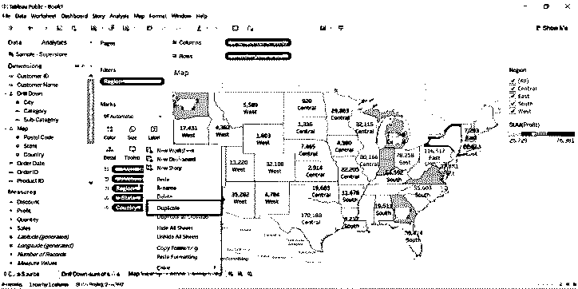

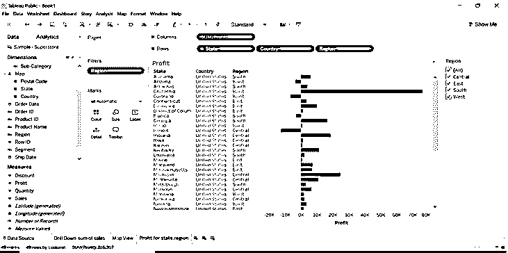

*   选择利润区域并标记仅保留。

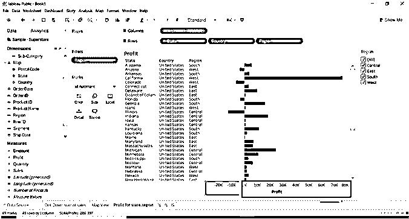

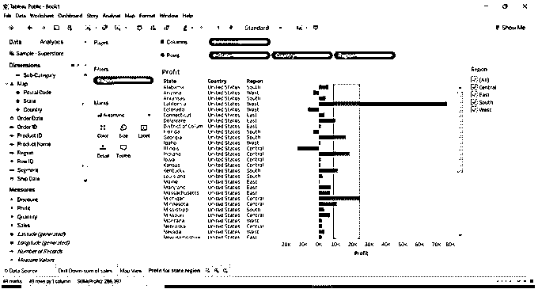

*   当我们选择“仅保留”时，将出现下图。

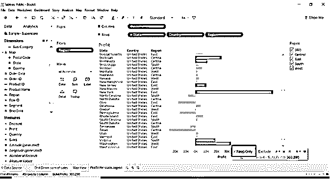

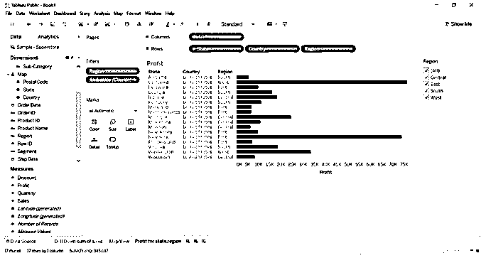

*   当我们单击“州测量”时，国家/地区将位于“州”之下，因为我们已经对其进行了分级。–给出状态标志。当我们点击–标志国家将会消失。
*   何时——与州政府签约。

*   当+与州签。

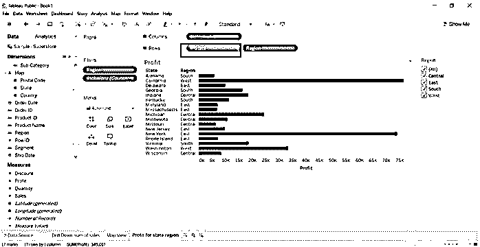

*   如果我们点击州上的+号，将显示国家的日期。

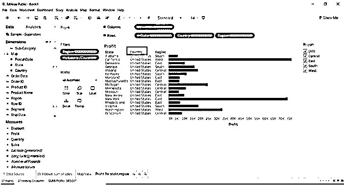

### 结论- Tableau 向下钻取

向下钻取是 tableaus 提供的最有用的特性之一。可视化使其易于查看。当有一个大的数据源时，我们可以通过向下钻取来查看每个数据。Tableau 是易于使用的工具，易于理解它提供的每个功能。

### 推荐文章

这是一个 Tableau 向下钻取的指南。在这里，我们讨论了简介以及创建地图视图和向下钻取地图。您也可以浏览我们推荐的其他文章，了解更多信息——

1.  [Tableau 竞争者](https://www.educba.com/tableau-competitors/)
2.  [什么是 Tableau？](https://www.educba.com/what-is-tableau/)
3.  [表格中的折线图](https://www.educba.com/line-chart-in-tableau/)
4.  [什么是 Tableau 服务器？](https://www.educba.com/what-is-tableau-server/)

