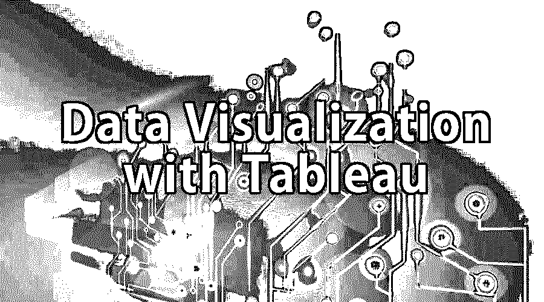

# 用 Tableau 实现数据可视化

> 原文：<https://www.educba.com/data-visualization-with-tableau/>

## 什么是用 Tableau 实现数据可视化？

tableau 的数据可视化就是通过可视化渲染来呈现信息的过程。几个世纪以来，人们已经习惯于图表和地图等可视化工具来更快更容易地理解信息。就人脑而言，它对视觉数据的识别速度比文本数据更快。

随着收集和分析的数据越来越多，tableau 系统的数据可视化受到大多数决策者的欢迎。它帮助决策者找出数百万个变量之间的相关性，并交流概念和假设。这也让他们决定未来。

<small>Hadoop、数据科学、统计学&其他</small>

还有一种类型的数据可视化，称为交互式可视化。这种方法比普通的 tableau 数据可视化方法更进了一步。它超越了静态数据表示的显示。相反，它与用户交互，立即改变数据并让他们知道数据是如何处理的。

### 使用 Tableau 实现数据可视化的重要性

当前场景中的技术发展使得数据可视化更加强大；因此，它提高了商业智能。企业使用数据可视化定义有很多原因。为你列出了一些。

*   可视化帮助人们清楚地理解事物，并对主题有更好的洞察力。
*   可视化有助于轻松预测未来并做出更好的决策
*   还可以轻松快速地发现大量数据
*   数据可视化以通用的方式传达信息
*   它使与他人分享想法变得简单
*   数据可视化让人们知道他们需要在业务中的哪些地方进行调整，以获得更好的结果。
*   它提供了可扩展性
*   这使得解释变得容易

### 数据可视化免费工具

为什么要投资数据可视化免费工具？你不能用传统的 excel 方法来保护你的数据吗？

今天的数据可视化自由工具远远领先于传统的标准图形和图表。现在，一天的数据以更复杂的方式显示，如数据可视化信息图、迷你图、热图、详细条形图等。还有交互式数据可视化免费工具，使用户能够参与数据的查询和分析。数据可视化免费工具有助于将来自不同渠道的数据整合在一起，并提供无限和快速的灵活性。

提供商业智能软件的软件供应商也将数据可视化作为其产品的一部分。他们要么开发自己的可视化技术，要么从专门从事数据可视化类型的公司外包。

市场上有很多免费的数据可视化工具。我们列出了一些顶级的数据可视化免费工具。

*   MicroStrategy 分析桌面
*   多莫
*   活人画
*   qlikview

在本文中，我们将了解最好的数据可视化工具之一——Tableau。

### 什么是 Tableau？

如果你打算开始创建自己的交互式数据可视化，那么 [Tableau](https://www.tableau.com/ "Tableau") 是一个很好的起点。这是 Tableau 软件开发的最流行和最强大的工具之一。它提供了一套工具，包括网络连接、桌面和服务器版本。它可以轻松连接到任何数据源，如 Microsoft excel、公司数据仓库或任何基于 web 的数据。

Tableau 提供了一个简单的拖放界面，可以将您的数据快速转化为商业见解。它以一种更吸引人的格式交付可视化数据，称为数据可视化仪表板。

Tableau 可以连接不同格式的本地或远程数据。Tableau 还可以将实时数据转换成最新的可视化数据。

### 数据可视化类型 Tableau 的优点和特性

Tableau 是商业智能领域的行业领导者。它正在成为数据可视化的标准。现在让我们看看 Tableau 直观而强大的重要特性。

**1。一键可视化分析:** Tableau 以一种逻辑简单的方式分析数据。数据在更短的开发时间内被转换成可视化。制作快速可视化是 Tableau 的一大优势。

**2。交互式仪表盘:** Tableau 有一个漂亮的交互式仪表盘，可以很快给出结果。仪表板还将向您展示丰富的可视化效果。数据可视化仪表板将让您深入了解数据。

**3。易用:**一些数据可视化工具让数据分析变得很难，但 Tableau 让它变得更容易。它减少了不必要的并发症。Tableau 使用拖放界面，提供了一个用户友好的环境。如果一个人知道 MS Excel 的基础知识，他可以使用 Tableau。

**4。直接连接:** Tableau 将用户直接连接到数据库、数据仓库和其他数据源。它不需要任何复杂的设置。

**5。处理大数据:** Tableau 可以毫不费力地分析大量数据，并比其他任何 DVT 都更好地将其可视化。

**6。发布和共享:**仪表板可以在用户访问它的平台上实时发布。结果也可以现场分享。

**7。处理所有类型的数据:**数据可视化 Tableau 的接口有一个快速的数据引擎，可以从各种不同的来源提取数据。Tableau 中的所有数据都是平等的。

**8。市场趋势:** Tableau 在商业分析市场发展迅速。现在所有行业都在使用它。许多顶级公司如微软、诺基亚和德勤都使用 Tableau 来满足他们的商业智能需求。

**9。交互式可视化:**Tableau 最重要的特性之一是它能够创建更漂亮的数据可视化类型。它产生有吸引力的和功能性的可视化，这将有助于用户作出决定。

10。智能地图: Tableau 还可以让你在地图中搜索或套索数据点。这将有助于得到地理问题“在哪里？”的答案

**11。跨平台工作:**用户可以通过桌面、浏览器、iPad 或手机访问 Tableau。凭借这一特性，它在数据分析行业掀起了一场革命。

**12。在仪表板之间复制:** Tableau 允许您在不同的工作簿之间复制工作表或任何仪表板元素。由于这个特性，如果您有不同的业务分析师使用数据可视化类型软件，您不需要从头开始。您还可以在仪表板之间进行无缝交互。

13。64 位版本: Tableau 让您可以选择 32 位或 64 位版本。下载的版本取决于操作系统。在 32 位操作系统中，您只能安装 32 位版本的 Tableau。64 位版本内存空间大，速度提高。

**14。SAML 认证:** SAML 认证允许用户在混合基础设施环境中创建单点登录。这将让 Tableau 服务器融入您的核心业务领域和内部应用程序。

15。元数据管理: Tableau 允许您快速方便地重命名字段和修改格式。您也可以通过选择点组来创建数据子集。

### 在 Tableau 中创建仪表板

按照以下步骤在 Tableau 中创建一个[仪表板](https://www.educba.com/dashboard-in-tableau/)

#### 开始

下载 Tableau 或使用该工具的免费试用版。Tableau 适用于 Windows 版本，其他用户必须依赖于虚拟机。

#### 连接到您的数据

一旦开始使用 Tableau，就可以从各种数据源中选择要连接的数据源。最好的事情是从谷歌分析数据开始。

Tableau 使用 OAuth 方法连接 Google Analytics。使用您的 Google 帐户信息登录。

#### 提取数据

下一步是选择要分析的数据的维度和度量。

*   维度包括登录页面、来源、媒体、城市、国家/地区、日期。
*   措施包括访问，反弹，退出，页面加载样本，加载时间，页面浏览量，在页面上的时间，独特的页面访问。

数据集将取决于添加的维度。

#### 工作空间

了解工具的工作空间。

工作区分为三个主要部分——数据、设置和可视化。

您可以在屏幕左侧查看两组数据，尺寸在屏幕顶部，测量在屏幕底部。列和行位于屏幕顶部附近。

#### 用 Tableau 实现数据可视化

你可以直观地看到媒体的流量是什么样的。

为此，将数据可视化类型图标拖放到屏幕顶部的列和行部分。

将中型图标拖到“列”部分，将图标拖到“行”部分。

这将让你以直观的形式了解数据。你还可以用更有趣的数据表示法。

您也可以通过将介质从列区域拖到颜色区域来给介质着色。这将让你比较数据容易。

#### 增强您的数据

原始数据只包括数字，而且原始数据还有很多工作要做，比如聚合。例如，原始数据将提供反弹次数，但不提供反弹率。但是 Tableau 给了你这个问题的答案。它有一个计算字段，可以在其中进行各种计算。

您可以使用 tableau 进行行为细分，这将为您的数据可视化定义提供一个新的维度。

#### 数据分段

Tableau 在数据分割方面非常有效。有很多方法可以对数据进行分段。例如，登陆页面、博客行为、跳出率是细分数据的几种方式。

计算字段选项是 Tableau 的一个非常吸引人的特性，它允许用户动态地对数据进行分段。可以做很多计算，各种强大的功能都有。这个选项的另一个有趣的特性是，一旦你编辑或刷新数据，所有这些字段都将被重新计算。

#### 过滤选项

Tableau 的一个重要特性是过滤器选项。它可以让你实时过滤数据。

在 Tableau 中过滤数据有两种数据可视化定义方法。

*   在第一种方法中，只需在过滤区域中拖放想要过滤的元素，然后选择您的选项。
*   在第二种方法中，有一个快速过滤选项。为此，右键单击要过滤的任何元素，并选择“添加到快速过滤器”选项。该工具会自动将元素添加到右边列的过滤器中。

这个函数将主要帮助你在数据可视化中用 tableau 演示来回答问题。

#### 快速视觉选项

Tableau tool 有一个名为“演示”的选项，可以快速开始可视化。该选项位于屏幕的右上角。它包含该工具提供的不同类型的视觉效果。当您将光标移动到视觉对象上时，您将了解使用该特定类型的视觉对象需要哪些数据。

有几个数据可视化定义可以让你的可视化数据看起来最好，并给你最好的结果。

*   包括数据大小和基数
*   找出你想要视觉化的东西和你想要传达的信息类型
*   了解你的受众
*   用简单的格式传达信息，让你的听众容易理解

视觉表示将帮助您获得业务问题的答案，如我需要集中精力在哪里？销售量是多少？

这也能让你更深入地了解数据，做出更好的商业决策。

### 结论

本文的底线是 tableau 数据可视化本身就是一门艺术和科学。这篇文章中的信息将帮助你开始使用 Tableau 工具。

你还在等什么？获取一个数据集并复制您的报告。你会对这个工具印象深刻。在获取数据之前，找出你的目标和需要回答的问题。这个工具将帮助你发现一些有趣的发现。您将理解 tableau 数据可视化的强大功能。

立即开始使用 Tableau。

### 推荐文章

这是使用 Tableau 进行数据可视化的指南。在这里，我们讨论了基本概念、重要性、免费工具，以及在 Tableau 中创建仪表板。您可以阅读以下文章了解更多信息——

1.  [数据可视化的优势](https://www.educba.com/benefits-of-data-visualization/)
2.  [Tableau 报告工具](https://www.educba.com/tableau-reporting-tool/)
3.  [数据可视化的类型](https://www.educba.com/types-of-data-visualization/)
4.  [Tableau 用户组](https://www.educba.com/tableau-user-group/)

