# Tableau 分组依据

> 原文：<https://www.educba.com/tableau-group-by/>

## Tableau Group By 简介

按名称本身分组定义可视化完成的活动。相似或不同度量和维度的分组。我们可以在 tableau 字段中组合相似或相关的成员组。我们可以为类别或国家创建一个组。假设我们已经开始使用示例超市数据库进行可视化，我们可以为类别、子类别等维度以及利润(平均利润)等度量创建一个组。它将用于纠正数据错误和回答类似“如果…会怎样”的问题。假设只是假设组的陈述。

**语法**

<small>Hadoop、数据科学、统计学&其他</small>

可视化中的组没有类似语法的公式，但有要执行的步骤。进入维度或度量字段->右键单击字段->创建->组

### Tableau 中的 Group by 是怎么做的？

1.  我们已经将样本-超市数据库导入 tableau。
2.  我们已经将订单表拖到表单中。

我们将按维度创建一个组。

1.  转到类别维度->右键单击->创建组

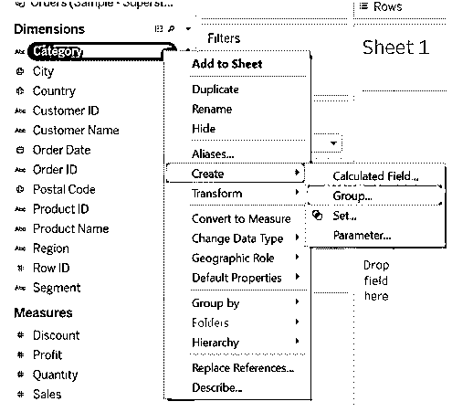

2.  从字段类别中选择选项，然后单击该组。我们有团体家具和办公用品。

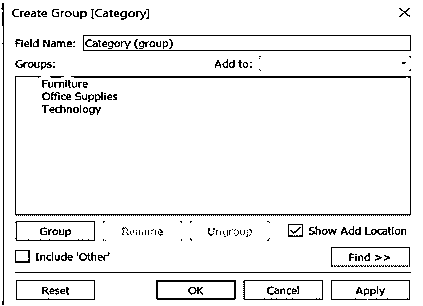

3.  已在维度字段中创建了组。

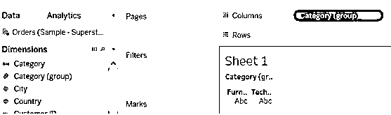

4.  我们可以将类别(组)添加到过滤器中，并可以看到组值。我们可以看到家具和办公用品供应商已经分组。

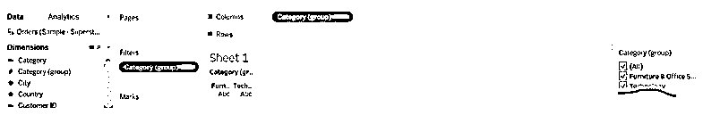

### Tableau 分组依据示例

1.  我们再次为城市维度创建了一个组。我们已经分组阿伯丁，阿比林，阿克伦城和随机选择的城市。要查看这些数据，我们需要将城市(组)拖到过滤器上。

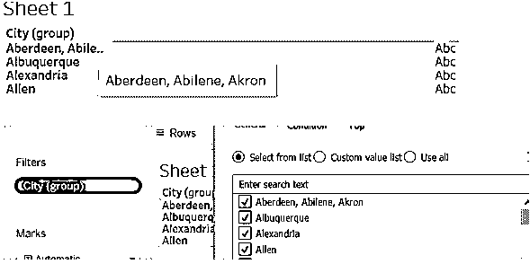

2.  我们还可以为维度字段创建一个组。创建的组将反映在尺寸字段中。
3.  我们已经为折扣创建了一个组，并且只选择了 0.1、0.2 和 0.3 以及最后的 0.149 值作为折扣。

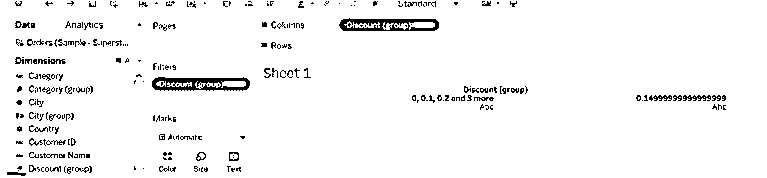

我们可以创建带有剩余选项或项目的组，并且我们可以在创建新组或添加一个或另一个组时包括这个创建的组。包含其他组将有助于我们突出数据的主要和次要点，或者显示结果的差异(组成员)。

### Tableau 组的工作方式

1.  转到类别组->右键单击->编辑组->标记包括其他

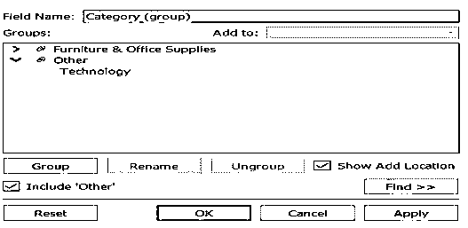

2.  我们可以在下图中观察到，其他什么也不是，但是 office 类别已经添加到组中(通过使用 include other choices)。

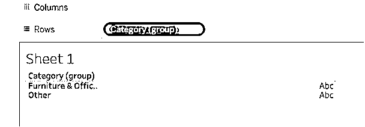

我们将看到类别组的利润和销售额，例如类别维度的每个衡量标准的执行情况。

1.  将“利润”拖到列，将“销售额”拖到行。
2.  将类别组拖到过滤器上。
3.  从“过滤器”窗口中选择“全部”选项。
4.  出于编辑目的，更改类别组的颜色(单击颜色->选择您选择的颜色)

您可以在下图中观察到数据是如何通过视图显示在 tableau 组中的。

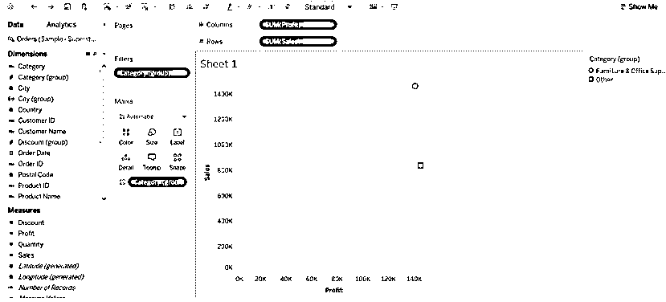

我们有“按数据分组”的编辑选项。编辑选项，我们可以根据自己的选择更改组名，添加和删除该字段的其他选项，创建一个新组。在组中进行更改时，我们需要始终使用编辑组选项。

1.  我们可以根据需要重新命名该组。我们要为国家(集团)执行这些任务。
2.  右击状态(组)->窗口将选项我们可以重命名它。您可以在下图中观察重命名是如何受到影响的。

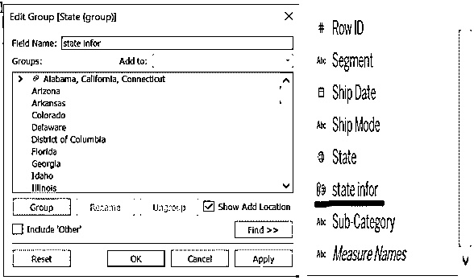

3.  或者我们可以用另一种方式重命名该组。
4.  右键单击组->单击重命名选项->命名它。

5.  我们可以在下图中观察到以另一种方式重命名的结果。

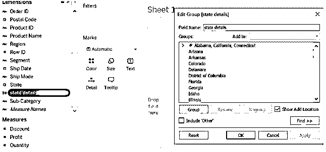

*   **我们可以通过“编辑群组”选项添加或删除群组成员。**

1.  转到要编辑的组。
2.  右键单击组->编辑组->单击组图标
3.  选择不想分组的成员–>单击取消分组。

您可以在下图中看到，阿克伦城已从群组中移除。

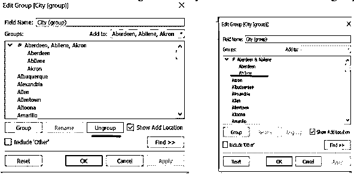

*   出于添加目的，请遵循向组添加成员的主要步骤。

选择成员->点击组选项。

*   我们可以根据自己的意愿给组上色，把组拖到颜色部分。

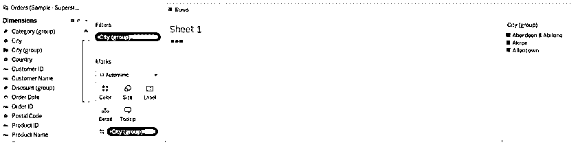

### 结论

我们已经了解了分组依据、应该如何进行分组、分组提供了哪些选择，以及这将如何帮助我们获得更详细的数据或数据比较。很容易对数据进行编辑，例如数据的颜色、重命名、大小或形状。分组将帮助我们发现数据在性能方面是如何增加和减少的。如果我们根据度量值创建分组，则结果分组将反映在维字段中。

### 推荐文章

这是一个 Tableau 组的指南。在这里，我们讨论如何在 Tableau 中完成 Group by 以及工作和示例。您也可以看看以下文章，了解更多信息–

1.  [Tableau Count Distinct](https://www.educba.com/tableau-count-distinct/)
2.  [Tableau 固定功能](https://www.educba.com/tableau-fixed-function/)
3.  [画面中的图例](https://www.educba.com/legend-in-tableau/)
4.  [Tableau 双轴](https://www.educba.com/tableau-dual-axis/)
5.  [窗口和表指南](https://www.educba.com/window-sum-tableau/)
6.  [操作顺序表](https://www.educba.com/tableau-order-of-operations/)
7.  [Tableau 用户组|如何创建？](https://www.educba.com/tableau-user-group/)

