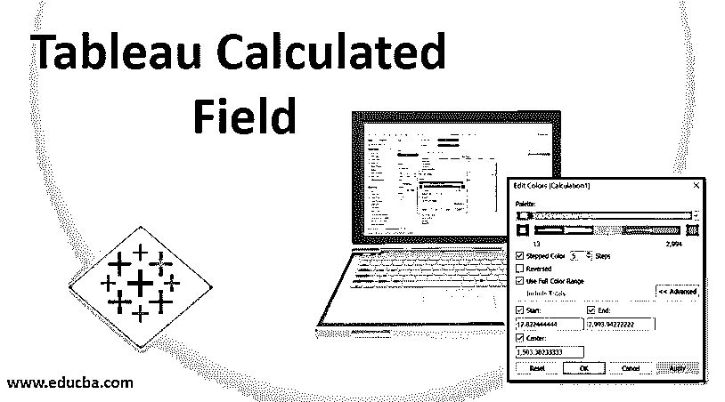
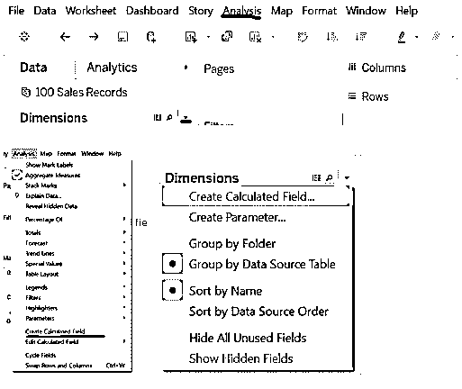
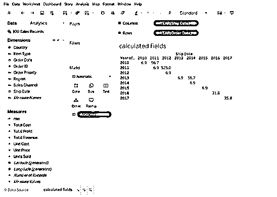
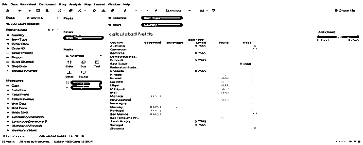
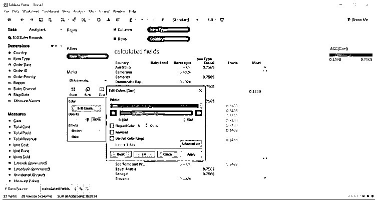
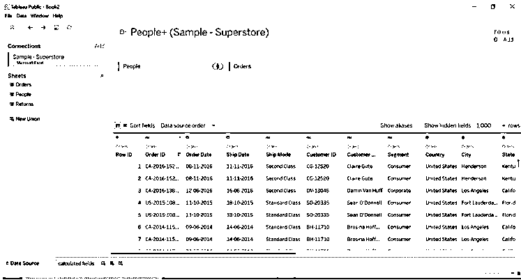
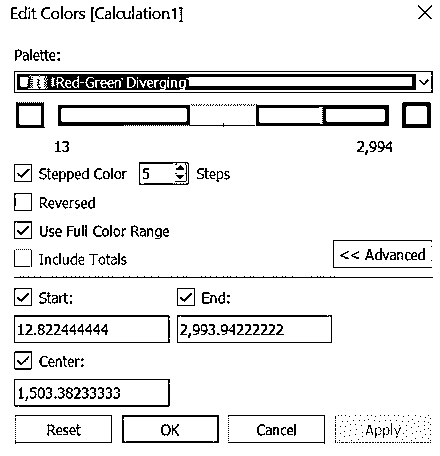
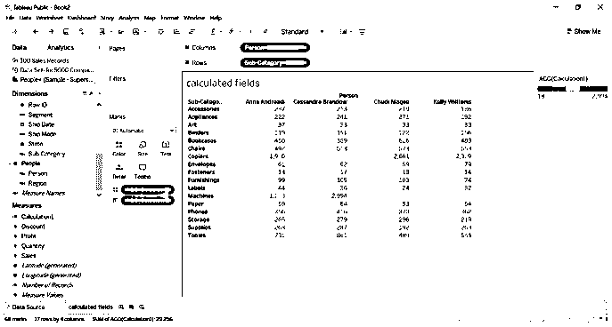
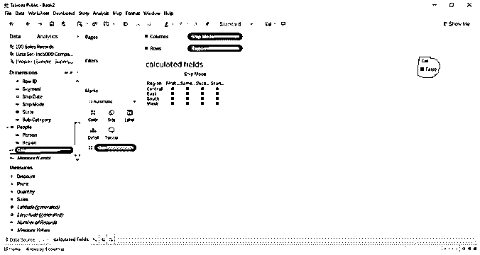

# Tableau 计算字段

> 原文：<https://www.educba.com/tableau-calculated-field/>

## Tableau 计算字段简介

Tableau 日期函数是非常有用的内置日期函数，如日、月、年、日期差、最大值、最小值和今天等。其由 Tableau 软件提供，并且使用户能够根据需要在日期和时间的上下文中操纵数据源，进一步允许用户对记录执行各种日期操作，以及创建复杂的日期表达式，这有助于年与年、月与月或周的数据分析。

**语法:**

<small>Hadoop、数据科学、统计学&其他</small>

Calculated field(value)

### Tableau 计算字段是如何工作的？

计算字段将对其他表字段中的值执行函数，或者计算用户输入的值。计算字段将在字段值计算期间执行查询操作。我们可以通过计算字段执行任何计算，我们可以创建 N 个计算字段。我们需要创建一个计算字段，给它命名，并输入我们要执行计算的字段值。如果我们从维度中获取计算字段值，则该字段将被添加到度量中，或者如果我们从度量中获取计算字段，则该字段将被添加到维度中。

### Tableau 计算字段的示例

下面是下面提到的 Tableau 计算字段的例子

#### 示例#1

我们可以通过单击分析或单击维度字段的底部箭头来创建计算字段。我们可以从两个选项中创建一个计算字段。

*   转到数据源选项，连接到以 excel、文本格式显示的数据库文件，或者可以连接到实时数据库或离线数据库。
*   打开计算字段，为计算字段命名，并根据要执行的计算进行编辑。
*   我们提取了 100 个销售记录文件，转到工作表并重命名(根据您的选择)。
*   我们将计算从订单日期到发货日期的最小单位成本。
*   MIN([单位成本])–我们已经创建了一个名为“计算字段”的 MIN，它是在“测量”字段中创建的。
*   将最小计算字段拖至文本格式选项，将 hip 日期拖至列，将订单日期拖至行。
*   我们可以看到项目从订单到发货日期之间的最小单位成本。

订单发货数据 2010 年的最低单位成本为 6.9，2011 年(订单日期)至 2012 年(发货日期)的最低单位成本为 525.0。

#### 实施例 2

我们将根据每个国家找到项目类型的收益值。

*   创建计算字段，将其命名为 Gain，并为其添加计算

SUM([Total Profit])/SUM([Total Cost])

*   将项目类型拖到列中，将国家拖到行中。
*   将增益(计算字段)拖动到文本格式选项。
*   将项目类型拖到筛选选项中，因为项目类型有多种选择，我们将对 3-4 种项目类型进行筛选。
*   拖动增益(计算字段)到颜色格式选项，将得到更直观的数据。

*   我们可以在上面的图像中看到，不同的颜色代表了增益的项目类型。例如，橙色的水果和棕色的肉类。我们可以编辑默认的颜色过滤器(点击颜色->选择编辑颜色->选择你想要的颜色)。
*   我们可以编辑颜色，我们选择了日出日落发散色板。值随着可视化中颜色的变化而变化。请参考下图编辑颜色。

#### 实施例 3

我们已经调出了样本超市数据库；对人员和订单表执行内部联接。

*   我们已经为 AVG 函数创建了一个计算字段。人员和子类别的平均销售计数(来自两个不同数据库的字段)。
*   AVG([销售])–已创建计算 1 字段中的数据。
*   将“人员”字段拖至列，将“子类别”拖至行。
*   将“计算 1”字段拖到“颜色和文本格式”选项中。
*   为销售的平均范围编辑颜色，这样会更容易更有效地理解结果。
*   **例如**–一个名为 Anna andreadi、子类别为 art 的人的平均销售额是 37。机器的平均计数为 1088(颜色也发生了变化)。

*   我们可以观察到，在上面的图像中，我们选择了开始，结束和中心值。我们可以根据自己的选择编辑该值。

#### 实施例 4

我们创建了一个具有折扣度量值的计算字段，该计算字段产生了维度。

*   我们已经为 ISNULL 函数创建了一个计算字段，如果值维度或度量值字段不包含任何值，ISNULL 的输出将显示为 True。
*   如果值维度或度量值字段包含值，ISNULL 的输出将显示为 False。
*   **语法**–is null([折扣])
*   将发货模式拖至列，将区域拖至行。
*   将 Cal(创建的计算字段)拖至 color。
*   结果显示为 False，因为折扣字段包含值，它不是空的。

### 结论

我们已经学习了 tableau 计算字段，使用计算字段的原因。创建和编辑计算字段所需的步骤。当我们进行计算时，字段是最好的处理方式。我们有多个选项可用于计算，如最小值、最大值、总和、比率等。

Tableau 提供了一个错误特性来验证我们用于计算的语法。为计算字段自动提供测量值和维度值。

### 推荐文章

这是 Tableau 计算字段的指南。在这里，我们讨论 Tableau 计算字段如何与示例一起工作。您也可以看看以下文章，了解更多信息–

1.  [画面中的图例](https://www.educba.com/legend-in-tableau/)
2.  [配置单元中的日期函数指南](https://www.educba.com/date-functions-in-hive/)
3.  [学习 PostgreSQL 日期函数](https://www.educba.com/postgresql-date-functions/)
4.  [窗口求和表完整指南](https://www.educba.com/window-sum-tableau/)
5.  [操作顺序表](https://www.educba.com/tableau-order-of-operations/)
6.  [Tableau 用户组|示例](https://www.educba.com/tableau-user-group/)

