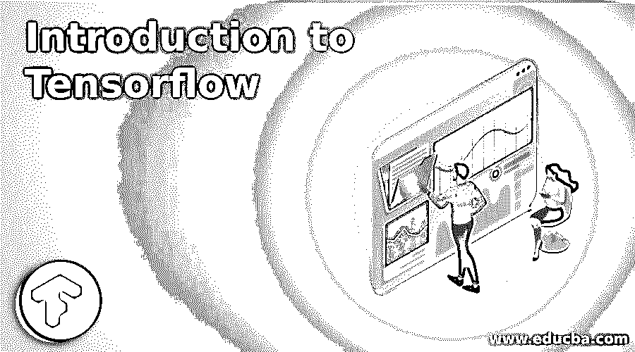
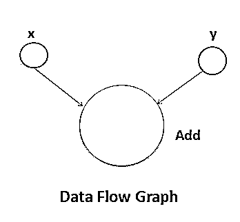

# 张量流简介

> 原文：<https://www.educba.com/introduction-to-tensorflow/>

## 张量流简介

TensorFlow 是最受欢迎的开源库之一，最初由 Google 开发，它使用数据流图执行数值计算。人工智能时代，TensorFlow 自带了对[机器和深度学习](https://www.educba.com/deep-learning-vs-machine-learning/)的强大支持。基于 Python 可以运行深度[神经网络](https://www.educba.com/what-is-neural-networks/)进行图像识别、文字嵌入、手写数字分类，以及创建各种序列模型。其灵活的架构允许跨各种平台轻松部署计算，如 CPU、GPU(图形处理单元 *)* 和服务器集群。TensorFlow 可用于创建算法来可视化对象，并训练机器识别对象。它还可以使用这些数据来理解大型数据集的模式和行为，并部署情感分析模型。随着机器学习在当今的广泛应用，许多组织都在使用 Tensorflow。

<small>Hadoop、数据科学、统计学&其他</small>

### 张量流的主要组件

在上面的部分中，我们已经学习了张量流的介绍；现在，我们继续讨论 TensorFlow 的主要组件。张量是张量流中的主要组成部分。它们被定义为多维数组或列表，这是 TensorFlow 语言的基本数据结构。任何被称为数据流图的流程图中的连接边都是张量。这些是多线性地图，可以是从向量空间到实数的任何东西。所以张量可以是标量，向量，或者矩阵。TensorFlow 程序通常分为组装图形的构造阶段和使用会话执行的执行阶段。

以下三个参数标识张量:

#### 1.军阶

张量中描述的维度单位称为秩。它确定了张量的维数。

#### 2.形状

行数和列数共同定义了张量的形状。

#### 3.类型

类型描述了分配给张量元素的数据类型。

对于构建张量，我们需要考虑构建一个 n 维数组，并对 n 维数组进行转换。张量流简介中的各个维度如下。

*   **一维张量:**

它是一个普通的数组结构，包含一组相同数据类型的值。

*   **二维张量:**

为了创建二维张量，使用阵列序列。

理解图形和会话的创建、管理张量和生成适当的输出是很重要的。在图形的帮助下，我们得到了指定张量之间数学计算的输出。图通过运行特定的子图只获取我们需要的值来节省计算，促进分布式计算，将工作分配给多个设备。还有，[很多常见的机器学习模型](https://www.educba.com/machine-learning-models/)被可视化为图形。

### 张量流的特征

我们讨论了张量流的介绍，现在我们将了解张量流的特征，如下所示:

*   与 Numpy 等其他库相比，使用 TensorFlow，图形的可视化变得更加容易。
*   TensorFlow 是一个开源库，在操作的模块化方面提供了灵活性。
*   可在 CPU 和 GPU 上轻松训练，用于分布式计算。
*   TensorFlow 提供并行神经网络训练，这使得模型在大规模系统上高效。
*   它有一个特征列，有助于将输入数据与模型联系起来。
*   提供了一套丰富的函数和类，允许用户从头开始定义模型。
*   [使用 TensorBoard](https://www.educba.com/tensorboard/) ，可以评估模型的不同表示，并在调试时进行必要的更改。
*   TensorFlow 将计算的定义与执行分开。

### 张量流的应用

TensorFlow 可以构建任何[类型的深度学习算法](https://www.educba.com/deep-learning-algorithms/)像 CNN、RNN、DBN、前馈神经网络、[自然语言处理](https://www.educba.com/what-is-natural-language-processing/)等。在引入 TensorFlow 时有几个编程元素，如常数、变量、占位符、会话等。它有着广泛的应用，下面提到了其中的一些。

*   语音识别系统
*   图像/视频识别
*   自动驾驶汽车
*   文本摘要
*   情感分析
*   用于搜索排序的深度神经网络
*   移动图像和视频处理
*   用于药物发现的大规模多任务网络。
*   用于实时翻译的光学字符识别

### 张量流的优缺点

由于我们已经学习了张量流的特征和介绍，现在我们将了解张量流的优点和缺点如下 **:**

#### 张量流的优势

*   TensorFlow 库附带了一套可视化工具 TensorBoard，用于更好的计算图形可视化。
*   用于复杂分析的开源库。
*   TensorFlow 支持多种客户端语言:JavaScript、Python、C++、Go、Java 和 Swift。
*   无缝性能、快速更新和频繁发布新功能的优势。
*   提供了一个很好的调试方法，因为它执行图的子部分，这有助于在边上引入和检索离散数据。
*   库可以部署在一系列硬件上(蜂窝设备、具有复杂设置的计算机)
*   集成大型分布式系统的高度并行神经网络。
*   TensorFlow 允许轻松共享训练好的模型。

### 张量流的缺点

*   TensorFlow 不提供符号循环，但有一个使用有限展开(分桶)的解决方法。
*   Windows 用户需要使用 python 包库 pip 安装 TensorFlow，因为它更适合 Linux 用户。
*   与竞争对手相比，在速度和使用率方面都有所欠缺。
*   目前，唯一支持的 GPU 是 NVIDIA 的。
*   唯一完整的语言支持是 Python，这是一个缺点，因为深度学习中其他语言的数量在增加。
*   虽然 TensorFlow 更强大，更适合深度学习，但不适合更简单的任务。

### 推荐文章

这是一个介绍张量流的指南。在这里，我们讨论了张量流的主要组成部分、特点、优点和缺点。您也可以阅读以下文章，了解更多信息——

1.  [tensorlow vs 咖啡](https://www.educba.com/tensorflow-vs-caffe/)
2.  [Tensorflow vs Pytorch](https://www.educba.com/tensorflow-vs-pytorch/)
3.  [Python vs Groovy](https://www.educba.com/python-vs-groovy/)
4.  [JavaScript vs VBScript](https://www.educba.com/javascript-vs-vbscript/)

