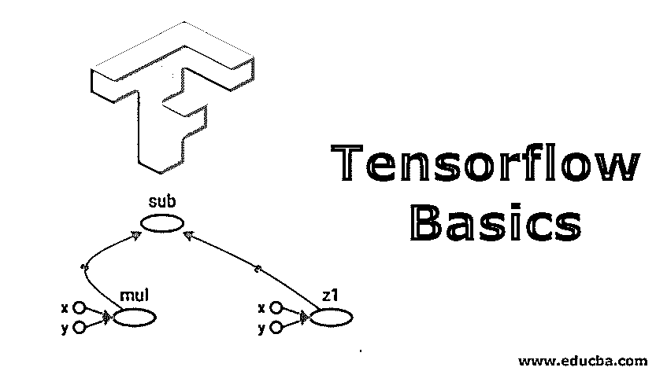
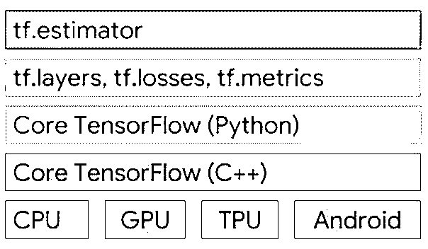
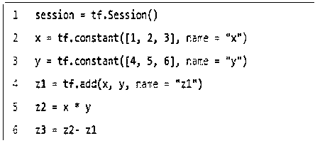
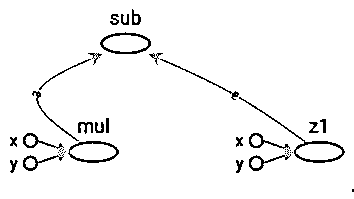

# Tensorflow Basics

> 原文：<https://www.educba.com/tensorflow-basics/>

## 张量流简介

Tensorflow 是开源软件和库。它是由谷歌 2010 深度学习人工智能研究团队建立的谷歌大脑团队开发的。在 Apache2.0 开源-2015 下发布之后，谷歌一直在内部使用它。在本主题中，我们将学习张量流基础知识。

Tensorflow 是 google brain 的第二代系统。版本 1 于 2017 年 2 月 11 日发布。Tensorflow 1.0 现在有了 Python API，1.0 版本还增加了 java 和 GO 语言的 API。张量流运算在多维数据阵列(称为张量)上执行的神经网络。它适用于张量。它是一个用于深度学习的软件库，主要用于使用数据流图进行数值计算。

<small>Hadoop、数据科学、统计学&其他</small>

### 什么是 Tensorflow 基础？

张量是描述向量、标量和其他张量之间的线性关系的对象。张量不过是多维数组。Tensorflow 支持根据您的需求编写代码，并提供不同类型的工具。比如我们可以用 C++写代码，可以从 python 调用 C++代码。或者我们可以写 python 代码，用 C++调用。

它支持的最底层语言首先是 Python 语言，其次是 C++语言。你可以在你的舒适区用任何语言写。它有一个不同的数学库的集合，有助于轻松地创建数学函数。

它还提供对 CPU、GPU、TPU 等处理的支持，也可以在 android 手机上运行。

*   **Tf.layers:** tf.layers 用于方法抽象，以便您可以自定义神经网络的层。
*   Tf.estimator:tensor flow 中最常用的 API 是 TF . estimator，它有助于创建、训练和测试您的模型。

### 张量流的安装

*   首先，检查您的 pip 版本；如果不是最新的，那么运行以下命令来升级 pip。

**代码:**

`pip install –upgrade pip`

*   运行下面的代码来安装 Tensorflow 的简单版本。

**代码:**

`pip install tensorflow / conda install tensorflow (Anaconda)`

*   这将使用 GPU 支持的配置安装 Tensorflow。

**代码:**

`pip install Tensorflow-gpu`

### 通过 3 行代码使用分类器的 tf.estimator 示例

**代码:**

`Import tensorflow as tf
classifier = tf.estimator.LinearClassifier(feature_columns)
classifier.train(input_fn=train_input_function, steps=2000)
predictions = classifier.predict(input_fn=predict_input_function)`

### 张量流的基本数据类型

Tensorflow 框架(Tensors)中的基本数据类型。

下图显示了张量的每个维度:

*   **标量–**O 维数组
*   **向量—**一维数组
*   **矩阵—**二维数组
*   **3D 张量–**3 维数组
*   **N–D 张量–**N 维数组

### 常数张量

下面给出的是常数张量:

#### 1.变量

tf。变量类，用于在 TensorFlow 中创建变量，调用 tf.get_variable 函数。

**初始化变量**

要初始化变量，通过调用 TF . global _ variables _ initializer，我们可以初始化所有的变量。

**变量和数学表达式的简单例子**

正常方式:

a = 3.0，b = 8*a +10

Tensorflow way:

c = tf。变量(tf.add (tf.multiply (X，a)，b)

#### 2.图表

我们用 TensorFlow 编写的代码中的每一行都被转换成底层图表。

**举例:**

*   **节点:**表示数学运算。
*   **Edges:** 表示多维数组(Tensors)并显示它们之间如何通信。

#### 3\. Tensorflow 2.0

*   在 Tensorflow 的第二个版本中，他们专注于使 API 更简单易用。
*   API 组件可以更好地与 Keras 集成；默认情况下，激活急切执行模式。
*   Eager 模式:Eager execution 是一个 run 接口，其中操作被立即执行，因为它们被称为 Python。
*   我们可以用渴望模式代替图形模式。我们可以计算我们需要计算的，并且我们可以马上得到结果。这会让 Tensorflow 变得像 Pytorch 一样简单。
*   专注于消除重复的 API。

#### 4\. Keras

*   [Tensorflow 提供了](https://www.educba.com/what-is-tensorflow/)一个高级别的 API，用于构建和训练深度学习模型。TensorFlow 中没有包含这一点，但在最新版本中，Keras 已包含在 Tensorflow 2.0 中。
*   用户友好:Keras 为常见用例提供了一个简单、一致的界面。
*   模块化和可组合:Keras 模型是通过将积木连接在一起而制成的。
*   易于扩展:创建或更新新的层，指标，损失函数。
*   使用 tf.keras 来使用 keras 模型。

#### 5\. Tensorflow Lite

*   2017 年，谷歌公布了专门为移动开发打造的软件 Tensorflow Lite。
*   Tensorflow Lite (TFLite)是一个用于移动设备推理的轻量级解决方案。
*   我们也可以通过创建 C++ API 将它用于 IOS 和 Android，我们也可以为 Android 开发人员使用 Java 包装类。

### Tensorflow 支持的算法列表

下面是提到的清单:

#### 1.用于回归

*   线性回归(tf .估计器.线性回归)
*   助推树回归(tf.estimator .助推树回归器)

#### 2.用于分类

*   分类(tf .估计器.线性分类器)
*   深度学习组合(TF . estimator . DNNLinearCombinedClassifier)
*   增强树分类器(TF . estimator . Boosted Tree Classifier)

### 张量流的特征

下面是提到的特征:

*   Tensorflow 可以有效地处理涉及多维数组(张量)的不同类型的数学表达式。
*   它还为深度学习神经网络和其他机器学习概念提供支持。
*   Tensorflow 可以在多个 CPU 和 GPU 上运行。
*   它还提供自己的处理能力，即张量处理单元。

### 张量处理单元(TPU)

*   谷歌宣布了其张量处理单元(TPU)，这是一种专用集成电路(硬件芯片)，专为机器学习而建，为 Tensorflow 量身定制。
*   2017 年，谷歌宣布了 Tensorflow 的第二个版本以及谷歌云中 TPU 的可用性。
*   TPU 是一个可编程的人工智能加速器，为使用或运行模型而构建。谷歌在他们的数据中心运行 TPU 已经一年多了。

### 边缘 TPU

*   Edge TPU 是谷歌制造的一款芯片，用于在智能手机等小型计算设备上设计和运行 TensorFlow Lite 机器学习(ML)模型。
*   计算大型数据集的高可扩展性。
*   它还可以在实况模型中训练和服务模型。不需要重写代码。

### 结论–张量流基础

Tensorflow 是一个非常常用的深度学习库。这主要用于创建神经网络，也用于初创公司和大公司。如上所见，Google 也在内部使用 TensorFlow 它仍然被用在几乎所有的产品中，比如 Gmail 和 google 搜索引擎。

### 推荐文章

这是一个张量流基础知识的指南。这里我们讨论 tensorflow 的安装以及 tensorflow 支持的功能和算法列表。您也可以阅读以下文章，了解更多信息——

1.  [什么是张量流？](https://www.educba.com/what-is-tensorflow/)
2.  [tensorlow 替代品](https://www.educba.com/tensorflow-alternatives/)
3.  [tensor flow 简介](https://www.educba.com/introduction-to-tensorflow/)
4.  [如何安装 TensorFlow](https://www.educba.com/install-tensorflow/)

