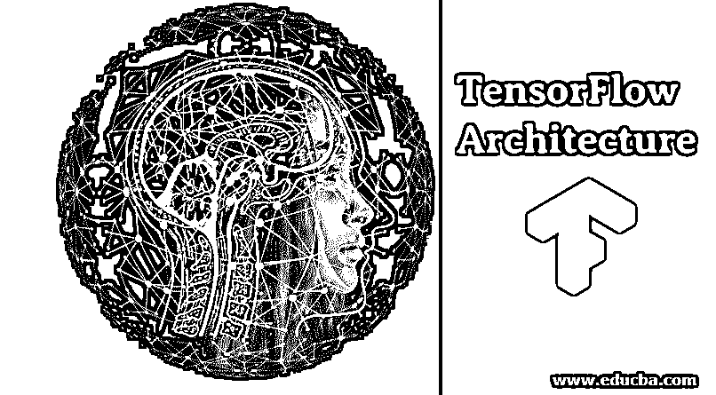
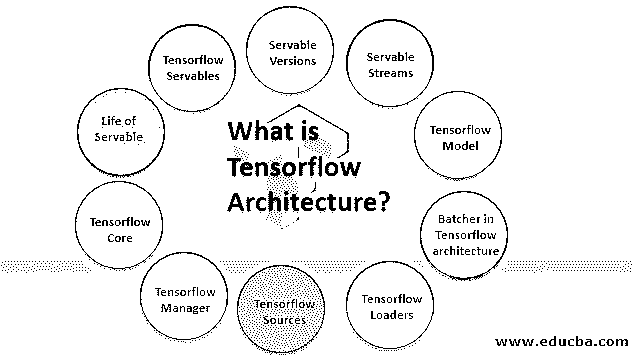
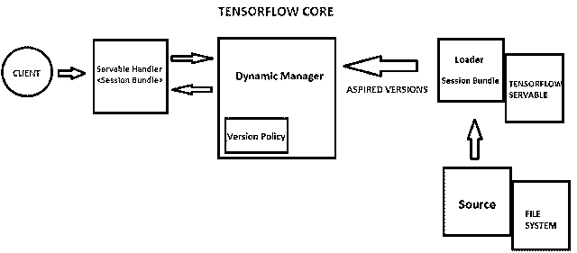

# tensorflow 体系结构

> 原文：<https://www.educba.com/tensorflow-architecture/>

## 张量流简介

在本文中，我们将看到一个关于 TensorFlow 架构的概述。TensorFlow 是一个跨平台的库，有一些常见的概念，如操作、会话和计算图。TensorFlow 服务使新算法和实验易于部署，同时保留相同的数据库架构和 API。

### 什么是 Tensorflow 架构？

<small>Hadoop、数据科学、统计学&其他</small>

Tensorflow 是一个常用的深度学习库，由致力于人工智能的谷歌大脑团队构建。它的开发是因为它可以在多个 CPU、GPU 上使用，可以在移动设备上运行，并支持不同的包装类，如 python、C++或 Java 和张量，它们描述了向量、标量和其他张量之间的线性关系。

张量不过是多维数组。为了理解 TensorFlow 的架构和特性，首先，我们需要理解一些术语。

1.  张量流服务
2.  可服务版本
3.  可服务流
4.  Tensorflow Model
5.  Tensorflow Loaders
6.  唐斯多夫之源
7.  Tensorflow Manager
8.  Tensorflow Core
9.  可服务的生活
10.  张量流架构中的屠夫

#### 1.张量流服务

*   Tensorflow Servables 是主要用于执行计算的常见对象。TensorFlow servable 的大小非常灵活。Servables 是 TensorFlow 服务中的中心未完成单元。
*   一个可服务单元可以包含任何东西，就像它可以包含元组、查找表一样。可服务对象可以是任何类型和任何接口。这些特性非常灵活，很容易在未来进行改进，比如异步操作模式、流式结果和实验性 API。

#### 2.可服务版本

*   可服务版本用于维护 TensorFlow 可服务版本。它可以处理一个或多个版本的 Servables。它可以帮助配置新的算法，处理权重，并可以进行其他更改，可以加载数据。
*   它还可以更改和管理版本，一次启用多个可服务版本。

#### 3.可服务流

它是 Servables 不同版本的集合。它以版本递增的顺序存储它。

#### 4\. Tensorflow Models

*   TensorFlow 模型可以包含一个或多个 TensorFlow Servables。它主要用于包含多个算法的机器学习任务，这些算法根据模型、查找表、度量和表嵌入包含不同的权重。
*   它可以用许多不同的方式来提供，从而有不同的方式来提供查找表。

#### 5\. Tensorflow Loaders

*   Tensorflow loader 是一个管理 TensorFlow Servables 生命周期的 API。它为一些学习算法提供了一个公共基础设施。
*   TensorFlow 加载器的主要用途是使用标准化的加载器 API 加载和卸载 Servables。

#### 6.唐斯多夫之源

*   源代码是作为一个插件模块。Tensorflow source 执行 servable 的基本处理，如查找 servable，根据请求提供 servable。
*   每个引用一次可以提供一个或多个可服务的流。每个源提供一个加载器实例来处理流的版本。并且每个可服务流都是基于版本加载的。
*   源代码有不同的状态，可以被不同的版本和多个 Servables 共享。也可以处理版本之间更新或更改。

#### 7.张量流管理器

*   Tensorflow manager 处理 servable 的端到端生命周期。
*   加载服务，服务服务，卸载服务。
*   管理器从所有可服务的源获得响应，并监控它的所有版本。管理员也可以拒绝或推迟上传。
*   GetServableHandle()函数提供了一个帮助处理 TensorFlow Servables 管理事务的接口。

#### 8\. Tensorflow Core

Tensorflow 核心包含:

*   生命周期指标。
*   Tensorflow 服务核心以 servables 和 loaders 为对象。

#### 9.一个仆人的生活

整个过程解释了如何使用 servable 以及 servable 的整个生命周期:

*   不同可服务版本的源代码创建加载程序。客户端请求管理器和管理器将加载器期望的版本、加载和服务发送回客户端。
*   Loader 包含可用于加载 Servables 的元数据。回调用于通知管理器关于可服务的源代码版本。管理器遵循一个版本策略，该策略有助于配置和决定下一步需要采取的操作。
*   经理还检查装货人的安全；如果它是安全的，它将向加载程序提供必要的资源，并允许加载新版本。经理根据客户要求提供可分割的。在管理器返回访问 servable 的句柄后，它将显式地请求一个特定的版本或指向最新的版本。
*   动态管理器处理可服务版本，应用版本策略并决定需要加载的版本或最新版本。动态管理器为加载程序分配内存。加载器启动张量流图并更新张量流图的权重。
*   当客户机请求 servable 并检查客户机的版本时，动态管理器返回带有所请求的 Servable 版本的处理程序。

#### 10.张量流架构中的批处理程序

*   批处理是将多个请求处理成单个请求的过程。
*   使用这个程序，我们可以降低执行推理的成本，特别是像 GPU、TPU 这样的硬件加速。
*   Tensorflow servable 包含一个批处理器小部件，通过使用这个小部件，客户端可以轻松地将多个特定的推理请求批处理成一个批处理请求。这样他们就可以有效地运行这个程序。

### 结论–张量流架构

Tensorflow 架构代表了一个分散的系统。它显示了不同的组件如何在一个分散的系统中工作和发挥作用。服务于客户端的请求，并使用批处理多个操作并行。TensorFlow 架构的一些最佳特性包括批处理操作、硬件加速、动态管理器选项、加载器、源和可服务流。

### 推荐文章

这是一个张量流架构的指南。这里我们讨论什么是 TensorFlow 以及 TensorFlow 架构中的一些最佳特性。您也可以浏览我们推荐的其他文章，了解更多信息——

1.  [特征张量流简介](https://www.educba.com/introduction-to-tensorflow/)
2.  [TensorFlow vs Spark |前 5 名对比](https://www.educba.com/tensorflow-vs-spark/)
3.  [Theano vs tensor flow–顶部差异](https://www.educba.com/theano-vs-tensorflow/)
4.  [TensorFlow 备选方案|前 11 名](https://www.educba.com/tensorflow-alternatives/)
5.  [张量流模型|张量流前 5 名模型](https://www.educba.com/tensorflow-models/)
6.  [tensor flow 概述及不同版本](https://www.educba.com/tensorflow-versions/)
7.  [Mxnet vs TensorFlow |顶级差异](https://www.educba.com/mxnet-vs-tensorflow/)

