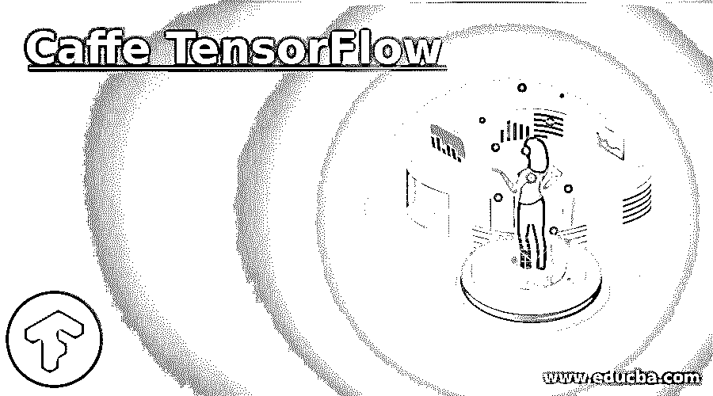

# tensorflow 咖啡

> 原文：<https://www.educba.com/caffe-tensorflow/>

## 咖啡张量流简介

Caffe TensorFlow 是一个相对较新的深度学习库，用户可以在 TensorFlow 部署中使用 Caffe 模型。因此，它在灵活性、易用性、速度和时间方面为用户提供了优势。用户不必在 TensorFlow 框架中编写他的模型。它可以在 Github 上免费获得，并且是开源的。可以分叉，用户可以贡献。它不需要安装咖啡厅。如果安装了 PyCaffe 实用程序并设置了相应的环境路径变量，也可以使用它。

### Caffe TensorFlow 是如何工作的？

它是一个开源的 GitHub 存储库，使用 prototxt 文件作为输入参数，并将其转换为 python 文件。因此，有了这个，Caffe 模型可以很容易地部署在 TensorFlow 环境中。通过使用用 Python 编写的验证器文件，可以很容易地验证预先训练的基线模型。对于较旧的 Caffe 模型，必须使用 upgrade_net_proto_text 和 upgrade_net_proto_binary 文件，首先将它们升级到 Caffe 支持的最新版本，然后按照内联提到的后续步骤将其部署到 TensorFlow 环境。它有一个限制，即用户需要有 Python 2.7 环境才能访问它。此外，不能同时调用 Caffe 和 TensorFlow 模型。因此，遵循两个阶段的过程。首先，使用转换器文件提取并转换参数，然后在最后一个阶段将其输入张量流。此外，用户的边界值和填充必须注意，因为它在 Caffe 和 TensorFlow 中的处理方式不同。

<small>Hadoop、数据科学、统计学&其他</small>

以下步骤描述了用户如何在他/她的本地机器上使用上述存储库。

1.  要安装 Caffe-TensorFlow，请使用带有存储库路径的 git clone 命令将其映射到您的本地文件夹。
2.  它默认使用 TensorFlow GPU 环境，消耗更多内存。为了避免陷入这种情况，请卸载默认环境并安装 TensorFlow CPU。
3.  使用 python 可执行命令和 convert.py 文件将 Caffe 模型转换为 TensorFlow。它将采用详细的参数，如 Caffe 模型路径、prototxt 文件路径、存储权重和其他与模型相关的参数的输出路径、转换后的代码路径和一个独立的输出路径，如果执行的命令成功，将生成一个 pb 文件。这个文件存储了模型权重和相应的架构。
4.  正确执行上述步骤后，用户也可以重新安装 TensorFlow GPU。这为用户提供了更快运行深度神经网络模型架构的优势。因此，用户可以更快地验证模型。

当 Caffe 模型不具有定制层时，即，当模型具有定制层并且必须被转换成张量流时，用户实现的层，上述方法是有用的。

**用户可以遵循以下步骤:**

1.  可以使用 GitHub 上提供的一个组合 python 文件将模型权重组合成一个文件。其中的关联权重可以加载到用户的张量流计算图中。
2.  张量流和 Caffe 模型中使用的复杂层的排序是不同的。例如，对于张量流和 Caffe，LSTM 门的级联排序不同。因此，用户需要更深入地查看两个框架的源代码，这是开源的。

**用户可以容易地使用的潜在的基本的先上方法如下:**

1.  Caffe 模型权重可以导出到 NumPy n 维矩阵中。
2.  可以为 Caffe 模型的初始 N 层运行简单的模型示例。相应的输出可以存储在平面文件中。
3.  用户可以将上述权重加载到他/她的张量流计算图中。
4.  对于张量流计算图，可以重复步骤 2。
5.  相应的输出可以与存储在平面文件中的输出进行比较。
6.  如果输出不匹配，那么用户可以检查上述步骤是否正确执行。
7.  n 的值可以在每次迭代后递增，并且对其更新后的值重复上述步骤。

上述过程虽然在计算上和存储上是昂贵的，但可以证明是非常有效的，因为它遵循一种交叉验证策略，其中用户可以设置评估度量，例如，平均差异以确认在 Caffe 环境中的初始模型与在 TensorFlow 中的最终模型。如果平均差异最小，则无论部署环境是 TensorFlow 还是 Caffe，该模型都会给出准确的结果。在卷积网络上使用上述方法，可以实现 0.001 的平均差，而在双 LSTM 上使用时，可以实现 0.01 的平均差。

### 咖啡张量流的好处

Caffe 模型存储在一个名为 Caffe Model Zoo 的存储库中。研究人员、学者、科学家、学生等都可以访问该网站。世界各地。与之相关联的相应模型可以很容易地转换成 TensorFlow。这使得它的计算速度更快，更便宜，更少的内存密集等。此外，它增加了用户的灵活性和使用，因为用户不必从头开始在 TensorFlow 中实现相同的 Caffe 模型。它还被用于训练 ImageNet 模型，具有相当高的精确度。它可以用于图像分类、语音处理、自然语言处理、检测面部标志等。卷积网络，LSTM，双 LSTM 模型等。被使用。

### 结论

Caffe-TensorFlow 模型在所有行业领域都有应用，因为这两种流行的深度学习框架都需要模型部署。然而，用户在 Caffe 中开发模型并在 TensorFlow 中部署时，需要警惕其局限性并克服这些局限性。

### 推荐文章

这是咖啡张量流的指南。在这里，我们讨论 Caffe TensorFlow 的介绍，以及它如何详细地与各个步骤和好处一起工作。您也可以浏览我们的其他相关文章，了解更多信息——

1.  [tensor flow 简介](https://www.educba.com/introduction-to-tensorflow/)
2.  [tensorlow vs 咖啡](https://www.educba.com/tensorflow-vs-caffe/)
3.  [用 TensorFlow 进行深度学习](https://www.educba.com/deep-learning-with-tensorflow/)
4.  [TensorFlow RNN](https://www.educba.com/tensorflow-rnn/)

