# TensorFlow RNN

> 原文：<https://www.educba.com/tensorflow-rnn/>

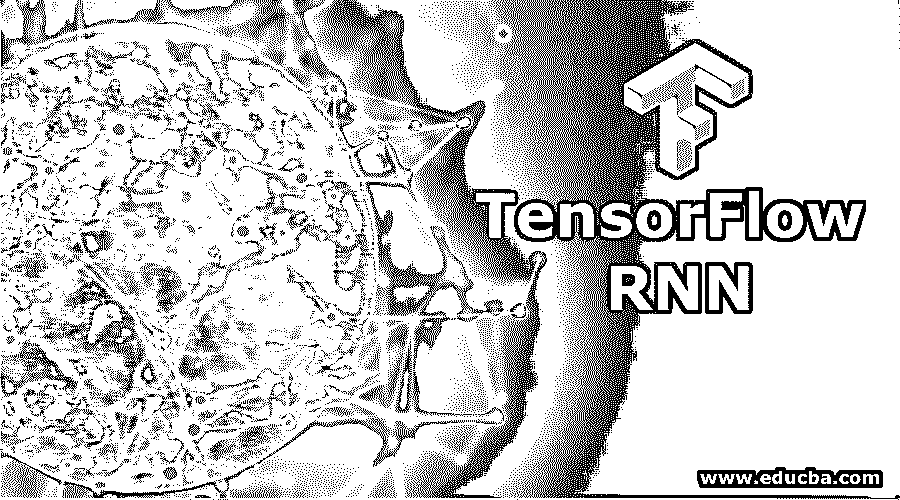

## 张量流 RNN 简介

张量流 RNN 或者更确切地说 RNN 代表递归神经网络，这些[种神经网络](https://www.educba.com/what-is-neural-networks/)以记住前一步的输出并将其用作下一步的输入而闻名。在其他神经网络中，隐藏层的输入和输出是相互独立的。然而，在 RNN 的情况下，它包含一个存储器，帮助保存输出并将其作为下一步的输入进行处理，这种现象是使用 RNN 神经网络的单个隐藏层实现的。

### RNN 是如何在 TensorFlow 中工作的？

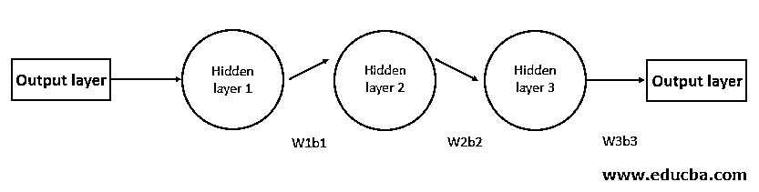

<small>Hadoop、数据科学、统计学&其他</small>

上图是具有 3 个不同隐藏层的神经网络的表示，每一层都有其单独的权重(w)和偏差(b ),例如我们可以看到 w1、w2、w3 是权重，b1、b2 和 b3 是偏差。对于每个隐藏层，所有的权重和偏差都是彼此独立的，因此对于这个网络来说，记住特定的状态是很难解决这种分布式权重和偏差问题并记住状态的，因此使用 RNN。

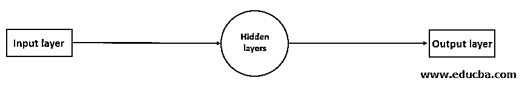

在上图中，有一个具有输入层和输出层的 RNN 神经网络，在它们之间有多个隐藏层。因此，RNN 所做的就是通过计算所有隐藏层的平均权重和平均值来编译所有隐藏层的所有单独的激活函数，并创建这个单层来帮助记忆先前的状态并降低网络的复杂性。

### RNN in TensorFlow

RNN 一般用于两种情况，即解决时间序列问题或解决自然语言处理问题。因此，在下面 TensorFlow 中 RNN 的实现中，我们将了解 LSTM(长短期记忆)

让我们从进口开始。

我们从 TensorFlow .keras.models 和 TensorFlow 导入了 TensorFlow 和序列模型。Keras.layers 我们导入了密集层、下降层和 LSTM 层来构建我们的模型。

因此，我们将使用顺序模型，并使用密集层、漏失层和 LSTM 层来构建模型。在这里，我们使用由 [TensorFlow 库](https://www.educba.com/what-is-tensorflow/)提供的 inbuild 数据集。

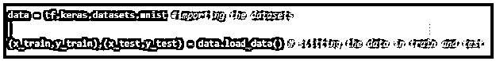

由于数据是图像的集合，所以我们需要将数据展平以获得尺寸和坐标(这是数据预处理)

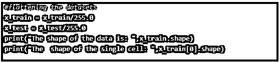

数据的形状如下图所示，我们可以看到它由 60000 张 28×28 大小的图片组成。

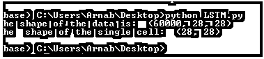

### 定义模型的结构

该模型的结构包括两个 LSTM 层和两个致密层；我们使用 relu(校正线性单位)作为两个 LSTM 和一个密集层的激活函数。我们将使用 SoftMax 作为最后一层(密集层)的激活函数。

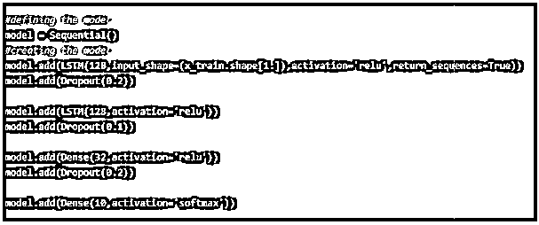

**优化**

我们将使用 Adam optimizer 来优化模型。

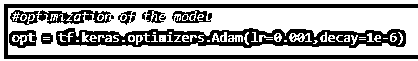

**编译**

在编译时，我们使用稀疏分类交叉熵矩阵作为损失函数来计算损失。

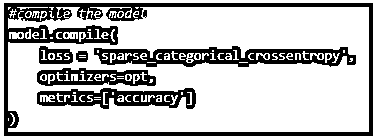

一旦模型建立，我们现在将使用 3 个时期来拟合模型。

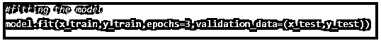

**最终训练好的模型**

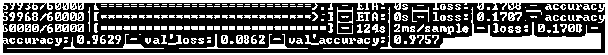

在最终训练好的模型中，我们可以看到下面。

**准确率评分:** 97 %

**损失:** 0.08%

### 张量流中 RNN 的优缺点

下面给出的是 RNN 的优点和缺点:

#### 优势

*   由于它能记住特定时间段的信息，这种神经网络在设计聊天机器人和进行时间序列分析时非常有用。
*   这些神经网络可以与 CNN(卷积神经网络)等其他神经网络结合使用，以扩展性能和有效性。
*   TensorFlow 中的 RNN 是一个非常强大的工具，可以用来设计或原型化新类型的神经网络，如(LSTM)，因为 Keras(它是 TensorFlow 库的包装器)有一个包(tf。Keras.layers.RNN)，它完成所有的工作，只需要用户定义每一步的数学逻辑。
*   此外，由于内置了 Keras.layers.RNN、tf.keras.layers.LSTM、tf.keras.layers.GRU 等功能，TensorFlow 中的 RNN 易于使用
*   张量流中的 RNN 是高度可定制的，我们可以使用 RNN 来创建和实现我们自己的神经网络。

#### 不足之处

*   由于 RNN 是记忆序列的有用神经网络，如果我们使用 relu 或 tanh 作为激活函数，它不能处理很长的序列。
*   训练一只 RNN 需要很多资源，训练一只 RNN 也很困难。因此，根据数据的大小，在 GPU 而不是 CPU 上训练 RNN 总是明智的。

### 结论

在本文中，我们介绍了 RNN 的基础知识以及如何在 TensorFlow 中实现 RNN。RNN 可以与其他神经网络结合使用，以设计更多不同种类的神经网络。由于其记忆因素，它充当了开发聊天机器人的基本垫脚石。

### 推荐文章

这是 RNN 张量流的指南。这里我们讨论 RNN 是如何在张量流中工作的？优点和缺点。您也可以看看以下文章，了解更多信息–

1.  [tensor flow 简介](https://www.educba.com/introduction-to-tensorflow/)
2.  [tensorlow vs 咖啡](https://www.educba.com/tensorflow-vs-caffe/)
3.  [递归神经网络(RNN)](https://www.educba.com/recurrent-neural-networks-rnn/)
4.  [超参数机器学习](https://www.educba.com/hyperparameter-machine-learning/)
5.  [了解不同的 TensorFlow 版本](https://www.educba.com/tensorflow-versions/)
6.  [TensorFlow 调试|如何工作？](https://www.educba.com/tensorflow-debugging/)

