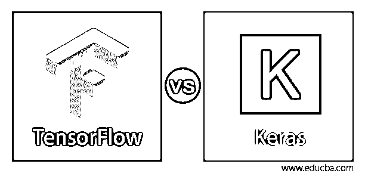

# TensorFlow vs Keras

> 原文：<https://www.educba.com/tensorflow-vs-keras/>

## TensorFlow 与 Keras 之间的差异

Tensorflow 是最著名的用于开发深度学习模型的库。它有着丰富多彩的文化。Tensorflow 足以应对提交的广泛流行以及 TensorFlow Github 存储库上的分叉数量。但是使用 TensorFlow 就没那么容易了。另一方面，Keras 是基于 TensorFlow 的高级 API。与 Tensorflow 相比，它使用起来更简单。当 Keras 安装在 Tensorflow 的顶部时，两者有何不同？如果 Keras 更加用户友好，我为什么要使用 Tensorflow 进行更深入的学习模型呢？以下几点将阐明选择哪一个。

### Keras 是什么？

Keras 是一个高级的深度学习 Python 库，通常用于创建神经网络，以解决数据科学家面临的复杂挑战。更高级别的 API 意味着 Keras 可以用作前端，而 ano 或 Tensor-flow 可以用作后端。在实现深度神经网络时，Keras 促进了数据科学家的研究。它以其广泛、易于理解的 API 而广受欢迎。文档对每个人来说都是非常清晰的开始。另一件事是可以使用更高级别的 API。这意味着它可以作为张量流、Theano 等的接口。

<small>Hadoop、数据科学、统计学&其他</small>

### What is Tensorflow?

如今，谷歌的 TensorFlow 是世界闻名的深度计算库。谷歌用于改善搜索引擎、翻译、字幕或推荐的产品在其所有产品中都使用了机器学习。谷歌不仅有数据；它拥有世界上最大的计算机，这意味着它是为测量张量流而建造的。TensorFlow 是一个谷歌大脑项目库，旨在加速机器学习和对深度神经网络的研究。它被设计成可以在几个 CPU 和 GPU 上运行，它有几个包装器，使用几种语言，如 C++、Python 或 Java。

### TensorFlow 与 Keras 的面对面比较(信息图)

以下是 TensorFlow 与 Keras 之间的 7 大差异:

### TensorFlow 与 Keras 的主要区别

张量流与 Keras 之间的主要区别如下:

*   Keras 是运行在 TensorFlow 上的高级 API。由于其简单的可用性和语法的简洁性，它得到了推广，这使得快速开发成为可能。
*   Keras 的性能相对较慢，而 Tensorflow 提供了类似的快速高效的速度。
*   喀拉斯的建筑很朴素。它更容易阅读和简短。另一方面，TensorFlow 并不容易使用，尽管它提供了 Keras 作为一个方便工作的系统。
*   对于 keras 来说，简单网络的调试通常要简单得多。然而，Tensorflow 的调试非常困难。
*   Keras 通常用作小型数据集的较慢比较。另一方面，TensorFlow 用于需要快速实现的高性能模型和大型数据集。

### TensorFlow 与 Keras 对比表

我们来讨论一下 TensorFlow 与 Keras 的顶级对比:

| **TensorFlow** | **Keras** |
| Tensorflow 是一个底层架构 API。 | Keras 是一个高级架构 API。 |
| TensorFlow 相对来说不太容易使用。 | 与 TensorFlow 相比，它更加用户友好和易于使用。 |
| 无线电原型在 Tensorflow 中不可行。 | 在 Keras 中，无线电原型意味着构建简单或复杂的神经网络可以在几分钟内完成。 |
| 与 Keras 相比，TensorFlow 提供了更高级的操作。 | Keras 为构建深度学习模型提供了各种通用功能。 |
| 张量流的架构很复杂。 | Keras 的架构很简单。更容易理解。 |
| Tensorflow 中调试比较困难。 | Keras 中的调试更容易。 |
| TensorFlow 用于需要快速实施的高性能模型和大型数据集。 | Keras 的数据集很小。 |

在这两个系统中，有许多变体。Keras 是一个开源库，用于机器学习过程中的许多不同任务，而 TensorFlow 是一个开源库。TensorFlow 提供高级和低级 API，Keras 只提供高级 API。Tensorflow 强大的执行能力使得在灵活性方面通过直观的调试进行即时迭代成为可能。因此，所有的框架都促进了高级 API 模型的创建和训练。Keras 有一个 Python 设计，比 TensorFlow 好用得多。

### 推荐文章

这是一个关于 TensorFlow 和 Keras 之间最大差异的指南。在这里，我们还讨论了 TensorFlow 与 Keras 板的关键差异，并提供了信息图表和比较表。您也可以看看以下文章，了解更多信息–

1.  [TensorFlow RNN](https://www.educba.com/tensorflow-rnn/)
2.  [tensorlow vs 咖啡](https://www.educba.com/tensorflow-vs-caffe/)
3.  [TensorFlow vs Spark](https://www.educba.com/tensorflow-vs-spark/)
4.  [张量低图像分类](https://www.educba.com/tensorflow-image-classification/)

