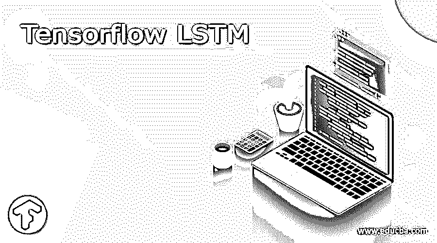
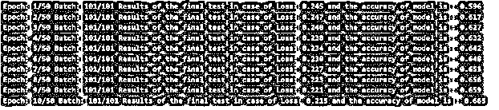

# 张量流 LSTM

> 原文：<https://www.educba.com/tensorflow-lstm/>

## What is Tensorflow LSTM?

TensorFlow 是一种用于机器学习的技术，是 google 为端到端通信提供的 GitHub 上的开源平台，它极大地改变了专家和初学者构建机器学习模型的方式。另一端的 LSTM 代表长短期记忆，用于深度学习技术，充当人工 RNN，即递归神经网络。1997 年，尤尔根·施密德胡伯和塞普·霍克雷特提出了 LSTM。它们是反馈连接，可以处理整个数据序列，包括视频和语音数据，而不仅仅是单个数据点。

我们可以利用 LSTM 的一些场景是在创建一个应用程序的过程中，这个应用程序涉及到语音识别或相关手写识别。称为细胞的 LSTM 单位主要由遗忘门、输出门和输入门组成。晶胞具有记忆特定时间段的值的能力，而上述三个门负责处理进出晶胞的信息流。

<small>Hadoop、数据科学、统计学&其他</small>

### 为什么要用 TensorFlow lstm？

LSTM 主要用在我们不知道持续时间的情况下，我们需要处理，分类和预测一系列的时间。LSTM 的使用主要用于记忆系统存储器内的 post 数据，这也被认为是 RNN 的更新或修改版本，它是一种递归神经网络，使记忆工作变得容易。

**示例代码——将 LSTM 与 TensorFlow 结合使用—**

让我们考虑一个例子来理解 LSTM 与 TensorFlow 一起创建将被训练的模型的工作。这里用到了机器学习和深度学习——

`import tensorflow as tf
from tensorflow.keras.datasets import imdb
from tensorflow.keras.layers import Embedding, Dense, LSTM
from tensorflow.keras.losses import BinaryCrossentropy
from tensorflow.keras.models import Sequential
from tensorflow.keras.optimizers import Adam
from tensorflow.keras.preprocessing.sequence import pad_sequences
# Configurations related to the model
extra_metric_param = ['accuracy'] size_of_single_batch = 128
output_of_dims = 15
function_used_for_Loss= BinaryCrossentropy()
length_of_maximum_sequence = 300
distinct_words_number = 5000
epochs_count = 5
optimizer = Adam()
split_for_validation = 0.20
Mode_Verbose = 1
# Execution should be in eager mode, so disable it
tf.compat.v1.disable_eager_execution()
# Data set should be loaded first
(x_train, y_train), (test_for_X_coordinate, test_for_Y_coordinate) = imdb.load_data(num_words=distinct_words_number)
print(x_train.shape)
print(test_for_X_coordinate.shape)
# Sequences should have proper padding between them
padded_inputs = pad_sequences(x_train, maxlen=length_of_maximum_sequence, value = 0.0) # 0.0 because it corresponds with <PAD>
padded_inputs_test = pad_sequences(test_for_X_coordinate, maxlen=length_of_maximum_sequence, value = 0.0) # 0.0 because it corresponds with <PAD>
# The keras model that will be used should be defined properly
model = Sequential()
model.add(Embedding(distinct_words_number, output_of_dims, input_length=length_of_maximum_sequence))
model.add(LSTM(10))
model.add(Dense(1, activation='sigmoid'))
# Model is compiled
model.compile(optimizer=optimizer, loss=loss_function, metrics=extra_metric_param)
# Providing brief summary about the model
model.summary()
# Model is being trained
history = model.fit(padded_inputs, y_train, batch=size_of_single_batch, epochs=epochs_count, verbose=Mode_Verbose, validation_split=split_for_validation)
# Model should be tested after the completion of the training
result_of_testing = model.evaluate(padded_inputs_test, test_for_Y_coordinate, verbose=False)
print(f'Results of the final test in case of Loss: {result_of_testing[0]} and the accuracy of model is : {result_of_testing[1]}')`

上述代码的输出如下所示

编写程序遵循的步骤-

编写上述程序时遵循的步骤及其简要描述如下所示

*   导入类和函数——第一步包括在程序开始时从机器学习中可用的包和库中导入所有需要的类和函数。
*   设置配置细节–下一步是提及将在程序中进一步使用的所有参数或指标的值。
*   禁用紧急模式–应在禁用紧急模式后执行
*   加载数据集–下一步是加载数据集，您将使用该数据集作为程序的输入来研究和分析该数据集。
*   创建适当填充的序列–填充应该在将要提供的多个序列之间均等地完成。
*   定义列表模型——在上面的例子中，我们使用了 TensorFlow 的 keras 模型，尽管还有许多其他可用的模型。
*   模型的编译——在定义了模型的所有细节之后，我们需要为了优化的目的对其进行编译，并使其成为机器可读的。
*   培训模型–培训包括模型的学习阶段，以便分批教授。
*   测试模型——在编译和训练之后，我们需要测试模型的准确性以及模型训练过程中发生的损失。

### 简要回顾 LSTMs

LSTM 是长短期记忆，用于深度学习技术，充当人工 RNN，是递归神经网络。称为单元的 LSTM 单元主要由遗忘门、输出门和输入门组成。晶胞具有记忆特定时间段的值的能力，而三个晶胞负责处理信息流。

**清单模式**

机器学习中使用的模型有三种类型，如下所列

*   回归模型–用于找出数值作为结果。示例包括确定下一天的湿度或温度、可售出的单位数量等。
*   多类分类模型——它可以涉及多个类，并且可以给出一个或多个结果。例如，如果产品是照相机、支架或衣柜，则是音乐的流派，即顾客偏好的类别。
*   二元分类模型–该模型有一个二元结果，用于确定垃圾邮件、产品是否会被购买、物体是否有生命等场景。

除此之外，机器学习还有两种方法，监督学习和非监督学习。在第一种方法中，模型的输出是通过研究相同的历史例子产生的，而非监督涉及研究模式。

### 结论

TensorFlow 是谷歌提供的开源平台，可用于机器学习和深度学习的端到端通信，而 LSTM 是递归神经网络架构，可与 TensorFlow 一起用于深度学习。

### 推荐文章

这是一个张量流 LSTM 指南。这里我们讨论什么是张量流 LSTM？为什么使用 TensorFlow LSTM？分别是。您也可以看看以下文章，了解更多信息–

1.  [TensorFlow Debugging](https://www.educba.com/tensorflow-debugging/)
2.  [tensorlow 版本](https://www.educba.com/tensorflow-versions/)
3.  [TensorFlow RNN](https://www.educba.com/tensorflow-rnn/)
4.  [TensorFlow Models](https://www.educba.com/tensorflow-models/)

