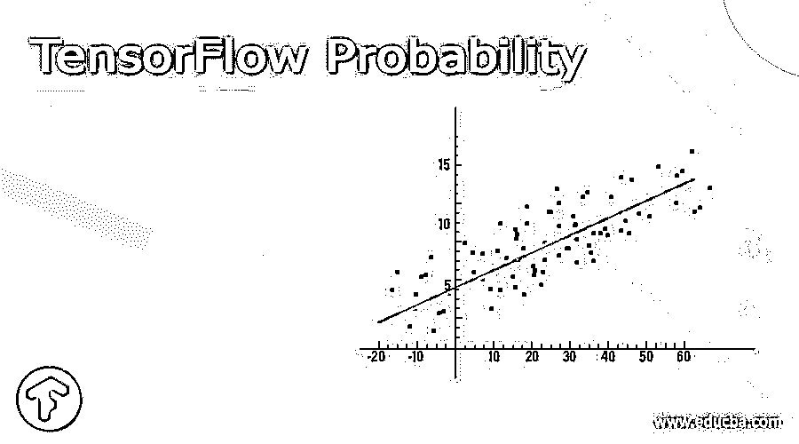
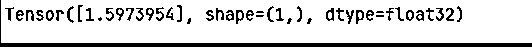

# 张量流概率

> 原文：<https://www.educba.com/tensorflow-probability/>

## 张量流概率的定义

基本上，TensorFlow 向用户提供不同种类的功能，其中 TensorFlow 是 TensorFlow 提供的功能之一。通常 TensorFlow 是一个为 TensorFlow 构建的 python 库，通过使用这个 Python 库，我们可以轻松地组合概率模型，我们还可以将深度学习模型与当今的现代硬件 TPU 和 GPU 相结合。这个库基本上对那些想要对数据进行预测的人有用，比如数据科学家、统计学家或 ML 研究人员和学生。TensorFlow 使用单一语言来实现。

### 1.什么是张量流概率？

基本上 TensorFlow 就是一个实现概率计算的库。作为张量流生物系统的一个组成部分，它提供了具有深刻组织的概率策略的混合；通过编程分离的基于角度的归纳，以及通过设备速度增加(例如，GPU)和适当的计算对巨大数据集和模型的多功能性。

<small>Hadoop、数据科学、统计学&其他</small>

这是一个依赖于 TensorFlow 的可信估计和概率显示库。它的结构块结合了巨大范围的传播和可逆变化(双投射体)，可能在 Keras 模型中使用的概率层，以及用于概率思维的装置，包括变分归纳和马尔可夫链蒙特卡罗。

Tensorflow 优势多样；一些记录如下。

1.Tensorflow 用于广泛选择似然环流和双射体。
2。这是一个工具，以制造深刻的概率模型，包括概率层和“联合分布”审议。
3。张量流是一个变分归纳和马尔可夫链，蒙特卡罗。
4。它是用于优化像内尔德米德，BFGS 和 SGLD。

### 2.张量流概率是如何工作的？

基本上，TensoFolw 中有三个不同的组件，如下所示。

#### Layer 0: TensorFlow:

数学任务——特别是 LinearOperator 类——支持无网格执行，可以利用特定的结构(倾斜、低秩等)进行有效的计算。它被组装起来并与群体保持同步，对 tf.linalg 在张量流中居中是必不可少的。

#### 第 1 层:统计构件:

拨款(tfp.distributions):一个巨大的可能性循环分类，以及与集群和广播语义相关的见解。
Bijectors (tfp.bijectors):任意因素的可逆可合成变化。双预测器提供了丰富的变化拨款类别，从对数典型离差等传统模型到隐蔽自回归流等精细的深度学习模型。

#### 第 2 层:模型构建:

联合分配(例如 TFP . Distributions . jointdistributionsequential):联合拨款超过至少一个潜在关联循环。作为使用 TFP 的 JointDistributions 进行演示的序幕，请看这个 collab
TensorFlow 使用带有漏洞的概率层来解决 TensorFlow 的不同功能。

#### 第三层:概率推理:

马尔可夫链蒙特卡罗(tfp.mcmc):通过检查来近似积分的算法。包含哈密尔顿蒙特卡罗，不规则行走大都会黑斯廷斯，以及装配定制进度部件的能力。

变分推理(tfp.vi):通过流线近似积分的算法。

分析仪(tfp。优化器):随机流线型技术，拓宽张量流优化器。结合随机梯度朗之万动力学。蒙特卡洛(tfp.monte_carlo):计算蒙特卡洛假设的工具。

它处于动态变化之中，界面可能会发生变化。

它也适用于 JAX: TensorFlow Probability (TFP)是一个用于概率思维和事实调查的库，目前还额外处理了 JAX！对于那些不舒服的人来说，JAX 是一个加速数学计算的图书馆，它依赖于可堆肥容量的变化。JAX 上的 TFP 维护了习惯 TFP 的大量最有价值的使用，同时保护了许多 TFP 客户目前可以接受的反射和 API。

现在让我们来看看检测异常 API 的张量流概率如下。

它有一个用于结构化时间序列(STS)的 API 库，这是一类贝叶斯可测量模型，可以将一个周期序列分解为可解释的偶发事件和模式部分。客户已经需要为他们的模型手动描述模式和偶然部分的特征，例如，演示利用一个具有邻域直接模式和一年中几个月的偶然影响的模型来估计 CO2 固定。与该替角项目相关，该小组制作了另一个异常位置 API，其中这些零件是根据信息时间序列诱发的。

### 3.安装张量流概率

有三种不同的安装方式如下。

第一种方法是使用稳定的构建:这样，它依赖于 Tensorflow 的当前稳定版本，我们可以使用 pip 命令来安装 TensorFlow 包。

`pip install –upgrade tensorflow-probability`

如果我们需要一些额外的包，我们只需要替换 pip3 而不是 pip。

第二种方法是我们可以在 pip 命令 tfp-daily 下为 TensorFlow 使用夜间构建，这依赖于 tf-daily 和 tf-daily gpu 中的一个。每日形式包含更多的当前元素，但是可能不如成形交付稳定。

第三种方式，我们可以从源头安装。这里我们可以使用 Bazel 构建系统。

`sudo apt-get install bazel git python-pip
python -m pip install --upgrade --user tf-nightly`

### 4.张量流概率示例

现在让我们看看下面的例子，以便更好地理解。

`import tensorflow as tf_obj
import tensorflow_probability as tfp_obj
tf_obj.enable_eager_execution()
print(tf_obj.__version__)
feat = tfp_obj.distributions.Normal(loc=0., scale=1.).sample(int(100e3))
lab = tfp_obj.distributions.Bernoulli(logits=1.618 * feat).sample()
model_demo = tfp_obj.glm.Bernoulli()
coef, linear_response, is_converged, num_iter = tfp_obj.glm.fit(
model_demo_matrix=feat[:, tf_obj.newaxis],
res=tf_obj.cast(lab, dtype=tf_obj.float32),
model_demo=model_demo)
print(coef)`

**解释**

在上面的例子中，我们尝试实现 TensorFlow probability，在这个例子中，我们首先导入所有需要的标准库，如图所示，然后，我们加载合成数据集，我们还定义了模型。上面程序的最终输出我们用下面的截图来说明。

### 结论

我们希望从这篇文章中你能学到更多关于张量流概率的知识。从上面的文章中，我们已经理解了张量流概率的基本思想，并且我们也看到了张量流概率的表示和例子。从这篇文章中，我们了解了如何以及何时使用张量流概率。

### 推荐文章

这是一个张量流概率指南。这里我们讨论定义，什么是张量流概率？，如何张量流概率？为了更好的理解。您也可以看看以下文章，了解更多信息–

1.  [TensorFlow Debugging](https://www.educba.com/tensorflow-debugging/)
2.  [用 TensorFlow 进行深度学习](https://www.educba.com/deep-learning-with-tensorflow/)
3.  [tensorlow 版本](https://www.educba.com/tensorflow-versions/)
4.  [Tensorflow Basics](https://www.educba.com/tensorflow-basics/)

