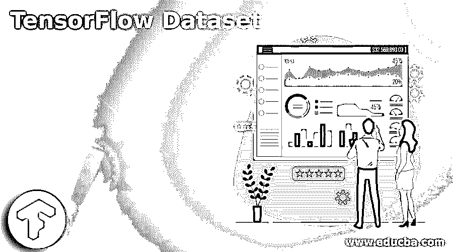
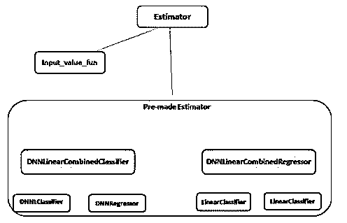
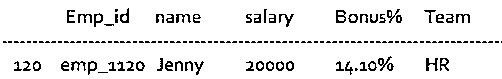
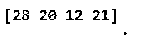

# tensorflow 数据集

> 原文：<https://www.educba.com/tensorflow-dataset/>

## 张量流数据集简介

基本上，TensorFlow 充当不同种类的数据集的集合，它随时可以使用，或者换句话说，我们可以说它是一种用于机器学习的框架。TensorFlow 数据集的主要用途是，借助 TensorFlow 数据集，我们可以在机器学习应用程序中构建管道。

没有 TensorFlow 数据集，这是不可能的，或者我们可以说这是一项耗时且痛苦的任务。TensorFlow 数据集是一个 API，它帮助我们构建异步项目，更精确地用于管道，以避免 GPU。通常 TensorFlow 以文本或图像格式从本地磁盘加载数据，然后应用转换来创建批处理，并将它们发送到 GPU。

<small>Hadoop、数据科学、统计学&其他</small>

### 什么是 TensorFlow 数据集？

*   深度学习是人工智能的一个子领域，或者我们可以说，机器学习是由大脑的设计和能力推动的一系列算法。基本上，TensorFlow 用于人工智能框架，或者我们可以说是机器学习框架，它直接给出了实现人工智能概念的直接解决方案。
*   由于数学计算，你可以利用 TensorFlow 库，它本身似乎并不完全新颖，但这些评估是用信息流图表完成的。这些中枢处理数字任务，而边缘处理信息，这些信息通常是在这些边缘之间传递的多维信息展示或张量。

### TensorFlow 数据集示例模型

让我们看看张量流数据集的示例，如下所示:

数据集是为张量流模型建立输入管道的另一种方法。这个 API 比使用 feed_dict 或基于行的管道要高效得多，而且使用起来更干净简单。

通常，我们在数据集中有如下高级类:

*   **Dataset:** 它是一个基类，包含创建转换数据集所需的所有方法，它还有助于初始化内存中的数据集。
*   基本上我们需要从文本文件中读取这一行，因此我们使用 TextLineDataset。
*   **TFRecordDataset:** 用于根据需要从 TFRecord 文件中读取记录。
*   **FixedLengthRecordDataset:**当我们需要从二进制文件中读取固定大小的记录时，我们可以使用 FixedLengthRecordDataset。
*   迭代器:通过使用迭代器，我们可以在需要的时候访问数据集元素。
*   我们需要创建 CSV 文件并存储我们需要的数据，如下所示:Sepailength，SepalWidth，SetosLength，SetosWidth，FlowerType。

**说明:**

*   在上面提到的输入值中，我们需要将它放入 CSV 文件中，这意味着我们从 CSV 文件中读取数据。前四个是单行的输入值，FlowerType 是标签，或者我们可以说是输出值。我们可以认为一个数据集的输入集是 float，而 int 为输出值。
*   我们还需要标记数据，这样我们就可以很容易地识别类别。

让我们看看如何表示数据集，如下所示:

**代码:**

`types_name = [‘Sepailength’,’ SepalWidth’,’ SetosLength’,’ SetosWidth’]`

*   完成训练数据集后，我们需要读取数据，因此我们需要创建如下函数:

**代码:**

`def in_value():
…………………
Return({‘Sepailengt’:[values], ‘……….})`

### 估计量的类图

让我们看看估计器的类图，如下所示:

估算器是一个不可否认的 API 级别，它减少了您最近在准备 TensorFlow 模型时期望编写的标准代码的重要部分。评估者同样具有真正的适应性，允许你在你的模型有明确的先决条件的情况下废除默认行为。

我们可以使用如下两种方法来构建类图:

*   **预制估算器:**这是一个预定义的估算器类，用于特定类型的模型。
*   **基类:**提供对模型的完全控制。

### 代表我们的数据集

让我们看看如何表示数据集，如下所示:

有不同的方法来表示数据，如下所示:

我们可以用数字数据、分类数据和顺序数据来表示数据集，我们可以根据自己的需要使用任何方式。

**代码:**

`import pandas as pd_obj
data_info = pd_obj.read_csv("emp.csv")
row1 = data_info.sample(n = 1)
row1
row2 = data_info.sample(n = 1)
row2`

**说明:**

*   在上面的例子中，我们尝试获取数据集，这里我们首先导入熊猫来实现 AI 程序，然后我们从 CSV 文件中读取数据，如图所示，这里我们有一个 emp.csv 文件，我们尝试从该文件中读取数据。
*   最终的输出，或者我们可以说是我们用下面的屏幕截图展示的结果。

**输出:**

类似地，我们可以像上面一样显示第二行。

### 导入数据张量流数据集

让我们看看如何导入数据 TensorFlow 数据集，如下所示:

**代码:**

`import tensorflow as tf_obj
A = tf_obj.constant([4,5,6,7])
B = tf_obj.constant([7,4,2,3])
res = tf_obj.multiply(A, B)
se = tf_obj.Session()
print(se.run(res))
se.close()`

**说明:**

*   通过使用上面的方法，我们尝试实现 TensorFlow 数据集，这里我们首先导入 TensorFlow，如图所示，之后，我们编写两个不同的数组 A 和 B，如图所示。之后，我们将两个数组相乘，并将结果存储到 res 变量中。在本例中，我们还添加了一个会话，在复杂的操作之后，我们关闭了该会话。
*   最终的输出，或者我们可以说是我们用下面的屏幕截图展示的结果。

**输出:**

### 免费赠品 TensorFlow 数据集

*   基本上，Tensorflow 数据集是一个开源数据集，它是我们可以在 Jax 等机器学习框架中直接使用的数据集的集合，我们可以根据需要使用 TensorFlow 设置所有数据集。
*   这也有助于我们提高绩效。

### 结论

从上面的文章中，我们已经理解了张量流数据集的基本思想，我们也看到了张量流数据集的表示。从本文中，我们看到了如何以及何时使用 TensorFlow 数据集。

### 推荐文章

这是一个张量流数据集的指南。在这里，我们讨论了介绍，例子，估计的类图&导入数据张量流数据集。您也可以看看以下文章，了解更多信息–

1.  [咖啡张量流](https://www.educba.com/caffe-tensorflow/)
2.  [TensorFlow Debugging](https://www.educba.com/tensorflow-debugging/)
3.  [什么是张量流？](https://www.educba.com/what-is-tensorflow/)
4.  [TensorFlow Models](https://www.educba.com/tensorflow-models/)

