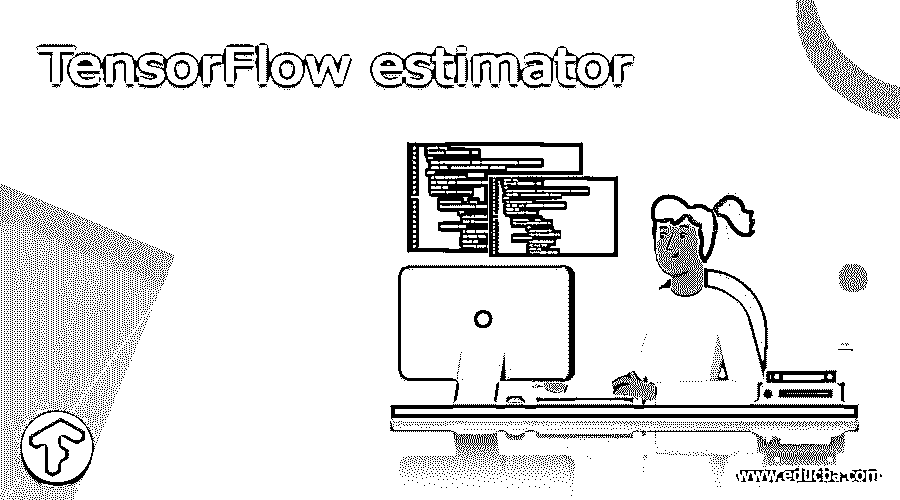
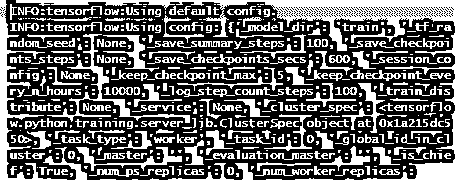
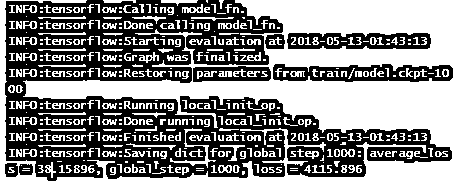

# 张量流估计量

> 原文：<https://www.educba.com/tensorflow-estimator/>

## 什么是张量流估计量？

TensorFlow 的估计器并没有修改网络图像的某些内容，但是它简化和具体化了管理训练、分析和预测。由于它的位置优化、有用的抽象以及来自核心 TensorFlow dev 公司的支持，它从相反的库中脱颖而出。评估者负责会话化和图形创建。它们易于管道化，并且可扩展和可建造。

### TensorFlow 估算器入门

TensorFlow 让您完全控制任何计算。为此，底层 API 是首选。此外，TensorFlow 附带了一组多样化的 API，用于执行各种机器学习方法。这是更高级的 API。他们被称为张量流的估计量。

<small>Hadoop、数据科学、统计学&其他</small>

*   低级 API:从头开始创建架构和优化模型。对于一个初学者来说，很难。
*   高级 API:使用高级 API 创建算法。使用起来很简单。为了构建、训练、评估和生成预测，TensorFlow 提供了一个称为估计器的工具箱。

为了使用估计器，我们必须学习两个新的泛化特性:列和输入函数。对于训练和评估，输入函数用于将数据传递给模型。模型对输入数据的解释由注释列指定。张量流估值器使用输入函数。输入函数的签名生成一组要素集和标注。输入函数应该返回包含两个值的行。字典，通过使用特征列名作为键，将特征列名转换为包含定型批的特征数据的张量。对于训练批次，提供标签列表。如果我们在一行中获得了知识，我们能够完全扫描到内存中，因此文件是一种格式(CSV，TSV ),那么所需的工作量是很小的。Numpy 或 pandas 习惯于在文件中读取。为了使用估计器，我们需要为训练传递一个输入函数。
函数格式给出为

`train(
input_fn,
hooks=None,
steps=None,
max_steps=None,
saving_listeners=None
)`

**创建特征栏**

`lin_model = tf.estimator.LinearRegressor(feature_columns=f_cols)`

### 收益张量流估计量

*   模型开发人员更容易分享他们的应用过程。
*   与低级 TensorFlow APIs 相比，高级直观代码在创建模型时通常更容易使用。
*   估计器是建立在 tf 之上的。keras.layers，让定制变得轻而易举。
*   评估人员将通过为您构建图表来简化。
*   估计器提供了一个分布式训练循环，允许您决定。
*   构建图形、设置变量、要加载的数据、要处理的异常、构建检查点文件和恢复到以前的状态，以及保存摘要。
*   总的来说，TensorFlow 似乎有开发然后抛弃高级 API 的历史。

### 特征张量流估计器

1.估算器是一个 TensorFlow 集成的高级 API，它允许我们处理预先实现的模型，同时还提供了根据需要轻松开发新模型的工具。

2.它还附带了几个高级 API，让我们可以轻松地在其上创建计算模型。其中一个就是 Estimator，让机器学习编程变得更容易。它使我们能够快速创建模型，进行培训评估，并将其部署到业务中。

3.评估者有四个主要特征:

他们将在给定的源输入上为多个步骤训练一个模式。他们将使用一组测试作为核心点来评估模型。
预测估计器将使用训练模型来执行推断。
通过导出来服务你的模型。

4.此外，估计器提供标准的训练作业行为，例如保存和恢复检查点、准备摘要等等。您需要为估计器构建一个模型 fn 和一个输入 fn，它们分别对应于张量流图的模型和输入部分。

**设置评估器**

`pip install -U tensorflow_datasets
import tempfile
import os
import tensorflow as tf
import tensorflow_datasets as tfds`

### 张量流估计器示例

*   线性回归

这里我们将使用心脏病发作数据集，可用数据值为年龄、性别、cp、trestbps、chol、fbs、restecg、thalach、exang、oldpeak、slope、ca、thal、target。对于每个值，算法将选择一个随机整数来替换 x 的值，以获得 y 的预测值。如果数据集包含 200 个观测值，则该技术将计算 200 个投影值。

*   使用熊猫

若要定型模型，必须首先导入适当的库。

`import pandas as pd
from sklearn import datasets
import tensorflow as tf
import itertools`

#### 步骤 1)用熊猫导入数据。

命名列并将其保存在列中。要导入数据，请致电 pd。读取 CSV()。

#### 第二步:转换信息

`COLUMNS = [ "age"," sex", "cp", "trestbps","chol","fbs","restecg" ,"thalach","exang" ,"oldpeak" ,"slope" , "ca ", "thal" , "target"] training_set = pd.read_csv(“D:/hrtattack_train.csv”, skipinitialspace=True,skiprows=1, names=COLUMNS)
test_set = pd.read_csv(“D:/hrtattack_test.csv”, skipinitialspace=True,skiprows=1, names=COLUMNS)
prediction_set = pd.read_csv(“D:/hrtattack_predict.csv”, skipinitialspace=True,skiprows=1, names=COLUMNS)`

数字变量必须转换成正确的结构。tf.feature column.numeric column 是一种用于转换连续变量的 TensorFlow 技术()。

`fe_cols = [tf.feature_column.numeric_column(i) for i in FEATURES]`

要使用此函数，请使用 tf。命令提示符下的估计器。

接下来，估计函数需要两个参数:

*   模型目录:保存图形、保存模型参数等的目录。
*   特征列:由要包含在模型中的变量组成。

默认情况下，TensorFlow 将在您的工作目录中建立一个训练文件。如下面的张量流回归场景所示，您必须使用此路径来访问张量板。

#### 第三步

`estimator = tf.estimator.
LinearRegressor(
feature_columns=fe_cols,
m_dir="train")`

**输出:**

#### 第四步

看看你的模型并评估它。

使用下面的代码，您可以在测试集上测试您的模型的适合性:

`est = estimator.evaluate(
i_fn=get_input_fn(test_set,
n_epochs=2,
n_batch = 120,
shuffle=False)`

**输出为**

#### 第五步:预测

最后一个阶段是借助特征矩阵预测未来价值。产生一个价值库来预测。在这个模型中，数据集有 14 个值选项。对于每一个选项，模型都会建立一个预测。

### 结论

概括地说，未来我们将使用 Estimator APIs 在本地和云中训练深度神经网络。我们还将把训练好的模型放在云服务上，通过 REST API 可以访问它。

### 推荐文章

这是张量流估计器的指南。在这里，我们讨论什么是张量流估计器，好处，特点，代码实现的例子。您也可以看看以下文章，了解更多信息–

1.  [咖啡张量流](https://www.educba.com/caffe-tensorflow/)
2.  [TensorFlow Debugging](https://www.educba.com/tensorflow-debugging/)
3.  [tensorlow 版本](https://www.educba.com/tensorflow-versions/)
4.  [TensorFlow Models](https://www.educba.com/tensorflow-models/)

