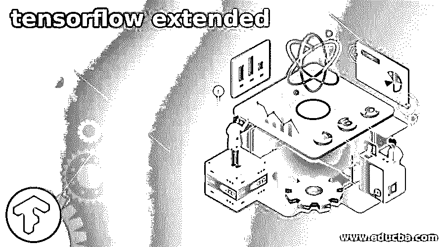

# tensorflow extended

> 原文：<https://www.educba.com/tensorflow-extended/>

## tensorflow 扩展简介

Tensorflow Extended (TFX)是一个过程级 Tensorflow 机器学习平台，它使用 Tensorflow 和 Sibyl 框架，曾在谷歌使用。TFX 是一组组件，可用于构建可扩展的 ML 管道，这些管道可以执行高性能的机器学习作业。Tensorflow Extended (TFX)是一个用于创建端到端管道的机器学习框架。

### TensorFlow extended 入门

本文将着眼于我们可以用来跨越整个机器学习生命周期的各种内置组件。

<small>Hadoop、数据科学、统计学&其他</small>

一个极好的 MLOps 工具，用于构建一个强大而透明的 ML 系统和一个流动管道。如果正确使用，它可以更容易地保持最先进的 ML 性能，同时减少 ML Ops 的技术债务。

**安装:**

`Pip install tfx`

**套餐**

`pip install -i https://pypi-nightly.tensorflow.org/simple --pre tfx`

**TFX 管道组件包括:**

带有打包库或容器的模型验证器构成了一个 TFX 组件。

**ExampleGen:** 它使用 ExampleGen 将样本数据接收到基目录中。转换连接，ExampleGen 处理其他格式。

`Example_gen=csvEx(input_val=examples)`

这是一个计算统计数据的程序，比如数据分布和异常检测。StatisticsGen 还是计算描述性统计数据以进行数据完整性检查的首选工具。这通过可视化捕捉指定数据的形状。

`Statistic_gen=StatisticGen(input_val=example_gen.outputs)`

**SchemaGen** :为了保证数据的有效性和整洁性，这个组件使用 TF 数据验证库来定义预期的边界、类型和属性。给出带有约束和特征的数据的高度描述。模式定义了指定数据的描述。它指定了种类、预期属性、边界和其他数据特征。

**转换(tf 转换):**生成 TF。转换图和转换后的示例实用程序。它具有运行作业、创建转换图和向培训师发送组件的功能。

**评估者:**评估并确认模型性能指标。

**培训师:**采用 TF 模式。培训师培训两种服务模式:生产和评估。

**Transform:** 提供用于运行作业、创建转换图和发送到 trainer 组件的实用程序。要修改获取的数据，我们必须首先发送来自 ExampleGen 的数据，然后是来自 SchemaGen 的模式，最后是包含转换代码的 Python 模块。

**示例验证器**使用 TF 数据验证库(定义良好的输入和输出)检测数据中的异常。它可用于在新数据输入模型之前发现新数据中的漂移、变化和偏差。

在下图中，我们可以看到可用的 TFX 库和管道组件之间的关系。

### TFX 用户指南

谷歌的内部平台 TensorFlow Extended 于 2019 年初公开发布，旨在协助企业实施工业级端到端生产系统(TFX)。它带有一个配置基础和开放库，用于集成配置、部署和监控任何机器学习技术的通用组件。

### TensorFlow 扩展管道

管道节点是 TFX 管道需要注意的另一个标准方面。它们是特殊用途的类，用于执行高级元数据操作，比如使用人工制品属性查询当前的 ML 元数据。导入器节点是最流行的管道节点，它是将外部资源集成到 ML 元数据库中的专用特征节点，以便下游节点可以使用注册的人工制品作为输入。该节点的主要任务是将外部工件(如模式)引入 TFX 管道，供训练器组件中的转换使用。

`Importer=ImporterNode(instance _name=’import_schema’ ,source_uri=’uri/to/schema’
Artifact_type=’ ‘
Reimport=false)`

TFX 管道是由组件实例和输入参数组成的机器学习工作流的可移植实现。它们是使用管道类定义的。

`from tfx.orchestration import metadata
pipeline = pipeline. Pipeline(
pipeline_name=pipeline_name,
pipeline_root=pipeline_root,
components=components,
enable_cache=True)`

带 Keras 型号的 Tensorflow2 可用于新的 TFX 渠道，展示该通用教练机。

协调上述所有组件和管理管道需要流程编排。前一个组件完成后，我们可以立即开始新组件的工作。我们使用编排的管理界面来触发任务和监控组件。在我看来，编排是 TFX 开放和适应性强的方式之一。

### TFX 图书馆

它建立在 TensorFlow (TF)库的基础上，这些库用于创建 Python 用户定义的函数。TFX 的额外价值来自于它将 TF 库的功能封装在被称为标准组件的可重用构件中。因此，只需相当少的代码，就可以很容易地将它们耦合起来以构建管道。

下列 TFX 图书馆可供使用:

1.TensorFlow 数据验证(TFDV)是一个机器学习数据分析和验证库。

它有一个模式查看器、可伸缩的计算和数据集比较。

2.TensorFlow Transform (TFT)是一个使用 TensorFlow 预处理数据的库。

3.对于 TFX，TensorFlow 用于训练模型。KerasTuner 是一个微调模型超参数的工具。(模型训练和调整)

4.TensorFlow 元数据(TFMD)提供了标准的元数据表示，在使用 TensorFlow 训练机器学习模型时非常有用。Tensorflow Extended 大量使用机器学习元数据进行组件交换、血统跟踪和其他活动。

5.ML Metadata (MLMD)是一个用于存储和检索元数据的库，这些元数据与机器学习开发人员和数据科学家的工作流相关联。它利用数据存储和 SQL-lite。

TFX 的好处之一是一些库是在 Apache Beam 上完成的。因此，TFX 是一个相当可扩展和快速的过程。这也有助于 TFX 在流式和批处理管道上可靠运行的能力。

**对比:**

张量板显示在流中训练期间从检查点计算的完整模型指标。另一方面，TFMA 使用导出的 eval 保存的模型文件批量计算和可视化指标，为我们提供了关于模型性能的更详细的信息。

**TFX 1.0 版本**

TFX 1.0.0 现已可供下载。这是 TFX 的第一个后测试版本，包含稳定的公共 API 和工件。

### 结论

TensorFlow 在少数情况下可能不太受关注，因为它不是主要应用。摄取管道并不总是直截了当的，学习曲线也很长。这并不奇怪，因为它是为了使谷歌的过程更容易，并解决他们的具体问题而创建的。TFX 可能被认为是针对 TensorFlow 专业用户的利基产品。

### 推荐文章

这是一个张量流扩展的指南。在这里，我们讨论我们可以用来跨越整个机器学习生命周期的各种内置组件。您也可以看看以下文章，了解更多信息–

1.  [TensorFlow Debugging](https://www.educba.com/tensorflow-debugging/)
2.  [TensorFlow RNN](https://www.educba.com/tensorflow-rnn/)
3.  [TensorFlow 游乐场](https://www.educba.com/tensorflow-playground/)
4.  [咖啡张量流](https://www.educba.com/caffe-tensorflow/)

