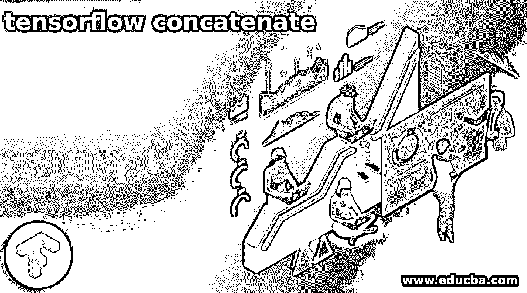
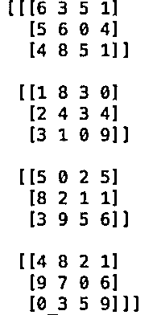
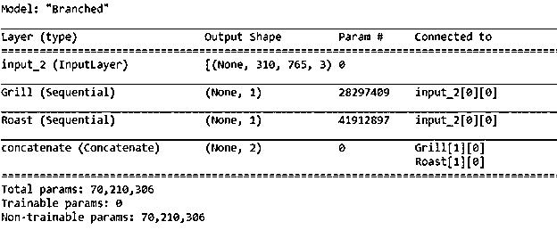

# 串联张量洛

> 原文：<https://www.educba.com/tensorflow-concatenate/>

## 张量流连接简介

Tensorflow concatenate 是一种方法，使用这种方法，我们可以将两个值连接并生成一个结果。tensorflow 框架中使用 Concat()函数将 tensprs 与一维格式连接起来。在本文中，我们将尝试了解什么是张量流连接、如何连接、如何使用张量流连接、张量流连接功能、张量流连接示例，并最终总结我们的陈述。

### 什么是张量流连接？

Tensorflow concatenate 是这样一个过程，我们传递两个或更多我们想要组合和连接的张量，并从中形成一个张量。concat()函数的语法如下所示

<small>Hadoop、数据科学、统计学&其他</small>

`tensorFlowObject.Concat(input values, axis, operation name)`

上述语法中提到的参数如下所述——

*   输入值——这是源输入张量或我们想要连接的张量列表。
*   轴-它是零维的张量值，有助于指定连接时需要遵循的维度。
*   operation name–这是一个可选参数，需要传递它来定义要执行的操作的名称。
*   返回值–concat()函数的输出是张量，它具有所提供的输入张量参数的连接值。

concatenate 层负责连接输入值，并从模块和层类继承其功能。除了 concat()函数，我们还可以使用函数–

`tensorflow.keras.layers.Concatenate(axis = 1, ** keyword arguments of standard layer)`

另外，请注意，所提供的所有输入张量的形状应该相同。这里的特殊价值是连接轴。如前所述，在 concatenate()函数的情况下，也只获得一个包含组合或联合输入张量的输出张量。

### 怎么串联？

可以简单地将存储在两个或多个不同变量或对象中的两个或多个张量值连接起来，方法是将它们的列表放在方括号[tensor1，tensor2，...]中，像这样将它们作为第二个参数和第一个参数与指定张量维数的轴值一起输入到 concat()函数中。例如，如果我们有两个形状相同的矩阵/张量

[[ 21,  22,  23], [ 24,  25,  26]]

和

[[ 27, 28,  29], [30, 31, 32]]

在我们使用 concat() tensorflow 函数将两者连接起来之后，我们的矩阵将如下面的张量值所示

[[[ 21,  22,  23], [ 24,  25,  26]],[[ 27, 28,  29], [30, 31, 32]]]

### 使用张量流连接

tensorkflow concatenate 函数仅在您有两个或更多要连接的相同形状的张量值时才可用。注意，如果矩阵的形状不一样，那么在对 concatenate()函数进行操作之前，需要对向量进行整形。

*   一旦我们在程序中准备好了输入，我们要做的第一步就是在开始时导入必要的库和包。
*   准备输入张量。将它们存储在对象中，或者列出它们的列表并作为参数传递。如果形状不同，则在将其作为输入传递之前进行整形。
*   将轴和输入参数传递给张量矩阵。

### tensorflow 链特征

tensorflow 中 concatenate 的功能或属性如下所述

*   activity regulator–这是一个可选函数，用于准备 tensorflow 中该串联层的输出。
*   Dt 类型输入–用于检索层输入，仅适用于只有一个层输入的情况。然后，它返回一个由一列张量或一个张量组成的输出。
*   损耗——这种损耗实际上与级联层有关。负责正则化张量的张量也是通过使用层的关联丢失和访问的属性来生成和创建的。工作方式类似于 eager safe，这意味着损失的进入将在张量流下传播梯度。渐变回与之相关的变量。
*   不可训练的重量
*   不可训练变量
*   output _ mask–此属性或功能仅适用于串联层仅由单个入站节点组成的情况，即仅创建单个入站层的连接的情况。此功能有助于检索层的输出 massk 张量。
*   output _ shape–仅当存在一个输出图层或所有输出的形状具有相同的形状时适用。
*   可训练重量
*   可训练变量
*   设定重量
*   获得重量
*   获取的更新
*   获取输出形状于
*   获取输出掩码于
*   在以下位置获取输出
*   遭受损失
*   在以下位置获取输入形状
*   获取输入掩码的位置
*   在以下位置获取输入
*   获取配置
*   从配置
*   计数参数
*   计算输出形状
*   计算掩码
*   体格

### 张量流连接示例

下面举几个例子

#### 示例#1

**代码:**

`def sampleTestingDDPGinput():
operationsOfNB = 2
sampleEducbaActor = Sequential()
sampleEducbaActor.add(Flatten(input_shape=(2, 3)))
sampleEducbaActor.add(Dense(operationsOfNB))
inputOperation = Input(shape=(operationsOfNB,), name='inputOperation')
observation_input = Input(shape=(2, 3), name='observation_input')
sampleVar = Concatenate()([inputOperation, Flatten()(observation_input)])
sampleVar = Dense(1)(sampleVar)
requiredCritics = Model(inputs=[inputOperation, observation_input], outputs=sampleVar)
memory = SequentialMemory(limit=10, window_length=2)
educbaAgent = DDPGAgent(sampleEducbaActor=sampleEducbaActor, critic=requiredCritics , critic_inputOperation=inputOperation, memory=memory,
operationsOfNB=2, nb_steps_warmup_critic=5, nb_steps_warmup_sampleEducbaActor=5, batch_size=4)
educbaAgent.compile('sgd')
educbaAgent.fit(MultiInputTestEnv((3,)), nb_steps=10)`

执行上述程序的输出如下图所示

#### 实施例 2

**代码:**

`def buildingNeuralNetwork(self):
input_states = Input(shape=(self.observation_size,))
input_action = Input(shape=(self.action_size,))
input_layer = Concatenate()([input_states, input_action])
sampleLayer1 = Dense(self.observation_size)(input_layer)
sampleLayer1 = Activation('relu')(sampleLayer1)
sampleLayer2 = Dense(self.observation_size)(sampleLayer1)
sampleLayer2 = Activation('relu')(sampleLayer2)
sampleLayer3 = Dense(2*self.action_size)(sampleLayer2)
sampleLayer3 = Activation('relu')(sampleLayer3)
receivedAdvantage = Dense(1, activation = 'linear')(sampleLayer3)
educbaModel = Model(inputs=[input_states, input_action], outputs=[receivedAdvantage])
educbaModel.compile(loss='mse', optimizer=Adam(lr=self.lr_))
print (educbaModel.summary())
return educbaModel`

执行上述程序的输出如下图所示

### 结论

tensorflow concatenate 函数在 tensorflow 中用于合并或连接两个或多个源张量，并形成由单个张量组成的单个输出，其中包含两个输入张量。我们可以提供和指定输入轴维度，这有助于表示张量的维度。

### 推荐文章

这是一个张量流连接的指南。这里我们讨论什么是张量流连接，如何连接，如何使用张量流连接。您也可以看看以下文章，了解更多信息–

1.  [张量流估计器](https://www.educba.com/tensorflow-estimator/)
2.  [张量流概率](https://www.educba.com/tensorflow-probability/)
3.  [tensorlow 版本](https://www.educba.com/tensorflow-versions/)
4.  [张量流 LSTM](https://www.educba.com/tensorflow-lstm/)

