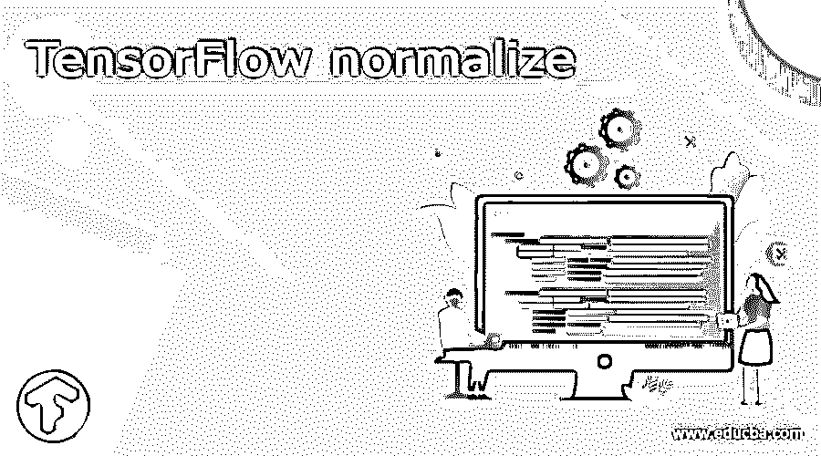
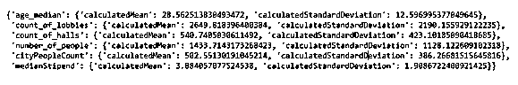
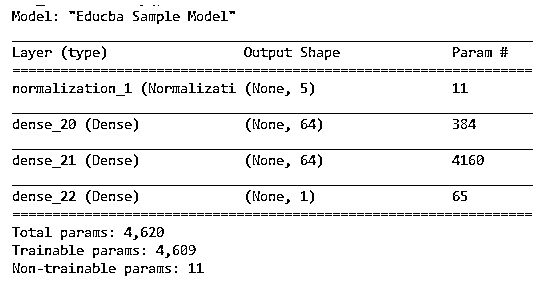
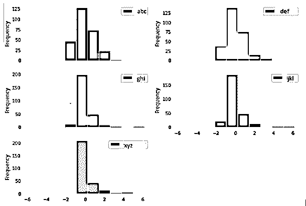

# 张量流归一化

> 原文：<https://www.educba.com/tensorflow-normalize/>

## 张量流归一化简介

Tensorflow normalize 是 Tensorflow 库中可用的方法，有助于实现神经网络中张量的规范化过程。此过程的主要目的是进行转换，以便所有功能在相同或相似的规模级别上工作。归一化在提高训练稳定性和模型性能方面起着至关重要的作用。内部用于归一化的主要技术包括对数缩放、缩放到指定范围、z 得分和裁剪。

在本文中，我们将讨论点张量流归一化概述，如何使用张量流归一化，张量流归一化的功能，张量流归一化的例子，最后总结我们的声明。

<small>Hadoop、数据科学、统计学&其他</small>

### 张量流归一化概述

标准化是这样一个过程，在该过程中，我们尝试在相似的规模上调整模型的所有参数和特征，以便提高模型的整体性能和训练质量。规范化方法的语法如下所示。请注意，normalize 函数仅适用于 numpy 数组格式的数据。

Tensorflow.keras.utils.normalize(sample array, axis = -1, order = 2)

以上语法中使用的参数在此逐一详细描述——

*   样本数组–要规范化的是 NumPy 数组数据。
*   axis–该参数有助于指定我们希望 numpy 数组沿其进行规范化的轴。
*   order–该参数指定我们想要考虑的标准化顺序。该值可以是一个数字，例如这里的 2 代表 L2 范数归一化。
*   output value–该方法的返回值是完全规范化的原始 numpy 数组的副本。

### 如何使用 TensorFlow normalize？

在我们的 python 张量流模型中使用归一化方法时，我们需要遵循的步骤如下所述

*   观察并尝试探索可用的数据集，包括找出数据之间的联系和相关性。
*   模型的训练数据应该按照上述语法使用 normalize 方法进行规范化。
*   应执行线性模型的步骤，包括构建、编译和评估值。
*   应该建立、编译和适当训练 DNN 神经网络，以给出值的评估。

### 张量流归一化特征

可以对各种类型的特征进行归一化。一般来说，归一化意味着我们希望获得平均中间值，以便在绘制直方图时数据均匀分布，并且我们可以了解我们拥有的数据集的模式。对于数值特性，比如计算范围内数据集的平均值、众数、中值或分布以及许多其他特性，我们必须将特性数据传递给 normalize()函数。
当您尝试执行归一化时，我们将需要使用 TensorFlow.estimator，此外，我们还需要在 TensorFlow.feature_column 中提及参数归一化函数，以防它是一个数值特征，然后 tensor flow . feature _ column . numeric _ feature，以防我们希望提供评估、训练和服务时所需的相同参数。

该功能可以在下面的语法中提及——

`Feature = tensorflow.feature_column.numeric_column (name of the feature, function of normalization = zscore)`

我们在这里作为规格化函数传递的参数是 z 得分，它代表了观察值的平均值和除了值什么都没有的观察值之间的关系。

我们使用的 zscore 函数如下所示

Def zscore(示例):

mean = 3.04
Std = 1.2
Return(x-计算平均值)/计算标准偏差

让我们考虑一个例子，在这个例子中，我们将尝试通过使用数字特征的归一化来找到估计值。我们将尝试创建标准偏差和平均值，我们已经使用了上述计算。我们将通过使用指定的特性列来创建估算器。我们的代码如下所示

`def receiveParamsForNormalization(educbaSampleTrainedFnc, inputFeatures):
def zscoreArgument(column):
calculatedMean = educbaSampleTrainedFnc[column].mean()
calculatedStandardDeviation = educbaSampleTrainedFnc[column].std()
return {'calculatedMean': calculatedMean, 'calculatedStandardDeviation': calculatedStandardDeviation}
normalization_parameters = {}
for column in inputFeatures:
normalization_parameters[column] = zscoreArgument(column)
return normalization_parameters
NUMERIC_inputFeatures = ['age_median', 'count_of_lobbies', 'count_of_halls',
'number_of_people', 'cityPeopleCount', 'medianStipend'] normalization_parameters = receiveParamsForNormalization(educbaSampleTrainedFnc,
NUMERIC_inputFeatures)
normalization_parameters`

执行上述代码的输出结果如下图所示

### 张量流归一化示例

让我们考虑一个例子。我们将尝试对-1 到 1 范围内的所有数据进行标准化。TensorFlow 2.x 库推出了实验性的规范化引擎，为手动规范化过程的替代方案创造了一种方式。

我们将首先导入所有必需的包和库。然后，我们将继续为规范化过程创建一个对象。下一步是让引擎熟悉统计数据和摘要的范围，这可以通过在没有数据集的情况下向规格化引擎提供数据来完成。

规范化的对象帮助我们提供数据集的输入，以及 NumPy 方法，它返回包含所有被规范化的数字的矩阵。该矩阵可用于准备 pandas 数据框，只需简单地传递它，这将有助于绘制更新的归一化数据集的直方图。我们还可以在图形输出中观察到归一化后的零值周围的数据聚类。

`import tensorflow as tensorObj
from tensorflow import keras
from tensorflow.keras import layers
from tensorflow.keras.layers.experimental
import preprocessing
sampleEducbaNormalizingObj = preprocessing.Normalization()
sampleEducbaNormalizingObj.adapt( np.array( features_to_be_trained))
( pd
.DataFrame ( sampleEducbaNormalizingObj( features_to_be_trained)
.numpy(), columns = ['abc', 'def', 'ghi', 'jkl', 'xyz'], index = features_to_be_trained.index)
.plot
.hist ( subplots=True, layout = (3,2)))
def build_and_compile_sampleEducbaModel(sampleEducbaNormalizingObj):
sampleEducbaModel = keras.Sequential([
sampleEducbaNormalizingObj,
layers.Dense (64, activation='relu'),
layers.Dense (64, activation='relu'),
layers.Dense (1)
])
sampleEducbaModel.compile(loss='mean_squared_error',
optimizer=tensorObj.keras.optimizers.Adam(0.001))
return sampleEducbaModel
dnnModel = build_and_compile_sampleEducbaModel ( sampleEducbaNormalizingObj)
dnnModel. summary()`

**直方图输出-**

### 结论

在 NumPy 数组上使用 Tensorflow normalize 方法，使可用数据集规范化。我们必须找出相关性并研究输入数据，然后进行手动标准化过程，或者我们可以利用 tensorflow 第 2 版中提供的试错法标准化技术。

### 推荐文章

这是一个张量流归一化的指南。在这里，我们讨论介绍，概述，如何使用张量流规格化？代码实现示例。您也可以看看以下文章，了解更多信息–

1.  [tensorlow 数据集](https://www.educba.com/tensorflow-dataset/)
2.  [tensorflow extended](https://www.educba.com/tensorflow-extended/)
3.  [TensorFlow Load Model](https://www.educba.com/tensorflow-load-model/)
4.  [张量流概率](https://www.educba.com/tensorflow-probability/)

