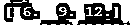
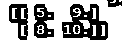
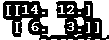

# 张量流占位符

> 原文：<https://www.educba.com/tensorflow-placeholder/>

## tensorflow 占位符简介

张量流向用户提供不同类型的功能，其中占位符是张量流提供的功能之一。基本上，TensorFlow 占位符是一个简单的变量，为以后的用户存储分配的数据或表示以后的日期。在这些存储数据的帮助下，我们可以执行我们想要的不同操作，例如在没有任何数据的情况下构建计算图，因为 Tensorflow 占位符为系统提供了执行操作所需的数据。所以简单来说，我们可以说 Tensorflow 占位符是用来管理我们所有的数据的，但是我们需要维护一些基本的结构以备后用。

### 什么是 TensorFlow 占位符？

Tensorflow 是谷歌创建的开源人工智能结构，可以组装神经组织，并完成所有人工智能任务的分类。Tensorflow 在信息流图中逐渐消失，其中中心是数字活动，边缘是张量中的信息，因此得名 Tensorflow。在我们训练模型的时候，我们需要在整个会议中分配特定的负荷和倾向。张量流因素可以在整个会议中保持倾向和负荷的优势。我们需要记住，应该引入张量流因子。在 TensorFlow 中，当我们准备模型时，因子具有不可思议的用途。作为常量，我们需要调用构造函数引入变量；潜在价值可以作为争用传递。

<small>Hadoop、数据科学、统计学&其他</small>

张量流占位符起初是空的，在实际准备模型中被用来照顾。假设我们需要将信息注入到计算图表中，我们需要利用名为占位符的工具。占位符被绑定在特定的发音中。通过调用构造函数，可以很容易地将因子添加到计算图表中。

### 创建张量流占位符张量

现在让我们看看如何创建一个 tensorflow 占位符，如下所示。

**语法**

`variable name = tensorflow.placeholder(specified data type, None)`

**解释**

在上面的语法中，我们使用 TensorFlow 和占位符，如上面的语法所示；此外，我们需要指定数据类型。

现在让我们看看如何创建占位符的例子如下。

`import tensorflow as tflow
y = tflow.placeholder("float", None)
z = y * 3
with tflow.Session() as sess:
r = sess.run(z, feed_dict={y: [2, 3, 4]})
print(r)`

**解释**

在上面的例子中，我们试图实现一个占位符；首先，我们需要 TensorFlow 和 NumPy 库，如图所示。之后，我们创建了一个占位符供将来使用。最后，在这个例子中，我们执行一个乘法运算，如上面的程序所示。上面程序的最终输出我们用下面的截图来说明。

### 图形张量流占位符

现在让我们看看如何为占位符创建一个张量流图，如下所示。

图表是会议中计算和任务的概要。例如，Tensorflow 首先制作一个计算图表，其中中心是任务，边是张量，然后在会议中执行。

现在让我们来看一个图形张量流的实际例子，以便更好地理解。

**例子**

`import tensorflow as tflow
# 2X2 matrices with placeholder
x = tflow.placeholder(tflow.float32, shape=(2,2))
y = tflow.placeholder(tflow.float32, shape=(2,2))
# Addition operation of two by two matrices
z = x + y
a = [[3,4],[4,8]] b = [[2,5],[4,2]] with tflow.Session() as sess:
# Here we need to pass the memory location that we want.
path='D:/Work From Home'
# Here we generate the computational graph.
tensor_graph=tflow.summary.FileWriter(path, sess.graph)
#In this step we need to dump the value of a and b to generate the result.
print(sess.run(z, feed_dict = {x:a, y:b}))`

**解释**

在上面的例子中，我们试图用占位符实现图形 TensorFlow，如图所示。首先，我们需要导入 TensorFlow 库；之后，我们需要为占位符创建两个两个的矩阵，如图所示。创建占位符后，我们需要编写代码来执行我们想要的任何操作；在这个例子中，我们执行两个矩阵的加法运算。最后，我们编写代码来创建计算图，并在代码末尾生成结果。上面程序的最终输出我们用下面的截图来说明。

### 参数张量流占位符

现在我们来看看 TensorFlow 占位符是什么参数如下。

占位符是一个分配了信息的变量。它允许我们进行活动，组装计算图表，然后通过这些占位符将信息输入图表。最后，它负责将信息引入到流中的张量。

`Variable = tf.placeholder(specified data type, specified shape=None, specified name=None )`

**自变量**

**指定数据类型:**用于指定数据类型，取决于用户需求，即我们可以使用任何数据类型。

**指定形状:**指定形状是占位符的可选部分；我们可以根据用户需求定义数据的形状；否则，它具有默认形状。

**指定名称:**也是占位符的可选部分；它用于指定占位符的名称。

**例子**

现在让我们看看占位符的不同例子，以便更好地理解如下。

`import tensorflow as tflow
x = tflow .placeholder(tflow .float32, shape=(2,2))
y = tflow .placeholder(tflow .float32, shape=(2,2))
z = x + y
a = [[5,7],[2,1]] b = [[9,5],[4,2]] with tflow.Session() as sess:
print(sess.run(z, feed_dict = {x:a, y:b}))`

**解释**

在上面的例子中，我们简单地实现了一个占位符程序，其参数如下所示。首先，我们导入张量流。之后，我们需要为占位符编写代码，所有参数如下所示。在本例中，我们执行矩阵的加法运算，最后，我们在进程的帮助下打印加法运算的结果。上面程序的最终输出我们用下面的截图来说明。

这样，我们可以实现不同用途的占位符。

### 结论

我们希望从这篇文章中你能学到更多关于占位符的知识。从上面的文章中，我们已经理解了占位符的基本思想，我们还看到了 TensorFlow 占位符的表示和示例。从本文中，我们了解了如何以及何时使用 TensorFlow 占位符。

### 推荐文章

这是 tensorflow 占位符的指南。这里我们讨论了张量流占位符的基本思想，我们还看到了张量流占位符的表示和示例。您也可以看看以下文章，了解更多信息–

1.  [咖啡张量流](https://www.educba.com/caffe-tensorflow/)
2.  [用 TensorFlow 进行深度学习](https://www.educba.com/deep-learning-with-tensorflow/)
3.  [TensorFlow Models](https://www.educba.com/tensorflow-models/)
4.  [什么是张量流？](https://www.educba.com/what-is-tensorflow/)

