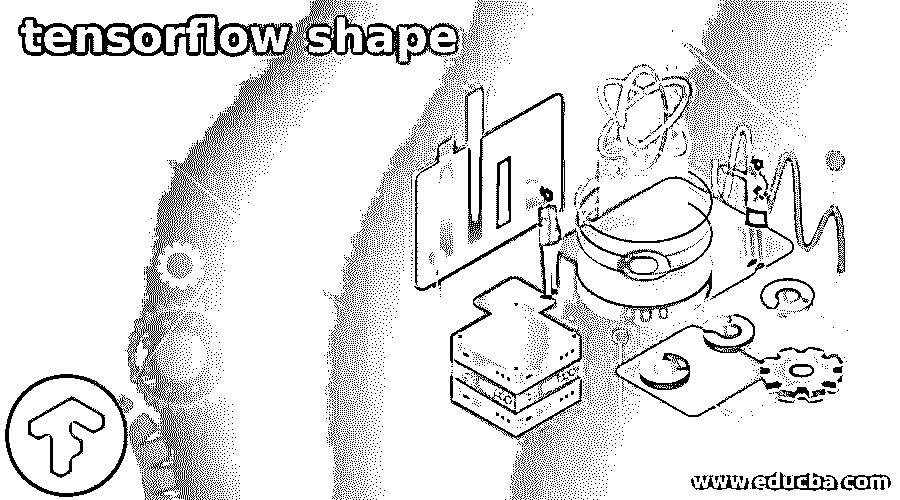
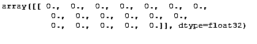
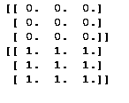

# TensorFlow shape

> 原文：<https://www.educba.com/tensorflow-shape/>

## 张量流形状简介

TensorFlow 为用户提供不同类型的功能，其中形状是 Tensorflow 提供的功能之一。基本上，张量流形状意味着每个维度中存在多少个元素。在构建图形的过程中，张量流自动包含了所有的维度和形状点。形状的维度和点有一个已知或未知的等级。如果我们知道形状的等级，那么尺寸大小和点可能是已知的或未知的。在 TensorFlow 中有两种绘制形状的方法，静态和动态。在这两者的帮助下，我们可以连接不同的节点。

### 什么是张量流形状？

当我们深入研究张量流的偏心率时，挑战就出现了，我们发现张量状态的意义是没有限制的。实际上，张量流允许我们以三种不同的方式处理张量的状态:

<small>Hadoop、数据科学、统计学&其他</small>

1.  **完全已知的** **形状**实际上是上面描绘的模型，其中我们知道每次测量的位置和大小。
2.  **在某种程度上，已知的形状:**对于这种情况，我们知道位置，但是我们至少有一个模糊的尺寸用于测量(已经准备了一堆模型的每个人都知道这一点，当我们特征化信息时，我们简单地指示元素向量形状，允许组测量设置为无，例如:(无，27，29，4)。
3.  **模糊的形状和已知的位置:**对于这种情况，我们知道张量的位置，但是我们没有关于任何测量尊重的线索，例如:(Null)。

Tensorflow 在非能量模式下使用时，将图表定义与图表执行隔离开来。这使我们可以在执行图表后，初步确定集线器之间的连接特征。

在我们特征化 ML 模型时(然而该思想适用于非排他性计算图)，我们完全特征化组织边界(例如，完全特征化倾向向量形状，就像卷积通道的数量和它们的形状一样)；随后，我们考虑一个完全已知的形状定义。然而，一个图表的执行时间，考虑到所有的事情，张量之间的联系(不是组织边界之间的联系，组织边界保持不变)可能是惊人的强大。

### 张量流形状函数

现在我们来看看 TensorFlow 中的 shape 函数如下。

形状是每个度量中分量的数量，例如，标量具有位置 0 和未填充的形状()，矢量具有秩 1 和状态(A0)，点阵具有秩 2 和状态(A0，D1)等。

**语法**

`tf.shape( i/p, o/type=tf.specifeid_dataypes, name)`

**解释**

在上面的例子中，我们使用了不同参数的形状函数，如图所示；这里，第一个参数是输入，表示我们需要什么输入来生成形状，下一个参数是输入的输出类型，表示我们需要指定我们想要的数据类型。Name 是该语法的可选部分。

### 例子

现在让我们来看一个形状函数的例子，以便更好地理解。

`import tensorflow as tflow
from tensorflow.python.framework import ops
ops.reset_default_graph()
ses = tflow.Session()
t = tflow.zeros([1,20])
ses.run(t)
r = tflow.Variable(tflow.zeros([1,20]))
ses.run(r.initializer)
ses.run(r)`

**解释**

在上面的示例中，我们首先导入 TensorFlow 库，如下所示。之后我们启动图形，使用 shape 的零点函数；这是张量流形状的默认函数。上面程序的最终输出我们用下面的截图来说明。

### 张量流形状方法

**Tensor.get_shape 策略:**这个形状来源于用来制作张量的任务，并且可能在某种程度上是完整的。在静态形状没有被完全表征的情况下，张量 ten 的强大状态可以通过评估 tf.shape (ten)来控制

**例子**

现在让我们看看如何使用 shape 方法生成指定的形状，如下所示。

`import tensorflow as tflow
from tensorflow.python.framework import ops
ops.reset_default_graph()
ses = tflow.Session()
r_d = 3
c_d = 3
z_v = tflow.Variable(tflow.zeros([r_d, c_d]))
o_v = tflow.Variable(tflow.ones([r_d, c_d]))
ses.run(z_v.initializer)
ses.run(o_v.initializer)
print(ses.run(z_v))
print(ses.run(o_v))`

**例子**

在上面的例子中，我们尝试用 TensorFlow shape 方法实现我们想要的特定形状；这里，我们生成 3×3 矩阵。上面程序的最终输出我们用下面的截图来说明。

### 元素张量流形状

现在让我们看看我们需要的形状元素如下。

首先，我们需要导入 TensorFlow 的所有库文件。

之后，我们需要开始会话来绘制图形，或者说是计算图形。

现在提供绘制形状的值，或者 Tensorflow 使用默认形状函数，即 tf.zeros()函数。张量流计算需要认识到哪些文章是因子，哪些是常数。所以我们用张量流容量 tf 做一个变量。变量()。请注意，您不能运行 session.run(变量名)；这将导致一个错误。由于 TensorFlow 使用计算图，我们需要进行变量引入活动来评估因素。对于此内容，我们可以通过调用变量 strategy 变量来依次设置每个因素。初始化器。

1.  **网络架构**

该组织认可输入的任何深度和任何空间程度(高度、宽度)的图片。我将利用这种组织设计向您展示静态和动态形状的概念，关于张量状态的数据数量，以及我们可以在图定义时间和执行时间获得和使用的组织边界。

2.  **动态输入**

当我们在图形执行时将值包含到占位符中时，同时，在 TensorFlow 中引入了 shape，它检查所有可能的形状和值与预定的位置，并留给我们任务来仔细检查传递的关注是否是我们准备使用的。因此，这表明信息占位符有两种明确无误的形状:一种是在大纲定义时已知的静态形状，另一种是在图形执行时已知的有趣形状。

### 结论

我们希望从这篇文章中你能学到更多关于张量流形状的知识。从上面的文章中，我们已经吸收了张量流形状的基本思想，并且我们也看到了张量流形状的示例表示。从这篇文章中，我们了解了如何以及何时使用张量流形状。

### 推荐文章

这是一个张量流形状的指南。这里我们讨论张量流形状的基本思想，我们也看到张量流形状的表示和例子。您也可以看看以下文章，了解更多信息–

1.  [咖啡张量流](https://www.educba.com/caffe-tensorflow/)
2.  [Tensorflow Basics](https://www.educba.com/tensorflow-basics/)
3.  [TensorFlow Models](https://www.educba.com/tensorflow-models/)
4.  [TensorFlow 游乐场](https://www.educba.com/tensorflow-playground/)

