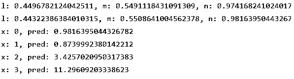

# TensorFlow Adam optimizer

> 原文：<https://www.educba.com/tensorflow-adam-optimizer/>

## TensorFlow adam 优化器简介

以下文章提供了 TensorFlow adam 优化器的概要。Adam 代表自适应矩估计，一种使用先验梯度计算当前梯度的方法。Adam 优化方法是一种随机梯度下降扩展，最近在计算机视觉和自然语言处理应用中获得了牵引力。Adam optimizer 是一种独特的算法，已被证明在广泛的学习方法中有效。这种方法背后的主要思想是结合动量和 RMSprop。

### TensorFlow Adam 优化器入门

TensorFlow 提供了一些优化类型，以及其他人定义其类的必要性。优化器中有两个重要步骤:

<small>Hadoop、数据科学、统计学&其他</small>

1.apply gradients()在计算时更新变量

2.gradients()更新计算图形中的梯度。

Adam 使用梯度的指数递减平均值及其平方来修改参数。Adam 技术计算效率高，需要很少的内存，对梯度的对角线重缩放不敏感，非常适合高级分析问题。若要实现 Adam，请设置 V _dw=0，S_ dw=0，V_ dB，S_ dB =0。然后，在迭代“t”时，使用当前小批量，即，使用小批量梯度下降，计算导数 dw，db。接下来是动量指数加权平均值。

V_ dw 等于 b。

我们可以使用在每个梯度下降步骤上达到优化算法的方法。我们通过对句柄进行最少的调用来实现这一点。

`x = adam.minimize(mse, var_list=x)`

**Adam Optimizer 是最流行且广泛用于神经网络训练的。**

特遣部队。Tensorflow.js 中的 train.adam()函数构建一个 tf。adamOptimizer 采用 Adam 优化算法。

`tf. train. adam (learningRate? beta1? beta2?, epsilon?)`

Adam 类被定义为

`tf.keras.optimizers.Adam(
learning_rate=0.001,
beta_1=0.9,
beta_2=0.999,
epsilon=1e-07,
amsgrad=False,
name="Adam",
**kwargs
)`

这些论点是:

**学习率:**不带自变量的张量返回要利用的实数。

**Beta:** 一个浮点值或者一个常量浮点张量是 beta 1。一阶矩估计的指数退化率。默认值为 0.9。

**beta 2:** 一个浮点值。默认值为 0.999。

**ε**是一个很小的数字，保证了数值的稳定性。1e-7 是默认值。

**amsgrad:** 这个函数返回一个布尔值。默认值为 False。

**名称:**应用渐变时创建的操作的名称是可选的。“Adam”是默认值。

**关键字**参数被称为 kwargs。

`opt = tf. keras. optimizers. Adam(learning_rate=0.2)
val1 = tf. Variable (10.0)
loss = lambda: (val1 ** 2)/2.0       # d(loss)/d(val1) == val1
step_count = opt. minimize (loss, [val1]).numpy()
val1.numpy()`

**输出为 9.8**

TensorFlow 提供了一种独特的数据类型，便于记录梯度信息，以区分需要计算梯度信息的张量(如参数)和不需要计算梯度信息的常规张量。Tf。可变。一个变量可能适合。Variable()方法将普通张量转化为优化张量。

有三种方法可以初始化变量:

应使用 tf.global variables 初始值设定项来初始化所有全局变量()

使用 tf.variables 初始化器(变量列表)来设置我们关心的变量。这个函数可以代替全局变量初始化器:var name 应该只用来初始化一个变量。

**初始化器**

处理第一种选择是好的。重要的是要记住我们应该在一个会话中执行它。结果，我们将看到最后一个会话类似于这样:

**as tf。会话()作为会话:**

`sess.run(tf.global_variables_initializer())`

### 添加优化程序后调用 initialize。

**创建您的模型**

`# Replace train op = tf. train with the optimizer train op = tf.train.
AdamOptimizer(1e-4).
minimize (cross entropy)
# Initialize variables with the operators.
tf. initialize all variables = init op ()`

**在新窗口中打开图表**

`tf.Session = sess ()`

**现在初始化变量**

`sess.run(init_op)`

**训练模型给定为**

`sess.run(train op)`

Adam 在计算过程中使用初始学习率。大多数用户不使用 Adam 学习率衰减的原因是算法为他们执行了学习率衰减:

`t <- t + 1
lr_t <- learning_rate * sqrt (1 - beta2^t) / (1 - beta1^t)`

其中 t0 是初始时间步长，lr_t 是使用的新学习速率。

### 使用张量流 Adam 优化器

adam 优化器采用 adam 算法，该算法使用随机梯度下降法来执行优化过程。它使用简单，占用的内存很少。因此，当有大量数据和设置要处理时，这是合适的。

与简单的 TF . train . gradientdescentoptimizer 相比，Adam 具有各种优势。.因为它采用了参数移动平均，Adam 可以使用更大的有效步长，并且算法将收敛到这个步长，而无需精细调整。然而，该算法的最大缺点是 Adam 需要在每个训练周期中对每个参数进行额外的计算。一个简单的 TF . train . GradientDescentOptimizer 也可以用于 MLP，但它需要额外的超参数调整才能快速收敛。

### TensorFlow adam 优化器示例

下面是 tensorflow adam 优化器的示例:

#### **代码:**

`const a = tf. tensor1d ([0, 1, 2, 3]);
const b = tf.tensor1d([1., 2., 5., 11.]);
const p = tf.scalar(Math.random()).variable();
const q = tf.scalar(Math.random()).variable();
const r = tf.scalar(Math.random()).variable();
// b = p * a^3 - q * a + r.
const d = a => p.mul(a.pow(3)).sub(q.mul(a)).add(r);
const ls = (pred, label) => pred.sub(label).square().mean();
const lrate = 0.01;
const opzr = tf.train.adam(lrate);
for (let j = 0; j < 10; j++) {
opzr.minimize(() => ls(f(a), b));
console.log(
`p: ${p.dataSync()}, q: ${q.dataSync()}, r: ${r.dataSync()}`);
}
const preds = f(a).dataSync();
preds.forEach((pred, j) => {
console.log (`a: ${j}, pred: ${pred}`);
});`

**解释**

创建一个简单的二次函数，以 a、b 作为输入，以张量、p、q 和 r 作为系数。然后计算预测的均方损失，并将其传递给 Adam 优化器，以最大限度地减少损失，并在理想情况下调整系数。输出显示为

**输出:**

### 结论

为神经网络模型选择正确的优化器和参数可以帮助我们提取相关精度的结果。任何新接触深度学习的人几乎肯定会收到使用 Adam 的最佳和最一致的结果，因为它之前已经被证明表现良好。然而，除了存储学习率之外，它还独立地维护每个参数的动量变化。

### 推荐文章

这是一个指南，以 tensorflow 亚当优化。在这里，我们讨论使用张量流 Adam 优化器以及示例和输出。您也可以看看以下文章，了解更多信息–

1.  [张量流整形](https://www.educba.com/tensorflow-reshape/)
2.  [张量流会话](https://www.educba.com/tensorflow-session/)
3.  [张量流 LSTM](https://www.educba.com/tensorflow-lstm/)
4.  [TensorFlow Debugging](https://www.educba.com/tensorflow-debugging/)

