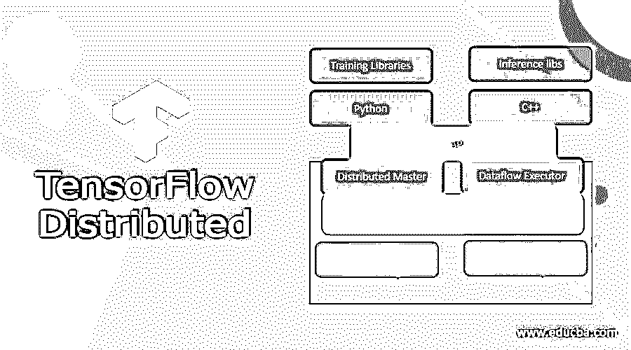
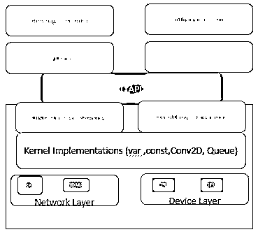
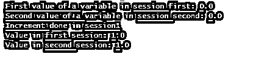

# 张量流分布式

> 原文：<https://www.educba.com/tensorflow-distributed/>

## 张量流分布式简介

TensorFlow API 允许用户在几个 GPU、计算机或 TPU 之间分割训练。使用这个 API，我们可以用少量源代码分发现有的模型和学习代码。训练一个机器学习模型需要很长时间。随着数据集变得越来越大，在短期内训练模型变得越来越困难。分布式计算被用来克服这个问题。

### 什么是 TensorFlow 分布式？

TensorFlow 提供分布式计算，允许多个进程计算图形的不同部分，甚至在不同的服务器上。这也可以将计算分配给具有强大 GPU 的服务器，而其他计算则在具有更多内存的服务器上执行。此外，TensorFlow 的分布式培训基于数据并行性，允许我们在众多设备上运行不同的输入数据切片，同时复制相同的模型架构。

<small>Hadoop、数据科学、统计学&其他</small>

### 如何使用 TensorFlow 分布式？

Tf。distribute 是 TensorFlow 的主要分布式训练方法。策略。这种方法允许用户在几台 PC、GPU 或 TPU 之间发送模型训练。它易于使用，具有良好的开箱即用性能和快速切换策略的能力。首先，数据总量被分成相等的片。接下来，根据训练设备选择这些切片；在每个切片之后，可以使用模型在该切片上进行训练。因为每个模型的数据是不同的，所以每个模型的参数也是不同的，所以这些权重最终必须聚合到新的主模型中。

TensorFlow 还可以非常高效地读取 TFRecord 格式的数据。TFRecord 文件是一组二进制记录，表示输入数据的一个序列化实例。

整个管道现在显示为:

1.在包中生成资产数据记录

2.使用 Dask，以分布式方式为每批(或其他定标器)预处理和序列化资产数据

3.用序列化的二进制集为每个会话创建一个 TFRecord 文件。

tf.distribute .该策略是基于以下重要目标制定的:

:它使用简单，适合许多用户，包括研究人员、机器学习工程师和其他人。
交付了开箱即用的出色成果。
策略之间的切换很简单。

### 镜像策略

tf。分发是一种镜像策略。镜像策略是一种在许多 GPU 上执行同步分布式训练的技术。使用这种策略，我们可以构建跨 GPU 镜像的模型变量的克隆。这些变量在操作期间作为镜像变量收集在一起，并与 all-reduce 技术保持同步。英伟达 NCCL 提供默认算法；然而，我们可以选择另一个预先构建的替代方案或开发一个自定义算法。

创建镜像类型

`mirrored_strategy = tf.distribute.MirroredStrategy()`

**TPU 的战略**

可以使用 TF . spread . experimental . TPU strategy 在 TPU 之间分配训练。它包含针对 TPU 优化的定制版 all-reduce。

**多工作者镜像策略**

这是一个非常具体的策略——多机多 GPU。为了管理流程，它在工作人员之间复制每台设备的变量。所以归约依赖于硬件和张量大小。

**架构**

分散进行允许我们同时训练所有的大型模型，这加快了训练过程。该概念的架构如下所示。A-C API 将多种语言的用户级代码与核心运行时分开。

**客户端:**

用户编写创建计算图的客户端 TensorFlow 应用程序。最后，客户机建立一个会话，并将图形规范发送给分布式主机。

**分布式主机:**

分布式主机修剪该图以获得评估客户机请求的节点所需的子图。然后以协调的方式跨一系列作业执行优化的子图。

**工人服务:**

每个任务的工作服务处理来自主服务器的请求。工作服务将内核发送到本地设备，并行运行它们。训练时，工人计算梯度，通常存储在 GPU 上。如果一个工人或参数服务器中断，首席工人控制故障并确保容错。如果主要工人去世，必须从最近的检查点重新进行培训。

**内核实现**

几个动作内核是用 Eigen: Tensor 执行的，它使用 C++模板为多核 CPU 和 GPU 生成有效的特征码。

**实际细节讨论**

在连接服务器之前创建两个集群，以便在单独的进程中执行每个服务器。

`from multiprocessing import Process
from time import sleep
def s1():
ser1 = tf.train.Server(cluster,
j_name="local",
task_index=0)
se1 = tf.Session(ser1.target)
print("First server: running no-op...")
se1.run(tf.no_op())
print("First server: no-op run!")
ser1.join()
def s2():
for j in range(3):
print("Second server: %d seconds disconnected before connect..."
% (3 - j))
sleep(2.0)
ser2 = tf.train.Server(cluster,
j_name="local",
task_index=1)
print(" Second server : connected!")
ser2.join()
pr1 = Process(target=s1, daemon=True)
pr2 = Process(target=s2, daemon=True)
pr1.start()
pr2.start()`

### 张量流分布式示例

要执行分布式训练，必须调整训练脚本并将其复制到所有节点。

`work = ["localhost:2222", "localhost:2223"]`

接下来，为每个任务分配一个包含任务集合的作业。因此，job com 任务被分配为“本地”

`jobs = {"local": tasks}`

**启动服务器**

`ser1 = tf.train.Server(cluster, j_name="local", task_index=0)
ser2 = tf.train.Server(cluster, j_name="local", task_index=1)`

**下一次在同一图形上执行**

`tf.reset_default_graph()
v1 = tf.Variable(initial_value=0.0, name='variable')
see1 = tf.Session(ser1.target)
see2 = tf.Session(ser2.target)`

在第一个服务器中进行的下一个修改将反映在另一个服务器中。

`se1.run(tf. global_variables_initializer())
se2.run(tf.global_variables_initializer())
print("First value of a variable in session first:", se1.run(var))
print("Second value of a variable in session second:", se2.run(var))
se1.run(var.assign_add(1.0))
print("Increment done in session1")
print("Value in first session:", se1.run(var))
print("Value in second session:", se2.run(var))`

**解释**

上述步骤实现了一个集群，其中有两个服务器对其进行操作。输出如下所示:

### **结果**

### 结论

我们现在了解了分布式张量流可以做什么，以及如何调整您的张量流算法来执行分布式学习或并行实验。通过采用分布式训练技术，用户可以大大减少训练时间和费用。此外，分布式培训方法允许开发人员创建大规模的深度模型。

### 推荐文章

这是一个关于张量流分布的指南。这里我们讨论简介，什么是 TensorFlow 分布式，以及代码实现的例子。您也可以看看以下文章，了解更多信息–

1.  [张量流展平](https://www.educba.com/tensorflow-flatten/)
2.  [tensorflow extended](https://www.educba.com/tensorflow-extended/)
3.  [张量流估计器](https://www.educba.com/tensorflow-estimator/)
4.  [TensorFlow Keras Model](https://www.educba.com/tensorflow-keras-model/)

