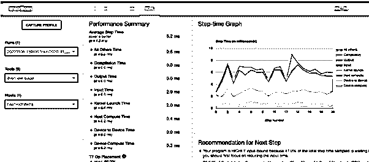
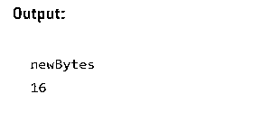

# TensorFlow Profiler

> 原文：<https://www.educba.com/tensorflow-profiler/>

## 张量流剖面仪简介

TensorFlow Profiler(也称为 Profiler)是一套用于测量 TensorFlow 模型的有效资源消耗开发的工具。这个最新版本的分析器是建立在当前的功能之上的，如跟踪查看器，并被合并到张量板中。因此，TensorFlow 分析器可以更容易地识别训练过程中的瓶颈，从而将我们的优化工作集中在那里。

### 张量流剖面仪概述

TensorFlow 的剖析模块 TFProfile 是可用的。该模块使记录每次操作的时间变得简单。张量板是可视化的首选。分析有助于了解模型中各种 TensorFlow 操作(op)的硬件资源消耗(时间和内存),以及性能瓶颈的解决方案，并最终加快模型的执行速度。

<small>Hadoop、数据科学、统计学&其他</small>

**TensorFlow profiler Setup**

`Installing Profiler Plug-in
pip install -U tensorboard_plugin_profile
The latest versions of TensorFlow
import TensorFlow as tf
print("TensorFlow version: ", tf.__version__)`

### 如何分析模型

TFProfile 中使用的模型——获取时间戳

`def buildmodel (lr = 0.03):
mdl1 = Sequential ()
mdl1.add (Convolution2D (32, 3, 3, border_mode='same',kernel_regularizer=regularizers.l2(0.0001), input_shape=(32, 32, 3)))
mdl1.add(Activation('relu'))
mdl1.add(BatchNormalization ())
mdl1.add(Convolution2D(64, 3, 3,kernel_regularizer=regularizers.l2(0.0003),border_mode='same'))
mdl1.add(Activation('relu'))
mdl1.add (BatchNormalization ())
mdl1.add(MaxPooling2D(pool_size=(1, 1)))
mdl1.add(Dropout(0.2))
mdl1.add(Convolution2D(32, 1, 1))
mdl1.add(Convolution2D(64, 3, 3,kernel_regularizer=regularizers.l2(0.0001),border_mode='same'))
mdl1.add(Activation('relu'))
mdl1.add(BatchNormalization())
mdl1.add(Convolution2D(128, 3, 3,kernel_regularizer=regularizers.l2(0.0001),border_mode='same'))
mdl1.add(Activation('relu'))
mdl1.add(BatchNormalization())
mdl1.add(MaxPooling2D(pool_size=(2, 2)))
mdl1.add(Dropout(0.3))
mdl1.add(Convolution2D(32, 1, 1))
mdl1.add(Convolution2D(128, 3, 3,kernel_regularizer=regularizers.l2(0.0001), border_mode='same'))
mdl1.add(Activation('relu'))
mdl1.add(BatchNormalization())
mdl1.add(Convolution2D(256, 3, 3,kernel_regularizer=regularizers.l2(0.0001), border_mode='same'))
mdl1.add(Activation('relu'))
mdl1.add(BatchNormalization())
mdl1.add(MaxPooling2D(pool_size=(2, 2)))
mdl1.add(Dropout(0.5))
mdl1.add(Convolution2D(11, 2, 1))
mdl1.add(AveragePooling2D(pool_size = (4,4)))
mdl1.add(Flatten ())
mdl1.add(Activation('softmax'))
sgd = optimizers.SGD(lr=lr, momentum=0.8, decay=1e-6, nesterov=True)
print("lr:- \n",lr)
mdl1.compile(optimizer=sgd, loss='categorical_crossentropy', metrics=['accuracy'])
mdl1.summary()
return mdl1`

因此，我们将在本次演示中使用 MNIST 数据集，并执行一些用户数据预处理，如数据规范化和重排。

现在，加载并预处理数据集:

`(d_train, d_test), ds\_info = tfds. load(
'mnist',
split=['train', 'test'],
shuffle_files=True, as_supervised=True,with_info=True,)
def rescale(image, label):
return tf.cast(image, tf.float32) / 255., label
d_train = d_train.map(rescale)
d_train = d_train.batch(128)`

该模型将是一个非常简单的三层序列模型。

**创建模型:**

`def GetModel():model=tf.keras.models.Sequential([ tf.keras.layers.Flatten(input_shape=(26,26,1)), tf.keras.layers.Dense(126,activation='relu'), tf.keras.layers.Dense(10,activation='softmax')])return model`

**训练一个模型**

`model.fit(
d_train,
epochs=2,
validation_data=d_test,
callbacks = [tensorboard_callback]`

**使用分析器**

Profiler 是一个用于机器学习(ML)模型脚本的模型性能模拟器。在开发过程的训练和推理阶段，可以使用分析器。它对于评估脚本性能和仿真资源需求以及交付给边缘设备的脚本特别有用。例如，使用 Profiler，您可以看到您的模型脚本在目标设备上使用了多少内存空间，以及运行需要多长时间。

建模之后，下一步使用概要分析

`#Import the heavenly Body
import tensorflow as tf
log_dir="logs/profile/" + datetime.now().strftime("%Y%m%d-%H%M%S")
tensorboard_callback = tf. keras.callbacks.TensorBoard(log_dir=log_dir, profile_batch=3)
callbacks_list=[tensorboard_callback] mod_info = mdl2.fit_generator(train_iterator,
steps_per_epoch=len(train_iterator),
validation_data=(test_features,test_labels),
epochs=1, verbose=1,callbacks=callbacks_list)`

在这种情况下，我们使用了两个选项:日志目录和配置文件批处理。日志目录的位置由 log dir 提供，分析批处理用于决定要分析哪个批处理。定义超参数，如时期数、批量大小和数据增强。例如，我们可以提高批处理大小来提高系统利用率，这可能会导致 CPU 瓶颈。另一方面，在大批量上增加的数据预处理需要大量的计算。

在接下来的部分中，我们的用户将学习如何使用 TensorFlow 分析器来跟踪 TensorFlow 代码的执行。

**样本代码**

`model = keras.Sequential([
layers.Dense(512, activation="relu"),
layers.Dense(10, activation="softmax")
])
model.compile(optimizer="rmsprop",
loss="sparse_categorical_crossentropy",
metrics=["accuracy"])
train_images = train_images.reshape((60000, 28 * 28))
train_images = train_images.astype("float32") / 255
test_images = test_images.reshape((10000, 28 * 28))
test_images = test_images.astype("float32") / 255`

**张量流剖面模型性能**

性能分析中描述了收集性能数据的四种方法。其中一个是 Keras 用户界面独有的。另一种(样本选择模式)是通过张量板网络界面进行交互的。

模特培训

`tf.profiler.experimental.start('logdir')
tf.profiler.experimental.stop()
with tf.profiler.experimental.Profile('logdir'):
// model code
pass`

以下是该模型性能的高级总结:

**步进时间图**显示了步数(x 轴)与完成每一步所需的时间(步进时间，y 轴)。它还指示每个类别的步进时间(彩色分区)。从上面的图表中我们可以看到，我们的模型是“高度输入绑定的”，这意味着它在输入操作上花费了大量的训练时间。我们将不断改进这一点:)

器件的运算位置应尽可能高，以充分利用 GPU。

**平均步骤时间**细分为平均步骤时间(在性能总结下)。在理想情况下，我们希望我们的模型将大部分时间用于“训练”，也就是说，让 GPU 保持忙碌(设备计算时间必须是最高的，所有其他开销必须尽可能低)。

**TF Op，**在主机(CPU)与设备上执行的操作的百分比显示在 TF Op Placement(在性能摘要下)(GPU)中。设备操作定位必须最大化，以提高 GPU 利用率。

缓存和预取用于帮助我们进行优化。

1.  **Data.dataset.cache:** 数据集将使用 dataset.cache 加载到内存或本地存储中。在每个时期，这将通过避免耗时的 I/O 操作(如从文件中打开和读取数据)来节省时间。
2.  **数据。Dataset.Prefetch:** 数据会提前准备好，并行。

### 剖面仪仪器

编程模式

– TensorBoard keras callback

–tensor Flow profiler API 和采样模式(支持按需分析)。

使用 tf.profile()的示例

`import * as tf from "@tensorflow/tfjs"
let eduprof =
await tf.profile(function (){
let cba1 = tf.tensor4d([[[[7], [11]], [[13], [34]]]]);
return cba1;
});
console.log("newBytes ")
console.log(eduprof.newBytes);`

**输出:**

### 结论

本文展示了 Tensorflow Profiler 是一款功能强大且易于使用的工具(在克服了安装障碍之后),它可以为您节省大量时间和部分分析器功能。首先，我们讨论了一个非常方便的用于调试模型的 TensorFlow 工具。然后，我们查看了该工具的首选项，如何利用它，以及如何提高 TensorFlow 模型在 GPU 上的性能。之后，还有更多关于分析器和优化技术的内容，我们将在下一节详细讨论。

### 推荐文章

这是张量流剖面仪指南。在这里，我们将讨论该工具的偏好，如何利用它，以及如何提高 TensorFlow 模型在 GPU 上的性能。您也可以看看以下文章，了解更多信息–

1.  [TensorFlow Keras Model](https://www.educba.com/tensorflow-keras-model/)
2.  [张量流 LSTM](https://www.educba.com/tensorflow-lstm/)
3.  [TensorFlow Debugging](https://www.educba.com/tensorflow-debugging/)
4.  [tensorlow 版本](https://www.educba.com/tensorflow-versions/)

