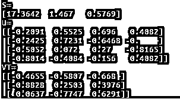
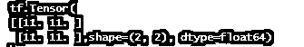
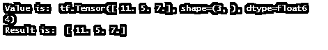

# Numpy 的张量流张量

> 原文：<https://www.educba.com/tensorflow-tensor-to-numpy/>

## 向 Numpy 引入张量流张量

下面的文章提供了张量流张量到 numpy 的概要。张量对象和 NumPy 数组可以共享内存。因此，对其中一个的任何修改都会对另一个产生影响。TensorFlow 是一个开源的数值计算工具包，其主要目标是提供一个简单的 API 来实现实用的机器学习算法，并部署它们在 CPU、GPU 或集群上运行。NumPy 支持大规模多维数组和矩阵，以及一套操作它们的数学函数。

### 概述张量流张量到 Numpy

张量可以被转换成 Numpy 数据类型，随后可以使用 Numpy 函数对其进行处理。以下是 NumPy 数组和 tf 之间最明显的区别。张量:

<small>Hadoop、数据科学、统计学&其他</small>

*   加速器内存可以支持张量(像 GPU 和 TPU)。
*   张量是不变的。

张量的 numpy()方法用于将它们转换为 NumPy ndarrays。由于数组和 tf 的原因，这种转换通常是廉价的。如果可能的话，张量共享底层的内存表示。然而，由于 tf，交换底层表示是不可能的。此外，张量可以存储在 GPU 内存中，而 NumPy 数组必须存储在主机内存中，并且转换需要从 GPU 复制到主机内存。以下方法可以将 TensorFlow 中的张量转换为 numpy 数组。

首先，打电话给 np。数组(你的张量)。

第二，用户要用张量。NumPy 的。

### 如何使用 TensorFlow 张量进行 Numpy？

张量流转换方法

在这个阶段有两种方法可以将张量转换成 NumPy 数组。

1.  第一种方法是使用 numpy()技术。

如果我们已经安装了最新的版本并且启用了快速执行。然后我们可以直接利用 _tensor.numpy()函数。

`np_ar = tensor.numpy()
print(np_ar)`

例:我们将从使用 NumPy 的 random.rand 方法创建一个 NumPy 数组开始，以产生一个 4×3 的随机矩阵。

`np_ar = np.random.rand(4, 2)`

如果我们运行代码，可以看到这只是一个典型的 NumPy 数组。命令行可能如下所示:

`python numpy-arrays-to-tensorflow-tensors-and-back.py`

2.  **第二种方法是使用 eval()**

安装 TensorFlow 版时，将使用此方法。但是，如果之前已经安装了 TensorFlow v2.0，则必须首先禁用 v2 行为。然后我们就能转换它了。

`import tensorflow. compat.v1 as tf
tf.disable_v2_behavior()
tensor = tf.constant([[11,12,13],[14,15,16],[17,18,19]])
tensor.eval(ses=tf.Session())`

在张量上，我们使用 NumPy 函数 np.add()。

`m = np.add(t, 1)
print(m)
//example that converts tensor t to array m.
% tensorflow_version 1\. x
import tensorflow as tf
t = tf.constant([
[5, 2],
[2, 8] ])
m = t.eval(session = tf.compat.v1.Session())
print(m)
print(type(m))`

### 张量流张量到数值的转换

我们经常用 NumPy 处理数组，用 TensorFlow 处理张量。NumPy 数组和张量之间的区别在于，与 NumPy 数组不同，张量由加速器内存(如 GPU)支持，并且是不可变的。NumPy 喜欢像 tnp.int64 和 tnp 这样的宽类型。float64 用于将文字转换为 ND 数组。将常数转换为 tf 时。张量，tf。Convert- to tensor 支持 tf.int32 和 tf。float32 类型。tensor flow NumPy API 遵循 NumPy integer 行为。他们更喜欢用 float32 做彩车。

### 张量流转换程序 Numpy 数组到张量

**步骤 1:** 导入您需要的库。

第一步是导入必要的库，在本例中是 TensorFlow。让我们使用导入表达式来导入它。

`import tensorflow as tf
import numpy as np`

**第二步:**制作 Tensorflow 样本张量。

让我们制作一个样本张量来实现 NumPy 数组转换。在这个例子中，我做了一个常量的基本张量。我们必须利用特遣部队。constant()方法来实现这一点。

要做到这一点，运行下面的代码。

`tensor = tf.constant([[11,12,13],[14,15,16],[17,18,19]])`

### 张量流张量到数值例子

这是我们将要努力的事情。因此，让我们深入了解 NumPy 为 TensorFlow 用户带来的一些灵活性。

#### 示例#1

`import numpy as np
import matplotlib.pyplot as pt
a=tnp.random.randn(100,100).clip(-2,2)
b=np.sum(a,axis=1)
c=tnp.sum(b)
a+b
pt.hist(a.ravel())`

**解释**

我们已经展示了如何使用 Tensorflow ndarray 输入来调用 matplotlib 直方图函数。因此，我们将 NDarray 传递给前面代码中的 TensorFlow numPy 函数。最后，张量流 ND 数组被提供给期望 NumPy 数组的 API。

#### 实施例 2

`import tensorflow as tf;
import numpy as np
X = tf.constant([[11,12,13],[11,13,13],[14,15,16],[17,18,19]], dtype=tf.float32)
init = tf.global_variables_initializer()
init_loc = tf.local_variables_initializer()
with tf.Session() as se:
ses.run([init, init_loc])
np.set_printoptions(precision=4, suppress=True)
AN= X.eval()
U,S,VT = np.linalg.svd(AN)
print 'M='
print M
print 'N='
print N
print 'OP='
print OP`

**输出:**

#### 实施例 3

`import numpy as np
import tensorflow as tf
arr= np.ones([2, 2])
print(arr)
tsr = tf.multiply(array, 10)
print(tsr)`

**解释**

首先，我们使用 Python 的 NumPy 库生成一个数组。使用 tf 创建一个所有元素都设置为 1 的张量。一个。该操作为所有元素生成一个形状为 1 的 dtype 张量。然后，使用 TensorFlow，通过对值应用乘法函数，将此数组转换为张量，结果如下:

**输出:**

#### 实施例 4

`import numpy as np
import tensorflow as tf
n_sum = np.sum(tnp.ones([2, 3]))
print ("sum = %s. Class: %s" % (float(n_sum), n_sum.__class__))
tp_sum = tnp.sum(np.ones([2, 3]))
print("sum = %s. Class: %s" % (float(tp_sum), tp_sum.__class__))
sum = 6.0\. Class: <class 'numpy.float64'>
sum = 6.0\. Class: <class 'tensorflow.python.framework.ops.EagerTensor'>
result = 15 + 2 * tnp.random.randn(1, 1000)
_ = plt.hist(result)`

**解释**

TensorFlow NumPy 函数可以接受各种输入，包括 np.ndarray。通过对这些输入执行 ndarray.asarray，它们被转换为 ND 数组。

**输出:**

直方图如下所示

#### 实施例 5

`import tensorflow as tf
va = tf.constant([11, 5, 7], dtype = tf.float64)
print("Value is: ", va)
prt = tf.make_tensor_proto(value)
final= tf.make_ndarray(prt)
print ("Result is: ", final)`

**解释**

基本库安装在前面的张量代码中，初始化输入。接下来，使用 tensorProto，将 tensor 转换为 numpy，最后，打印结果 numpy 数组:

**输出:**

### 结论

到目前为止，我们已经了解了张量和数组之间的区别，以及如何使用它们来训练机器学习算法。总之，数组是整数的集合，而张量是多维数组，包括张量到 numPy 转换的实例。

### 推荐文章

这是一个指南张量流张量到 numpy。这里我们讨论如何使用 TensorFlow 张量进行 numpy，以及示例和输出。您也可以看看以下文章，了解更多信息–

1.  [张量流估计器](https://www.educba.com/tensorflow-estimator/)
2.  [tensorlow 数据集](https://www.educba.com/tensorflow-dataset/)
3.  [GitHub TensorFlow](https://www.educba.com/github-tensorflow/)
4.  [咖啡张量流](https://www.educba.com/caffe-tensorflow/)

