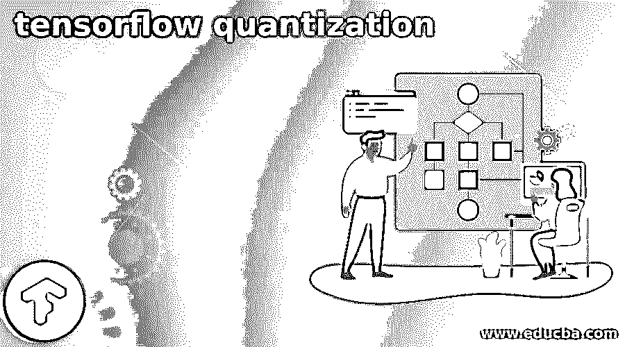
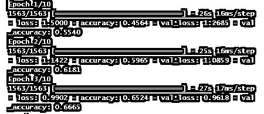

# 张量流量子化

> 原文：<https://www.educba.com/tensorflow-quantization/>

## 张量流量子化简介

下面的文章提供了张量流量化的概要。降低组成一个数并用于表示模型参数的位数的做法称为量化。例如，TensorFlow 中模型的参数默认为 32 位浮点值。TF Lite 是一套优化模型的工具。它可以与传统的 TensorFlow 结合使用，以最小化训练的 TF 模型的大小，从而提高它们的效率。

### 张量流量化概述

量化最直接的原因是通过记录每个图层的最小值和最大值来减小文件大小，然后将每个浮点值压缩为一个八位整数，表示该范围内 256 个线性集合中最接近的实数。例如，在-3.0 到 6.0 的范围内，0 字节代表-3.0，255 代表 6.0，128 代表 1.5 左右。

<small>Hadoop、数据科学、统计学&其他</small>

**在 ML 模型中浮动 32**

`tf.keras.backend.floatx()
'float32'`

据说，这是一种对实数(m.k.m .，值如 1.348348348399……)进行编码的方法，可以确保处理速度，同时最小化范围和精度的权衡。另一方面，整数只能是整数(比如 10、3 或 52)。

### 模型张量流量子化

因此，如果我们希望部署我们的模型，使用 float32 训练它的知识不会帮助我们，因为它增加了模型的大小，并降低了推理的效率。这个困难可以用定量分析来解决。TensorFlow(未标明)表示，“它通过降低用于表示模型参数的数字的精度来运行”。考虑一下:然而，将值转换为 3452 只需要一个 8 位整数 int8，这意味着我们可以节省 24 位来显示浮点数的估计值！

### 神经网络量化的类型

神经网络的量化方法

当涉及到神经网络量化时，有两种基本方法:1)训练后的量化和 2)量化感知训练

#### 训练后量化

最广泛使用的量化方法是训练后量化。只有在模型完成了这种方法的训练之后，量化才会发生。在模型保真度损失很小的情况下，训练后量化是一种转换方法，可以最小化模型大小，同时减少 CPU 和硬件加速器延迟。在执行训练后量化之前，我们需要知道每个参数的范围，即权重和激活。量化引擎通过计算代表性数据集中每个数据点的激活来确定激活频率。在计算两个参数的范围后，量化引擎将这些范围内的所有值转换成较低的位数。

运行以下 python 脚本来量化模型权重:冻结图表样本行代码

`con = tf.lite.TFLiteConverter.from_frozen_graph(frozen_graph_file,
input_arrays=input_arrays,
output_arrays=output_arrays,
input_shapes=input_shapes)
con.allow_custom_ops = True
con.optimizations = [tf.lite.Optimize.DEFAULT] tflite_quant_model = con.convert()`

#### 量化感知训练

在量化感知训练中，我们在训练期间将该量化误差人工引入网络，以使其更加鲁棒。反向传播(Backpropagation)是一种基于浮点权重的训练算法，它仍被用于量化感知训练，以捕捉细微的变化。量化通过压缩模型和降低延迟来提高性能。使用 API 默认值时，模型大小缩小了 4 倍，我们通常在后端测试中发现 CPU 延迟提高了 1.5 到 4 倍。支持机器学习加速器，如 EdgeTPU 和 NNAPI，最终将体验到延迟的改善。该方法产生语音、视觉、文本和翻译。

一般来说，量化感知训练包括三个步骤:

1.  用 tf。训练一个标准模型。
2.  使用相关的 API 使其具有量化意识，允许其学习某些抗丢失设置。
3.  使用可用的方法之一量化模型，如动态范围量化、浮点 16 量化或全整数量化。

#### 量化示例

TensorFlow 为适合生产使用的八位计算提供内置支持。例如，下面是如何将最新的 Google Net 模型转换为 8 位版本:这将产生一个新版本，它执行与旧版本相同的操作，但具有 8 位计算和量化权重。

`bazel build tensorflow/demo/label_image:label_image
bazel-bin/tensorflow/demo/label_image/label_image \
--input_graph=/tens/quantized_graph.pb \
--input_width=299 \
--input_height=299 \
--mean_value=128 \
--std_value=128 \
--input_layer_name="Mul:0" \
--output_layer_name="softmax:0"`

**示例–2**

需要经过训练的张量流模型来量化该模型。因此，让我们训练一个基本的 CNN 模型，并比较原始张量流模型与量化转换模型的准确性。

张量模型实现 ts

`import tensorflow as tf
from tensorflow.keras import datasets, layers, models
import matplotlib.pyplot as plt
import numpy as np
tf.__version__`

**加载数据集:**

这里我将使用 CIFAR-10 数据集。下面列出了类别标签及其标准整数值。

0 是飞机，1 是汽车，2 是鸟，3 是猫，4 是鹿，5 是狗，6 是青蛙，7 匹马，8:船，9 是卡车

`from matplotlib import pyplot
from keras.datasets import cifar10
(trainX, trainy), (testX, testy) = cifar10.load_data ()
print ('Train Analysis: X=%s, y=%s' % (trainX.shape, trainy.shape))
print ('Test Analysis: X=%s, y=%s' % (testX.shape, testy.shape))
train_X, test_Y = train_X / 255.0, test_Y / 255.0
class_names = ['airplane', 'automobile', 'bird', 'cat', 'deer', 'dog', 'frog', 'horse', 'ship', 'truck'] // Model
model = models. Sequential()
model.add(layers.Conv2D(32, (3, 3), activation='relu', input_shape=(32, 32, 3)))
model.add (layers.MaxPooling2D((2, 2)))
model.add(layers.Conv2D(64, (3, 3), activation='relu'))
model.add(layers.MaxPooling2D((2, 2)))
model.add(layers.Conv2D(64, (3, 3), activation='relu'))
model.add(layers.Flatten())
model.add(layers.Dense(64, activation='relu'))
model.add(layers.Dense(10))
model.compile(optimizer='adam',
loss=tf.keras.losses.SparseCategoricalCrossentropy(from_logits=True),
metrics=['accuracy'])
history = model.fit(train_X, train_Y, epochs=10,
validation_data=(test_X, test_Y))`

#### **使用 Float16** 量化

Float16 量化通过将权重值转换为 float16 位浮点整数来减小模型的大小，对精度和延迟的影响最小。使用这种量化技术，模型大小减半。

`convtr = tf.lite.TFLiteConverter.from_keras_model(model)
convtr.optimizations = [tf.lite.Optimize.DEFAULT] convtr.target_spec.supported_types = [tf.float16] tflite_model = convtr.convert()
open("converted_model.tflite", "wb").write(tflite_model)`

**解释**

这里，我们研究了带有量化的模型，结果如下所示:

**输出**

`249936`

### 结论

在这篇文章中，我们通过一个例子研究了提高存储要求的张量流量化方法和不同类型的量化。最后，我们讨论了量化感知训练，它可以在量化之前完成，通过在训练期间模拟量化来建立对量化损失更有弹性的模型。

### 推荐文章

这是张量流量子化的指南。在这里，我们讨论张量流量化方法，提高存储要求和不同类型的一个例子。您也可以看看以下文章，了解更多信息–

1.  [tensorflow extended](https://www.educba.com/tensorflow-extended/)
2.  [TensorFlow Load Model](https://www.educba.com/tensorflow-load-model/)
3.  [张量流概率](https://www.educba.com/tensorflow-probability/)
4.  [咖啡张量流](https://www.educba.com/caffe-tensorflow/)

