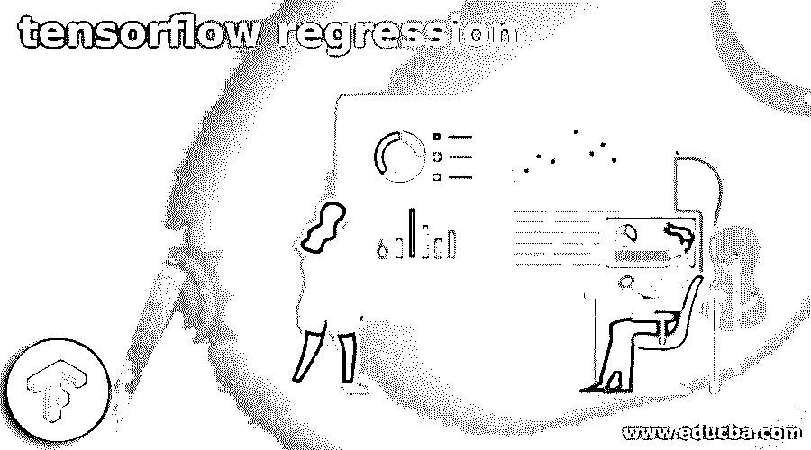
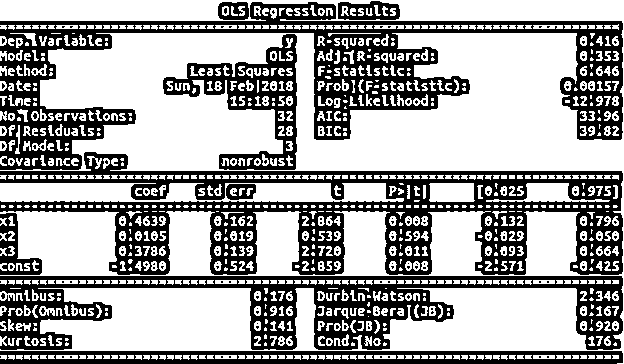

# TensorFlow Regression

> 原文：<https://www.educba.com/tensorflow-regression/>

## 张量流回归简介

线性回归张量流是帮助我们预测的模型，用于拟合一个参数直接依赖于另一个参数的情况。这里，我们有一个因变量和一个自变量。根据独立参数值的变化，我们需要预测独立变化变量。

通过使用线性回归方法，我们可以有多种方法来拟合模型。在本文中，我们将大致了解什么是 tensorflow 回归，使用 tensorflow 回归，创建模型，并了解其实现和示例的帮助。最后，我们将结束我们的发言。

<small>Hadoop、数据科学、统计学&其他</small>

### 什么是张量流回归？

线性回归是张量流模型，它与同分布的独立变量和误差一起工作。这些误差是在考虑自相关和异质的情况下产生的。线性回归模型为用户提供了对广义可行最小二乘法和 AR (p)的支持，它们只不过是自相关误差、广义最小二乘法、加权最小二乘法和普通最小二乘法。每个命令和参数的用法不同。

线性回归的简单例子可以用下面的等式来表示，该等式也构成了图上直线的等式

B = p + q * A

其中 B 和 A 是变量，B 是因变量，它的值随着 A 的值而变化。a 是自变量，也是我们传递给回归模型的输入值。b 也称为要预测或估计其值的值或输出。q 是回归线的斜率，表示 A 对 b 值的影响。p 是常数值，也表示 Y 截距，即回归线与 Y 轴的交点。

有两种类型的回归

1.  **简单线性回归**

当只有一个自变量的值变化时。我们希望预测一个依赖于自变量的因变量的值。这种情况的实现称为简单线性回归。

2.  **多元线性回归**

当多个自变量取值不同时，我们要预测依赖于所有自变量的一个因变量的值，那么这种情况的实现就叫多元线性回归。

### 使用张量流回归

我们需要创建模型。将其拟合到回归模式中，然后传递各种回归函数。如果您愿意，也可以在最后打印输出摘要。需要传递各种参数。

实施线性回归描述中涉及的参数如下所述

*   **Cholsimgainv**–n * n 维三角矩阵数组满足一些约束条件。
*   **Df _ model**–float 数据类型值表示模型的自由度，取值同 p-1。这里，p 代表回归数。每当我们计算这里的自由度时，我们不考虑截距。
*   **Pinv_wexog** 是一个维数为 p * n 的数组，比较多，是一个 Penrose 伪逆矩阵。
*   **Df _ resid**——它是一个浮点值，对应于 s 残差的自由度，参数的值等于 n-p，其中 p 是传递参数的个数，n 是观测值的个数。这里截距是计算自由度的参数。
*   **Nobs**–该参数代表观察次数，通常用 n 表示。
*   **Llf** 是表示对应于拟合模型的似然函数的浮点值。
*   **适马**–它是一个 n*n 维的数组，代表一个带有误差项的协方差矩阵。
*   归一化 cov 参数是具有归一化协方差值的 p* p 维数组。
*   **适马**–这是一个 n * n 维的数组和一个包含误差项的协方差矩阵。
*   **Wendog**–白化响应变量，数据类型为数组。
*   **Wexog**–这是一个数组，由白化设计矩阵组成。

### 如何使用 TensorFlow 线性回归？

回归模型有四个可用的属性类别，有助于我们使用 tensorflow 线性回归。这些类别如下所列

*   OLS-普通最小二乘法
*   WLS 加权最小二乘法
*   GLS–广义最小二乘法
*   可行广义最小二乘和自相关误差。

我们可以按照相同的结构和方法，以相同的方式使用上述所有回归模型。除了滚动 WLS，递归 LS，ad 滚动 OLS，其他回归类有 GLS 的超类。

#### **创建模型**

要创建马力模型，可以使用 build_and_compile_model()函数。对于张量 keras 模型，我们可以使用函数 tf.keras.Sequential()函数。

### 张量流回归示例

在您学习了使用 tensorflow 的基础知识之后，是时候转向更复杂的部分了，我们将在 tensorflow 包的帮助下在源数据中实现线性回归。我们将遵循上述示例中提到的相同步骤，为 OLS 模型添加一个额外的部分。让我们直接跳到代码，然后试着理解它

`// importing the necessary packages
import numpy as educbaSampleNumpy
import stateducbaSampleStatsodels.api as educbaSampleStats
// Loading the source data set
educba_data = educbaSampleStats.datasets.spector.load()
// Adding constants to the data file
educba_data.exog = educbaSampleStats.add_constant(educba_data.exog, prepend=False)
//Fitting the model which is in OLS
educbaModel = educbaSampleStats.OLS(educba_data.endog, educba_data.exog)
res = educbaModel.fit()
// Summarize the statistical results and printing the same on console
print(res.summary())`

我们可以很容易地从输出中读出结果的细节。执行上述代码会产生以下输出–

### 结论

Tensorflow 线性回归模型有助于在独立变量发生变化时预测或估计因变量的值。Tensorflow 多元回归是指当您有多个自变量，而一个因变量依赖于所有其他自变量时。

### 推荐文章

这是一个张量流回归指南。这里我们讨论回归模型属性的四个可用类别，这将有助于我们使用张量流线性回归。您也可以看看以下文章，了解更多信息–

1.  [张量流估计器](https://www.educba.com/tensorflow-estimator/)
2.  [tensorlow 数据集](https://www.educba.com/tensorflow-dataset/)
3.  [张量流会话](https://www.educba.com/tensorflow-session/)
4.  [张量流概率](https://www.educba.com/tensorflow-probability/)

